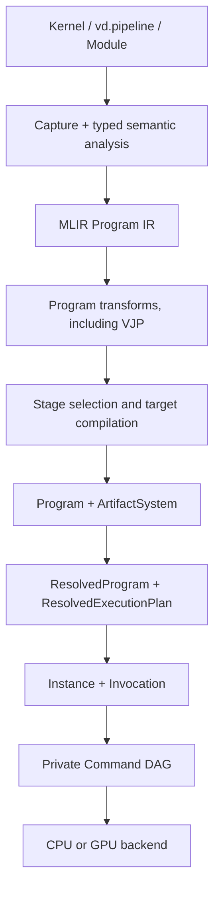

# VernonDSL 技术架构

本文提供面向开发者和集成者的系统概览。字段级合同和完整不变量由
[`specs/README.md`](specs/README.md) 索引的规范文档定义；本文不重复定义
manifest schema 或 ABI。

具体 release、Compiler Contract 和 Program Version 仅由 `versions.toml`
定义。当前 release line 内补齐后端实现、修复 bug 和增加测试不构成升版理由。

## 1. 系统模型

VernonDSL 是嵌入 Python 语法的静态类型 Tensor DSL。设备代码不按 Python
运行时语义执行，而是经过受限 frontend、typed MLIR、target compiler 和
Runtime 执行。



核心约束：

1. Kernel、graphics pipeline、Module 和 VJP 共用一个 Program 模型。
2. Compiler 不拥有 invocation-time TensorView descriptor 或 launch extent。
3. Runtime 只执行已经 resolve 的物理计划，不通过名称、sentinel 或资源扫描
   重新推导语义。
4. RuntimeCore 通过 Provider SPI 与硬件隔离；VernonRHI 是内建 GPU provider。
5. Command DAG 是 Runtime 私有调度模型，不是 Python 或部署层 API。

## 2. 语言与 frontend

Frontend 负责：

- 加载受限 source module graph；
- 解析 Kernel、graphics entries、helpers 和 Struct；
- 执行类型推导、effect analysis 和 capability-independent validation；
- 绑定 captured constants 和 Features；
- 捕获 initialized Module 的 host-static 控制流；
- 生成 Vernon IR 和 MLIR Program IR。

语言保持 Value、Storage 和 Resource 三类语义：

- Value：Scalar、Tensor、Tuple、Struct；
- Storage：TensorStorage owner 与 TensorView borrow；
- Resource：Texture、Sampler。

`Tensor` 是 immutable by-value 数据。`TensorView` 是带 shape、stride、offset
和 access 的 Storage borrow。两者不能通过物理 backend carrier 混为同一语义
类型。

Module constructor 和 host-static `forward` 控制流可以使用普通 Python 值。
invocation Value 或 device data 不能控制 Module-level Python 分支；动态数据
控制流必须位于 Kernel/Shader 内。

详见：

- [`specs/language/contract.md`](specs/language/contract.md)
- [`specs/language/tensor_view.md`](specs/language/tensor_view.md)
- [`specs/compiler/design.md`](specs/compiler/design.md)

## 3. Program、Stage 与 Node

- **Program**：可调用语义图，拥有 Values、Storages、Nodes、graphs 和 ABI。
- **Stage**：可被多个 Node 复用的 portable implementation contract。
- **Node**：Program 中对某个 Stage 的一次调用，拥有自己的 endpoint
  projection 和 resource transitions。

Standalone compute Kernel 和 graphics pipeline 都规范化为 one-node Program。
Module 只是在同一模型中拥有更多 Node。Node 数量、Stage kind 和是否
differentiated 都不会选择第二套 manifest、loader 或 binding API。

每个 Node 显式映射 Program Value/Storage version 到 Stage-local physical
endpoint。Aggregate logical leaves 和 physical carrier leaves 分开描述。
Runtime 不按名称、dtype 或 endpoint 顺序猜测映射。

详见：

- [`specs/program/architecture.md`](specs/program/architecture.md)
- [`specs/program/execution_manifest.md`](specs/program/execution_manifest.md)

## 4. Compiler 与 artifact

编译分为语义和物理两层：

1. Program IR 拥有 graph composition、VJP、cotangent fan-in 和资源版本。
2. Kernel/Shader IR 拥有 thread semantics、workgroup behavior、structured
   local control flow 和 Stage ABI。
3. Implementation selection 将 Program Node 映射到 portable Stage。
4. Target compiler 为 Stage 生成 object、PTX、SPIR-V、GLSL/GLES、MSL 或
   DXIL。
5. Cooker 输出一个 Program、feature variants 和 target ArtifactSystem。

Compute Stage 不根据动态 TensorView shape 或 grid 重新编译。动态 shape、
stride、offset、byte extent 和 grid axes 都在 invocation 时绑定。

Artifact identity 覆盖 compiler/Program versions、target/options、requirements、
entry points、reflection 和 code blobs。旧 contract artifact 被拒绝，不经过
兼容性转换。

## 5. Cook 与部署

`vd.program_asset(...)` 接受：

- compute Kernel；
- `vd.pipeline(...)` graphics pipeline；
- initialized Module；
- 支持的 Program transform，例如 `vd.ad.vjp(...)`。

```python
asset = vd.program_asset(
    id="graphics/example",
    program=vd.pipeline(
        vertex,
        fragment,
        targets=vd.target_formats(colors={0: vd.rgba8_unorm}),
    ),
)
```

每个 cooked bundle 对应一个 target ArtifactSystem，并可包含多个明确列出的
feature variants。Manifest 是 immutable deployment description，不包含
invocation-time 资源、shape 或 command encoder。

## 6. Runtime lifecycle

Canonical C/C++ 调用路径为：

```text
load Program bundle
  -> resolve feature variant
  -> create Program executable
  -> create Program instance
  -> begin invocation
  -> bind Program Values and controls
  -> forward
  -> optional reusable pullback
```

`VernonProgramExecutable` 持有 immutable `ResolvedExecutionPlan`。该计划包含：

- selected Stage implementations；
- per-Node endpoint projections；
- host/device residency；
- upload、device-copy 和 readback edges；
- resource hazards 和 backend barriers；
- graphics scopes；
- publication transactions；
- tape、checkpoint 和 replay plans。

Runtime 内部完成 command recording、submission、synchronization 和 publication。
外部 encoder 是 engine embedding facility，不是 Program binding API。

详见 [`specs/runtime/design.md`](specs/runtime/design.md)。

## 7. RuntimeCore、Provider 与 RHI

RuntimeCore 处理 provider-neutral 的 Program resolve、binding plans、invocation
materialization 和 publication。Provider 处理 physical resource、commands、
submission 和 completion。VernonRHI 实现内建 GPU provider：

- CUDA：compute；
- Vulkan：compute 和 offscreen graphics；
- DirectX 12：compute 和 offscreen graphics；
- Metal：compute 和 offscreen graphics；
- OpenGL/OpenGL ES：外部 context 下的 compute 和 graphics。

CPU provider 独立实现 compute，不依赖 VernonRHI。Backend 编译进 binary
不代表运行时一定可用；loader、device、context、API version 和 required
features 都必须通过 capability validation。

## 8. Graphics

`vd.pipeline(vertex, fragment, ...)` 是 graphics authoring object。Graphics
Node 在部署前规范化为：

- immutable pipeline state；
- render-pass control；
- draw-command control；
- dynamic-state control；
- attachments 和 image subresource versions；
- ordinary Program endpoint bindings。

Attachment load/store/clear/resolve 属于 render-pass semantics，不是 pipeline
state。Draw counts 必须显式提供，不能从 vertex input 推导。

Compute 与 graphics 通过相同 Program Values、Storages、transfers 和 hazards
组合。相邻 draw 的 native render-pass fusion 是 Command DAG 优化。

详见
[`specs/program/graphics_execution.md`](specs/program/graphics_execution.md)。

## 9. Autodiff

`vd.ad.vjp(program, wrt=...)` 产生包含 forward graph、backward graph、residual
contract 和 derivative ABI 的 Program：

```text
ForwardGraph(X) -> (Y, R)
BackwardGraph(R, dY) -> dX
```

Program VJP 负责 reverse topology 和 cotangent accumulation。Kernel VJP 负责
compute Stage derivative implementation 和 opaque tape ABI。

Forward 返回 reusable pullback。Pullback 持有 immutable retained state；每次
apply 创建独立 invocation scratch 并 transactionally publish 新 gradient。

Graphics VJP 当前不受支持；requested derivative path 穿过 graphics Node 时
fail closed。

详见：

- [`specs/autodiff/contract.md`](specs/autodiff/contract.md)
- [`specs/autodiff/program_adjoint_ssa.md`](specs/autodiff/program_adjoint_ssa.md)

## 10. Publication 与 failure

Program output publication 分为：

- `commit_after_success`：先 staging，成功后提交；
- `in_place`：允许直接修改 caller-visible Storage。

Buffer 和 image publication 在可能时使用 device copy。Execution failure
不会把部分 staged output 暴露给 caller。Public C API 捕获 exception，并返回
稳定 status 和 diagnostic。

## 11. Testing 与 future work

跨后端语言和 Program acceptance 由以下文档定义：

- [`specs/testing/program_acceptance.md`](specs/testing/program_acceptance.md)
- [`specs/testing/cross_backend_language_testing_plan.md`](specs/testing/cross_backend_language_testing_plan.md)

未完成工作位于：

- [`specs/roadmap.md`](specs/roadmap.md)
- [`specs/language/future_language_roadmap.md`](specs/language/future_language_roadmap.md)
- [`specs/future/README.md`](specs/future/README.md)

## 12. 代码导航

- Python frontend：`python/vernon_dsl/`
- Program asset frontend：`python/vernon_dsl/_program_assets/`
- Vernon dialect：`source/lib/Dialect/Vernon/`
- Program dialect：`source/lib/Dialect/VernonProgram/`
- Compiler：`source/lib/compiler/`
- Runtime：`source/lib/runtime/`
- Public headers：`source/include/`
- Tests：`python/tests/`、`source/tests/`
