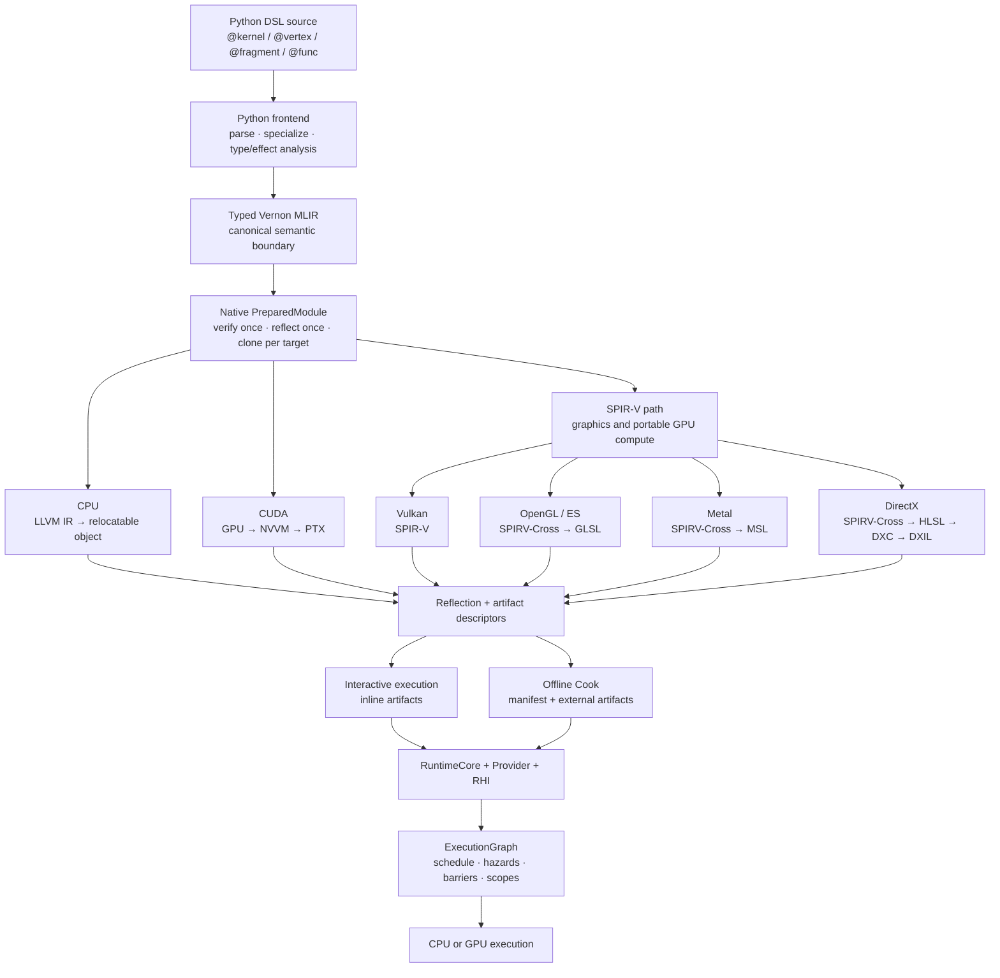
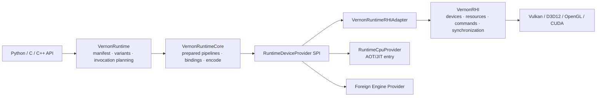
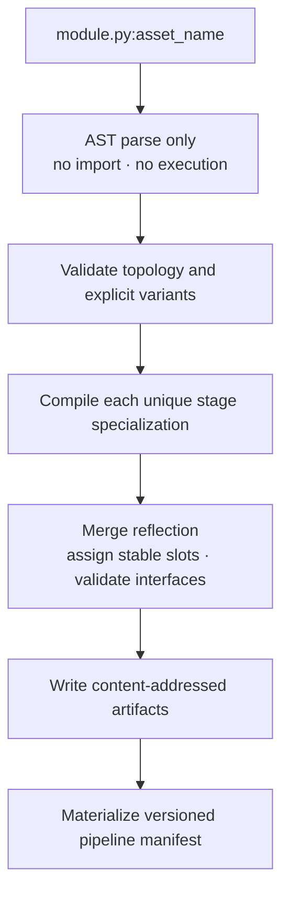

# VernonDSL 技术架构

本文面向希望理解、集成或扩展 VernonDSL 的开发者，描述代码从上层
Python DSL 到各后端产物的完整路径，以及语言、编译器、Runtime、RHI、
ExecutionGraph 和离线 Cook 机制之间的边界。

> 当前发布线是 Windows-first alpha。发布版 frontend 仍处于 language v3；
> `specs/language/contract.md` 描述的是逐步落地的 language-v4 规范目标。
> 本文以当前实现架构为主，不把 roadmap 中尚未验收的能力描述为稳定功能。

## 1. 系统概览

VernonDSL 是一个嵌入 Python 语法、但不使用 Python 运行时语义执行设备代码的
静态类型 Tensor DSL。Python 文件是源码载体；frontend 解析 AST、完成类型和
效果分析，并生成 Vernon MLIR。Native compiler 从同一份已验证 IR 分叉到各
目标后端。交互式执行和离线 Cook 共用相同的 frontend、compiler、reflection
和 pipeline ABI。



架构上最重要的约束有三个：

1. **只有一条 AST 到 MLIR 的 frontend 路径。** Kernel、Pipeline、native
   compiler API、命令行编译器和 cooker 不允许各自实现一套 lowering。
2. **Compiler 与 Runtime 解耦。** 编译停止在 owned artifacts、reflection
   和可选 CPU JIT entry；设备创建和执行属于 Runtime。
3. **RuntimeCore 与硬件 API 解耦。** RuntimeCore 只依赖 Provider SPI；
   VernonRHI 是官方硬件实现，但外部 Engine 可以提供自己的 Provider。

## 2. 语言模型

### 2.1 Python 是语法，不是设备执行环境

Frontend 读取源码和受限 import graph，不 import 或执行 shader 模块。捕获常量
必须属于确定性的常量表达式子集，并进入 specialization/cache identity。
这使离线 Cook 可在不触发模块级 Python 副作用的情况下工作。

入口和 helper 通过装饰器声明：

- `@kernel`：compute 入口；
- `@vertex`、`@fragment`：当前 graphics stage；
- `@func`：非递归、可按参数类型特化的 helper；
- `@func(shared=True)`：限制为 host/device 共用的纯 Value 运算；
- `@struct`：声明 nominal immutable product Value。

当前 graphics topology 是 `vertex -> fragment`。Stage kind 来自装饰器，不由
tuple 位置推断。

### 2.2 Value、Storage 与 Resource

语言将类型严格分为三类：

- **Value**：不可变计算值。包括 scalar、固定形状 `Tensor`、`Tuple` 和
  `@struct`；
- **Storage**：可寻址、可读写内存。核心类型是 `TensorStorage` owner 与
  `TensorView` borrow；
- **Resource**：有专用语义的不透明设备对象，例如 `Texture` 和 `Sampler`。

核心语义规则是：

```text
Storage load  -> Value
Value compute -> Value
Storage store <- Value
```

Storage/Resource handle 不能作为 Tensor element，也不会发生隐式复制。

### 2.3 Tensor-first 类型系统

`Tensor[element_type, shape]` 是统一的固定形状 compound numeric Value。
Vector 和 Matrix 只是 rank-1/rank-2 Tensor 的别名和操作集合，不是独立类型。

支持的 scalar 包括：

- `bool`
- `i32`、`u32`
- `f16`、`f32`、`f64`

小型固定 Tensor 可物化为 MLIR vector 或目标原生 vector/matrix；一般值计算
可使用 tensor/linalg；可寻址数据则使用 memref 或后端 buffer 表示。这些物理
选择不会改变源语言类型。

### 2.4 TensorStorage 与 TensorView

`TensorStorage[T]` 在 host runtime 中拥有 dense typed allocation。
`TensorView[T, shape, access]` 是设备函数参数、slice、field projection 和
workgroup allocation 使用的非 owning Storage view。

TensorView 描述符包含：

- 静态 extent 与 `vd.dyn` 动态 extent；
- 每一维 signed stride；
- element offset；
- `read`、`write` 或 `read_write` access；
- 从来源推断的 address space；
- owner 与生命周期关系。

Shape/access 属于类型约束；具体 stride 和 offset 属于 dispatch descriptor，
不会被错误地固化进 compute artifact。结构化 AoS storage 可以投影成共享同一
owner 的多个 field views，只要写 view 内部保持 injective。

### 2.5 Graphics 接口

Graphics 参数仍遵守 Value/Storage/Resource 分类：

- `Tensor[..., attribute()]` 是由 vertex stream 提供的 immutable Value；
- `Tensor[..., uniform()]` 是每次 invocation 的 immutable Value；
- `Texture`、`Sampler` 使用 resource binding；
- 需要 shader 内直接寻址、写入或 atomic 时使用带 resource annotation 的
  `TensorView`。

Attribute location 先保留显式范围，再按声明顺序 first-fit 分配自动 location。
Matrix/aggregate 会展开为连续 attribute leaves；不同后端再执行 format 和
location capability 验证。

### 2.6 控制流、数学与同步

当前核心语句覆盖赋值、indexed assignment、`if`、`range`、`while`、
`break`、`continue`、nested/early `return`。表达式覆盖 typed call、索引、
Tensor/Tuple/Struct 构造、算术、比较和受支持属性。

Portable math surface 包括常用三角函数、指数/对数、`sqrt`、`floor`、`pow`、
`clamp`，以及 `dot`、`cross`、`norm`、`normalize`、`reflect`。

Compute 支持 workgroup storage、barrier、builtin invocation IDs，以及受目标
能力约束的 i32/u32 atomic。Target 不支持某个合法语言操作时必须显式报错，
不能静默窄化或改变语义。

递归、异常、generator、任意 Python class/list/dict 语义、动态分配和任意
Python object mutation 不属于当前设备语言。

## 3. Frontend 与公共语义边界

一次 entry-specialized frontend 请求的处理顺序是：

1. 加载并验证 source module graph；
2. 绑定 captured constants，应用 enabled features 和 runtime shape；
3. normalize Struct methods 与 generated builtins；
4. 对选定 entry 做 reachability pruning 和 call graph 验证；
5. 完成类型推断、helper specialization、effect/alias 验证；
6. 将 typed semantic nodes 降为文本 Vernon MLIR；
7. 交给 native compiler 做 target capability validation 和 artifact materialization。

Frontend cache key 包含 compiler/pipeline contract version、所有 source
dependency digest、entry、feature set、captured constants、shape/interface、
workgroup size 和 helper specialization。缓存命中仍重新校验依赖 digest；
失败请求不缓存。

Frontend 内部按职责拆分：

- project preparation、declaration collection 和 request cache；
- specialization；
- typed semantic analysis；
- numeric/aggregate/control-flow/loop lowering；
- TensorView storage lowering；
- Texture/Sampler resource lowering；
- deterministic MLIR module emission。

这些 lowering 模块只消费 typed model，不重新做类型推断。

## 4. Native Compiler

### 4.1 PreparedModule

Native C API 接收 frontend 生成的 MLIR。每个 compile request：

1. parse 一次；
2. verify 一次；
3. 运行公共 Vernon validation 和 deterministic helper inlining 一次；
4. 建立 `PreparedModule`；
5. 从原始 validated module 和 prepared IR 生成 reflection；
6. 为每个 target clone 一份 module，再运行破坏性的后端 pass pipeline。

因此同一个请求编译多个目标时不会重新解析源码，也不会让一个后端的 pass
污染另一个后端。

### 4.2 后端映射

**CPU**

```text
Vernon MLIR
  -> standard/SCF/Linalg lowering
  -> LLVM dialect
  -> LLVM IR
  -> target relocatable object (.obj/.o)
```

CPU 是 compute reference backend。持久化格式是 relocatable object；交互式
Python 执行可由 embedded LLD 将 object 链成临时 host DLL/so/dylib。LLVM IR
和 ORC JIT 都不是持久化 bundle 格式。

**CUDA**

```text
Vernon compute
  -> gpu.module / gpu.func
  -> NVVM
  -> LLVM NVPTX
  -> PTX
```

CUDA 是 compute-only backend，不经过 SPIR-V。TensorView 参数保留 N-D
descriptor 语义；小型 static Value Tensor 在 GPU module 内按 row-major
flatten 为 vector，较大值经过 linalg/bufferization/local loops。

**Vulkan**

```text
Vernon compute or graphics
  -> GPU / Vernon graphics interface lowering
  -> SPIR-V
  -> .spv
```

Vulkan Runtime 直接消费 SPIR-V。编译器负责 descriptor、interface、builtin
和 structured-control-flow materialization；Runtime 根据 reflection 构建
descriptor layouts、push constants 和 graphics pipelines。

**OpenGL / OpenGL ES**

```text
Vernon graphics or supported compute
  -> SPIR-V
  -> SPIRV-Cross
  -> desktop GLSL or GLSL ES
```

GLSL profile 和版本属于 target options 及 manifest contract。OpenGL 与
OpenGL ES 是两个不同 backend，不能加载对方 profile 的 bundle。

**Metal**

```text
Vernon portable GPU program
  -> SPIR-V
  -> SPIRV-Cross
  -> MSL source
```

当前 Metal 只生成 source artifact，没有 Vernon Metal Runtime。

**DirectX**

```text
Vernon graphics or supported compute
  -> SPIR-V
  -> SPIRV-Cross
  -> HLSL
  -> DXC
  -> DXIL
```

Shader Model 是显式 target option。DirectX Runtime artifact 需要 DXC；未配置
DXC 时 compiler 必须返回明确错误，而不是生成伪 DXIL。

### 4.3 Reflection 与 ABI

每次编译同时生成 canonical reflection，描述：

- entry/stage/workgroup information；
- 参数类别、dtype、shape、access 和 stable slot；
- Struct/Tuple/Tensor 的 canonical Value ABI layout；
- attribute、varying、fragment output 与 builtin interface；
- resource binding 和内部 implicit parameters；
- artifact format、filename、digest 和 normalized target options；
- runtime requirements 与版本信息。

Native layout 不从 Python/C++ struct memory 猜测。Runtime 按 reflection 的
field/index path 打包 structured Values，并校验 shape、offset、alignment、
完整性和重复绑定。

## 5. Runtime、Provider 与 RHI

Runtime 由 API facade、provider-agnostic core、Provider SPI 和硬件层组成：



### 5.1 VernonRuntime 与 RuntimeCore

`VernonRuntime` facade 负责：

- manifest parsing、version/hash/requirement validation；
- variant selection；
- reflection-driven parameter/binding plan；
- backend pipeline resolution 和 invocation routing。

`VernonRuntimeCore` 负责：

- prepared pipeline 与 binding cache；
- provider-agnostic binding update 和 draw/dispatch encode；
- 对 opaque Provider resource references 的事务性 retain/release。

RuntimeCore 不拥有 device、queue、buffer、image、sampler、framebuffer 或
resource state，也不直接包含 Vulkan/D3D12/OpenGL 类型。

### 5.2 Provider SPI 与官方 Adapter

`RuntimeDeviceProvider` 是 RuntimeCore 的设备边界。官方
`VernonRuntimeRHIAdapter` 将 SPI 映射到 VernonRHI。外部 Engine 可以只依赖
RuntimeCore 并实现自己的 Provider，而不采用 VernonRHI。

CPU Provider 直接执行 AOT/JIT entry，绕过 RHI。GPU Provider 将 prepared
bindings 和 pipeline 操作编码到 RHI command encoder。GPU Runtime context
由一个已创建的 RHI device 构造；Runtime、资源、command encoder 和
ExecutionGraph 必须来自同一 device。

### 5.3 VernonRHI

VernonRHI 负责：

- owned/borrowed device；
- generation-checked logical resource handles；
- buffer/image/view/sampler 创建、导入、销毁与 native interop；
- command encoder 与 backend command object；
- resource state、barrier、upload/readback staging；
- pipeline/native object 创建与缓存；
- submission、completion 和错误诊断。

Runtime、Engine 和 Python host 必须使用同一个 RHI module/device。跨独立 RHI
副本或跨 device 传递 handle 是非法的。

### 5.4 Backend ownership

- **CUDA**：动态加载 CUDA Driver，compute-only；
- **Vulkan**：动态发现 Khronos loader；owned 模式拥有
  instance/device/queue/command pool，NativeInterop 模式可借用外部 device、
  queue 和已打开的 command buffer，并按 advertised extension 协商
  portability；
- **D3D12**：owned 模式管理 COM device/queue/allocator/list/fence，
  NativeInterop 模式借用外部 device、queue 和已打开的 command list；
  Windows-only；
- **OpenGL/ES**：不创建隐含全局 context，通过统一 callbacks 使用 Python、
  Engine 或其他 host 拥有的 context；
- **CPU**：由 RuntimeCpuProvider 执行，不进入 RHI。

借用 Vulkan/D3D12 native command target 时，RHI 只记录命令，不提交、同步或
销毁 owner 的 native object；提交与 completion 由外部 Engine 控制。

RHI backend 是否被编译进 binary 与运行机器上是否存在 loader/driver/device
是两个不同问题。

## 6. 命令编码与资源生命周期

一次 GPU invocation 不直接提交 backend API 调用，而是：

1. RuntimeCore 解析 stable parameter slots；
2. Adapter 将 Runtime references 解析为 RHI resources；
3. Provider 准备或复用 pipeline/layout/binding object；
4. draw/dispatch 记录到一个 RHI command encoder；
5. encoder finish 后统一 submit；
6. submission completion 后释放 retained resources 和 transient allocations。

Immediate invocation 创建一个临时 encoder 并提交一次。ExecutionGraph 则让多个
pass 共用一个 encoder，在所有 compiled scopes 记录完成后只提交一次。

当前稳定 ABI 的 owned submission 是同步的，不公开多帧 in-flight 或异步
completion API。代码中的 ring reuse、resource reclamation 和 borrowed command
语义都建立在这一约束上。

## 7. ExecutionGraph

ExecutionGraph 是 host orchestration graph，不是编译器内部数据流 IR，也不是
PipelineAsset。它负责跨 invocation 的 pass ordering、hazard、barrier 和 render
scope。

### 7.1 建图

Host 将 RHI-backed Tensor、RawBuffer、Texture 或 depth target import 为
GraphResource，再添加 RenderPass/ComputePass。每个 pass 声明：

- read/write resource use；
- attachment load/store/clear；
- 可选显式 dependency；
- 实际 pipeline invocation callback。

同一个底层资源通过不同 view 再次 import 时共享 hazard identity，但 attachment
view metadata 仍独立保留。

### 7.2 Compile

Native graph compiler：

1. 验证 pass、resource ownership 和 dependency；
2. 从 resource uses 推导 RAW、WAR、WAW hazard；
3. 合并显式依赖并检测 cycle；
4. cull 没有 live/exported output 的 transient work；
5. 生成 deterministic topological schedule；
6. 推导 source/destination stage、access 和 resource state；
7. 合并兼容的连续 render passes 为 render scope；
8. 生成 backend-neutral compiled barriers 和 scopes。

Render scope fusion 要求 attachment identity、geometry 和 read-only policy
兼容。中间 clear 可编码为 scope 内显式 clear；无法保持语义的 discard 或
load/store 变化会强制拆分 scope。

### 7.3 Execute

执行时 graph 按 compiled scope：

- 应用 scope barriers；
- 为 render scope 建立 attachment state；
- 调用 pass callback，将 prepared draw/dispatch 编码到同一个 command encoder；
- 完成 scope；
- 最后 finish 并 submit 一次。

Backend 将统一 barrier/state 映射为：

- Vulkan pipeline barriers 与 image layouts；
- D3D12 transitions/UAV barriers；
- OpenGL merged memory barriers 和 framebuffer state。

## 8. 交互式执行

交互式 `Kernel`/`Pipeline` 路径适合开发和即时反馈：

```text
Python decorated entry
  -> FrontendCompileRequest
  -> Vernon MLIR
  -> native Compiler
  -> artifact + reflection
  -> inline artifact descriptor
  -> in-memory pipeline bundle
  -> Runtime load/resolve
  -> direct invocation or ExecutionGraph
```

Artifact data 内联在 bundle 中：SPIR-V/DXIL 使用 base64，文本 artifact 使用
UTF-8。交互路径仍使用正式 `PIPELINE_VERSION` schema，不存在另一套私有 runtime
格式。

## 9. PipelineAsset 与 Cook

### 9.1 声明

持久化 executable 通过模块级 `pipeline_asset(...)` 声明：

```python
FAST = vd.feature("FAST")

mesh_asset = vd.pipeline_asset(
    id="pipeline/mesh",
    program=(mesh_vertex, mesh_fragment),
    variants=((), (FAST,)),
)
```

`program=` 只能是：

- 一个 compute `@kernel`；或
- 一个非空 graphics stage tuple。

Compute 和 graphics 不能混在同一个 asset。`variants=` 显式枚举允许的 canonical
feature combinations，不自动生成 feature powerset；`()` 是明确的空 feature
variant，不是隐式 fallback。当前一个 asset 最多包含 16 个 variant。Runtime
resolve 时要求 feature set 精确匹配，不会自动回退到空集或某个子集。

### 9.2 Cooker pipeline



Cook 的具体步骤：

1. 解析 `source.py:asset_name`；
2. 从 AST 提取 PipelineAsset 和 feature declaration；
3. 验证 stage topology、target compatibility 和 variant canonical form；
4. 为每个 variant/entry 生成 specialized MLIR；
5. 按 module、entry、MLIR digest、target/options 缓存重复 stage compilation；
6. 将 compiler reflection 归一化为 CompiledStage；
7. 跨 stage 合并参数，分配所有 variant 共用的 stable slots；
8. 验证 vertex/fragment interface 和 fragment outputs；
9. 以 artifact digest 去重 stage records；
10. 写 `artifacts/{sha256}{extension}` 并生成
    `{output-directory-name}.pipeline.json`。

Target 是 cooker 输入而不是 source declaration。一个 backend-independent
PipelineAsset 可以分别 Cook 为 Vulkan、OpenGL、DirectX、CUDA 或 CPU 部署物，
也可以生成供外部 Metal 工具链使用的 MSL source artifact，只要其 stage 和
feature 被该 target 支持。Metal 当前没有 Vernon Runtime。

### 9.3 Manifest 与内容寻址

Cooked output 包含：

- 当前 `PIPELINE_VERSION`；
- pipeline id、target 和 normalized target options；
- feature universe 和显式 variant keys；
- 每个 variant 的 stage map、parameter slots、internal parameters 和 outputs；
- 去重后的 stage reflection；
- artifact relative path、format、byte size 和 SHA-256；
- runtime requirements；
- 对整个 canonical manifest 的 `content_hash`。

Artifact descriptor 与 stage digest 必须一致。Runtime 在把 bytes 交给 backend
之前验证：

- manifest version 和 canonical shape；
- manifest `content_hash`；
- artifact path confinement；
- artifact size 和 SHA-256；
- target/runtime compatibility；
- required API version/features；
- CPU target triple/object metadata。

这使 bundle 可以安全缓存、分发，并在内容发生变化时确定性失效。

### 9.4 CPU 部署差异

CPU Cook 产出 relocatable object，而不是可由 Runtime 随意 `dlopen` 的 LLVM
中间格式。部署应用将 object 链入自身，并通过 module-hashed wrapper symbol
注册 entry。Runtime 验证 manifest 中的 symbol、target triple、object format、
size 和 digest，再解析已注册 entry。

### 9.5 Load、Resolve 与 Invoke

```text
manifest + artifacts
  -> Runtime load and validation
  -> select canonical feature variant
  -> resolve stage artifacts
  -> prepare backend layouts/pipelines
  -> cache VernonLoadedPipeline
  -> bind by stable slots
  -> encode through direct invocation or ExecutionGraph
```

Manifest parsing、artifact IO 和 pipeline preparation 都不应出现在 hot draw/
dispatch path。重复 invocation 复用 prepared pipeline、layout 和绑定结构。

## 10. 版本与兼容性

`versions.toml` 是唯一手工维护的版本来源：

- `RELEASE_VERSION`：包发布版本，不定义 ABI compatibility；
- `COMPILER_CONTRACT_VERSION`：语言语义、Vernon MLIR contract、reflection 和
  stage topology；
- `PIPELINE_VERSION`：manifest、artifact descriptor、Runtime Provider SPI 和
  RHI ABI。

修改 `PIPELINE_VERSION` 意味着 Runtime、Provider 和 RHI 必须一起重建。当前不
承诺第三方预编译 Provider/RHI 插件跨 pipeline version 兼容。

## 11. 典型端到端路径

### 11.1 Compute

```text
@kernel
  -> typed Tensor/TensorView semantics
  -> Vernon MLIR
  -> CPU object / CUDA PTX / Vulkan SPIR-V
  -> reflection-driven compute bundle
  -> RuntimeCore binding plan
  -> CPU entry or RHI compute command
```

### 11.2 Graphics

```text
@vertex + @fragment
  -> interface/location planning
  -> Vernon graphics IR
  -> SPIR-V
  -> Vulkan SPIR-V / GLSL / MSL / HLSL+DXIL
  -> graphics bundle
  -> Runtime prepared pipeline
  -> RHI render commands
```

### 11.3 Multi-pass

```text
PipelineAssets or interactive Pipelines
  -> import shared resources
  -> RenderPass / ComputePass declarations
  -> ExecutionGraph compile
  -> hazard schedule + barriers + fused scopes
  -> one RHI command encoder
  -> one submission
```

## 12. 代码导航

主要实现位置：

- `python/vernon_dsl/frontend/`：AST、module graph、specialization、typed
  analysis 和 Vernon MLIR emission；
- `python/vernon_dsl/types.py`、`decorators.py`、`intrinsics.py`：公开语言
  类型、入口/helper decorators 和 intrinsic；
- `python/vernon_dsl/language/`：stage/feature registry 与语言内部模型；
- `source/include/mlir/Dialect/Vernon/`、`source/lib/Dialect/Vernon/`：
  Vernon MLIR dialect 与 transforms；
- `source/lib/compiler/`：PreparedModule、reflection 和 target pipelines；
- `python/vernon_dsl/bundle/`：纯 bundle model、parameter planning 和
  serialization；
- `python/vernon_dsl/_shader_assets/`：PipelineAsset AST parsing、Cook 和
  artifact IO；
- `source/lib/runtime/`：RuntimeCore、backend pipeline implementations 和
  RHI Adapter；
- `source/lib/rhi/`：统一 RHI 与 CUDA/Vulkan/D3D12/OpenGL backend；
- `source/lib/execution_graph/`：native graph validation、schedule、hazard、
  scope 和 barrier planning；
- `python/vernon_dsl/_runtime/`：Python session、resources、Kernel/Pipeline
  invocation 和 ExecutionGraph facade；
- `specs/language/contract.md`：语言规范目标；
- `specs/compiler/design.md`：compiler/cook 设计约束；
- `specs/runtime/design.md`：runtime/RHI/execution 设计约束。

## 13. 当前边界

- CPU 与 CUDA 是 compute backend；CPU 不提供软件 rasterizer；
- Vulkan、D3D12 和 OpenGL 提供 graphics，具体 compute/format/type 能力由
  device 和 API version 决定；
- DirectX Runtime 仅支持 Windows，DXIL 编译需要 DXC；
- macOS 原生没有 Vulkan，通常通过 Khronos loader + MoltenVK；
- Metal 当前只生成 MSL artifact，没有 Runtime；
- Runtime 当前采用同步 submission，不公开多帧 in-flight；
- sparse layout、任意动态分配、递归和完整 autodiff 仍不属于当前稳定能力；
- 合法的 frontend program 仍可能因目标 capability 不足而在 target validation
  阶段被明确拒绝。
