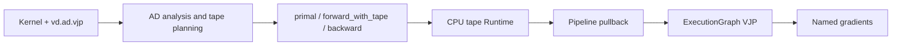
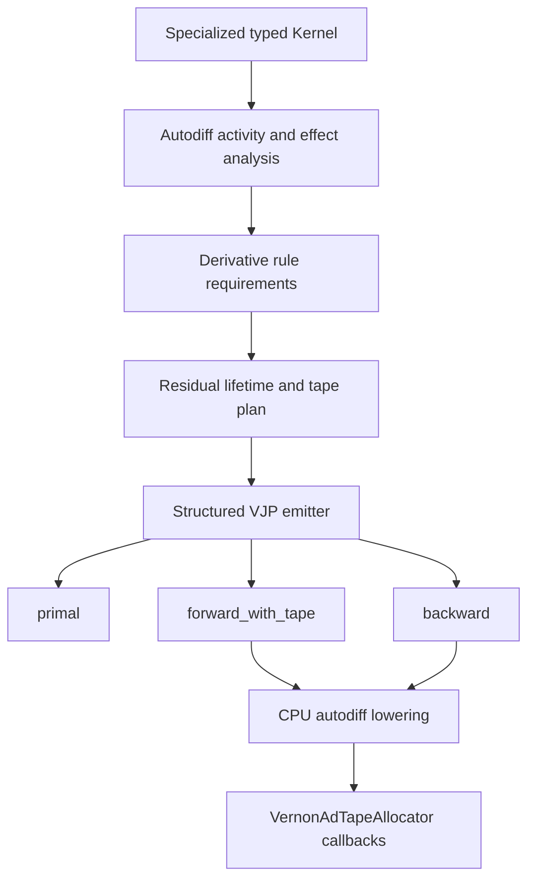
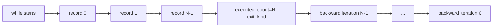
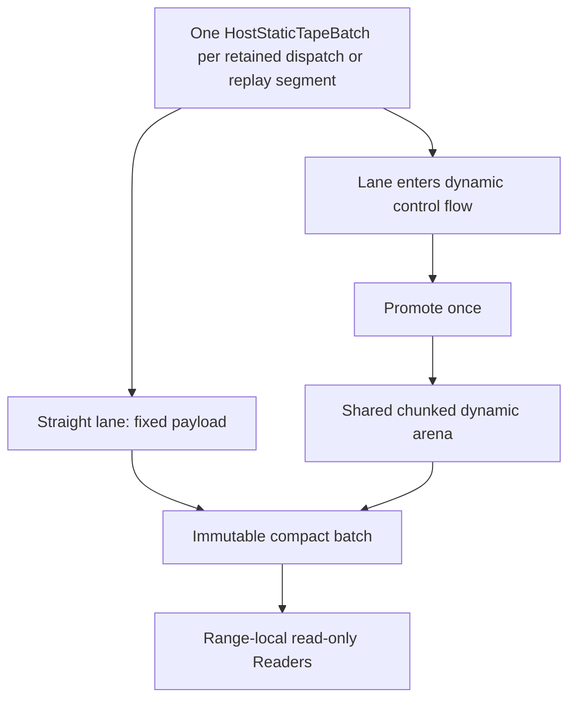
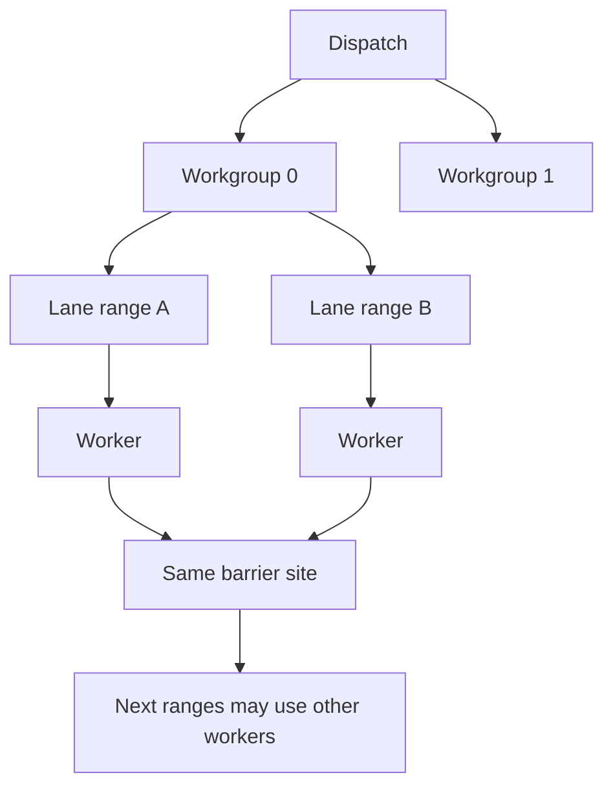
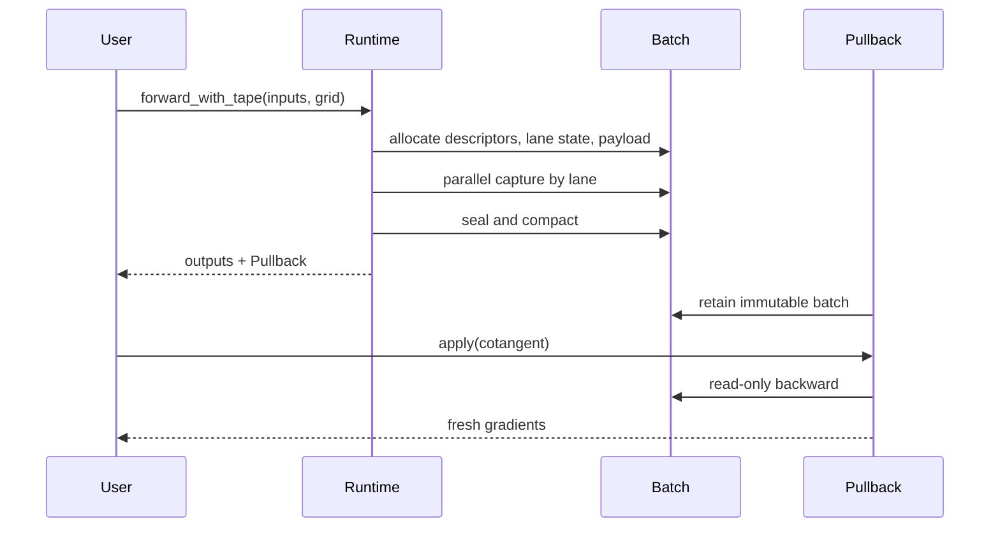
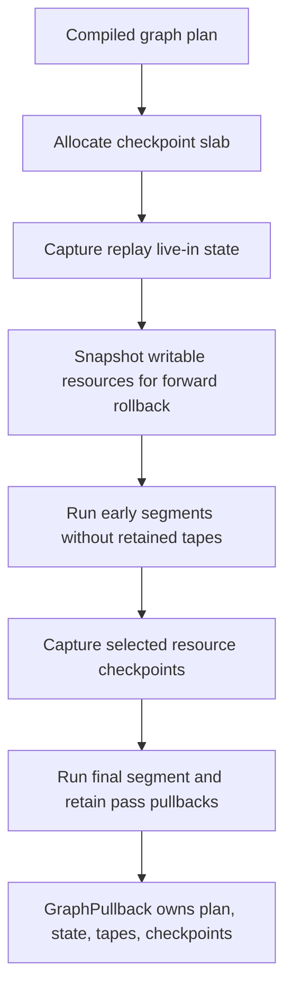
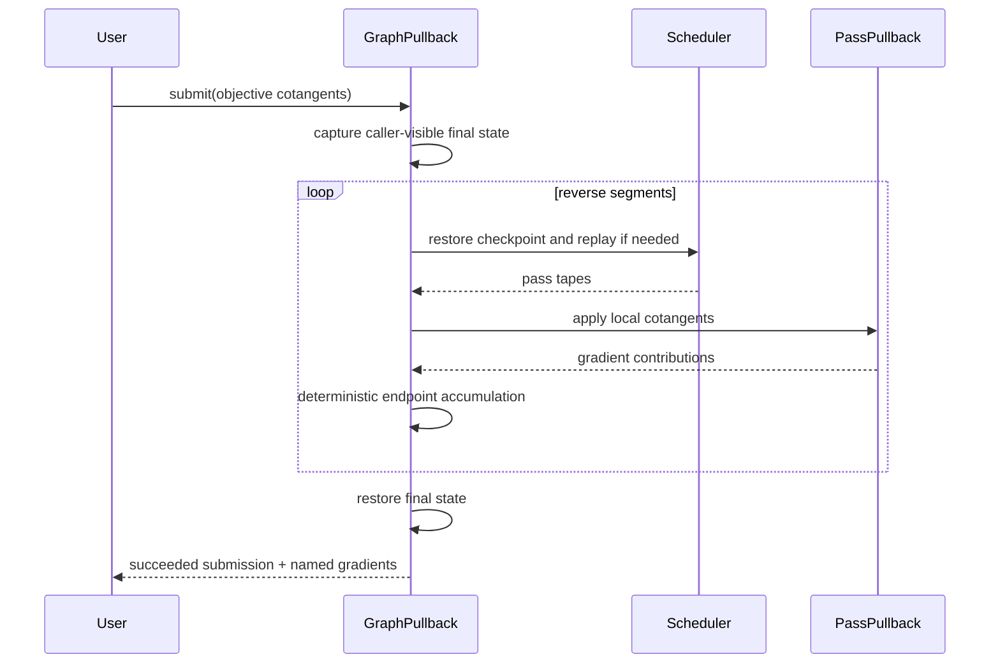

# VernonDSL 自动微分教程：从 Tape IR 到 ExecutionGraph VJP

> 本文面向第一次接触编译器自动微分的读者。
>
> 本文描述当前 CPU structured VJP、cost-aware residual source、no-Tape、
> ExecutionGraph resource-version replay 和 complete-workgroup bounded replay。
> GPU/graphics AD 与高阶 AD 会明确标为“尚未实现”，不会把路线图当成现状。

## 0. 先建立一张全局地图

VernonDSL 当前的反向自动微分可以分成三个层次：

1. **单个 Kernel 的 VJP**：编译器把一个 Kernel 变成
   `primal`、`forward_with_tape` 和 `backward` 三个 profile。
2. **CPU Tape Runtime**：正向时记录反向需要的值和控制流历史，反向时只读这些记录。
3. **ExecutionGraph VJP**：把多个 Kernel pullback 连接起来，处理 pass 间的
   cotangent、checkpoint、replay 和梯度累加。



这三个层次不要混淆：

- **Tape** 保存的是一个 Kernel invocation 的反向所需信息。
- **Pipeline pullback** 表示一次 Kernel dispatch 的可复用反向计算。
- **Graph checkpoint** 保存的是 pass 之间的资源状态，用来重放一段 graph。

后面会逐层展开。

---

## 1. 为什么反向模式需要 Tape

### 1.1 从导数到 VJP

设程序是：

```text
Y = F(X)
```

完整 Jacobian 是 `J_F(X)`。这里必须先区分两类量：

```text
δY = J_F(X) δX
```

`δX`、`δY` 是正向的微小扰动（differential）。上式描述 Jacobian 如何把输入扰动
向前推到输出扰动，也就是 JVP。

反向模式处理的不是 `δX`、`δY`，而是 cotangent。本文使用 `X_bar`、`Y_bar`
表示 cotangent：

```text
Y_bar = ∂L/∂Y
X_bar = ∂L/∂X
```

其中 `L` 是最终标量目标。VJP 计算：

```text
X_bar = J_F(X)^T Y_bar
```

这个公式不是把 `δY = J δX` 求逆。通常 `J` 甚至不是方阵。它来自标量目标的链式法则：

```text
δL = Y_bar^T δY
   = Y_bar^T J_F(X) δX
   = (J_F(X)^T Y_bar)^T δX
```

根据 `δL = X_bar^T δX`，得到：

```text
X_bar = J_F(X)^T Y_bar
```

因此：

- `X` 是 primal input；
- `Y` 是 primal output；
- `δX`、`δY` 是正向扰动；
- `Y_bar = ∂L/∂Y` 是从后续计算传回来的输出 cotangent；
- `X_bar = ∂L/∂X` 是输入 cotangent；
- 从 `Y_bar` 映射到 `X_bar` 的函数叫 **pullback**。

例如：

```text
y = x * x
dy/dx = 2x
```

若后续标量目标给出 `y_bar = ∂L/∂y = 3`，pullback 返回：

```text
x_bar = ∂L/∂x = 2x * y_bar = 2x * 3
```

反向计算需要知道正向时的 `x`。如果 `x` 在反向时无法安全重算，就必须把它保存下来。
这个被保存的 primal 值叫 **residual**。

### 1.2 Tape 不等于“保存所有中间值”

一个成熟的反向 AD 系统会为每个反向所需值选择以下策略之一：

1. 保存为 residual；
2. 反向时重新计算，也就是 rematerialization；
3. 从 checkpoint 重放一段更大的计算；
4. 使用不需要该值的专门反向规则。

因此 Tape 的目标不是记录整个执行过程，而是记录：

- 反向规则确实需要且不适合重算的值；
- 动态分支选择；
- 动态循环实际执行次数和退出方式；
- 找到嵌套记录所需的结构信息。

### 1.3 标量输出与 Tensor 输出

若 `Y` 本身就是唯一标量 objective，可以令 `L = Y`，于是自然种子
`Y_bar = ∂L/∂Y = 1`，pullback 可以省略 cotangent。

若输出是 Tensor、Tuple、Struct 或多个 objective，则必须显式提供结构匹配的 cotangent。
VernonDSL 不会隐式插入 `sum` 或 `mean`。

例如：

```text
L = mean((image - target)^2)
image_bar = ∂L/∂image = 2 * (image - target) / element_count
```

图像 Kernel 的 pullback 接收的是 `image_bar`，不是一个模糊的“对 image 求导”请求。

---

## 2. 用户看到的 VJP API

### 2.1 `wrt` 是唯一的求导输入声明

VernonDSL 当前不会给变量增加 `requires_grad`，也没有隐式 `.grad` 状态。

```python
program = vd.ad.vjp(
    objective,
    wrt=("x", "y"),
    outputs=("output",),
)
```

含义是：

- 对 `x`、`y` 求导；
- `output` 是需要 cotangent 的 objective；
- 这个调用声明一个编译变换，不会立即执行 Kernel。

普通 primal 调用不会分配 Tape，也不会承担 backward 成本。

### 2.2 Direct 与 cooked

Direct 路径在当前 Python 进程中编译并加载 CPU 程序。Cooked 路径把三个 profile
和反射信息写入 pipeline asset：

```python
asset = vd.pipeline_asset(
    id="compute/loss",
    program=vd.ad.vjp(
        objective,
        wrt=("parameters",),
        outputs=("loss",),
    ),
)
```

Cooked asset 仍然使用相同的 native CPU VJP Runtime；它不是另一套 Python AD。

### 2.3 Tangent 的类型不一定等于 primal 类型

当前梯度提升规则包括：

```text
f16 primal -> f32 gradient
f32 primal -> f32 gradient
f64 primal -> f64 gradient
integer/bool -> Zero
```

Tensor、Vector、Matrix、Tuple 和 Struct 的 tangent 递归构造。
可变 Storage 的梯度使用新拥有的 Storage，而不是写入 primal Storage。

---

## 3. 编译器如何产生三个 profile

整体流程是：



主要实现位置：

- `VernonAutodiffAnalysis.cpp`：活动性、Storage 版本和 effect 分析；
- `VernonAutodiffRules.cpp`：每个 primal operation 的 VJP 规则；
- `VernonAutodiffTapePlanning.cpp`：residual lifetime、物理 slot 和 rematerialization；
- `VernonStructuredVjp.cpp`：生成 forward/backward；
- `VernonLowerCPUAutodiff.cpp`：把逻辑 Tape IR 降低为 Runtime callback。

### 3.1 Activity analysis

不是所有值都需要参与反向。

若某个 operation：

- 不影响任何 objective；
- 或其结果只流向不可微路径；
- 或对应输入的 adjoint 根本不需要某个 primal operand；

那么它不应产生 residual。

这一步决定“哪些值在导数图中活跃”，而 Tape planner 再决定“活跃值如何保存”。

### 3.2 Derivative rule requirements

不同反向规则需要不同 primal：

```text
z = x + y   -> x_bar += z_bar, y_bar += z_bar
z = x * y   -> x_bar += z_bar*y, y_bar += z_bar*x
z = exp(x)  -> x_bar += z_bar*z
```

第一条规则不需要保存 `x/y`；第二条需要 `x/y`；第三条可以保存输出 `z`。
Tape planner 的输入不是“所有 SSA 值”，而是规则声明的 primal requirements。

### 3.3 Rematerialization

若一个值由廉价、纯、可安全重算的 operation 产生，planner 可以不保存它。

例如常量、部分简单算术或纯 Tensor projection 可以在 backward 中重建。
有 Storage 读取、写入或无法证明稳定性的计算不能随意重算。

### 3.4 Residual lifetime 与物理 slot

对于当前“先完成整个 forward，再执行 backward”的可复用 pullback，凡是需要从 Tape
读取的 persistent residual，都必须一直保留到 forward 结束。

例如 `A` 和 `B` 分别在 forward 的不同位置产生：

```text
forward:   produce A ---- produce B ---- forward end
backward:                                read B ---- read A

A lifetime: [produce A -------------------------------- read A]
B lifetime:               [produce B -------- read B]
```

它们在 forward/backward 边界同时存活，所以 `B` 不能覆盖 `A`。而且 pullback 可重复使用，
Tape 在一次 backward 读完后也保持 immutable，不能为下一次 application 改写。

`AdMemoryPlan` 和通用 `AdBufferAssignment` 确实支持“同一 memory domain 中不重叠 interval
复用 physical buffer”，这对其它临时 memory domain 和未来调度有意义；但当前 Kernel 的
`PersistentResidual` interval 通常都会跨过 forward/backward 边界，因此一般不能互相复用。

当前减少 persistent Tape 的主要方式是：

1. activity analysis 排除 backward 不需要的值；
2. rematerialization 让纯且廉价的值不进入 Tape；
3. dynamic region 只记录实际执行路径需要的 leaves；
4. graph checkpoint/replay 避免同时保留所有 pass tapes。

每个最终保留的 residual 仍会获得独立、不会被其它同时存活 residual 覆盖的 byte offset。

---

## 4. Tape IR：编译器与 Runtime 之间的语义层

### 4.1 核心类型

Tape IR 定义在 `VernonTypes.td` 和 `VernonOps.td`。

- `!vernon.ad_tape`：一次 invocation 的 opaque Tape 所有权；
- `!vernon.ad_region_header`：一个动态控制流 region 的逻辑句柄；
- `!vernon.ad_adjoint_buffer<...>`：反向中的 invocation-local adjoint scratch。

这些类型不暴露 host pointer、vector、page index 或 backend 对象。

### 4.2 Region、record 与 leaf

可以把动态 Tape 想象成：

```text
Tape
└── root region
    ├── record 0
    │   ├── saved leaf bytes
    │   └── child region
    ├── record 1
    └── ...
```

- **region** 表示一段动态控制结构；
- **record** 表示该结构的一次执行，例如一次 loop iteration；
- **leaf** 是 record 中按固定 offset 保存的一个 ABI leaf；
- **child region** 表示嵌套的 if/loop。

### 4.3 正向写入操作

核心正向操作包括：

```text
ad.begin_invocation
ad.begin_region
ad.reserve_record
ad.checked_increment
ad.write_leaf
ad.end_region
```

概念伪 IR：

```mlir
%tape = vernon.ad.begin_invocation
%root = vernon.ad.begin_region %tape
%record = vernon.ad.reserve_record %root
vernon.ad.write_leaf %root, %record, %saved {leaf_offset = 0}
vernon.ad.end_region %root, %executed_count, %exit_kind
```

`record_size`、`record_alignment` 和 `leaf_offset` 都由编译器确定。

### 4.4 反向读取操作

```text
ad.read_record_offset
ad.read_executed_count
ad.read_exit_kind
ad.read_nested_region
ad.read_leaf
```

Backward 不能写 Tape。它只根据正向封存的 region/record 读取值和执行历史。

### 4.5 `ad.capture`、`ad.commit` 与 Runtime transaction

这三个概念容易混淆：

- 当前 structured forward emitter 使用 `ad.capture` 包住 Tape capture；
- 逻辑协议中存在 `ad.commit`，用于描述 capture 成功后的可见 effect；
- 当前 structured VJP emitter 不直接依赖 `ad.commit` 完成所有 Storage 提交；
- CPU Runtime 使用 `HostEffectTransaction` shadow 正向可见写入，全部 lane 成功后才 commit。

因此 `ad.commit` 不是“第二种 Tape”，`HostEffectTransaction` 也不是 residual storage。
它们处理的是失败时是否发布可见 Storage effect。

### 4.6 Lowering 后是什么

逻辑操作最终降低成 `VernonAdTapeAllocator` ABI callback：

```text
begin_region
reserve_record
write_leaf
set_child
end_region
seal
read_leaf
read_child
read_executed_count
read_exit_kind
```

Compiler 只看 opaque handle 和 callback。Runtime 才知道 payload、chunk、compact array
和 page-layout-v1 的物理表示。

CPU lowering 同时扫描 operation types 和函数签名；即使 canonicalization 删除了 handle
的最后一个 operation-level use，签名中的 `!vernon.ad_tape` 仍会先降成 allocator/reader
ABI，不会泄漏到通用 CPU ABI wrapper。

---

## 5. 直线型程序：静态 residual 快路径

考虑：

```text
a = x + y
b = a * y
out = b * b
```

反向为：

```text
d_b += 2 * b * d_out
d_a += y * d_b
d_y += a * d_b
d_x += d_a
d_y += d_a
```

`a`、`b`、`y` 是否保存，取决于：

- 它们是否已经是 profile input；
- backward rule 是否需要；
- 能否廉价重算；
- lifetime 是否允许复用 slot。

一种可能的布局是：

```text
offset 0..3   saved a
offset 4..7   saved b
stride        8 bytes per lane
```

每个 invocation lane 的地址为：

```text
lane_payload_base = dispatch_payload + lane_index * stride
saved_value_addr  = lane_payload_base + static_offset
```

### 5.1 为什么静态路径快

直线 Kernel 没有需要记录的动态 `scf.if`/`scf.while` region，因此：

- 编译器提前决定所有 offset；
- 一个 dispatch 使用一个 `HostStaticTapeBatch`；
- descriptor、lane state 和 payload 都是连续数组；
- 没有每 lane 的 heap object、vector 或 mutex；
- forward write 和 backward read 都是固定 offset。

### 5.2 Static 不等于“没有 Tape”

Static 表示布局静态，不表示 residual 数量为零。

也要区分三个指标：

- **logical residual bytes**：真正有意义的 residual payload；
- **retained/allocated bytes**：pullback 实际保留的物理内存；
- **construction peak**：forward 建 Tape 时 descriptor、lane state、临时 arena 等峰值。

内存 planner 必须使用正确的物理指标，不能拿 logical payload 代替实际 retained allocation。

---

## 6. 动态分支与循环

### 6.1 为什么只保存数值还不够

```python
if x > 0:
    y = sin(x)
else:
    y = x * x
```

Backward 必须知道正向走了哪一支。重新计算条件并不总是安全：

- 输入 Storage 可能已经改变；
- 条件可能依赖动态读取；
- 浮点或 effect 语义不能假定可重复。

因此 Tape 需要记录 predicate 或等价的分支历史。

### 6.2 `scf.if`

Forward 为 active `scf.if` 建立 nested region：

1. 保存决定分支的 predicate；
2. 只为实际执行的分支写入 records；
3. 为需要稳定索引的未执行 child 保留结构信息；
4. 在 region 结束时封存 metadata。

Backward：

1. `read_nested_region` 找到该 if 的记录；
2. `read_leaf` 恢复 predicate；
3. 只执行正向实际走过的分支的反向代码。

### 6.3 动态循环

```python
result = x
index = 0
while index < count:
    result = result * x
    index += 1
```

正向需要记录：

- 实际 iteration count；
- 每次 iteration 的 residual record；
- break/continue/normal exit 等 `exit_kind`；
- 嵌套控制流的 child region。



可重建的 canonical positive-step `scf.for` 保持结构化形式，backward 重建 trip count、
induction value 并逆序执行，不保存逐 iteration 控制历史。真正动态的 `scf.while` 才使用
executed count、exit kind 和必要 carried primals 的动态 Tape。

### 6.4 Promotion

所有 lane 最初都属于 `HostStaticTapeBatch`。

当一个 lane 首次需要 nested child record 时，它被 **promote** 到共享的
`HostDynamicTapeBatch`：



Promotion 是单向的。一个 lane 一旦进入动态路径，本次 capture 不会再降回静态路径。

### 6.5 Dynamic 不等于“一 lane 一个对象图”

逻辑上，每个 lane 仍然拥有一棵独立的 Tape 树；物理上，所有 lane 的节点存放在同一个
dispatch-owned batch 和共享 arenas 中。

#### Static lane

`HostStaticTapeBatch` 在 dispatch 开始时建立连续数组：

```text
descriptors[lane_count]
lane_states[lane_count]
payload[lane_count * payload_stride]
```

lane `i` 的固定 payload slice 是：

```text
payload[i * payload_stride : (i + 1) * payload_stride]
```

它的 `LaneState[i]` 只记录 phase、实际 payload size、executed count 和 exit kind。
纯直线 lane 的所有 residual 都写入这个 slice 的编译期固定 offset。

#### Promoted dynamic lane

当 lane `i` 需要 nested child region 时，`HostDynamicTapeBatch` 中的 `lanes[i]`
保存该 lane 的少量 POD 状态：

```text
status
required_bytes / payload_bytes
root_region_handle
current_region_handle
generation
sealed
```

真正的内容统一 append 到四个共享 arena：

```text
payload arena   : 所有 dynamic lane 的 leaf bytes
region arena    : 所有 lane 的 Region entries
record arena    : 所有 lane 的 Record entries
children arena  : Record 到 child Region 的 handles
```

共享 arena 只共享物理分配，不共享逻辑所有权。每个 Region/Record entry 都带有 `lane`
和 `generation`；通过错误 lane 的 handle 访问会被拒绝。

例如三个 lanes 可以同时形成：

```text
lanes[0] -> static payload slice 0

lanes[1].root -> region #4  (lane=1)
                 ├── record #7 -> payload[128..136)
                 └── child -> region #9 (lane=1)

lanes[2].root -> region #5  (lane=2)
                 ├── record #8  -> payload[136..144)
                 └── record #10 -> payload[160..168)
```

由于多个 workers 并发 append，lane 1 和 lane 2 的 entries 在物理 arena 中可能交错。
`root`、record links 和 child handles 把它们重新组成各自的逻辑 Tape 树。

#### 一次 `write_leaf` 如何定位 lane

1. Runtime 给每个 invocation 传入 `descriptor(lane)`；
2. descriptor 的 owner 可以恢复 batch 和 lane index；
3. static lane 使用 `lane * payload_stride + leaf_offset`；
4. dynamic lane 先用 record handle 找到 `payloadOffset/payloadSize`；
5. 查找同时验证 record 的 lane、generation 和 bounds；
6. leaf bytes 写到共享 payload arena 的对应 offset。

所以 worker thread 不是 Tape identity。worker 即使在 barrier 后变化，compiled invocation
仍使用同一个 logical lane index 和该 lane 的 descriptor/Reader。

#### Seal 与 backward

所有 lanes 完成后，dynamic batch 压缩为：

```text
laneRoots[lane_count]
snapshotRegions[]
snapshotRecords[]
snapshotChildren[]
immutable payload chunks
```

compact region handle 编码 lane identity 和 snapshot index。Backward 为当前 range 的每个
lane 创建短生命周期 `Reader(lane)`：

- static lane 从自己的固定 payload slice 读取；
- dynamic lane 从 `laneRoots[lane]` 开始遍历 snapshot region/record；
- handle 中的 lane 与 Reader lane 不一致时读取失败。

因此当前设计不是“一 lane 一个 heap Tape 对象”，而是“每 lane 一个逻辑 Tape，
所有逻辑 Tape 共享一个经过 lane 隔离和校验的物理存储批次”。

#### 共享 batch 不会消除 per-lane Tape 容量

这里共享的是 allocator、chunk 和 metadata storage，不是把不同 lane 的 residual 合并成
一份。不同 lanes 通常具有不同的 primal values 和控制流历史，因此仍需分别保存：

```text
total physical lanes = grid workgroups * lanes per workgroup

static tape payload
    ≈ static_lane_count * payload_stride

dynamic tape payload
    ≈ sum(each promoted lane's executed record payload)
```

worker thread 数量只决定同时执行多少 ranges，不决定 Tape 大小。即使 Runtime 只有 8 个
worker，包含一百万个 physical lanes 的 dispatch 仍然有一百万份 logical lane history。

compact batch 删除了 per-lane heap object、vector 和 mutex。CPU bounded replay 进一步把
generic Tape 的同时驻留范围限制为一个完整 workgroup；只有 `balanced`/`min_runtime`
选择的纯静态计划在 whole-dispatch construction bytes 能满足 hard budget 时才直接保留整个
dispatch。GPU 后端仍需各自实现 backend-local segment buffers。

---

## 7. CPU 多线程执行模型

### 7.1 Grid、workgroup、invocation 与 lane

若调用：

```text
grid = (gx, gy, gz)
workgroup = (wx, wy, wz)
```

则 physical invocation extent 是：

```text
(gx*wx, gy*wy, gz*wz)
```

每个 physical invocation 对应一个 logical **lane**，并有稳定的 linear index。
Tape lane、argument/result frame 和 invocation-private adjoint 都按这个 identity 定位。

### 7.2 Lane 不等于 OS thread

CPU scheduler 使用固定预算的 worker pool，并把 workgroup 的 lane 切成 contiguous ranges。

- 不会为每个 lane 创建线程；
- 不会为每个 lane 创建 queue item；
- worker 可以在不同 barrier phase 执行同一 logical lane；
- lane-owned 状态必须跟随 lane identity，而不是绑在 worker-local storage。



### 7.3 Barrier 不是 worker 阻塞

Lowered Kernel 在 barrier 处返回 `yielded` 和 barrier site。

Runtime 等待该 workgroup 当前 phase 的所有 ranges：

- 全部在同一 site yield：进入下一 phase；
- 有的 complete、有的 yield：失败；
- yield site 不一致：失败；
- 某 range 报错：整个 workgroup/dispatch 失败。

worker 不会睡在 Kernel barrier 上等待其它 worker；它返回 scheduler。

### 7.4 Forward capture 的并发边界

每个 lane 有自己的 writable allocator descriptor。

- 同一 descriptor 只属于该 lane 当前 capture；
- 不允许多个线程同时调用同一 descriptor；
- 不同 lane 可以并行写各自 static payload；
- promoted lanes 可并行向共享 chunk arena 申请不重叠 offset；
- compaction 在所有 lane seal 后统一发生。

以上规则只说明 lanes 如何并行写 **Tape**，不自动保证用户 `TensorView` 写入安全。

### 7.5 多个 lanes 如何写同一个 TensorView owner

多个 lanes 可以持有指向同一 TensorView owner 的 descriptor，但普通 store 必须满足
dispatch-wide injectivity：不同 physical lanes 实际执行的普通写不能落到同一物理位置。

典型安全写法是：

```python
output[global_id] = value
```

只要 compiler 证明不同 `global_id` 映射到不同元素，并且 Runtime 验证 grid/workgroup
满足生成的 `dispatch_contract`，这些 lanes 就可以无锁并行写。

下面的写法对多 invocation dispatch 不安全：

```python
output[0] = value
```

所有 lanes 都写 `output[0]`。普通写不能依赖“最后一个 worker 获胜”，也不能由 Runtime
偷偷串行化。Compiler 会为可证明只在单 invocation 下安全的写生成 unit-grid/workgroup
约束；不满足时 dispatch 在 allocation 和 mutation 前失败。无法证明安全的 overlap
必须拒绝，除非使用明确的 synchronization/effect rule。

需要多个 lanes 累加到同一位置时，必须使用：

- 支持类型和 backend capability 的 semantic atomic；
- workgroup-local reduction + barrier，再由一个 lane 写回；
- 单独 reduction operator/pass；
- AD compiler 生成的正式 gradient accumulation plan。

CPU autodiff forward 会先通过 `HostEffectTransaction` 为 writable Storage 建立 shadow，
Kernel 中的 TensorView descriptor 指向 shadow。所有 lanes 仍然并行写这一个 shadow：

```text
original Storage
    -> stage/copy to transaction shadow
    -> lanes write shadow under proven race rules
    -> all lanes and Tape capture succeed
    -> one commit copies shadow back
```

Transaction 只提供失败时的 all-or-nothing publication，不解决 data race。若 lanes 对同一
shadow element 进行未同步普通写，依然是不合法程序。

workgroup storage 也遵循同样原则，但其 owner 只在一个 workgroup 内共享。Barrier 保证
不同 phases 之间的可见性；同一 phase 的冲突写仍需 disjoint indices 或 atomic。

### 7.6 Backward 与梯度 ownership

Backward Tape 是 immutable，可以被 range-local Reader 并行读取。

梯度写入根据 compiler metadata 选择：

- `invocation_private`：每 lane 私有；
- `workgroup_shared`：同一 workgroup 共享；
- `atomic_shared`：冲突写使用语义 atomic；
- `none`：不允许或不需要外部 accumulation。

所有 backward workgroup 成功后，外部梯度才发布。失败不能发布部分梯度。

### 7.7 Pullback reuse 与并发

Pipeline pullback 保留 immutable forward Tape，所以可以顺序应用多个不同 cotangent：

```text
forward once
pullback(Y_bar_1) -> X_bar_1
pullback(Y_bar_2) -> X_bar_2
```

每次 application 创建新的 mutable backward phase state 和 fresh gradient owners。

公开同步契约应按“可顺序复用”理解；不要在没有明确 API 保证时依赖同一个 pipeline pullback
的并发调用。Graph pullback 内部使用 mutex 串行化 `submit()`。

---

## 8. Tape 生命周期与内存

### 8.1 一次 pipeline VJP 的生命周期



### 8.2 CPU 如何限制 Tape 驻留

CPU Runtime 根据 profile 计划选择三条路径：

```text
residual_storage=none:
    不创建 allocator、batch 或 Tape reservation

static + balanced/min_runtime + whole dispatch fits:
    一次 forward，保留 immutable whole-dispatch Tape

其它有 Tape 的计划:
    使用 Tape-free primal profile 完成原始 forward
    不为原始 forward 构造并丢弃 per-workgroup Tape
    backward 每次 replay 一个完整 workgroup
```

第三条路径的 active Tape working set 随 workgroup volume 和单 workgroup 的动态历史变化，
不随 dispatch 的 workgroup 总数增长。Graph checkpoint 仍处理不同层级的问题：

- Kernel Tape 处理一个 pass 内部的 invocation/control flow；
- Graph checkpoint 处理 pass 之间的 resource state；
- 两者位于不同层级。

### 8.3 CPU bounded replay 与 GPU 待办

CPU 已实现 bounded replay segments：

```text
retain resource-version dependencies
-> replay one complete-workgroup segment
-> build backend-local bounded Tape
-> run segment backward
-> release Tape after completion
```

CPU、CUDA、Vulkan、DirectX 12、Metal 和 OpenGL 共用的是 logical segment、
checkpoint dependencies、Tape budget 和 completion lifetime。CPU host buffer、GPU device
buffer、unified memory 等 physical storage 由 backend 决定；公共语义不包含 host readback
或 file spill。

每个 segment 必须包含完整 workgroups，并保留原 dispatch 的 virtual global ID、grid size、
barrier、resource version 和 gradient ownership 语义。若单个 workgroup 的 dynamic history
已经超过预算，Runtime 必须选择 specialized VJP、其它 checkpoint/rematerialization 边界或
明确失败，不能假设执行中的 GPU workgroup 可以暂停并 spill。CPU 已执行这些约束；
CUDA、Vulkan、DirectX 12、Metal 和 OpenGL 的 backend-local 实现尚未完成。

### 8.4 更大的优化：在 operator/pass 层定义 VJP

Bounded replay 解决 generic per-lane Tape 的 backend-local working-set 问题，但对于
`matmul`、stencil、reduction 等
具有已知数学结构的 operator，更重要的优化是避免把它们先展开成大量 lanes，再对每个
lane 的标量执行轨迹录 Tape。

设：

```text
C = A @ B
```

高层 VJP 直接是：

```text
A_bar = C_bar @ transpose(B)
B_bar = transpose(A) @ C_bar
```

Backward 需要的是 primal `A/B` 和调用者传入的 `C_bar`，通常不需要保存每个 output lane
在 reduction loop 中访问过的所有标量。若 `A/B` 在 pullback 生命周期内保持 immutable，
Tape 甚至只需保留经过版本验证的 resource references；若它们可能被覆盖，则需要
resource version、snapshot、checkpoint 或 replay。

对于 `A[M,K] @ B[K,N]`：

```text
per-output-lane scalar trace: 可能记录 O(M*N*K) 的访问/中间历史
operator-level VJP inputs:    保留 O(M*K + K*N) 的 A/B 状态
```

两者可能相差一个数量级。该优化的本质是：

```text
不要在 lowering 成 threads 之后才发现它原本是 matmul
而是在语义仍是 matmul/operator 时注册 transpose/VJP rule
```

Vernon 当前已经为 invocation-local ranked Value Tensor 的 `vd.matmul` intrinsic 提供内建
VJP rule，并声明 operand 0/1 为所需 primals；但这不等于已经拥有一个对大规模全局
Storage matmul pass 的无 per-lane Tape 实现。后者需要 operator/pass-level differentiable
interface、资源版本语义以及专门的 backward dispatch。

#### Generic `@kernel` 与 first-class operator 的边界

AD transform 虽然直接接收一个 specialized `@kernel`，但它运行在 target/thread lowering
之前，仍能看到 typed SSA operations、`vernon.intrinsic`、`scf.if/while` 和
TensorView load/store。因此并非只能机械记录每个标量结果。

对于 generic `@kernel`，当前可利用的主要优化是：

1. **保留 Kernel 内的 semantic intrinsic。**  
   若源码显式使用 `vd.matmul` 等 intrinsic，AD 在它被 scalarize 前应用内建 VJP rule。
   但当前该 matmul 是一个 invocation 内的 Value Tensor operation，不代表整个 dispatch
   是一个 global Storage matmul。

2. **Resource-version-aware rematerialization。**  
   对纯 elementwise、stencil 或结构化 loop Kernel，如果 backward 能证明 primal
   TensorView 版本仍可读取，可以从输入 Storage 重新加载并重算 lane intermediates，
   而不是保存 per-lane residual。若输入会被后续 pass 覆盖，ExecutionGraph 必须保留该
   resource version、checkpoint 或 replay。当前 rematerialization 主要覆盖纯 SSA
   expression；跨 Storage version 的安全重读仍需要更强分析。

若用户语义本来就是全局 Storage matmul，更合适的接口不是把它伪装成任意 `@kernel`
再额外标注，而是直接调用 first-class `MatMul` operator。该 operator 本质上是一个
semantic `ComputePass`：

```text
Graph:
    MatMulPass(A, B -> C)

MatMulPass implementation:
    primal dispatch      = backend matmul kernel/library
    required primals     = resource versions A, B
    transpose/VJP        = C_bar @ B^T, A^T @ C_bar
    backward dispatches  = backend matmul kernels/libraries
```

用户不需要为一个已知 operator 手工绑定 forward/backward kernels。Operator
实现自身拥有 derivative rule 和 backend dispatch。Graph VJP 只需：

- 保留或 checkpoint `A/B` 的正确 resource versions；
- 把 `C_bar` 路由到 MatMulPass pullback；
- 接收并累加 `A_bar/B_bar`；
- 把 operator 的 retained bytes、forward peak 和 replay cost 纳入 graph plan。

这种 pass 不需要先创建 generic per-lane pipeline pullback，因此通常不会产生
matmul reduction loop 的 per-lane Tape；底层仍可以用大量 threads 执行 forward/backward，
但 threads 是 operator 的执行细节，不是 AD 的保存粒度。

理论上可以从 `global_invocation_id`、affine indices 和 load/store pattern 中自动识别
global matmul 或 stencil，再提升为 first-class operator；但这类受限
polyhedral/pattern analysis 对 alias、动态索引、barrier 和 data-dependent control flow
很脆弱，不应成为主要 API 或通用正确性基础。

同样的原则适用于物理模拟和 Graphics：

- stencil step 保存输入 field/version，backward 使用 adjoint stencil；
- reduction 使用专门的 broadcast/accumulation rule；
- particle gather/scatter 使用显式 transpose 与冲突累加策略；
- rasterization、visibility、sampling 使用 named custom VJP，而不是记录每个 shader lane
  的全部标量轨迹。

Generic Tape 仍然是任意用户 Kernel、数据相关分支、循环和复杂 effects 的正确 fallback。
优化顺序应先保留并利用高层 operator 语义，再对无法获得专门 VJP 的剩余路径使用
rematerialization、checkpoint 和 bounded replay。

### 8.5 物理模拟能否主要写成 operator-level program

多数结构化物理模拟可以表示为“少量数学 operators 组成的 timestep graph”，不必把整个
simulation 写成一个巨大 `@kernel`：

```text
state_t
  -> apply_force
  -> advection
  -> divergence
  -> pressure_solve
  -> projection
  -> integrate
  -> state_t+1
```

这些 operator 本质上都是 semantic `ComputePass`，内部仍可使用一个或多个 CPU/GPU
Kernels。Graph 看到的是 resource version、依赖和 operator VJP，而不是内部 threads。

适合 first-class operator 的常见类别包括：

- elementwise state update 和显式 time integration；
- structured-grid gradient/divergence/Laplacian/stencil；
- advection 与 interpolation；
- reduction 和守恒量统计；
- particle-to-grid / grid-to-particle transfer；
- sparse/dense linear operator 与 linear solve；
- pressure projection、constraint projection；
- 已定义导数语义的 collision/contact operator。

其中 linear/implicit solve 特别不应简单记录 solver 每次 iteration 的 Tape。若：

```text
A(theta) x = b(theta)
```

Backward 通常通过 adjoint solve：

```text
A(theta)^T lambda = x_bar
```

再由 `lambda` 计算 `theta_bar/b_bar`。这样保存 converged state 和必要 operator inputs，
而不是记录 Jacobi/CG/Newton 的全部内部迭代历史。

仍然适合 generic `@kernel` 的部分包括：

- 用户自定义局部 force/material law；
- 尚未进入 operator library 的特殊 stencil；
- 每 particle/cell 的局部 constitutive update；
- 复杂 data-dependent branching；
- 实验性算法和 backend-specific local optimization。

较好的分层不是“全都 operator”或“全都 Kernel”，而是：

```text
ExecutionGraph / timestep loop
└── first-class physics operators
    └── backend kernels
        └── generic @kernel AD only where no operator VJP exists
```

对于纯局部 `@kernel`，compiler 仍可通过 resource-aware rematerialization 避免 Tape；
但跨 grid 的数学结构、solver transpose 和资源版本最好由 operator 明确表达。

困难主要出现在：

- adaptive mesh、动态稀疏拓扑；
- collision set、visibility 等不连续变化；
- aliasing 或原地覆盖难以版本化；
- operator 的 transpose 会产生写冲突；
- forward 使用近似 solver，而 backward 需要定义一致的数值语义。

因此常见 fluid、particle、FEM/FDM timestep 的大部分骨架适合 operator level；
自定义局部计算保留 `@kernel` fallback。构建一套小而明确的 physics operator library，
通常比试图从任意 Kernel 自动恢复高层算法更可控。

---

## 9. ExecutionGraph VJP

### 9.1 为什么还需要 Graph VJP

单个 pipeline pullback 只知道一个 Kernel：

```text
Pass A: x -> h
Pass B: h -> loss
```

Graph VJP 需要自动完成：

```text
d_loss -> Pass B pullback -> d_h -> Pass A pullback -> d_x
```

若 graph 有 fan-out：

```text
h -> Pass B -> y1
h -> Pass C -> y2
```

则 `d_h` 是两个贡献的确定性和。

### 9.2 Python 声明

一个两 pass 的例子：

```python
source = vd.storage.from_numpy(np.array([3.0], dtype=np.float32))
intermediate = vd.storage.zeros(dtype=vd.f32, shape=(1,))
loss = vd.storage.zeros(dtype=vd.f32, shape=(1,))

graph = vd.ExecutionGraph()
source_resource = graph.differentiable_input("source", source)
intermediate_resource = graph.import_resource(intermediate, exported=False)
loss_resource = graph.objective("loss", loss)

graph.add_pass(
    vd.VjpComputePass(
        "square-source",
        square_vjp,
        {"source": source_resource, "output": intermediate_resource},
        grid=(1, 1, 1),
    )
)
graph.add_pass(
    vd.VjpComputePass(
        "square-intermediate",
        square_vjp,
        {"source": intermediate_resource, "output": loss_resource},
        grid=(1, 1, 1),
    )
)

compiled = graph.compile()
pullback = compiled.vjp()
gradients = pullback(None)
source_bar = gradients["source"]
```

普通 `compiled.submit()` 只执行 primal，不应创建 AD Tape。
只有 `compiled.vjp()` 执行 forward-with-tape。

### 9.3 编译阶段

Graph compile 会：

1. 调用每个 pass 的 declaration；
2. 建立 resource hazard 与 dependency schedule；
3. 验证 differentiable input、objective 和 pass derivative mappings；
4. 检查 active reverse path 上是否存在不可微写入；
5. 若启用 checkpoint planning，建立 resource-granular checkpoint DAG；
6. 冻结 immutable `CompiledExecutionGraph`。

Python 负责把用户对象适配为 native value，但不在 Python 中遍历 reverse schedule。

### 9.4 Graph forward



在执行任何 pass 前，native graph VJP 会 snapshot writable checkpoint resources。
若 forward callback、checkpoint copy 或分配失败，它会丢弃已创建的 pass pullbacks/checkpoints，
恢复这些 snapshots，并把异常转换为 graph VJP error。

无 checkpoint cut 时，整个 schedule 的 pass pullbacks 都保留。

有 cut 时：

- early segments 正向执行但不永久保留 Tape；
- cut 上存活的 resource values 保存到 native checkpoint slab；
- final segment 的 Tape 从原始 forward 保留。

### 9.5 Graph backward

`GraphPullback.submit()`：

1. 验证 objective cotangent；
2. 保存调用 backward 前的 caller-visible final resource state；
3. 从最后一个 segment 向前处理；
4. 对需要 replay 的 segment，恢复原始 live-in 和对应 checkpoint；
5. 通过正常 compiled scheduler 重放 forward，重新获得该 segment 的 pass tapes；
6. 逆序应用 pass pullback；
7. 按 `DerivativeEndpointKey` 累加 cotangent；
8. 释放已经死亡的 checkpoint；
9. 恢复 caller-visible resource state；
10. 全部成功后一次性发布 named gradients。



### 9.6 为什么最后一个 segment 也必须 replayable

第一次 backward 使用原始 forward 保留的 final-segment tapes。

但多 segment pullback 为了保持可复用性，会在 backward 后重建 final segment tapes。
因此当前实现会重新执行 final segment。不能仅因为第一次反向没有在开头 replay 它，
就允许其中包含 non-replayable pass。

### 9.7 Graph checkpoint 记录什么

Planner 以每个 pass 的 resource output 为单位追踪：

- producer；
- consumers；
- byte size/alignment；
- checkpointable；
- pass residual bytes；
- forward construction peak；
- replay cost。

一个 cut 需要保存所有跨过该 cut 仍存活的 resource values。

Planner 的 peak 模型概念上包括：

```text
persistent checkpoints
+ initial replay state
+ current segment retained tapes / construction peak
+ final-state restoration snapshot
```

### 9.8 Pullback 状态恢复

要区分两份状态：

- **original initial state**：graph forward 开始时的 live-in，用于 replay；
- **caller-visible final state**：用户调用 backward 时资源当前内容，backward 结束后要恢复。

只恢复 checkpoint 不够，因为某些 interior segment 第一次读取的 live-in 可能来自 graph 初始输入。

---

## 10. Telemetry 应该怎么读

Pipeline/graph pullback 暴露的常见指标：

- `estimated_tape_bytes`：编译/adapter 估计；
- `logical_residual_bytes`：有效 residual payload；
- `resident_tape_bytes`：当前驻留 Tape；
- `allocated_tape_bytes`：allocator 实际分配；
- `peak_temporary_tape_bytes`：bounded replay 在 backward replay segment 中实际观测到的临时 Tape 峰值；原始 forward 不分配 Tape；
- `checkpoint_bytes`：graph persistent checkpoint slab；
- `peak_runtime_managed_bytes`：Runtime 观测的 managed peak；
- `tape_context_limit_bytes`：相关 pipeline 的 Tape policy limit；
- `recomputation_factor`：rematerialization 与 graph replay 的估计开销；
- `reverse_python_callback_count`：反向期间跨入 Python adapter 的次数。

做 benchmark 时至少区分：

1. 首次编译；
2. warm forward；
3. warm backward；
4. 显式同步点；
5. logical/resident/allocated/peak；
6. process RSS；
7. 数值正确性。

只看 wall-clock 或只看 logical residual 都可能得出错误结论。

---

## 11. 当前边界与工程注意事项

以下是理解当前实现时必须知道的边界，不应被教程示例掩盖。

### 11.1 产品边界

- 只有 CPU structured VJP 是当前 AD 执行路径；
- GPU 和 graphics AD 尚未实现；
- higher-order AD、JVP、持久 `.grad` 尚未实现；
- graph VJP 当前是 CPU compute 路径；
- cooked VJP 可以参与 graph VJP，但当前缺少自动 checkpoint planning 所需的完整 metadata；
- CPU complete-workgroup bounded replay 已实现；CUDA、Vulkan、DirectX 12、Metal 和
  OpenGL 的 backend-local segments 尚未实现，路线不包含通用 backing/spill phase。

### 11.2 工程注意事项

- logical residual、retained allocation、forward construction peak 和 process RSS 是不同指标，
  benchmark 与 memory plan 不能混用；
- `residual_storage=none` 不创建 Tape descriptor、lane state、batch 或 reservation；
- checkpoint planner 使用有界候选 frontier；超出搜索上限会明确失败，而不是保证任意规模 DAG
  都能得到全局最优 cut；
- graph forward/replay 需要 checkpointable writable resources 才能提供事务恢复；
- graph backward submission 在当前 CPU 路径通常同步完成，submission state machine 不等于已经具备
  真正异步、多任务并行执行；
- reverse schedule 在 C++，但 Python pipeline adapter、cotangent materialization 和 accumulation
  仍可能产生被 telemetry 记录的 Python crossings；
- benchmark Markdown、JSON 和 freeze 结论必须由同一次运行生成，不能只修改其中一个数值。

这些限制不否定架构分层，但意味着不能把“有 memory budget 和 submission API”直接解释为
“任意问题规模的内存已受限”或“执行已经异步”。

---

## 12. 面向物理模拟和 Graphics：AD/Graph VJP 离 JAX 还有多远

### 12.1 先说结论

这里只比较物理模拟、可微计算图和未来 differentiable graphics 所需的 AD/Graph VJP。

VernonDSL 已经有一套有结构的反向 AD 编译与 Runtime 基础，但离 JAX 成熟的
array-program AD 执行能力仍有明显距离。

差距不主要在“有没有 `vjp` API”，而在完整执行系统：

- 长时间步 simulation 的转置与 checkpoint schedule；
- Kernel 与 pass 间的全图 fusion、buffer assignment 和 memory scheduling；
- 大规模 grid/particle workload 的 bounded Tape residency；
- GPU compute AD 和 device-resident Graph VJP；
- graphics primitive、visibility、rasterization 和 texture 的显式 VJP 规则；
- 可复现的 profiling、数值验证与调试能力。

### 12.2 能力对照

| 物理模拟/Graphics 相关维度 | VernonDSL 当前状态 | JAX 作为 AD substrate 的能力 |
| --- | --- | --- |
| 单 Kernel Reverse VJP | CPU typed structured VJP | 成熟的 `vjp/grad` 变换组合 |
| Static residual | 已实现固定 offset 与 lifetime reuse | 与编译器 buffer assignment 深度结合 |
| Dynamic control flow | if/while execution-history Tape | 成熟 staged control-flow 与优化 |
| Rematerialization | 有限 pure-op recipe | `jax.checkpoint/remat` policy 与 XLA 优化 |
| 单 pass 大 dispatch | CPU complete-workgroup bounded replay；GPU 尚缺 | 更成熟的 buffer scheduling；仍可能 OOM |
| 多 pass Graph VJP | Native reverse、resource checkpoint/replay | 整个 staged array program 可一起优化 |
| 长时间步 simulation | 无 graph-level loop/subgraph primitive，通常需要展开或放入 Kernel | `scan/while`、transpose 与 remat 组合更成熟 |
| CPU grid/stencil 性能 | AOT/JIT range scheduler | XLA fusion、vectorization 和 buffer reuse 更成熟 |
| GPU compute AD | 尚未实现 | GPU 上 forward/backward 与 residual 可保持 device-resident |
| Differentiable graphics | 尚无 rasterization/visibility/texture custom VJP | JAX 本身也不是 renderer，但可作为成熟 array AD substrate |
| Async Graph VJP | submission API 存在，但 CPU AD 通常同步 | accelerator arrays 可异步排队和依赖 |

JAX 也不是“永远不会爆内存”。它同样需要保存 linearization points，并提供
[`jax.checkpoint`/`jax.remat`](https://docs.jax.dev/en/latest/gradient-checkpointing.html)
在 FLOPs 与内存之间权衡。区别是 JAX/XLA 已有更成熟的全图优化、设备 buffer assignment
与部署经验。

### 12.3 当前 speed 差距来自哪里

VernonDSL 已经避免了一些明显低效：

- compiled range 一次处理多个 lanes；
- 没有每 invocation Python callback；
- static Tape 是连续布局；
- pipeline preparation 与 warm invocation 分离；
- graph reverse traversal 在 native C++。

但仍缺少：

1. XLA 级跨 operation/pass fusion；
2. 成熟 CPU vectorization 和 architecture-specific tuning；
3. stencil、scatter/gather、reduction 等 simulation 热点的系统优化；
4. graph-level loop/subgraph 表达与跨 timestep 优化；
5. GPU AD 与 device-resident forward/backward；
6. 真正异步的 host/device pipeline；
7. 多个 simulation step/submission 的 overlap；
8. 大规模 profile-guided performance work。

JAX 的 accelerator operation 通常异步返回 future-like `jax.Array`，直到 host 读取或
`block_until_ready()` 才同步。Vernon 当前的 AD 路径通常同步完成，因此 host orchestration
更容易进入关键路径。

### 12.4 当前爆内存的根因

旧 whole-dispatch 路径的 resident memory 随总 invocation count 增长：

```text
Phase 2:
resident memory
^
|          /
|        /
|      /
|____/____________ invocation count
```

CPU bounded replay 对 replay-eligible workload 已达到：

```text
bounded replay target:
backend-local Tape working set
^
|      __________ configured window
|     /
|____/____________ invocation count
```

这张图只表示 replay-eligible workload 的 active Tape working set。Checkpoint 和 primal
resource versions 仍有独立内存成本；它不声称总 simulation state 与 timestep count 无关。

当前剩余边界：

- static layout 和 rematerialization 继续降低每 segment 的常数项；
- graph checkpoint 减少 pass 间 retained tapes；
- CPU generic 大 dispatch 不再要求 whole-dispatch Tape；
- GPU AD 尚未实现，因此 GPU backend-local bounded replay 仍是待办。

对于时间积分模拟还存在第二个维度：

```text
state_0 -> step -> state_1 -> step -> ... -> state_T
```

若把 `T` 个 step 展开成静态 graph，Graph VJP 需要在 timestep 维度选择 checkpoint/replay；
若把循环放进单个 Kernel，则动态 Tape 可能随实际 iteration count 增长。当前两条路径都没有
JAX staged loop + remat 那样成熟的统一优化。

### 12.5 Graphics 与 JAX 不是同一种产品目标

JAX 提供的是通用 array-program AD，并不直接定义：

- rasterization 的可见性梯度；
- depth test、blending 和 sampling 的导数；
- topology change 或遮挡边界处采用什么近似；
- texture handle 与实际可微 texel Storage 的关系。

因此“达到 JAX 水平”在 graphics 方向只表示底层 array AD、rematerialization、
device execution 和 Graph VJP 足够成熟。VernonDSL 仍需要自己的 named custom VJP rules，
明确每个 graphics primitive 保存什么 residual、在哪些不连续点采用什么语义。

这也是 VernonDSL 潜在的差异化方向，但当前 graphics AD 尚未实现，不能算作已有优势。

### 12.6 合理的追赶顺序

不要直接以“支持一个 GPU backend”作为追平 JAX 的标志。更可靠的顺序是：

1. 修完 Phase 1/2 correctness 和 physical memory accounting；
2. 建立 pass/operator-level specialized VJP 与 resource-version requirements；
3. 增加 graph-level loop/subgraph 与 timestep checkpoint schedule；
4. 实现跨后端 Phase 3 bounded replay segments；
5. 让 residual、checkpoint、gradient staging、effect shadow 进入统一真实内存账本；
6. 用 grid、particle、stencil 和长时间积分 benchmark 推进 fusion、vectorization 和 scheduler；
7. 实现真正 asynchronous submission/lifetime；
8. 实现窄范围 GPU compute pipeline AD；
9. 实现 GPU Graph VJP，使 state、Tape、checkpoint 和 gradients 保持 backend-local；
10. 最后增加 graphics custom VJP，从明确的小范围 primitive 开始。

VernonDSL 的目标应是把 typed DSL、Storage effects、workgroup semantics、
长时间步 ExecutionGraph 和 graphics custom VJP 组合成可靠的物理模拟 AD 系统。
但在宣称同级性能之前，必须先通过 bounded memory、warm benchmark、GPU residency
和真实应用规模验证。

---

## 13. 调试时应该看哪里

### Compiler

- AD activity/effect：`VernonAutodiffAnalysis.cpp`
- derivative rules：`VernonAutodiffRules.cpp`
- residual/rematerialization：`VernonAutodiffTapePlanning.cpp`
- static/dynamic forward/backward emit：`VernonStructuredVjp.cpp`
- logical Tape IR：`VernonOps.td`、`logical-ir.mlir`
- CPU callback lowering：`VernonLowerCPUAutodiff.cpp`

### Runtime

- allocator ABI：`tape_allocator_abi.h`
- static/dynamic batch：`host_tape_allocator.h/.cpp`
- CPU forward/pullback：`runtime_autodiff_cpu.cpp`
- workgroup range scheduler：`cpu_workgroup_dispatch.cpp`

### Graph VJP

- public C++ types：`VernonExecutionGraph.h`
- graph compile/endpoints：`execution_graph.cpp`
- checkpoint planner：`execution_graph_checkpoint_planner.cpp`
- forward/replay/backward：`execution_graph_autodiff.cpp`
- Python declaration：`graph_autodiff.py`
- native Python adapter：`native_execution_graph*.cpp`

### Representative tests

- Tape IR roundtrip：`source/tests/mlir/Autodiff/logical-ir.mlir`
- static offset agreement：`vernon_structured_vjp_test.cpp`
- dynamic if/while：`vernon_structured_vjp_test.cpp`
- static/dynamic batch：`runtime_autodiff_test.cpp`
- workgroup/barrier AD：`runtime_workgroup_autodiff_test.cpp`
- graph chain/checkpoint/reuse：`execution_graph_test.cpp`、`python/tests/test_execution_graph.py`

---

## 14. 术语速查

**Primal**  
普通正向程序或正向值。

**Adjoint**  
反向传播中某个值当前累积的梯度。

**Differential (`δX`)**  
输入的微小正向扰动；通过 `δY = J δX` 向前传播，不是反向梯度。

**Cotangent**  
传给 pullback 的输出梯度种子。本文写作 `Y_bar = ∂L/∂Y`；
pullback 返回 `X_bar = ∂L/∂X`。

**VJP**  
`J^T v`，当前公开反向 AD 变换。

**Pullback**  
把输出 cotangent 映射到 `wrt` gradients 的可复用对象。

**Residual**  
Backward 需要的正向值。

**Rematerialization**  
Backward 中重新计算 primal，而不是从 Tape 读取。

**Tape**  
Residual 与动态执行历史的逻辑集合。

**Region**  
动态控制流的一段嵌套执行区域。

**Record**  
Region 的一次执行实例，例如一次 loop iteration。

**Leaf**  
Record 中一个按 ABI 展平并按 offset 保存的值。

**Lane**  
一个 physical invocation 的稳定 Runtime identity，不等于 worker thread。

**Carrier dimensions**  
多 invocation cotangent/gradient owner 前置的 physical `(z,y,x)` 维度。

**Checkpoint**  
Graph pass 边界上的 resource snapshot，不是 Kernel Tape leaf。

**Replay**  
从 initial state/checkpoint 重新执行 graph segment，以重新得到 pass tapes。

**Page layout v1**  
Phase 2 冻结的 compact immutable CPU Tape 表示；它不是跨后端 physical ABI，也不表示
GPU backend-local bounded replay segments 已实现。CPU replay segment 可以继续使用该布局。

