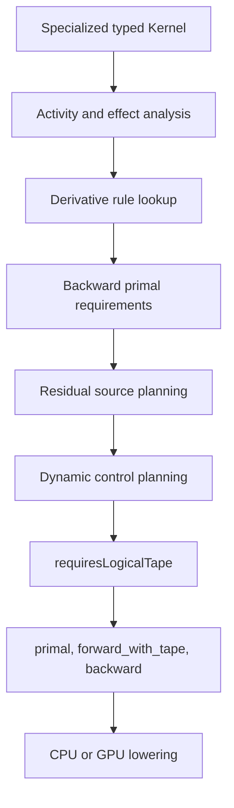
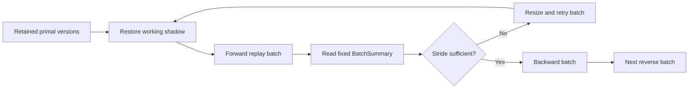
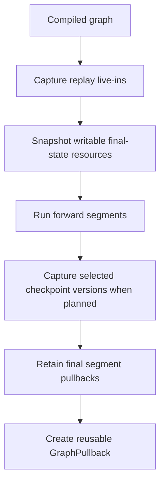

# VernonDSL 自动微分教程
> 本文以当前仓库实现为准，介绍一阶反向模式自动微分。
>
> Compute VJP 已支持 CPU 与 GPU。
> GPU captured Tape 已实现 device-local complete-workgroup bounded replay。
> Graphics AD、JVP 与高阶 AD 尚未实现。

## 阅读路径
如果你第一次接触编译器自动微分，建议依次阅读：
- 1) 第 1、2 节：VJP、公开 API 和 pullback；
- 2) 第 3、4 节：residual planning、no-Tape 与三种 `planning_policy`；
- 3) 第 5 节：编译器生成的 profile 与 Tape IR；
- 4) 第 6、7 节：CPU/GPU Runtime；
- 5) 第 8 节：ExecutionGraph VJP、checkpoint 和 replay；
- 6) 第 9、10 节：telemetry、边界与调试入口。
如果你正在实现或调试：
- source 选择错误：看 3.2 到 3.6；
- policy 行为不符合预期：看第 4 节；
- `residual_storage` 不对：看 3.7；
- CPU Tape 或 lane 问题：看第 6 节和附录 A；
- GPU replay、readback 或动态 stride：看第 7 节；
- graph 峰值内存或重放：看第 8 节；
- 指标含义：看第 9 节；
- derivative rule 或 physics 设计：看附录 B、C。
整套系统必须分成三个层次理解：


- **Kernel Tape** 保存一次 Kernel 反向所需的局部 residual 和动态控制历史。
- **Pipeline pullback** 封装一次 dispatch 的可复用反向计算及其 retained state。
- **Graph checkpoint** 保存 pass 间的资源版本，用于重放 graph segment。

三者生命周期、预算和 policy 都不同。

---

## 1. 概念：VJP、residual 与 pullback
### 1.1 从 Jacobian 到 VJP
设程序为：

```text
Y = F(X)
```
正向微分是：

```text
δY = J_F(X) δX
```
这里的 `δX`、`δY` 是 tangent。这对应 JVP，但 VernonDSL 当前没有公开 JVP API。反向模式传播 cotangent：

```text
Y_bar = ∂L/∂Y
X_bar = ∂L/∂X
X_bar = J_F(X)^T Y_bar
```
它不是对 `J_F` 求逆。这个式子来自标量目标 `L` 的链式法则：

```text
δL = Y_bar^T δY
   = Y_bar^T J_F(X) δX
   = (J_F(X)^T Y_bar)^T δX
```
从 `Y_bar` 映射到 `X_bar` 的函数叫 **pullback**。以平方为例：

```text
y = x * x

∂y/∂x = 2 * x

x_bar = y_bar * ∂y/∂x
      = y_bar * 2 * x
```
反向规则需要正向时的 `x`。这个 backward primal requirement 可以来自：
- 原始参数；
- 仍然存在的精确资源版本；
- 纯重算；
- 正向捕获的 residual；
- builtin，例如 invocation id；
- 动态控制记录。

### 1.2 residual 不是“所有中间值”
Residual 是反向规则确实需要的正向信息。编译器不应默认保存所有 SSA value。一个 requirement 通常有多种 source：

```text
required primal
    -> argument
    -> exact version reload
    -> rematerialization
    -> capture
```
Tape 只承载被选为 capture 的值，以及不可重建的动态控制历史。因此下面三句话都可能同时成立：
- Kernel 有大量 active operations；
- backward 需要很多 primal；
- 最终仍然是 no-Tape。

前提是每个 requirement 都有合法的非 capture source，而动态控制也能从 entry primals 重建。
### 1.3 cotangent 必须匹配 objective
Compute VJP 的 `outputs` 是可写 Storage objective 路径。Tensor 或多输出 objective 通常需要显式 cotangent。VernonDSL 不会隐式插入 `sum` 或 `mean`。只有一个元素的 graph objective 可以使用 `None` 作为隐式单位 cotangent。
非标量 objective 必须传入形状和 dtype 合法的 cotangent。例如：

```text
loss = mean((image - target)^2)

image_bar = ∂loss/∂image
          = 2 * (image - target) / element_count
```
若 Kernel 只产生 `image`，它的 pullback 接收的是 `image_bar`，而不是一个含义不明的“对 image 求导”开关。
### 1.4 tangent 类型
当前梯度元素类型提升规则是：

```text
f16 primal     -> f32 gradient
f32 primal     -> f32 gradient
f64 primal     -> f64 gradient
integer / bool -> Zero
```
Tensor、Vector、Matrix、Tuple 和 Struct 递归构造 tangent。Storage 梯度使用独立拥有的 Storage，不隐式写入 primal Storage。VernonDSL 没有 `requires_grad`，也没有持久的 `.grad` 状态。`wrt` 是唯一的公开求导输入声明。

---

## 2. 公开 API：声明、执行与复用
### 2.1 最小 compute VJP
当前 Python 声明与执行形式如下：

```python
import numpy as np
import vernon_dsl as vd

@vd.kernel
def square(
    value: vd.TensorView[vd.f32, (1,), vd.read],
    loss: vd.TensorView[vd.f32, (1,), vd.write],
) -> None:
    loss[0] = value[0] * value[0]

square_vjp = vd.ad.vjp(
    square,
    wrt=("value",),
    outputs=("loss",),
    planning_policy="min_memory",
)

value = vd.storage.from_numpy(np.array([3.0], dtype=np.float32))
loss = vd.storage.zeros(dtype=vd.f32, shape=(1,))

result, pullback = square_vjp(value, loss, grid=(1, 1, 1))
gradient = pullback(np.array([2.0], dtype=np.float32))["value"]
```
重要语义：
- `vd.ad.vjp(...)` 声明编译变换，不立即执行。
- `wrt` 与 `outputs` 必须是 canonical source paths。
- path 集合必须非空、唯一，并在内部规范排序。
- direct 调用必须显式提供三维正整数 `grid`。
- 返回值是 `(primal_result, pullback)`。
- 写 Storage 的 Kernel 常见 `primal_result` 为 `None`。
- pullback 返回按 `wrt` path 命名的梯度字典。
### 2.2 `planning_policy` 的实际拼写
公开 API 只接受：

```python
planning_policy="min_memory"
planning_policy="balanced"
planning_policy="min_runtime"
```
默认值是：

```python
planning_policy="min_memory"
```
诸如 `"heuristic"`、`"runtime"` 或 `"memory"` 都会被拒绝。Policy 是 transform identity 的一部分。同一个 Kernel 使用不同 policy 会产生不同 transform identity，从而可以拥有不同编译产物。
### 2.3 Direct 与 cooked 都支持 CPU/GPU compute
旧的“direct/cooked 仅 CPU”描述已经不正确。当前 direct compute VJP 会根据 active architecture 选择：
- CPU；CUDA；Vulkan；DirectX；Metal；OpenGL；OpenGL ES。
实际可用性仍取决于构建配置、设备和 backend 能力。Cooked 路径把 primal、`forward_with_tape`、`backward` 以及反射和 AD metadata 写入 pipeline asset。它不是另一套 Python 自动微分。

```python
asset = vd.pipeline_asset(
    id="compute/square",
    program=vd.ad.vjp(
        square,
        wrt=("value",),
        outputs=("loss",),
        planning_policy="balanced",
    ),
)
```
Direct 与 cooked 使用相同的 structured VJP 语义和 native Runtime。
### 2.4 普通 primal 与 AD forward 不同
普通 Kernel 调用或普通 `compiled.submit()`：
- 只运行 primal；不创建 AD Tape；不创建 pipeline pullback；不承担 backward 生命周期。
只有 VJP 调用或 `compiled.vjp()` 才构造 pullback。注意 no-Tape VJP 仍然是 AD forward：它不分配 Tape，但可能保留 backward 所需的 primal/resource version、shape 或 launch state。
### 2.5 pullback 可复用
一个 pullback 可以用不同 cotangent 重复调用：

```python
_, pullback = square_vjp(value, loss, grid=(1, 1, 1))

first = pullback(np.array([1.0], dtype=np.float32))["value"]
second = pullback(np.array([-0.25], dtype=np.float32))["value"]
```
复用意味着：
- retained state 必须活到 pullback 被释放；
- 每次 apply 都产生新的梯度结果；
- Runtime 必须把临时 replay 状态恢复到可再次使用的状态；
- graph pullback 也要在反向后重建必要的 final segment state。
“可复用”不等于“可以无同步地并发调用同一个 pullback”。除非 Runtime 明确提供该并发保证，调用者应把同一 pullback 的 apply 视为有序操作。

---

## 3. Residual planning 与 no-Tape
### 3.1 backward primal requirements
Derivative rule 不只给出代数公式，还声明反向需要哪些 primal operand 或 result。例如：

```text
z = x * y

x_bar += z_bar * y
y_bar += z_bar * x
```
乘法 VJP 需要 `x` 和 `y`。而加法：

```text
z = x + y

x_bar += z_bar
y_bar += z_bar
```
不需要保存 `z`、`x` 或 `y` 来计算局部导数。Planner 对每个 active requirement 做三件事：
- 1) 枚举可用 source；2) 先过滤不合法或当前 contract 不可用的 source；3) 在预算内按 policy 排序并选取。
这里“requirement”比“SSA value”更准确。聚合值会按 canonical ABI leaf 规划，不同 leaf 理论上可以有不同候选和成本。
### 3.2 六类可选 source
当前 source kind 是：

```text
Builtin
PrimalArgument
ExactVersionReload
PureRematerialization
StaticCapture
DynamicCapture
```
另有 `Unsupported` 用于诊断和失败路径，它不是可执行 source。
#### Builtin
值可由 Runtime invocation context 直接提供。典型信息包括：
- global invocation 坐标；local invocation 坐标；workgroup 坐标；dispatch 相关 builtin。
Builtin 不需要作为 residual payload 捕获。
#### PrimalArgument
值来自 Kernel entry 参数，并可作为 backward 的显式 `primal.<source_name>` 参数。

标量或值类型参数通常可直接使用。TensorView 参数不能仅凭原始 descriptor 就宣称安全，
而是要求 retained logical resource version。没有版本保证或没有计入预算的深拷贝，
就不是合法 source。
#### ExactVersionReload
值来自 Storage load，并且 backward 可从同一逻辑 Storage 的精确历史版本重新加载。它要求：
- load 的 Storage identity 已知；`versionBefore` 精确；该版本被保留；load indices 可重建；当前 compiler/runtime/graph contract 能传递这个版本。
“同一个 Python 对象还在”并不足够。如果 Storage 已被后续 pass 或同一 Kernel 覆写，当前内容不等于所需的历史版本。
#### PureRematerialization
在 backward 中重算 requirement。Recipe 必须由允许的纯操作构成，并从 backward 可用 root 出发。它要求：
- 无不可重放副作用；operand 可用或可递归重建；index 计算可重建；reduction 的确定性约束满足；动态控制上下文可重建或已有记录。
纯重算会降低 retained bytes，但增加 `recomputationCost`。
#### StaticCapture
把 top-level、固定结构中的 requirement 写入 Tape。它有：
- `captureStoreBytes`；`backwardLoadBytes`；对齐和 root record 成本；forward 到 backward 的持久生命周期。
Static capture 意味着有 Tape，但 layout 可在编译期固定。
#### DynamicCapture
requirement 位于必须记录的动态 region 中。它写入按实际执行路径增长的 region record。除 value payload 外，动态 Tape 可能还包含：
- predicate；executed count；exit kind；parent/child record identity；previous record offset；child region handle。
Dynamic capture 不是“一 lane 一个 C++ 对象图”。IR 定义逻辑 record，Runtime 使用受预算控制的 arena/设备 buffer 承载。
### 3.3 legality 先于 policy
Policy 不能把非法 source 变合法。候选进入排序前必须同时满足：

```text
candidate.legal
&& candidate.availableInCurrentContract
&& candidate.deterministicReductionLegal
&& candidate fits compiler hard budget
```
这条顺序很重要。例如，`ExactVersionReload` 的 runtime score 很低，但目标版本已被覆写且没有 checkpoint：
- 它不是“稍差”的候选；它是非法候选；三种 policy 都不能选它。
又例如，某个 rematerialization 依赖非确定性 reduction：
- 如果当前 deterministic contract 不允许；即使它节省大量内存；也必须先过滤。
Policy 是 legal plan 之间的偏好，不是语义豁免。
### 3.4 control 能否重建
no-Tape 不仅要求数值 residual 无 capture，还要求反向控制流不依赖逻辑 Tape。当前 planner 会尝试从 entry primals 重建控制：
- `scf.if`：condition 及 active body requirement 可重建时可省记录；
- canonical positive-step `scf.for`：bounds 和 active body 可重建时可省记录；
- nested reconstructible `if/for`：可递归处理；
- active `scf.while`：通常需要 executed count 与 exit kind；
- 不可重建动态 region 会出现在 Tape plan 中。
Canonical `scf.for` 还要求：
- step 是正的常量；lower bound 可从 entry primals 重建；upper bound 可从 entry primals 重建。
动态 region 一旦必须记录，`requiresLogicalTape` 就为真，即使其中没有一个数值 residual payload。
### 3.5 `requiresLogicalTape` 的精确定义
当前 structured emitter 的判定是：

```text
requiresLogicalTape(plan) =
    plan.regions 非空
    或任一 selected source 是 StaticCapture
    或任一 selected source 是 DynamicCapture
    或存在未能选出有效 candidate 的保守失败状态
```
正常成功编译时可以简化为：

```text
有不可重建的动态 region
|| 至少一个 requirement 选择 capture
```
若结果为 false：
- `forward_with_tape` 实际克隆普通 forward，不返回 Tape；
- backward ABI 不含 Tape 与 root region；
- `tape_bytes` 为 0；
- `residual_storage` 为 `"none"`。
若结果为 true：
- forward 创建 capture transaction；backward 接收 Tape；storage kind 根据 region 是否动态区分 static/dynamic。
### 3.6 no-Tape 的完整含义
no-Tape 的严格含义只有：
> 这次 structured Kernel VJP 不需要逻辑 AD Tape。
它不意味着：
- backward 不需要任何 primal；
- pullback 不保留任何对象；
- retained allocation 一定为 0；
- graph 不需要 checkpoint；
- GPU 不需要 launch metadata；
- backward 不需要 gradient temporary；
- 所有计算都在一次 graph submission 中完成。

no-Tape backward 仍可显式接收：
- builtin；
- `primal.<name>`；
- exact resource version；
- shape source；
- output cotangent；
- Storage gradient destination；
- launch geometry。
因此 telemetry 中完全可能看到：

```text
logical_residual_bytes   = 0
resident_tape_bytes      = 0
allocated_tape_bytes     = 0
retained_allocation_bytes > 0
```
这不是矛盾。前三项是 Tape，最后一项还包括 retained primal/resource backing allocations。
### 3.7 `residual_storage`
编译器对 forward/backward profile 写入：

```text
vernon.ad.residual_storage = "none"
vernon.ad.residual_storage = "static"
vernon.ad.residual_storage = "dynamic"
```
判定为：

```text
none:
    requiresLogicalTape == false
static:
    requiresLogicalTape == true，且没有必须记录的动态 region
dynamic:
    requiresLogicalTape == true，且存在必须记录的动态 region
```
`static` 不等于 no-Tape。它仍有固定 layout 的 Tape。`dynamic` 也不等于无限内存。Runtime 使用 bounded replay，并在实际 stride 超出 hint 时进行受预算约束的 retry。
### 3.8 compiler hard budget
当前 compiler residual planning 默认 hard budget 是：

```text
64 MiB = 64 * 1024 * 1024 bytes
```
函数属性 `vernon.ad.memory_budget_bytes` 可提供正的 64-bit 覆盖值。这是 hard admission 条件，不是软建议。候选 capture 加上：
- fixed invocation/region headers；已选择 capture；leaf padding/alignment；最终 retained Tape hint；
必须能放入预算。如果没有合法 plan 能 fit，编译失败并报告没有 residual plan 满足 compiler memory budget。Hard budget 可以覆盖 policy 的 soft preference。例如 `min_runtime` 偏好 capture，
但 capture 超预算时必须选择合法且 fit 的 reload/rematerialization，或者失败。
### 3.9 生命周期：CPU no-Tape
CPU no-Tape forward：
1. 验证 dispatch contract。
2. 保留 backward ABI 明确要求的 primal leaves。
3. 保留必要的 TensorView owner 与 shape。
4. 运行无 Tape 的 forward profile。
5. 创建 `NoTapeCpuPullback`。

CPU no-Tape apply：
1. 读取 retained primals 和 runtime shapes。
2. 准备 cotangent 与 gradient destinations。
3. 直接运行 backward profile。
4. 发布新的 gradients。

没有 Host Tape arena，但 retained input owner 仍可占据显著内存。

### 3.10 生命周期：GPU no-Tape
GPU no-Tape forward：
1. 运行 no-Tape forward profile。
2. 保留 backward bindings 所需的 device/host primal values。
3. 保留 grid 与 workgroup geometry。
4. 创建 `NoTapePullback`。

GPU no-Tape apply：
1. 预留 apply-time temporary budget。
2. 根据 `grid * workgroupSize` 准备导数值。
3. materialize backward binding plan。
4. 上传固定 launch metadata。
5. 对原始 grid 提交一次 backward dispatch。
6. stage 并发布 gradients。

no-Tape GPU Runtime 不读取 `planning_policy`。它没有 replay batch 可规划。“单次 backward dispatch”指 Kernel backward dispatch，不排除必要的 upload、同步和最终 gradient publication/readback。

---

## 4. `planning_policy`：三个层次、三个含义
同样的三个字符串在三层出现，但绝不能把三层当成一个全局旋钮。
### 4.1 A 层：structured residual planning
这是公开 Python API：

```python
vd.ad.vjp(
    kernel,
    wrt=("x",),
    outputs=("loss",),
    planning_policy="balanced",
)
```
它控制编译器在 legal residual source 之间的排序。当前编译器 score 精确为
`runtime = captureStoreBytes + backwardLoadBytes + 4 * resourceReloadCost + 8 * recomputationCost`：

```text
runtime = captureStoreBytes
        + backwardLoadBytes
        + 4 * resourceReloadCost
        + 8 * recomputationCost
```
所有加法和乘法使用饱和语义，溢出时按最大 `uint64` 处理。定义：

```text
retained = captureStoreBytes
```
三种排序键是：

```text
min_memory:  (retained, runtime)
balanced:    (retained + runtime, retained)
min_runtime: (runtime, retained)
```
键按字典序升序比较。
#### `min_memory`
先最小化 capture retention，再比较 weighted runtime。它倾向：
- 优先考虑 `retained = 0` 的 Builtin、PrimalArgument、ExactVersionReload 或
  PureRematerialization；这些非 capture source 之间再按 weighted runtime 排序。

这不是固定的 source 类别优先表。例如合法 rematerialization 比 exact reload 更便宜时，
两者 retained 同为 0，`min_memory` 会选择 rematerialization。
但“倾向 no-Tape”不等于“保证 no-Tape”。不可重建控制或唯一合法的 capture requirement 仍会生成 Tape。此外，`min_memory` 禁止 whole-dispatch Tape retention。

#### `balanced`
先最小化：

```text
retained + runtime
```
再最小化 retained。它允许 whole-dispatch retention，但只对 static Tape 开放，并仍要通过 Runtime hard physical budget admission。它不保证介于另外两者的内存值。离散候选、对齐和 hard budget 都可能让结果跳变。
#### `min_runtime`
先最小化 weighted runtime，再最小化 retained。它更可能选择 capture，也允许 static Tape 的 whole-dispatch retention。但它仍不能：
- 选择非法 exact reload；
- 选择不确定的 rematerialization；
- 超过 compiler hard budget；
- 绕过 Runtime physical budget。

### 4.2 数值化例子：同一个 requirement
假设一个 16-byte residual 有三个 legal/current/deterministic 候选：

```text
ExactVersionReload:
    captureStoreBytes = 0, backwardLoadBytes = 0
    resourceReloadCost = 3, recomputationCost = 0
PureRematerialization:
    captureStoreBytes = 0, backwardLoadBytes = 0
    resourceReloadCost = 0, recomputationCost = 1
StaticCapture:
    captureStoreBytes = 16, backwardLoadBytes = 16
    resourceReloadCost = 0, recomputationCost = 0
```
先计算 runtime：

```text
ExactVersionReload:      runtime = 4 * 3 = 12, retained = 0
PureRematerialization:   runtime = 8 * 1 = 8, retained = 0
StaticCapture:           runtime = 16 + 16 = 32, retained = 16
```
三个 policy 都会选 `PureRematerialization`。这个例子说明 policy 名称不是固定 source 映射。再看一个能产生分歧的 requirement：

```text
ExactVersionReload:    retained = 0,  runtime = 40
PureRematerialization: retained = 0,  runtime = 56
StaticCapture:         retained = 16, runtime = 8
```
排序如下。`min_memory`：

```text
ExactVersionReload    -> (0, 40)
PureRematerialization -> (0, 56)
StaticCapture         -> (16, 8)
```
选择 `ExactVersionReload`。`balanced`：

```text
ExactVersionReload    -> (40, 0)
PureRematerialization -> (56, 0)
StaticCapture         -> (24, 16)
```
选择 `StaticCapture`。`min_runtime`：

```text
ExactVersionReload    -> (40, 0)
PureRematerialization -> (56, 0)
StaticCapture         -> (8, 16)
```
选择 `StaticCapture`。再假设 StaticCapture 因剩余 hard budget 只有 8 bytes 而不能 fit：
- 三种 policy 都先排除 StaticCapture；
- `min_memory` 仍选 ExactVersionReload；
- `balanced` 改选 ExactVersionReload；
- `min_runtime` 也改选 ExactVersionReload。

这就是“hard budget 覆盖 soft preference”。如果 exact version 也不再 current，
它不是高成本候选，而是直接不参与排序。此时只剩 rematerialization；
若 rematerialization 也非法，编译失败。
### 4.3 whole-dispatch retention
Whole-dispatch retention 是 Runtime 对 static Tape 的快路径：正向一次构造并保留整个 dispatch 的 Tape，反向直接消费，不做 segment replay。当前编译 metadata 只在下列条件下允许：

```text
residual_storage == "static"
&& planning_policy in {"balanced", "min_runtime"}
```
`min_memory` 明确禁止。“允许”仍不是“必定采用”。CPU Runtime 会尝试按物理内存策略预留整个 dispatch，admission 失败时回退到 bounded replay。动态 Tape 不使用 whole-dispatch retention permission。
### 4.4 B 层：GPU Tape replay batch policy
这一层只存在于 GPU captured Tape 路径。它根据 apply-time temporary limit 先计算：

```text
maximumCapacity = min(
    groupCount,
    budget 可容纳的 group 数,
    uint32 最大值
)
```
预算分为两部分：
- 每个 workgroup 增长的部分：complete workgroup 的 Tape、forward segment metadata 和
  backward segment metadata；
- 每次 apply 只计一次的固定部分：已经准备的 derivative temporary 和固定
  `BatchSummary`。

固定部分会先从 apply-time budget 中扣除，但不会随一个 batch 中的 workgroup 数量线性增长。
三种 policy 的 batch capacity：

```text
min_memory:  min(maximumCapacity, ceil(groupCount / 64))
balanced:    ceil(sqrt(maximumCapacity))
min_runtime: maximumCapacity
```
`min_memory` 的 floor 保证在容量允许时最多约 64 batches。它不是固定一组一个 batch，否则 submission 和固定 summary readback 会随 workgroup 数线性增长。`balanced` 取最大容量的平方根附近。`min_runtime` 使用 hard budget 允许的最大 batch。
这一层仍受 apply-time hard physical budget 约束。如果连一个 complete workgroup 都放不下，apply 失败。no-Tape GPU path 不调用 batch planner，也不读取 policy。
### 4.5 C 层：ExecutionGraph checkpoint policy
Graph checkpoint planner 的内部 policy 也叫：

```text
min_memory
balanced
min_runtime
```
但它比较的是整个 checkpoint schedule。`min_memory`：

```text
(peakBytes, weightedRuntimeCost)
```
先最小化 graph 峰值内存。`balanced`：

```text
(peakBytes + weightedRuntimeCost, peakBytes)
```
先比较峰值加权运行成本之和。`min_runtime`：

```text
(weightedRuntimeCost, peakBytes)
```
先最小化运行成本。搜索 frontier 有界，当前上限为 65536 个 candidate。`min_runtime` 在找到 feasible candidate 后可以避免继续扩展该 candidate，形成运行时优先的早停/剪枝行为。所有 graph 候选仍必须：
- `peakBytes <= memoryBudget`；replayable；满足 deterministic reduction；checkpoint resource 可表示且可恢复。

Graph 层的 weighted runtime 与 structured value-level score 不是同一个公式。当前 graph planner
概念上计算：

```text
weightedRuntimeCost =
    captureStoreBytes
    + backwardLoadBytes
    + 2 * persistentCheckpointBytes
    + 4 * resourceReloadCost
    + 8 * recomputationCost
    + 16 * replayCost
```

多 segment 时，capture store 还会计入重建可复用 Tape 的额外成本。权重是 planner 的离散
成本尺度，不是毫秒；`peakBytes + weightedRuntimeCost` 也只是当前 `balanced` 的排序分数，
不是把物理 bytes 与真实时间做量纲严格的加法。
### 4.6 Python graph API 的真实边界
当前 Python 只公开：

```python
graph.plan_autodiff_checkpoints(memory_budget=...)
```
它没有公开 graph checkpoint `planning_policy` 参数。生产路径调用内部 planner 时默认使用 `balanced`。因此：

```python
vd.ad.vjp(..., planning_policy="min_runtime")
```
不会自动把 ExecutionGraph checkpoint policy 改成 `min_runtime`。它会影响：
- 1) structured residual source 选择；2) 若最终是 GPU captured Tape，影响 replay batch；
但不会通过 Python API 控制 graph checkpoint policy。三层关系应记为：

```text
A: vd.ad.vjp(planning_policy=...)
   -> structured residual source selection

B: compiled policy + GPU captured Tape
   -> replay batch capacity

C: internal graph checkpoint policy
   -> checkpoint cuts and replay schedule
   -> Python production path currently defaults to balanced
```
---

## 5. 编译器与 Tape IR
### 5.1 编译流程


主要阶段：
1. 找出 active input、operation、result 与 Storage effect。
2. 验证每个 active operation 都有 derivative rule。
3. 收集 rule 的 primal requirements。
4. 构建 exact reload、rematerialization 和 capture 候选。
5. 按 legality、budget、policy 选择 source。
6. 判断控制流是否可重建。
7. 建立 residual lifetime 和物理 buffer assignment。
8. 生成 forward/backward profile。
9. 写入 reflection 与 telemetry metadata。
### 5.2 三个 profile
编译产物包含：
#### `primal`
普通计算入口。
- 普通调用使用它；不创建 Tape；graph 普通 `submit()` 使用它；taped Runtime 的 replay 之外，首次用户可见 primal 也可使用它。
#### `forward_with_tape`
名字是稳定 profile 名称，即使最终是 no-Tape。no-Tape 时它是 primal clone，没有 Tape ABI。有 Tape 时它：
- begin invocation；reserve root/region records；写入 selected captures；提交 capture transaction；返回 Runtime 所需的 Tape state。
#### `backward`
接收：
- 可选 Tape/root region；builtin；required primal arguments；shape sources；output cotangents；Storage gradient destinations。
返回 value gradients，并写入 Storage gradients。
### 5.3 Tape IR 的核心类型
逻辑 Tape IR 使用以下概念：

```text
!vernon.ad_tape
!vernon.ad_region_header
record
leaf
header
```
- Tape 是一次 invocation 的逻辑容器。
- Region 表示动态结构中的一段执行历史。
- Record 表示一次具体执行实例。
- Leaf 是 canonical ABI 下的 scalar/vector/tensor leaf payload。

IR 不规定物理表示必须是 host vector 还是 device buffer。CPU/GPU Runtime 可以使用不同实现，
但必须保持相同的 record 语义。
### 5.4 invocation 与 region schema
Invocation header 至少包含 record identity，并可包含 root region handles。动态 region header 可包含：
- parent record identity；child region ordinal；last record offset；executed count；exit kind。
每个动态 record prefix 可包含：
- record identity；previous record offset；branch predicate；child region handles。
这些字段使 backward 能够：
- 从最后一次执行向前遍历；恢复嵌套结构；区分分支；逆序处理循环 iteration；验证 parent/child 关系。
### 5.5 forward Tape operations
概念上的正向操作包括：

```text
ad.begin_invocation
ad.begin_region
ad.reserve_record
ad.write_leaf
ad.end_region
ad.capture_yield
```
`reserve_record` 必须尊重：
- record size；stride；alignment；当前 lane/region；Runtime budget。
`ad.write_leaf` 按 canonical ABI 投影 aggregate，不能用 host layout 猜测 shader/MLIR value layout。
### 5.6 backward Tape operations
概念上的反向操作包括：

```text
read root record
read canonical leaf
open child region
walk previous record
read predicate
read executed count
read exit kind
```
Backward emitter 按 selected source 取值：
- `PrimalArgument`：从显式 backward 参数读取；
- `ExactVersionReload`：从精确资源版本读取；
- `PureRematerialization`：发出重算 recipe；
- capture：从 root/dynamic record 读取。
### 5.7 capture transaction
Tape 构造不是“边写边永久发布”。Runtime 需要 transaction 语义：

```text
begin
  -> allocate / reserve
  -> execute forward writes
  -> validate status
  -> commit
```
若发生：
- 分配失败；overflow；Kernel 失败；动态 stride 不足；device submission 失败；
本轮 capture 不得作为可用 pullback 发布。GPU 动态 stride retry 会恢复 primal shadow，重新构建 batch，而不是在已经被 forward 修改的状态上盲目重跑。
### 5.8 static hint 不是容量上限
`staticTapeBytesHint` 由：
- invocation header；invocation record；每个动态 region 的一个样本 header/record；
组合而来。它是 layout/statistics hint，不是：
- 最大循环次数；最大动态 record 数；最大 Tape 容量；安全的无检查 allocation size。
GPU Runtime 会规范化 stride，运行 forward 后读取 `BatchSummary`，发现所需 stride 更大时重新预算并 retry。
### 5.9 residual lifetime 与物理 slot
每个 residual interval 包含：
- ABI leaf；memory domain；byte size；alignment；lifetime begin/end；是否 rematerialized；recomputation cost。
物理 buffer assignment 可以让不重叠 lifetime 共享 slot。当前 memory domain 包括：

```text
PersistentResidual
TransientGradient
GraphCheckpoint
ForwardEffectShadow
```
逻辑 residual bytes、物理 peak 和实际 allocation traffic 因此不是同一个指标。

---

## 6. CPU Runtime
### 6.1 CPU 的两条主路径
根据 `residual_storage`：

```text
residual_storage = none
    -> NoTapeStructuredCpuExecutable

residual_storage = static | dynamic
    -> TapedStructuredCpuExecutable
```
no-Tape 直接保存 required primals 并运行 backward。Tape 路径再分：
- whole-dispatch retained static Tape；complete-workgroup bounded replay；dynamic region arena。
### 6.2 为什么按 complete workgroup
有 barrier、workgroup shared memory 或 cooperative reduction 时，单个 invocation 不能独立 replay。最小语义安全单位是完整 workgroup：

```text
forward complete workgroup
    -> backward complete workgroup
```
否则可能破坏：
- barrier 到达关系；shared memory 生命周期；workgroup reduction 顺序；joint reverse 所需的同步。
### 6.3 lane 模型简述
CPU 中：
- grid 是 workgroup 数；workgroup size 来自 Kernel；invocation 是逻辑 lane；lane 不是 OS thread；worker thread 执行一段 lane range。
坐标关系：

```text
global_id = workgroup_id * workgroup_size + local_id
```
Runtime frame 以逻辑 lane 索引，调度器可以让有限 worker 处理大量 lane。详细 lane/barrier/ownership 模型见附录 A。
### 6.4 static whole-dispatch 快路径
若编译 metadata 允许，CPU Runtime 尝试：
1. 计算 invocation count。
2. 预留整个 dispatch 的 Tape construction bytes。
3. 分配 `HostStaticTapeBatch`。
4. 运行 augmented forward。
5. commit budget。
6. 让 pullback 持有 Tape batch。

只对：
- static residual；`balanced` 或 `min_runtime`；通过 hard physical admission；
成立。失败时可回退到 bounded replay，而不是违反预算强行驻留。

### 6.5 bounded replay
若不保留 whole dispatch：
1. 用户可见 forward 运行 primal。
2. pullback 保留 replay 所需输入。
3. apply 时选取一个 workgroup/range。
4. 重放 forward，并构造该范围的 Tape。
5. 立即运行对应 backward。
6. 累加 staged gradients。
7. 回收或复用 Tape scratch。
8. 处理下一个范围。
9. 成功后一次性发布梯度。

这样 Tape 峰值受限于 batch，代价是重算和更多 Runtime 调度。
### 6.6 dynamic Tape arena
动态控制记录使用 host Tape allocator。Allocator 负责：
- lane-local logical state；
- region header；
- record payload；
- child linkage；
- alignment；
- context budget；
- recyclable construction storage。
动态执行次数没有编译期固定上限，但实际 allocation 受 Runtime budget 约束。
### 6.7 梯度 publication
CPU backward 先写 staged gradient destinations。全部 segment 成功后才 commit 到 caller-visible result。这样中途失败不会发布部分梯度。Fan-in accumulation 必须遵守 ownership：
- invocation-private：可以直接写；
- workgroup-shared：需要 workgroup 同步；
- atomic-shared：使用支持的原子语义；
- graph-level fan-in：由 graph pullback 确定性累加。

---

## 7. GPU Runtime
### 7.1 GPU no-Tape
GPU no-Tape 使用：

```text
NoTapeExecutable
    -> NoTapePullback
```
Forward 保留 backward binding plan 需要的 values，但不创建 Tape buffer。
Apply 对原始 grid 提交一次 backward dispatch。

它不进入 replay scheduler，也不读取 structured `planning_policy`。
因此 no-Tape 的常见 control-plane 特征是：
- 无 Tape status batch readback；
- 无 forward replay batch；
- 无 dynamic stride retry；
- 有一次 backward dispatch；
- 可能有 launch upload 和最终 gradient readback。
### 7.2 GPU captured Tape 已实现
GPU captured Tape 不是 TODO。当前 `runtime_gpu_pullback.cpp` 已实现：
- device-local Tape；
- complete-workgroup batching；
- reverse batch scheduling；
- retained primal shadow；
- forward replay；
- backward replay；
- fixed `BatchSummary` status；
- dynamic stride resize/retry；
- hard apply-time budget；
- failure rollback。
不要再沿用旧计划文档末尾“GPU bounded replay 尚待实现”的描述。
### 7.3 device-local complete-workgroup replay
每个 batch 包含若干完整 workgroup。


Tape payload 始终留在 device-local buffer。Host 不下载每个 lane 或每个 record 的 Tape。每个 forward batch 只下载固定大小的：

```text
BatchSummary
```
Summary 表示：
- 最大实际所需 Tape bytes/stride；construction status。
因此：
- Tape payload readback 为 0；status readback 大小不随 batch group 数增长；readback 次数随 batch 数增长。
### 7.4 reverse batch order
Scheduler 按反向顺序处理 workgroup range。每个 `Segment` 映射：
- 原 dispatch 中的 workgroup；batch-local group；lane 到 Tape offset；当前 Tape stride。
Forward 与 backward 都以：

```text
(batchGroups, 1, 1)
```
提交，而 launch metadata 保留原始 grid，使 builtin/global coordinates 仍对应原 dispatch。
### 7.5 retained shadow 与恢复
Replay 不能直接反复修改 retained initial state。Runtime 为 retained device values 创建 working shadow。每个非 pristine batch 前：
- 规划 restore copies；把 retained initial version 恢复到 working；再执行 forward replay。
若动态 stride retry：
- 释放旧 Tape/segment/status buffer；
- 按 required stride 重新预算；
- 创建 replacement buffers；
- 更新 scheduler capacity；
- 再次恢复 working shadow；
- 重跑同一 batch。
这保证 retry 看到相同 primal state。
### 7.6 动态 stride retry
初始：

```text
tapeStride = normalize(staticTapeBytesHint)
```
规范化规则：
- 至少 16 bytes；向 4-byte 对齐；检查 size overflow。
Forward batch 后：
1. 下载 `BatchSummary`。
2. 计算 batch lanes 的 required bytes。
3. status 为 0 时进入 backward。
4. status 为 1 且 required stride 更大时 retry。
5. 其他 status 或不增长 stride 视为 construction failure。

新 stride 可能降低 batch capacity，因为一个 complete workgroup 的 Tape 更大。如果新 stride 下一个 workgroup 也无法 fit apply-time budget，apply 失败，而不是拆开 workgroup。
### 7.7 GPU memory accounting
Captured replay 的 temporary peak 包括：
- derivative temporary；
- working primal restoration；
- Tape buffer；
- forward segment buffer；
- backward segment buffer；
- fixed status buffer；
- launch metadata。
Retained allocation 单独包括 pullback 生命周期内保存的：
- device primal versions；host scalar/value bindings；backing allocations。
`temporary_allocation_traffic_bytes` 还可能大于 peak，因为动态 retry 会分配 replacement buffers。
### 7.8 failure 与 publication
GPU apply 可能在以下边界失败：
- apply memory reservation；
- derivative preparation；
- retained restoration；
- binding materialization；
- Tape/segment/status allocation；
- upload/copy；
- forward submission；
- summary download；
- stride resize；
- backward submission；
- gradient staging/publication。
只有成功完成全部 batch 后才发布 gradients。失败不能把半成品作为有效结果返回。

---

## 8. ExecutionGraph VJP
### 8.1 三个对象不要混淆
再次区分：
#### Kernel Tape
单个 pass 的局部 reverse residual/control。
#### Pipeline pullback
一次 `VjpComputePass` forward 产生，持有该 dispatch 的 retained state，并可应用局部 cotangent。
#### Graph checkpoint
跨 pass 保存精确 resource version，用于重放一段 graph，从而重新产生 pipeline pullbacks。Graph no checkpoint 不代表 Kernel no-Tape。Kernel no-Tape 也不代表 Graph 不需要保存资源版本。
### 8.2 为什么需要 graph VJP
对于：

```text
PassA: x -> h
PassB: h -> loss
```
Graph backward 是：

```text
loss_bar
    -> PassB pullback
    -> h_bar
    -> PassA pullback
    -> x_bar
```
有 fan-out 时：

```text
h -> PassB -> y1
h -> PassC -> y2
```
`h_bar` 是来自 B、C 的贡献之和。Graph Runtime 负责 endpoint identity、顺序和确定性累加。
### 8.3 准确的 Python API 示例

```python
import numpy as np
import vernon_dsl as vd

@vd.kernel
def square(
    source: vd.TensorView[vd.f32, (1,), vd.read],
    output: vd.TensorView[vd.f32, (1,), vd.write],
) -> None:
    output[0] = source[0] * source[0]

square_vjp = vd.ad.vjp(
    square,
    wrt=("source",),
    outputs=("output",),
    planning_policy="min_memory",
)

source = vd.storage.from_numpy(np.array([3.0], dtype=np.float32))
intermediate = vd.storage.zeros(dtype=vd.f32, shape=(1,))
loss = vd.storage.zeros(dtype=vd.f32, shape=(1,))

builder = vd.ExecutionGraph()
source_resource = builder.differentiable_input("source", source)
intermediate_resource = builder.import_resource(intermediate, exported=False)
loss_resource = builder.objective("loss", loss)

first = builder.add_pass(
    vd.VjpComputePass(
        "square-source",
        square_vjp,
        {"source": source_resource, "output": intermediate_resource},
        grid=(1, 1, 1),
    )
)

second = vd.VjpComputePass(
    "square-intermediate",
    square_vjp,
    {"source": intermediate_resource, "output": loss_resource},
    grid=(1, 1, 1),
)
second.depends_on(first)
builder.add_pass(second)

builder.plan_autodiff_checkpoints(memory_budget=512_000)
compiled = builder.compile()

pullback = compiled.vjp()
gradients = pullback(None)
source_bar = gradients["source"]
```
API 要点：
- `differentiable_input(name, value)` 声明 named gradient endpoint。
- `objective(name, value)` 声明 graph objective。
- `VjpComputePass` 接受 structured `ProgramExpression` 或 cooked VJP pipeline。
- bindings 名称必须与 Kernel 参数匹配。
- `grid` 是三个正整数。
- `plan_autodiff_checkpoints` 目前只接受 `memory_budget`。
- `compile()` 消耗 builder，并返回 immutable compiled graph。
- `compiled.vjp()` 执行 graph AD forward，并返回 `GraphPullback`。
- 标量 objective 可用 `pullback(None)`。
- 多 objective 使用按 objective 名称映射的 cotangent。

### 8.4 graph compile
编译 graph 时：
1. 同步 pass declaration、resource access 与 dependency。
2. 建立 hazard schedule。
3. 验证 differentiable inputs 和 objectives。
4. 编译每个 `VjpComputePass`。
5. 读取每个 pass 的 residual/replay metadata。

如果用户调用了 `plan_autodiff_checkpoints(...)`，还会：

6. 追踪 required exact resource versions。
7. 建立 checkpoint DAG。
8. 在 memory budget 内选择 cuts。
9. 冻结 checkpoint layout 和 replay segments。

没有显式请求 checkpoint planning 时，graph 仍可正常 `compile()` 和 `vjp()`，但不会建立
checkpoint cuts；forward 会保留整个 schedule 的 pass pullbacks。
Pass metadata 包括：
- invocation count；
- Tape stride；
- workgroup invocation count；
- replay snapshot bytes；
- active operation replay cost；
- resource reload cost；
- recomputation cost；
- retained primal bytes；
- deterministic reduction legality；
- read/write footprints。

### 8.5 checkpoint DAG
Planner 按 resource version 建模：
- producer；
- consumers；
- byte size/alignment；
- checkpointable；
- pass predecessors；
- required primal version；
- replayable；
- residual bytes；
- retained allocation；
- forward peak；
- replay cost。
一个 cut 必须保存所有跨 cut 存活、且后续 replay 需要的精确版本。不是“把所有 graph 资源复制一遍”。有精确 footprint 时可按受影响范围建模，否则使用保守 whole resource 语义。
### 8.6 graph forward lifecycle


启用 checkpoint plan 时，Graph VJP forward 会：
1. 分配 checkpoint storage。
2. 保存必要 initial state。
3. 为失败 rollback 保存 writable state。
4. 执行 schedule。
5. 在选定 producer 后捕获 checkpoint version。
6. 对 early segment 丢弃长期不需要的 pass pullback。
7. 保留 final segment pullbacks。
8. 返回 graph pullback。

未启用 checkpoint plan 时，没有 checkpoint slab、cut 或 early-segment discard：
forward 保留整个 schedule 的 pass pullbacks，再直接创建 graph pullback。
若 forward、copy 或分配失败：
- 丢弃未发布 pullbacks；恢复 transaction snapshot；不留下半完成 graph state。
### 8.7 graph backward lifecycle
`GraphPullback.submit(cotangent)`：
1. 验证 objective cotangent。
2. 保存 caller-visible final resource state。
3. 从最后一个 segment 向前处理。
4. 若启用了 checkpoint plan，则恢复该 segment 的 live-in/checkpoint。
5. 必要时 replay forward，重新生成 pass pullbacks。
6. 逆序应用 pass pullback。
7. 按 endpoint key 累加 cotangent。
8. 释放已死亡 checkpoint。
9. 重建可复用所需的 final segment state。
10. 恢复 caller-visible final state。
11. 成功后一次性发布 named gradients。
异步形式：

```python
submission = pullback.submit(None)
submission.wait()
gradients = submission.gradients
```
同步快捷形式：

```python
gradients = pullback(None)
```
### 8.8 initial state 与 final state
必须区分：
#### original initial state
Graph AD forward 开始前的 live-in。用于 replay 前缀或 interior segment。
#### caller-visible final state
调用 backward 时用户可观察到的当前资源内容。Backward/replay 结束后必须恢复。只恢复 cut checkpoint 不够。某些 segment 的 live-in 来自 graph 初始输入，而不是上一个 checkpoint producer。
### 8.9 pullback 为什么能复用
第一次 backward 可以消费原始 forward 保留的 final segment pullbacks。但调用结束后若要第二次 backward：
- final segment 的 Tape/retained state 必须再次可用；
- 多 segment 情况可能需要 replay final segment；
- caller-visible final resources 必须恢复；
- failed replay 后 pullback 可能被标记为不可复用。
所以 planner 对 replayability 的要求不能只看“第一次 backward 是否会重放该 segment”。
### 8.10 checkpoint policy 与 Kernel policy 无自动联动
再强调一次：

```python
square_vjp = vd.ad.vjp(
    square,
    wrt=("source",),
    outputs=("output",),
    planning_policy="min_runtime",
)
```
只把 structured policy 编入 pass VJP。

```python
builder.plan_autodiff_checkpoints(memory_budget=512_000)
```
当前生产 Python API 没有 policy 参数，内部 graph planner 使用默认 `balanced`。

---

## 9. Telemetry、预算与常见误读
### 9.1 Pipeline/graph pullback 指标
常见属性包括：

```text
estimated_tape_bytes
logical_residual_bytes
resident_tape_bytes
allocated_tape_bytes
retained_allocation_bytes
checkpoint_bytes
peak_runtime_managed_bytes

submission_count
wait_count
readback_count
atomic_publication_count
temporary_allocation_traffic_bytes
device_wait_nanoseconds
tape_context_limit_bytes

recomputation_factor
pass_telemetry
reverse_python_callback_count
```
### 9.2 Tape 的四个“bytes”
#### `estimated_tape_bytes`
编译/adapter 基于 stride 与 invocation 的估计。对动态 Tape 是 hint，不是实际容量上限。
#### `logical_residual_bytes`
有效逻辑 residual payload。通常不等于 allocator 实际占用。
#### `resident_tape_bytes`
当前持续驻留的 Tape bytes。
#### `allocated_tape_bytes`
Runtime 实际分配的 Tape backing bytes。可能包含 padding、arena capacity 或 batch buffer。
### 9.3 retained allocation
`retained_allocation_bytes` 是 pullback 生命周期内保留的物理 backing allocation。它可能包括：
- required primal Storage owner；
- exact version backing；
- host scalar copy；
- device retained value；
- retained Tape batch；
- graph pass retained state。
因此 no-Tape：

```text
tape bytes = 0
```
不推出：

```text
retained_allocation_bytes = 0
```
### 9.4 peak 与 traffic
`peak_runtime_managed_bytes` 是某时刻同时受 Runtime 管理的峰值。`temporary_allocation_traffic_bytes` 是累计 allocation 流量。动态 stride retry 可能表现为：

```text
peak    较稳定
traffic 明显增加
```
因为旧 batch buffers 被 replacement buffers 替换。
### 9.5 control-plane 指标
GPU captured Tape 中：
- `submission_count` 大致反映 forward/backward batches；
- `wait_count` 反映同步边界；
- `readback_count` 包括每 batch 固定 summary 和最终 gradients；
- `device_wait_nanoseconds` 显示 host 等待设备时间。

若 `min_memory` 在大 dispatch 下产生过多 batch，先检查：
- complete-workgroup Tape bytes；
- apply-time temporary limit；
- dynamic required stride；
- restoration storage；
- 64-batch floor 是否被 hard capacity 截断。
### 9.6 compiler source telemetry
Profile metadata 记录：

```text
required_primal_paths
source_kind_counts
cost_components
selected_policy
whole_dispatch_retention_permitted
```
`cost_components` 包括：

```text
capture_store_bytes
backward_load_bytes
resource_reload_cost
recomputation_cost
checkpoint_copy_bytes
graph_replay_cost
retained_tape_bytes
```
看到 `source_kind_counts` 中没有 capture，仍要检查 dynamic regions。不可重建控制本身也会让 `requiresLogicalTape` 为真。
### 9.7 graph plan 指标
`compiled.autodiff_checkpoint_plan` 可用于检查：
- `memory_budget`；
- `peak_bytes`；
- `persistent_checkpoint_bytes`；
- `logical_residual_bytes`；
- `retained_allocation_bytes`；
- checkpoint resources；
- required versions；
- cuts/segments；
- selected policy metadata。
Runtime 还会检查：

```text
pullback.peak_runtime_managed_bytes <= plan["memory_budget"]
```
编译估计 fit 不代表 Runtime 可忽略实际物理大小。Runtime 对 checkpoint、initial state、Tape 和 temporary 做二次 hard admission。
### 9.8 推荐诊断顺序
遇到内存问题：
1. 看 `residual_storage`。
2. 看 `source_kind_counts`。
3. 看 `required_primal_paths`。
4. 比较 `logical_residual_bytes` 与 `retained_allocation_bytes`。
5. 看 `peak_runtime_managed_bytes`。
6. GPU Tape 路径看 batch 数、summary readback 和 stride retry。
7. Graph 路径看 checkpoint cuts 与 required versions。

遇到性能问题：
1. 区分 primal、AD forward、backward/replay。
2. 看 `submission_count` 与 `wait_count`。
3. 看 `recomputation_factor`。
4. 看 resource reload 与 recomputation cost。
5. 看 whole-dispatch 是否 admitted。
6. 看 graph segment 是否过多。

---

## 10. 边界、调试索引与实现约束
### 10.1 当前产品边界
已实现：
- 一阶 reverse-mode compute VJP；
- CPU compute 与多种 GPU compute backend；
- direct 与 cooked compute VJP；
- structured control；
- no-Tape；
- static/dynamic Tape；
- CPU bounded replay；
- GPU device-local complete-workgroup bounded replay；
- GPU dynamic stride retry；
- ExecutionGraph VJP；
- graph checkpoint/replay；
- reusable pipeline/graph pullback。

尚未实现：
- JVP；
- full Jacobian materialization；
- higher-order AD；
- 对 `ProgramExpression` 再求导；
- convenience `grad` alias；
- 持久 `.grad`；
- Graphics AD 的可执行 compiler/runtime 路径；
- 无显式 accepted custom rule 的 graphics derivatives。

`vd.ad.rule_set` 与 graphics transform declaration 存在于公开 contract，不等于当前 Graphics AD 已可执行。

### 10.2 不应推导出的结论
不要声称：
- `min_memory` 必然 no-Tape；
- `min_runtime` 必然有 Tape；
- static 就是 no-Tape；
- no-Tape retained bytes 必为 0；
- GPU Tape payload 会回读 host；
- GPU captured replay 尚未实现；
- direct/cooked 只支持 CPU；
- `vd.ad.vjp(planning_policy=...)` 自动控制 graph checkpoint policy；
- compiler 64 MiB budget 等于所有 Runtime context budget；
- static hint 是动态循环上限。
### 10.3 Compiler 调试入口
Residual planning：

```text
source/include/mlir/Dialect/Vernon/Transforms/VernonAutodiffTapePlanning.h
source/lib/Dialect/Vernon/Transforms/VernonAutodiffTapePlanning.cpp
```
Structured profile 生成与 `requiresLogicalTape`：

```text
source/lib/Dialect/Vernon/Transforms/VernonStructuredVjp.cpp
```
Derivative rules：

```text
source/lib/Dialect/Vernon/Transforms/VernonAutodiffRules.cpp
```
Python transform：

```text
python/vernon_dsl/ad.py
python/vernon_dsl/frontend/structured_vjp.py
python/vernon_dsl/frontend/autodiff_profiles.py
```
### 10.4 CPU Runtime 调试入口

```text
source/lib/runtime/autodiff/runtime_cpu_executable.cpp
source/lib/runtime/autodiff/runtime_cpu_backward.cpp
source/lib/runtime/autodiff/runtime_cpu_replay.cpp
source/lib/runtime/autodiff/host_tape_allocator.cpp
```
检查：
- residual storage metadata；
- required primal retention；
- whole-dispatch admission；
- complete-workgroup range；
- dynamic arena budget；
- staged gradient publication。
### 10.5 GPU Runtime 调试入口

```text
source/lib/runtime/autodiff/runtime_gpu_executable.cpp
source/lib/runtime/autodiff/runtime_gpu_preparation.cpp
source/lib/runtime/autodiff/runtime_gpu_pullback.cpp
source/lib/runtime/autodiff/runtime_gpu_replay.cpp
source/lib/runtime/autodiff/runtime_gpu_resources.cpp
source/lib/runtime/autodiff/runtime_gpu_derivatives.cpp
```
检查：
- no-Tape 与 Tape executable 选择；
- retained binding names；
- apply-time reservation；
- complete-workgroup capacity；
- fixed `BatchSummary`；
- restore copies；
- dynamic stride retry；
- gradient publication。
### 10.6 ExecutionGraph 调试入口

```text
python/vernon_dsl/_runtime/execution_graph.py
python/vernon_dsl/_runtime/graph_autodiff.py
source/lib/execution_graph/execution_graph_checkpoint_planner.cpp
source/lib/execution_graph/execution_graph_autodiff.cpp
```
检查：
- endpoint mapping；
- required primal resource versions；
- checkpointability；
- deterministic replay legality；
- cuts 与 segment；
- initial/final state restoration；
- pullback reuse。
### 10.7 代表性测试

```text
python/tests/test_autodiff.py
python/tests/test_storage_vjp_contract.py
python/tests/test_kernel_runtime.py
python/tests/test_execution_graph.py
python/tests/test_smoke_fluid_graph.py
source/tests/runtime/runtime_gpu_autodiff_test.cpp
source/tests/runtime/runtime_structured_scalar_autodiff_test.cpp
source/tests/runtime/execution_graph_test.cpp
```
改 planner 时至少覆盖：
- 三种 policy 的 source 选择；
- hard budget rejection；
- no-Tape ABI；
- static/dynamic storage；
- exact version legality；
- deterministic rematerialization；
- whole-dispatch permission。

改 GPU replay 时至少覆盖：
- 固定 summary 大小；
- batch capacity；
- reverse scheduling；
- dynamic stride；
- retry rollback；
- Tape payload 无 readback；
- one-workgroup hard failure。

### 10.8 Contract 约束
实现优化时应保持：
- 不修改现有 compiler contract；
- 不修改现有 pipeline serialization/reflection contract；
- profile 名称和 binding role 保持兼容；
- deterministic accumulation 保持稳定；
- CPU 与 GPU 的逻辑 Tape 语义一致；
- 普通 primal 不承担 AD Tape 成本；
- failure 不发布部分梯度；
- retained/resource lifetime 可审计。
需要新字段或 ABI 时，应走明确的版本发布，而不是把 Runtime 私有假设写进现有 contract。

---

## 附录 A：动态 control 与 CPU lane 模型
### A.1 `scf.if`
反向必须知道正向选择了哪个 branch。两种实现：
1. condition 可从 entry primals 纯重建。
2. Tape record 保存 predicate。

若 condition 可重建，还必须确保被选择 branch 内的 active requirement 也可合法重建。仅能重算 condition 不足以自动消除 region Tape。
### A.2 `scf.for`
Canonical positive-step loop 可从：

```text
lower
upper
constant positive step
```
这些值用于重建 trip count 与 induction value。

若 loop body requirement 全部可重建，可以不保存每次 iteration 的 control record。
若 body 内有 dynamic capture 或 nested dynamic child，仍需 region record。

反向 iteration 顺序是正向的逆序：

```text
forward:  i = 0, 1, 2
backward: i = 2, 1, 0
```
### A.3 `scf.while`
`while` 的实际执行次数和退出方式通常由运行时状态决定。当前 active while 需要记录：
- executed count；
- exit kind；
- nested child handles；
- per-iteration residual。
这通常使 `residual_storage` 成为 dynamic。
### A.4 Promotion
一个 value 最初看似 top-level static，但若其 producer 位于必须记录的动态 region，就不能错误地放入 invocation root record。Planner 必须把它归属到正确 owner region，否则：
- 多 iteration 会覆盖；
- branch 未执行时读取未初始化值；
- nested execution identity 丢失。
### A.5 CPU 坐标
设：

```text
grid      = (Gx, Gy, Gz)
workgroup = (Wx, Wy, Wz)
```
总 invocation 数：

```text
Gx * Gy * Gz * Wx * Wy * Wz
```
每个 lane 有：
- group linear index；
- local linear index；
- global linear index；
- 三维 workgroup id；
- 三维 local id；
- 三维 global id。
Tape 和 frame 必须按逻辑身份索引，不能按执行它的 worker thread 索引。
### A.6 lane 不是 thread
CPU scheduler 可以：
- 一个 worker 顺序处理多个 lanes；
- 多个 worker 处理不同 lane ranges；
- 在 barrier 边界分 phase；
- 在 bounded replay 中重复使用 frame storage。
所以：

```text
lane identity != std::thread identity
```
任何以 thread-local address 代替 lane identity 的实现都会在调度变化时出错。
### A.7 barrier
Kernel barrier 表示 workgroup 内逻辑同步。CPU 实现不必为每个 lane 创建 OS thread。它可以把 workgroup 拆成 phase：

```text
all lanes run phase 0
    -> barrier
    -> all lanes run phase 1
```
Backward 的 workgroup synchronization 同样必须覆盖全部 cooperative lanes。
### A.8 shared Storage 与梯度 ownership
若多个 lanes 写同一个 gradient owner，必须明确：
- 每个 lane 写不重叠位置；
- workgroup 内 reduction；
- atomic shared accumulation；
- invocation-private staged result；
- graph-level fan-in。
“每个 lane 算出的数值正确”不保证并发 publication 正确。
### A.9 complete-workgroup replay
CPU/GPU 都以 complete workgroup 为 replay 最小单位，原因相同：
- builtin 坐标；
- workgroup memory；
- barriers；
- cooperative reduction；
- gradient ownership。
Policy 可以改变一个 batch 有多少 workgroup，不能把一个 workgroup 拆成不完整语义单元。

---

## 附录 B：operator-level VJP
### B.1 为什么 Kernel rule 不够
标量 primitive rule 适合：

```text
add
mul
sin
exp
load
store
```
但大型 physics/ML operator 若完全展开，可能产生：
- 很长的 active schedule；
- 大量局部 residual；
- 重复 replay；
- 不理想的跨 pass checkpoint；
- 难以表达的数值稳定策略。
Operator-level VJP 可以把一个高层算子作为语义边界。
### B.2 operator rule 应声明什么
一个 operator-level rule 至少应明确：
- primal inputs/outputs；
- active operands；
- backward primal requirements；
- 可合法 reload 的 resource versions；
- 可 rematerialize 的纯子图；
- 必须 capture 的 residual；
- gradient ownership；
- deterministic reduction 要求；
- replayability；
- estimated cost。
它不能只返回一段 backward 代码，否则 planner 无法做内存和生命周期决策。
### B.3 与 no-Tape 的关系
专用 VJP 常能减少 requirements。例如一个归一化 operator 的通用展开可能需要许多中间量，而专用 rule 只需要：
- output；
- scale；
- 少量统计量。
如果这些值都可 exact reload 或纯重建，operator-level VJP 可以把原本 taped 的实现变为 no-Tape。但这仍取决于 legality 和 resource version，不是 rule 名称本身保证。
### B.4 与 graph checkpoint 的关系
Operator-level VJP 优化 Kernel 内部。Graph checkpoint 优化 pass 序列。两者可组合：

```text
operator rule
    -> 降低每个 pass 的 residual / replay cost
    -> 改变 graph planner 的节点成本
    -> 可能选择不同 checkpoint cuts
```
不应把大型 graph checkpoint 当作缺失 operator rule 的永久替代。

---

## 附录 C：物理模拟实现建议
### C.1 状态版本优先
流体、粒子和连续介质计算通常大量覆写 Storage。实现 VJP 时首先标出：
- 哪个 pass 产生哪个状态版本；
- backward 需要 version-before 还是 version-after；
- 哪些版本可由 checkpoint 保留；
- 哪些状态可从更早 checkpoint 重放；
- 哪些 reduction 必须确定性。
“同名 buffer”不是版本。双缓冲交换也必须按 resource identity/version 建模。
### C.2 advection
半拉格朗日 advection 的 VJP 可能需要：
- backtraced position；
- interpolation weights；
- sampled source values；
- boundary/clamp decision。

选择：
- position/weights 可纯重算时倾向 no-Tape；
- source 必须是精确历史版本；
- 边界动态决策不可重建时需 control/capture。
### C.3 pressure solve
迭代 pressure solve 可有两层策略：
- Kernel 内单次 Jacobi step 的 local VJP；
- Graph 上多 iteration 的 checkpoint/replay。

不要把所有 iteration 展开后永久保留每步 Tape。更常见的可扩展方案是：
- step-level VJP；
- ping-pong resource versions；
- graph checkpoint；
- 受预算重放。
### C.4 particle scatter
Particle-to-grid scatter 的 backward 涉及 fan-in。必须明确：
- 原子累加是否支持目标 dtype；
- reduction order 是否要求 deterministic；
- 是否可先写 invocation-private buffer 再稳定归约；
- replay 是否会重复副作用；
- gradient publication 是否 transactional。
非法的非确定性 rematerialization 不能因为 `min_memory` 而被选择。
### C.5 implicit solver
对隐式求解器，逐 iteration 反向并非唯一方案。可以考虑 operator-level implicit VJP，但它需要：
- 明确线性化算子；
- 收敛与失败语义；
- transpose solve；
- retained coefficients/version；
- tolerance 对可复现性的影响。
在这些 contract 明确前，不要把“数学上可隐式微分”等同于“当前 Runtime 已支持”。
### C.6 Graphics 的边界
Rasterization、visibility、depth、blend、texture 需要离散可见性和固定功能语义。虽然 API 可声明 named `RuleSet`，当前 Graphics AD 的可执行 compiler/runtime 路径尚未实现。Compute physics 可以使用当前 VJP，
但 graphics pipeline derivative 不能当作已交付能力。

---

## 附录 D：术语表
### Active
会影响 objective 且与 `wrt` 相关的值或 operation。
### Adjoint
反向累积中的内部 cotangent 状态。
### Backward primal requirement
Derivative rule 在 backward 计算局部 VJP 时需要的正向值。
### Batch
Runtime 一次 replay 处理的若干 complete workgroups。
### Builtin
由 invocation context 提供的坐标或执行信息。
### Capture
正向把 requirement 写入 Tape。
### Checkpoint
Graph 层保存的精确 resource version，用于 segment replay。
### Cotangent
反向传播的 `∂L/∂value`。
### DynamicCapture
写入动态 region record 的 residual source。
### ExactVersionReload
从保留的精确 Storage 历史版本重新加载 requirement。
### Forward-with-Tape
稳定的 AD forward profile 名。no-Tape 时可以没有 Tape ABI。
### Hard budget
必须满足的 admission 上限。Policy 不能绕过。
### JVP
`J v` 的正向模式乘积。当前未实现公开 API。
### Logical Tape
编译器 IR 定义的 residual/control 记录语义。
### no-Tape
`requiresLogicalTape == false`，不分配 Kernel AD Tape。
### Pipeline pullback
一次 Kernel dispatch 的可复用局部反向对象。
### Planning policy
根据上下文可指 residual source、GPU batch 或 graph checkpoint policy。必须注明层次。
### Primal
原始正向值或正向计算。
### PrimalArgument
由 backward 显式参数提供的 entry primal source。
### PureRematerialization
从可用 roots 通过纯、合法、确定的 recipe 重算 requirement。
### Residual
Backward 需要的正向信息。
### Residual storage
`none`、`static` 或 `dynamic` 的 profile metadata。
### StaticCapture
写入固定 root record 的 residual source。
### Tape payload
实际 residual/control record bytes。GPU captured replay 不把该 payload 回读 host。
### Tape stride
每 lane Tape record 的物理步幅 hint/实际值。
### Tangent
正向微分中的扰动类型和值。
### VJP
`J^T v`，即从 output cotangent 到 input cotangent 的映射。
### Whole-dispatch retention
保留整个 static dispatch Tape 的 Runtime 快路径。
### Workgroup-complete replay
以完整 workgroup 为最小语义单位的 bounded replay。

---

## 附录 E：快速检查清单
设计一个新 derivative rule 时：
- 列出 active operands；
- 列出 backward primal requirements；
- 判断每个 requirement 的合法 sources；
- 检查 Storage exact version；
- 检查 pure rematerialization roots；
- 检查 deterministic reduction；
- 检查 dynamic control；
- 给出成本；
- 检查 gradient ownership。

验证 no-Tape 时：
- `plan.regions` 为空；
- selected source 中没有 StaticCapture；
- selected source 中没有 DynamicCapture；
- `residual_storage == "none"`；
- `tape_bytes == 0`；
- backward ABI 无 Tape/root region；
- required primal paths 正确；
- retained allocation 已计入预算。

验证 GPU captured Tape 时：
- Tape/segment/status 在 device；
- batch 是 complete workgroups；
- status 只有固定 `BatchSummary`；
- Tape payload 没有 readback；
- reverse batch 顺序正确；
- original launch geometry 正确；
- retry 前恢复 primal shadow；
- replacement capacity 重新计算；
- hard budget 覆盖 policy；
- gradient 只在全部成功后发布。

验证 ExecutionGraph VJP 时：
- differentiable endpoints 唯一；
- objectives 是 graph resources；
- pass bindings 与 Kernel 参数匹配；
- required resource versions 精确；
- checkpoint resource 可恢复；
- replayable 与 deterministic 合法；
- initial state 与 final state 分开；
- peak 不超过 memory budget；
- pullback 第二次调用结果正确；
- `vd.ad.vjp` policy 未被误当成 graph checkpoint policy。
