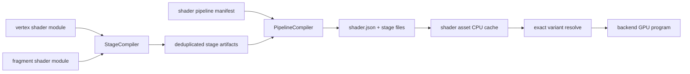

# Shader Variant Asset Architecture

## Decisions

- `INSTANCE` and `SKIN` are independent, composable compile-time features; all
  four combinations are valid unless an asset manifest excludes one.
- Users write one entry function per stage implementation. Vertex and fragment
  entries may live in different Python module graphs and are independently
  reusable.
- Feature conditions are specialized before normal type checking and MLIR
  emission, so no runtime branch or disabled interface argument survives.
- Python defines stage semantics and feature usage. A shader-module manifest
  gives a source module a stable asset identity; a separate pipeline manifest
  composes stage entries and defines target options and the finite set of
  variants to cook.
- Variant lookup is exact. Missing variants return `Result::Err`; there is no
  silent fallback.

## Authoring model

Add `feature`, `When`, and compile-time feature conditions to the restricted
frontend:

```python
INSTANCE = feature("INSTANCE")
SKIN = feature("SKIN")

@vertex
def mesh_vertex(
    position: vec3[f32],
    instance_transform: When[
        INSTANCE,
        Annotated[mat4[f32], instance()],
    ],
    joints: When[SKIN, vec4[u32]],
    weights: When[SKIN, vec4[f32]],
) -> Annotated[vec4[f32], builtin("position")]:
    result = vec4(position, 1.0)
    if INSTANCE:
        result = matmul(instance_transform, result)
    if SKIN:
        result = skin_position(result, joints, weights)
    return result
```

`if FEATURE` and `if not FEATURE` are compile-time-only syntax.
`When[FEATURE, T]` removes the argument and its interface metadata when
disabled. The compiler diagnoses use of a disabled value outside its guarded
branch.

Interface locations are inferred from declaration order and type span before
feature specialization. Scalars and vectors consume one location; a matrix
consumes one location per column. Conditional fields reserve their full range
even when disabled, so every surviving field keeps the same location in every
variant. Authors may explicitly override an inferred location; overlapping
ranges are compile errors. In the example, `position` uses location 0,
`instance_transform` reserves locations 1-4, `joints` uses 5, and `weights`
uses 6 for all four variants.

## Source assets and stage composition

Do not put a single `source` on the pipeline. Use two source-asset levels:

1. `*.shader-module.json` identifies a reusable Python module graph. A module
   may export multiple vertex, fragment, or compute entries.
2. `*.shader-pipeline.json` composes specific entries from independent modules.

The split does not require one file per stage. A shader module is one root
Python file plus its transitive imports. A pipeline may reference the same
module ID for both vertex and fragment entries:

```json
{
  "stages": {
    "vertex": {
      "module": "shader_modules/pbr",
      "entry": "pbr_vertex"
    },
    "fragment": {
      "module": "shader_modules/pbr",
      "entry": "pbr_fragment"
    }
  }
}
```

Compilation starts from each selected entry and keeps only its reachable helper
call graph. Helpers may be defined beside both entries or imported from a common
module. A stage entry may not call another stage entry; shared behavior must be
a non-entry helper. Helpers must remain stage-neutral: stage builtins and
interfaces are passed as typed arguments rather than read implicitly.

Example vertex module:

```json
{
  "schema_version": 1,
  "type": "shader_module",
  "id": "shader_modules/mesh_vertex",
  "source": "mesh_vertex.py"
}
```

Example fragment module:

```json
{
  "schema_version": 1,
  "type": "shader_module",
  "id": "shader_modules/pbr_fragment",
  "source": "pbr_fragment.py"
}
```

Example pipeline composition:

```json
{
  "schema_version": 1,
  "type": "shader_pipeline",
  "id": "shaders/pbr_mesh",
  "stages": {
    "vertex": {
      "module": "shader_modules/mesh_vertex",
      "entry": "mesh_vertex"
    },
    "fragment": {
      "module": "shader_modules/pbr_fragment",
      "entry": "pbr_fragment"
    }
  },
  "variants": {
    "include": [
      [],
      ["INSTANCE"],
      ["SKIN"],
      ["INSTANCE", "SKIN"]
    ],
    "max_variants": 16
  },
  "targets": {
    "opengl": {"glsl_version": 330},
    "vulkan": {},
    "metal": {}
  }
}
```

The same vertex module can be paired with several fragment modules, and the
same fragment module can be reused by static, instanced, and skinned pipelines.
Explicit `include` is the default policy to prevent accidental `2^N` growth.
Later, optional `exclude` or constraint expressions can generate combinations
while respecting `max_variants`.

A graphics pipeline initially requires one vertex and one fragment stage. A
compute pipeline references one compute entry and cannot mix graphics stages.
Future geometry and tessellation stages extend the stage map without changing
the module/pipeline split.

## Compilation and derived data

1. Resolve each referenced shader module and parse each variant-neutral module
   graph once. If two stages reference the same module, reuse that graph.
2. Form the pipeline feature namespace as the union of features used by its
   stages. The same feature name has the same meaning across modules.
3. Validate requested pipeline variants against source declarations.
4. For each selected entry, build its reachable helper graph and compute the
   subset of features that can affect it. Specialize only those features,
   remove disabled `When` arguments, fold compile-time branches, and discard
   unrelated entries and helpers.
5. Type-check, inline helpers, lower, and emit stage reflection after
   specialization.
6. Validate vertex/fragment interface compatibility after specialization.
7. Cache each stage artifact independently by module graph, entry, target
   options, and the stage-relevant feature subset. A fragment unaffected by
   `INSTANCE` or `SKIN` is compiled once.
8. Build each pipeline variant as a mapping from the full canonical pipeline
   feature key to shared stage artifact IDs.

Cook to a normally named asset directory containing `shader.json` and
`stages/<stage-hash>.<stage>.<format>` files. The manifest contains a versioned
header, pipeline reflection, and variant-to-stage mappings. Generated stage
files stay separate and readable; an optional deployment packer may combine
them later without changing runtime identities.

GLSL, SPIR-V, MSL or metallib, DXIL, PTX, and optional debug intermediates are
derived data. Python and both JSON manifests remain source assets. HLSL is an
intermediate for DXC, not the final DirectX runtime artifact.



## Cache keys

Stage content hashes include:

- canonical shader-module manifest;
- compiler and cache format versions;
- target and target options;
- selected entry;
- stage-relevant canonical feature names;
- transitive source paths and hashes.

Pipeline content hashes include:

- canonical shader-pipeline manifest;
- compiler and cache format versions;
- target and target options;
- full canonical pipeline feature keys;
- referenced stage artifact hashes.

Runtime feature IDs must not participate in cache keys. Stable sorted feature
names define the serialized key.

## Reflection contract

Extend compiler reflection with:

- bundle target and requested language version;
- canonical feature declarations and variant keys;
- module and entry identity for each stage artifact;
- pipeline variant-to-stage-artifact IDs;
- exact generated resource block, member, texture, and sampler names;
- resource kind, type, set, binding, offset, size, and alignment;
- per-stage interface locations and required capabilities;
- specialized cross-stage interface contracts;
- module and dependency hashes.

A pipeline variant points to shared stage artifact IDs. For example, four mesh
variants may select four specialized vertex artifacts while all reference one
unchanged fragment artifact. Incompatible module combinations fail while
cooking, not at draw time.

## Vernon asset and runtime model

Add texture-parallel components under `Vernon/render/asset/shader/`:

- `ShaderModuleAssetDescriptor` and `ShaderPipelineAssetDescriptor`;
- module and pipeline manifest parsers;
- `ShaderStageCompiler` with content-addressed stage-file read/write;
- `ShaderPipelineCompiler` with `shader.json` composition;
- `ShaderAssetRegistry` scanning `*.shader-module.json` and
  `*.shader-pipeline.json`;
- `ShaderAssetManager` with independent stage and pipeline CPU caches and a GPU
  cache keyed by `(pipeline_content_hash, variant_key)`;
- `ShaderProvider::mount` and variant-aware loading.

The asset resource is a `ShaderAsset` or shader family. Existing `Shader`
continues to represent one resolved linked GPU program.
`ShaderAsset::resolve(features)` returns `Result<Shader, std::string>`.

Replace incremental `ShaderLibrary` feature IDs with canonical feature names or
manifest-stable indices. `ForwardPass` merges geometry features (`INSTANCE`,
`SKIN`) with material features, resolves the exact variant, then binds reflected
resources. Legacy built-in shaders and named uniforms remain supported during
migration.

## Verification

- Frontend tests cover all four feature combinations, disabled-value
  diagnostics, recursive imports, and deterministic keys.
- Compiler tests verify no feature condition remains in MLIR, interfaces differ
  correctly, independently sourced stages compose, unchanged stages deduplicate,
  and reflection maps every variant and resource.
- Non-GUI asset tests cover module and pipeline manifest parsing, missing module
  or entry, incompatible stage interfaces, duplicate IDs, variant caps, cache
  invalidation, corrupt manifests or stage files, and exact missing-variant
  errors.
- GPU tests verify generated OpenGL source links for all four variants and
  reflected bindings work. Tests that create a GUI or graphics context are run
  manually by the developer.

## Implementation tasks

- [x] Implement compile-time feature declarations, conditional interface types,
      specialization, and deterministic variant keys in VernonDSL.
- [x] Define shader-module, shader-pipeline, and reflection schemas; cook
      deduplicated stage artifacts and versioned `shader.json` pipeline bundles.
- [x] Implement cooked shader descriptors, registries, compilers, caches, and
      providers following the texture asset architecture.
- [ ] Resolve exact variants from merged geometry and material features and bind
      resources from reflection while preserving legacy shaders.
- [ ] Add non-GUI compiler and asset tests plus developer-run GPU coverage for
      all `INSTANCE` and `SKIN` combinations.
