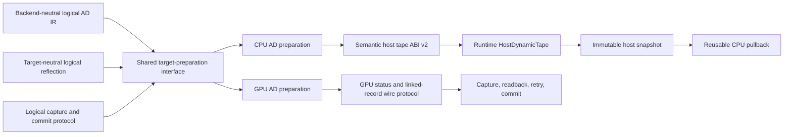

# CPU Dynamic Tape and Cross-Backend AD Architecture

## Status

This document records the CPU dynamic-tape architecture decision. Current
implemented behavior and remaining product work are maintained in
[`autodiff.md`](autodiff.md) and [`roadmap.md`](roadmap.md).

It refines the CPU sections of
[`mlir-centered-autodiff-architecture.md`](mlir-centered-autodiff-architecture.md)
while preserving the GPU boundaries in
[`gpu-autodiff-responsibility-architecture.md`](gpu-autodiff-responsibility-architecture.md).

Do not update the compiler contract or pipeline contract versions until the
next release.

## Motivation

The initial CPU dynamic-tape implementation proved that structured scalar VJP
can cross the previous Phase 7 boundary, but it does not yet provide a stable
long-term architecture:

- generated code knows callback-table byte offsets and parts of the tape
  representation;
- an embedded LLVM IR helper module duplicates typed compiler information;
- target preparation and reflection have AD-specific ordering exceptions;
- the current callback ABI permits representation details to cross the
  Compiler/Runtime boundary;
- fixed and dynamic structured tape paths coexist;
- capture does not yet provide a complete launch-atomic Storage/output effect
  transaction;
- numerical tests do not sufficiently cover complex, data-dependent control
  flow and failure rollback.

The required result is not a patch around these limitations. Phase 8 must end
with one clear CPU physical ABI and boundaries that can also support the later
GPU physical-entry and dynamic-tape phases.

## Target Architecture



The shared architecture stops at logical semantics and target-preparation
interfaces. Physical tape protocols deliberately diverge:

- CPU uses host-only semantic callbacks and Runtime-owned typed metadata.
- GPU uses physical status/tape resources, checked 32-bit offsets, atomic
  reservation, status readback, exact retry, and a GPU tape session.

The CPU callback ABI must never become a universal tape ABI.

## Non-Negotiable Invariants

- Logical AD expresses capture, regions, records, leaves, exits, and commit. It
  contains no host callback, pointer, status-word index, byte offset, resource
  binding, or backend object.
- AD does not define payload layout. Canonical leaf layout comes only from
  `VernonValueAbi`.
- Reflection describes an already materialized physical signature. It never
  predicts arguments that a later pass might create.
- Reflection and code generation consume the same target-prepared module.
- CPU and GPU lower directly from the same logical AD operations into distinct
  target-owned physical operations.
- Compiler code never parses a CPU tape snapshot. Runtime exclusively owns its
  representation and validation.
- Structured CPU profiles use one dynamic-tape ABI. There is no automatic
  fixed/dynamic protocol guessing or fallback.
- Capture failure exposes no Storage or output mutation. Successful capture
  commits observable effects exactly once.
- Pullbacks retain an immutable successful tape snapshot and may be reused.
- Generic frontend, validation, GPU outlining, and Metal/Vulkan/CUDA binding
  contain no structured-AD special cases.

## 1. Freeze the Semantic CPU Tape ABI v2

Reopen the provisional ABI in
`source/lib/runtime/autodiff/tape_allocator_abi.h` and define its final
host-only semantic callback contract.

Capture operations:

- `reset`;
- `begin_region`;
- `reserve_record`;
- `write_leaf`;
- `set_child`;
- `end_region`;
- `seal`.

Pullback operations:

- `read_leaf`;
- `read_child`;
- `read_executed_count`;
- `read_exit_kind`.

The ABI uses stable opaque invocation, region, and record handles. Generated
code cannot observe vector addresses, region-header offsets, record magic, or
the Runtime's metadata structures.

The contract must define:

- failure latching and behavior after failure;
- checked sizes, alignment, and exact required-byte accounting;
- handle ownership and thread rules;
- legal capture state transitions;
- snapshot ownership transfer;
- read-only pullback behavior;
- deterministic rejection of malformed or foreign handles.

Generated code must not hard-code callback-table byte offsets. C/C++ compile
tests and `static_assert` checks lock callback signatures, size, alignment, and
layout.

## 2. Make Runtime the Sole Tape-Format Owner

Refactor `host_tape_allocator.{h,cpp}` around explicit
`HostDynamicTape` and `HostTapeSnapshot` types.

- Leaf payload bytes may use `std::vector<std::byte>`.
- Region and record metadata use Runtime-private typed structures.
- Reservation returns stable opaque handles unaffected by payload growth.
- Region record tables and child tables provide O(1) semantic reads.
- Backward traversal must not repeatedly scan records and become O(n²).
- Sealing validates all region/record relationships before snapshot transfer.
- Snapshot construction moves payload and metadata once and exposes only the
  read-only callback contract.

Add an internal `HostTapeMemoryPolicy` with per-invocation and per-context
budgets. Every growth reserves budget first; a live snapshot retains its
charge, and destruction releases it. Tests inject small policies through
internal constructors rather than extending unreleased public Runtime
structures.

## 3. Replace Embedded LLVM Helpers with Typed CPU Lowering

Delete the embedded LLVM IR module in
`source/lib/compiler/compiler_cpu_autodiff.cpp`.

Split CPU physical preparation into clear stages:

1. `VernonPrepareCPUAutodiffSignatures` materializes hidden forward/backward
   builtins and rewrites physical signatures.
2. `VernonLowerCPUAutodiff` converts logical AD operations to internal typed
   CPU AD operations.
3. `VernonCPUAutodiffToLLVM` converts typed CPU AD operations to calls through
   the semantic ABI.

CPU physical operations must live in an explicitly CPU-owned namespace and
must all disappear before the CPU pipeline completes. Each logical operation
has one conversion pattern. Type or callback-contract mismatches fail in the
conversion pass with a precise diagnostic.

Future `VernonLowerGPUAutodiff` lowers from the original logical operations. It
must never consume CPU physical operations or link the host callback ABI.

MLIR tests must cover every logical operation, forward/backward signature
materialization, malformed profiles, missing callbacks, unsupported payloads,
and absence of old helper symbols, magic values, or fixed header offsets.

## 4. Prepare Each Target Exactly Once

Introduce a shared target-preparation result containing:

- one target-prepared MLIR module;
- one `PhysicalEntryModel` derived from that module.

CPU preparation performs, once and in order:

1. logical CPU AD ABI verification;
2. helper inlining and Storage projection;
3. logical AD to CPU physical AD lowering;
4. physical-entry model construction;
5. reflection from the physical entry;
6. ordinary CPU ABI, Tensor, and LLVM lowering.

Remove duplicate AD lowering from `compiler_cpu.cpp` and
`VernonCpuPipeline.cpp`. The preparation stage is explicit and not
idempotently rerun.

`LogicalReflectionModel` stores only target-neutral information such as source
path, logical dtype, shape, and input/output/wrt identity. It stores neither
CPU allocator details nor GPU bindings.

Target preparation combines that logical model with the actual physical
signature:

- CPU adds hidden allocator/root handles and host packing.
- GPU later adds status, tape, cotangent, output, and gradient `TensorView`
  resources, actual bindings, `vernon.autodiff_role`, and
  `vernon.autodiff_protocol`.

The preparation contract carries first-class logical-to-physical provenance.
Logical argument/result indices are seeded before target rewriting, preserved
through ordinary signature edits, and explicitly remapped by a target preparer
when it replaces attributes or creates a derived physical value. Projected
TensorView descriptor components inherit their owner's origin. The resolved
mapping is stored beside `PhysicalEntryModel` and independently checked during
reflection; `vernon.source_name` remains presentation metadata and is never
used to reconstruct post-preparation origin.

Validation and target compilation intentionally expose different reflection
shapes. Validation has no selected target, so each reflected value and entry
retains every canonical `physical_layouts` profile that can be derived from the
logical signature. Target compilation first reflects the target-prepared
signature and then retains only the physical-layout profile selected for that
target. Consumers must therefore not compare the two reflection documents
byte-for-byte. Compiler/pipeline versions, module hash, dependencies, struct
layouts, and logical value metadata for each preserved logical origin must be
identical; only target-materialized values, target metadata, artifacts, and
physical-layout profile selection may differ.

After this is established, remove frontend/reflection AD ordering exceptions,
CPU opaque builtin synthesis, and broad Value-ABI validation bypasses.
Non-AD reflection must remain structurally equivalent to its current output.

## 5. Implement a Real CPU Effect Transaction

Add an independent `HostEffectTransaction` to
`runtime_autodiff_cpu.cpp`.

- Writable and read-write TensorViews point to shadow Storage during capture.
- Read-write shadows initialize from original Storage.
- Observable output uses a staged buffer.
- Aliasing and overlap are validated before capture.
- Invocation capture, tape sealing, snapshot transfer, and policy validation
  must all succeed before commit.
- Success copies staged Storage/output to external destinations once.
- Any allocator, entry, policy, sealing, or snapshot failure discards shadows
  and leaves external bytes unchanged.

Logical `ad.commit` commits to the transaction shadow, not directly to external
Storage.

`HostEffectTransaction` is not a GPU abstraction. Only the behavioral state
machine is shared:

```text
Capture -> Validate -> Commit -> PullbackReady
```

The later GPU implementation realizes this as provisional capture, status
readback, optional exact allocation and replay, then one commit dispatch.

## 6. Remove Structured Fixed-Tape Compatibility

Every structured CPU profile, with or without control flow, uses the allocator
and root-region ABI.

Delete:

- fixed/dynamic dual protocol validation;
- forward-result tape-leaf to backward-argument copies;
- fixed-layout cotangent and pullback branches;
- structured fallback to the legacy native CPU emitter;
- any Runtime protocol selection inferred from argument names or incidental
  layout.

If a legacy non-structured API still has consumers, keep it as a separately
identified profile and loader. Never auto-detect both protocols in one loader.
If there are no consumers, remove it.

## 7. Cross-Backend Compatibility Requirements

Phase 8 does not implement GPU dynamic tape, but it must leave a valid Phase
10-12 boundary.

### Shared Components

- logical AD operation semantics;
- canonical `VernonValueAbi` payload layout;
- `LogicalReflectionModel`;
- target-preparation interface and `PhysicalEntryModel` concept;
- capture/validate/commit behavior;
- memory-policy semantics;
- numerical and failure-parity test fixtures where backend capability exists.

### Deliberately Target-Specific Components

CPU:

- callback-table ABI;
- host `size_t` and host allocation;
- opaque Runtime handles;
- typed host metadata;
- shadow-memory effect transaction.

GPU:

- status and dynamic-tape `TensorView` resources;
- checked 32-bit wire offsets;
- protocol-defined alignment and status words;
- atomic reservation and linked records for interleaved invocations;
- command submission, compact readback, exact resize/replay;
- RHI resource ownership in `GpuAutodiffTapeSession`.

The GPU physical-entry pass remains the sole owner of GPU AD resource
materialization. `VernonToGPU.cpp` and backend binding treat these as ordinary
reflected resources.

Add boundary tests proving:

- logical AD contains no CPU callback or GPU resource details;
- CPU prepared modules contain no logical tape handles;
- `LogicalReflectionModel` has no backend physical fields;
- a mock GPU target-preparer can materialize a resource signature from the
  same logical profile without linking CPU Runtime;
- non-AD Vulkan, Metal, and CUDA reflection/codegen do not change;
- no CPU pointer, `size_t`, callback offset, or opaque host handle appears in
  GPU preparation.

## 8. Numerical, Failure, and Complexity Tests

Add complex structured-control-flow tests with an independent pure-Python
primal oracle. Each case verifies:

- primal output;
- native VJP;
- centered finite differences for multiple inputs;
- random-cotangent identity `vjp(seed) == seed * gradient`;
- repeated pullback calls from one immutable snapshot.

Required cases:

1. Three nested data-dependent loops with nonlinear operations, loop-carried
   state, and conditional branches.
2. Nested `break` and `continue` with input-dependent exit locations.
3. Both fallthrough and break paths of loop-`else`.
4. Early return inside a loop and normal return.
5. Shared intermediate values across branches, multiple `wrt` inputs, and
   different cotangents.
6. Zero, one, medium, and at least 1500 iterations.
7. External inputs or Storage changed after forward while repeated pullbacks
   continue to use the original snapshot.

Avoid branch boundaries and nondifferentiable points, fix random seeds, and use
documented f32 tolerances.

Failure tests include:

- allocator capacity rejection;
- per-invocation and total memory-policy rejection;
- arithmetic overflow and invalid callback state;
- malformed or foreign handles;
- capture failure after partial execution;
- byte-for-byte unchanged external Storage/output after failure;
- exactly one commit after success;
- dynamic/fixed ABI mismatch rejected at load time.

Use instrumentation to prove approximately linear record traversal. Do not use
a fragile wall-clock benchmark.

## 9. Implementation Sequence

1. Finalize ABI v2 and its state-machine/C ABI tests.
2. Implement Runtime-owned typed tape, O(1) indexes, snapshots, and memory
   policy.
3. Add typed CPU physical lowering and remove the embedded LLVM helper after
   parity tests pass. No runtime compatibility branch remains.
4. Establish shared single-run target preparation and reflection; validate the
   interface with a mock GPU physical-entry preparer.
5. Implement the CPU effect transaction.
6. Move every structured CPU profile to dynamic tape and delete fixed
   compatibility.
7. Add complex numerical, failure-injection, complexity, and GPU-boundary
   tests.
8. Run the complete C++ and Python suites with CPU, Vulkan, and Metal enabled.
9. Update Phase 8 task completion only after every acceptance gate passes.

Use one `adbuild/` directory and run build configurations sequentially. Do not
parallel-build different directories.

## Phase 8 Acceptance Gate

Phase 8 is complete only when:

- ABI v2 is frozen by C ABI and state-machine tests;
- compiler-generated code contains no tape representation knowledge;
- Runtime exclusively owns CPU tape format, indexing, policy, and snapshots;
- target preparation and reflection run once from one prepared module;
- structured CPU has no fixed-tape compatibility path;
- capture failure has zero externally visible effects;
- success commits exactly once;
- complex numerical tests agree with independent finite differences;
- pullback reuse and long-loop complexity tests pass;
- GPU-boundary tests prove no CPU physical assumptions leak into shared IR;
- full CPU, Vulkan, and Metal C++/Python regression suites pass.
