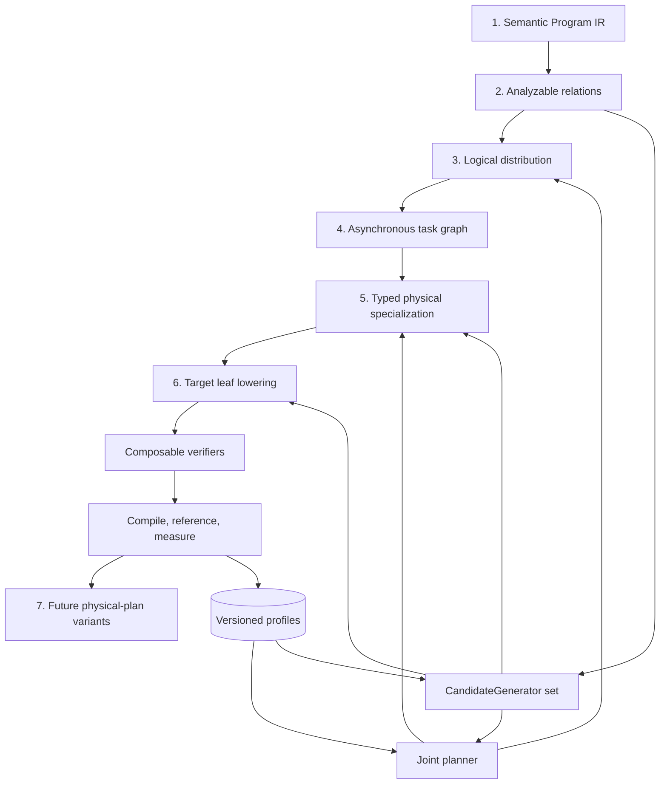

# Future compiler architecture

Status: future design, not a current VernonDSL contract.

This document is the architectural entry point for Vernon's future optimizing
compiler. It defines the questions answered by each layer, the authority of
each representation, and the invariants shared by machine learning,
simulation, scientific computing, sparse workloads, graphics, and
heterogeneous deployment.

Detailed contracts are split into:

- [`optimization_ir.md`](optimization_ir.md): analysis interfaces, distributed
  primitives, fusion, tile tasks, schedules, and verification;
- [`joint_planner.md`](joint_planner.md): topology, joint search, cost models,
  profiles, measurement, and agents;
- [`numerical_representation.md`](numerical_representation.md): mixed
  precision, quantization, storage encodings, accumulation, and quality;
- [`backend_lowering.md`](backend_lowering.md): target IRs, artifacts, and
  fallback policy;
- [`implementation_roadmap.md`](implementation_roadmap.md): implementation
  sequence and acceptance workloads.

Nothing here changes the current Program, compiler, manifest, Runtime, RHI, or
public ABI. A future design becomes current only through a separately
versioned release with implementation and acceptance coverage.

## 1. Goal

The compiler jointly selects:

- numerical and physical representation;
- logical partition and physical placement;
- replication and partial-result structure;
- redistribution and communication;
- asynchronous overlap and memory lifetime;
- fusion boundaries;
- tile, sparse, graphics, communication, and persistent schedules;
- target leaf lowering and validated Runtime variant.

These decisions interact. A compressed representation may reduce network
traffic but require conversion and scale synchronization. A partition with
minimal communication may create poor local tiles. A fused communication
kernel may remove staging while consuming the compute resources required for
forward progress.

The compiler therefore evaluates complete plans rather than optimizing each
decision once in isolation.

## 2. Central architectural claim

Vernon shares one optimization protocol across domains without inventing one
universal operation or one universal kernel:

> Program IR owns meaning. Analysis interfaces expose structure. Logical plans
> own partition and placement. The asynchronous task graph owns required
> physical work and dependencies. Typed physical IR owns target-oriented
> schedules. Deterministic rules, search procedures, and agents are
> interchangeable candidate generators at graph and kernel-lowering levels.
> Verifiers define legality. Explicit models and measurements select among
> legal candidates.

The analysis interfaces are the common optimization API. Rules, solvers,
enumerators, retrieval, agents, and external synthesis all implement one
`CandidateGenerator` protocol over those facts. A generator may grow and cost
a known fusion region or propose a new partition, algorithm, physical
schedule, target lowering, or cost-model extension. No generator acquires
semantic or correctness authority.

Machine learning strategy names such as data, tensor, pipeline, context, and
expert parallelism are optional source recipes and validation terminology.
They are not core IR operations, planner actions, or cost-model features.

## 3. End-to-end model



There are two kinds of structure:

- IR layers progressively own more physical decisions;
- optimization services generate, reject, rank, compile, and measure
  alternatives.

The joint planner is a service, not another semantic IR. Cost feedback may
select another candidate but cannot change Program meaning.

### 3.1 Core optimization records

Five records form the narrow contract between semantics, candidate generation,
acceptance, and deployment:

```text
SemanticRegion {
  Program provenance
  inputs, outputs, and observable effects
  available analysis interfaces and algebraic laws
  numerical and reference contract
}

OptimizationDecisionGraph {
  candidate decisions and dependencies
  assumptions and derived consequences
  parent alternatives and reversible refinements
  exact provenance for communication, conversion, and fusion
}

ImplementationCandidate {
  source SemanticRegion
  selected decision subgraph
  physical or target implementation
  assumptions, resource contract, and fallback
}

EvidenceBundle {
  static and translation validation
  numerical and differential results
  analytical estimates and uncertainty
  compilation and measured profiles
  counterexamples and qualification limits
}

PhysicalPlanVariant {
  qualified implementation and evidence
  shape, topology, phase, and capability bucket
  immutable execution and fallback
}
```

`SemanticRegion` is a referenced view of canonical Program meaning, not a
second semantic graph. `OptimizationDecisionGraph` is compiler planning state,
not Runtime state. `PlanCandidate` is a complete evaluable projection of one
consistent decision subgraph. A `PhysicalPlanVariant` is installed only after
its candidate and evidence satisfy the versioned acceptance policy.

## 4. Layer authorities

### 4.1 Semantic Program IR

Program IR is the sole authority for:

- logical Values and Storages;
- typed compute, graphics, sparse, coordination, and control operations;
- shape, index, numerical, and control semantics;
- effects, aliases, Storage-version transitions, and observable ordering;
- public boundaries;
- semantic transforms such as VJP.

It does not own device count, topology placement, communication algorithm,
stream, tile size, local layout, persistent worker role, measured duration, or
selected target artifact.

Runtime invocation facts such as concrete dynamic dimensions, strides,
offsets, resources, and launch grids remain invocation state. They do not
become semantic identity.

### 4.2 Analyzable relations

Operations expose only the analysis interfaces meaningful to them:

- iteration or index domain;
- access relations;
- effects, aliases, and semantic dependencies;
- iterator and reduction meaning;
- legal partition and fusion relations;
- numerical policy;
- conservative reference implementation.

The interfaces do not form a second semantic graph. Unknown structure reduces
optimization opportunities but does not invalidate an opaque Stage.
They are consumed equally by handwritten passes, bounded search, agents, and
external synthesizers. An agent may reason beyond existing rewrite rules, but
the resulting region or implementation must map back to these facts or provide
a separately checked semantic refinement.

### 4.3 Logical distribution

This layer owns:

- logical pieces of Values, Storages, domains, index sets, operations, or
  Program regions;
- placement on compute and memory resources;
- replication and consistency requirements;
- partial Values and their combine semantics;
- representation requirements;
- logical redistribution caused by producer-consumer mismatch.

Logical distribution does not select a collective library, stream, worker
role, kernel-local layout, or native operation.

### 4.4 Asynchronous task graph

After placement, every required action is explicit:

- compute;
- communication or copy;
- representation conversion;
- synchronization and completion;
- graphics;
- allocation, prefetch, eviction, publication, or I/O where applicable.

Tasks reference Program facts and logical-plan provenance. They do not redefine
Values, effects, or meaning. Overlap is represented by dependencies and
resources, not by subtracting estimated durations.

### 4.5 Typed physical specialization

Different domains retain different physical tasks:

- `TileTask` for structured and indexable compute;
- `SparseTask` for indirect or data-dependent work;
- `RenderScopeTask` for graphics;
- `CommunicationTask` for transfer, remote access, and collective work;
- `PersistentSchedule` for bounded resident composition.

They share ownership, resource, completion, capability, verification, and
fallback protocols without pretending their domain semantics are identical.

### 4.6 Target leaf lowering

A target backend receives a verified leaf region and implements its declared
semantics and synchronization. It may use CUDA Tile IR, GPU/NVGPU/NVVM,
SPIR-V, the current SPIRV-Cross MSL/GLSL/HLSL routes, DXC, LLVM, or
compiler-owned intrinsics. A future dedicated target IR requires its own
accepted design and does not silently replace the current route.

Target IR does not become the authority for global partition, cross-device
progress, Program numerics, or fallback.

### 4.7 Physical plan variants

The future compiler may produce immutable `PhysicalPlanVariant` records
containing artifacts, task execution, capability requirements, and fallback.
Runtime may select among installed physical-plan variants using declared
shape, phase, resource, or telemetry buckets. This concept is distinct from
the current compile-time Program typed specialization variant and requires a
separately versioned serialization, installation, and selection contract. A
materially new plan is compiled, validated, and installed as another physical
plan variant.

Runtime does not invent synchronization, representations, partitioning, or
unchecked schedules.

## 5. Authority matrix

| Fact | Program | Logical plan | Async tasks | Physical IR | Resolved plan |
| --- | :---: | :---: | :---: | :---: | :---: |
| Values, Storages, operations, effects | owner | reference | reference | projection | validated |
| Index, shape, numerical semantics | owner | projection | projection | local projection | validated |
| Partition, placement, replication, partial combine | constraint | owner | materialized | local projection | validated |
| Copy, communication, conversion, completion | — | requirement | owner | optional fused form | selected |
| Queue, engine, lifetime, residency | — | — | owner | requirement | selected |
| Local layout, ownership scope, pipeline | — | — | — | owner | selected |
| Artifact, capability dependency, fallback | — | — | candidate | requirement | owner |

`—` means that the layer must not reconstruct or independently own the fact.

## 6. Communication distinction

Two meanings of communication remain separate:

1. A Program may contain an explicitly authored semantic exchange, combine,
   or coordination operation.
2. The compiler introduces physical redistribution because selected
   placements or representations are incompatible.

The second is not inserted into semantic Program IR. It becomes explicit after
logical planning and before communication-aware fusion. NCCL, MPI, NVSHMEM, a
driver API, or a backend remote instruction never defines Program meaning.

## 7. Candidate generation and joint optimization boundary

A complete candidate contains:

```text
PlanCandidate {
  semantic_provenance
  generator_and_transformation_provenance
  numerical_and_representation_plan
  partition_and_placement_plan
  partial_values_and_redistributions
  asynchronous_task_graph
  fusion_regions
  typed_physical_schedules
  target_leaf_lowerings
  resource_and_capability_requirements
  split_fallbacks
}
```

Search is hierarchical to remain bounded, but earlier choices are revisable.
Every partition candidate materializes its communication and receives a local
fusion/tile evaluation. Material differences between estimates and measured
lower-level costs may trigger bounded reconsideration of representation,
partition, or placement.

Candidate generation is pluggable across optimization levels:

```text
CandidateGenerator {
  accepted_problem_kinds
  required_semantic_and_analysis_interfaces
  accepted_constraints_profiles_and_prior_evidence
  generated_decisions_regions_or_implementations
  declared assumptions_and_expected_evidence
  identity_version_and_replay_information
}
```

Handwritten rewrites, constraint solvers, equality saturation, schedule
enumerators, autotuners, retrieval systems, agents, and external synthesis
services all implement this protocol. There is no privileged rule path and
separate agent path. A generator may work at graph level, physical-region
level, target-lowering level, or more than one level, while every concrete
result enters the same decision, validation, evaluation, and installation
contracts.

Generated cost extensions may guide exploration of an out-of-distribution
candidate, but they remain explicit, versioned, uncertain, and independently
calibrated by measurement.

An implementation generator may target any registered inspectable target IR
or source adapter. It need not replay Vernon's deterministic lowering passes.
Skipping intermediate IR increases its translation-validation and fallback
obligations rather than weakening them.

### 7.1 Coupled global and local loops

Optimization uses two coupled loops:

```text
global loop:
  numerical representation, partition, placement, replication,
  redistribution, checkpointing, fusion boundaries, asynchronous composition

local loop:
  algorithmic replacement, tile, layout, pipeline, memory hierarchy,
  target operation selection, and leaf lowering
```

Neither loop is permanently upstream of the other. Every promising global
decision receives a local implementation estimate. Resource, compilation, and
measurement results may invalidate or revise the global decision that created
the region. The decision graph records this dependency so reconsideration can
replace the affected subgraph instead of restarting unrelated choices.

## 8. Domain independence

Shared infrastructure includes:

- canonical Program authority;
- analysis-interface protocol;
- partition and placement vocabulary;
- asynchronous dependencies and completion;
- resource and capability framework;
- composable verification;
- profiles, measurements, optimization memory, explanations, and Pareto
  selection;
- future immutable physical-plan variants and ordinary fallback.

Domain-specific components include:

- semantic operations;
- precision of access relations;
- partition and fusion rules;
- physical task kinds;
- cost features and schedule templates;
- reference implementations;
- peak backend paths.

Generality means a domain plugs typed components into common services. It does
not mean reducing sparse traversal or graphics to Linalg, or requiring every
Program to become one megakernel.

## 9. Program transforms

Semantic transforms run before distribution:

```text
Primal Program
  -> semantic transform such as VJP
  -> transformed Program
  -> numerical and distribution planning
  -> checkpoint and recompute planning
  -> physical fusion and target lowering
```

Transform, distribution, checkpoint, fusion, and tile planners may exchange
cost feedback. None may take over another layer's semantic authority.

## 10. User control

Users may constrain:

- partition factors, ranges, index sets, operations, or Program regions;
- allowed or required devices, memory tiers, and failure domains;
- replication, consistency, and combine policy;
- allowed redistribution classes, routes, or byte budgets;
- numerical encoding, accumulation, reproducibility, and quality;
- required or forbidden fusion boundaries;
- residency and memory budgets;
- latency, throughput, energy, accuracy, and tuning budgets.

Constraint strength is `hard`, `prefer`, `open`, or `closed`. Hard constraints
are never silently weakened because a model predicts a faster alternative.
Every selected plan explains how constraints were applied.

## 11. Kernel provenance

Executable compute implements a user-authored or compiler-generated semantic
region. Its physical implementation may originate from deterministic lowering,
schedule search, an agent lowering pass, or another registered synthesizer.
Every generated implementation records its semantic mapping, assumptions,
generator identity, target, validation evidence, and fallback.

An agent may emit Vernon physical IR, an external DSL, a target IR, or a lower
target representation directly. Vernon does not require all generators to pass
through one canonical target DSL. The lower the output level, the more
implementation detail must be recovered by target parsing, resource analysis,
translation validation, reference comparison, and capability qualification.

Generated source, IR, and artifacts belong in the compiler cache or deployment
bundle, not in an expanding committed kernel-template library.

External source DSLs may serve as experimental adapters or performance
references, but deployment does not require an external kernel package unless
a separately declared target toolchain requires it.

## 12. Architectural invariants

- Program IR remains the sole semantic authority.
- Analysis interfaces expose facts; they do not become a second semantic graph.
- Global partition and placement remain separate from kernel-local layout.
- Numerical meaning remains separate from storage and target representation.
- Compiler-induced communication is explicit before communication fusion.
- The asynchronous graph owns physical dependencies.
- Physical tasks remain typed.
- Capabilities, resources, progress, and fallback are explicit and fail closed.
- Every optimized candidate has a reference, split point, fallback, or
  explicit unsupported-target diagnostic.
- Cost and measurement select candidates but never mutate semantics.
- Under a future versioned selection contract, Runtime selects only installed
  validated `PhysicalPlanVariant` records.
- All candidate generators consume the same operation-analysis contracts and
  implement one proposal and acceptance protocol; generator type does not
  create another semantic path.
- Agents may propose graph plans, fusion algorithms, target implementations,
  and cost extensions; they do not own semantics, correctness, or performance
  evidence.
- Explicit accounting and calibrated models remain the shared evaluation
  language; agent intuition is a proposal prior and measurement is performance
  evidence.
- Current public contracts remain unchanged until a versioned release.

## 13. Non-goals

This architecture does not claim:

- one IR operation models every domain equally well;
- the planner proves a global optimum;
- affine maps model arbitrary sparse or graphics behavior;
- every Program becomes one persistent kernel;
- a cost model predicts exact performance;
- named human parallelism strategies define the automatic search;
- Runtime dynamically creates plans;
- backend code may supply missing Program semantics.
