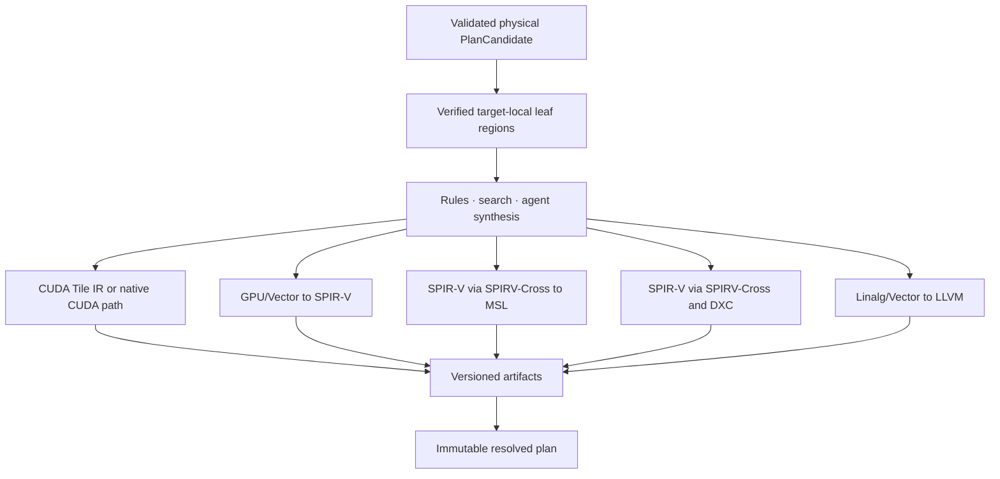

# Backend lowering and artifact policy

Status: future design, not a current VernonDSL contract.

This document defines how verified physical regions become target artifacts.
The IR and verification contract is in
[`optimization_ir.md`](optimization_ir.md); target selection is ranked by
[`joint_planner.md`](joint_planner.md).

## 1. Boundary

Vernon owns:

- Program semantics;
- numerical and representation policy;
- global partition and placement;
- redistribution and asynchronous dependencies;
- fusion eligibility and physical task composition;
- cross-device progress proof;
- variant identity and fallback.

A backend owns:

- native operations and target ABI;
- implementation of declared synchronization;
- object, shader, or bytecode emission;
- target-local resource reporting.

A backend may not infer missing correctness facts, change numerical behavior,
add undeclared synchronization, or remove fallback.

Implementation generation is separate from both authorities. Deterministic
passes, schedule search, agents, and external synthesizers implement the common
`CandidateGenerator` protocol and may propose how a verified region is
implemented. The proposal becomes backend input only after it carries the
required semantic mapping and assumptions; generator identity does not grant
correctness or performance authority.

## 2. Leaf lowering



Non-compute communication may remain a Runtime task. Device-side
communication is emitted only for a verified target-local or distributed-team
region with explicit capability and progress requirements.

### 2.1 Agent lowering

An agent may lower a leaf to Vernon physical IR, a registered external DSL,
target IR, or a lower target representation directly. CUDA Tile IR and CuTe
DSL are possible NVIDIA outputs, not canonical intermediates. Other targets
may use SPIR-V, LLVM-family IRs, target source languages, or future dedicated
representations.

```text
verified portable region
  -> deterministic lowering, search, or agent synthesis
  -> generated implementation candidate
  -> target parsing and translation validation
  -> compile, reference comparison, and measurement
  -> qualified artifact or rejection
```

Direct lowering may skip Vernon's normal intermediate pipeline. It may not
skip source-to-result region mapping, numerical and effect refinement,
resource/capability qualification, artifact identity, or fallback. Portability
comes from retaining the verified source region and regenerating independent
target implementations, not from requiring one low-level kernel to execute on
all targets.

An exact qualified artifact and its `EvidenceBundle` may be recovered through
optimization memory. A related schedule or decision subgraph is only a new
candidate seed and must be adapted and revalidated for changed shapes,
topology, driver, compiler, or target capabilities.

## 3. CUDA Tile IR

### 3.1 Status

CUDA Tile IR is NVIDIA's tile-centric, MLIR-based external dialect and
versioned bytecode. It currently lives outside the LLVM monorepo and tracks
compatible LLVM revisions. Its bytecode is a stable target interface separate
from its internal compiler IRs.

It is not CuTe DSL:

```text
cuTile Python -> CUDA Tile IR -> tileiras or Driver JIT
CuTe DSL      -> CuTe/Base MLIR stack -> PTX/SASS
```

CUDA Tile IR does not lower through CuTe DSL as a public compiler contract.

### 3.2 Vernon path

```text
Vernon FusionRegion and physical schedule
  -> verified CUDA-local leaf region
  -> CUDA Tile IR bytecode
  -> CUDA Driver JIT or tileiras AOT
  -> executable module
```

CUDA Driver module-loading APIs accept Tile IR data directly. Vernon does not
need to produce or retain PTX on this path. The Driver's internal code
generation stages are NVIDIA implementation details.

The preferred production integration boundary is versioned Tile IR bytecode.
Directly linking the out-of-tree `cuda_tile` MLIR dialect is an optional
development mode because it couples Vernon to a compatible LLVM revision.

### 3.3 JIT and AOT

JIT:

```text
Tile IR bytecode
  -> cuModuleLoadData or cuModuleLoadDataEx
  -> Driver selects current GPU architecture
  -> executable module
```

AOT:

```text
Tile IR bytecode
  -> tileiras --gpu-name=<target>
  -> CUBIN
  -> CUDA Driver
```

The deployment bundle may contain bytecode, AOT CUBIN variants, or both.
Driver/toolchain compatibility, architecture support, and first-load latency
are explicit deployment properties.

### 3.4 CUDA Tile qualification

A leaf region uses CUDA Tile IR only when:

- every operation and type has an exact supported tuple;
- bytecode and Driver/toolchain versions are compatible;
- layout, alignment, scope, and numerical requirements match;
- synchronization and memory consistency are representable;
- resource and progress requirements pass;
- ABI and reflection are available;
- an ordinary fallback exists.

Unsupported combinations select another Vernon CUDA lowering or fail
explicitly.

### 3.5 Ownership limit

CUDA Tile IR does not own:

- global distribution;
- Runtime collective fallback;
- cross-backend task ordering;
- Program transform or numerical policy;
- Vernon plan variants;
- cross-device progress beyond declared target capabilities.

Vernon may encode a verified device-side communication leaf only when its
addressability, visibility, participant, progress, and residency obligations
are representable and proven.

## 4. Other backends

| Target | Shared path | Peak specialization | Communication boundary |
| --- | --- | --- | --- |
| CUDA | CUDA Tile IR or GPU/NVGPU/NVVM/LLVM | Matrix, tensor memory, async transfer, specialization | Device-side when proven; otherwise Runtime |
| Vulkan | GPU/Vector to SPIR-V | Exact cooperative-matrix tuples | Runtime |
| OpenGL | SPIR-V through SPIRV-Cross to GLSL/GLES | Validated extension path | Runtime or host |
| Metal | SPIR-V through SPIRV-Cross to MSL | Future dedicated intrinsic path requires a separate decision | Runtime |
| DirectX | SPIR-V through SPIRV-Cross to HLSL, then DXC to DXIL | Future native linear-algebra path requires a separate decision | Runtime |
| CPU | Linalg/Vector to LLVM | Generated SIMD/ISA intrinsic | Runtime or host |

Portability means preserving semantics with explicit fallback, not requiring
identical decomposition or peak primitives.

The current compiler deliberately shares SPIR-V for graphics and routes Metal,
DirectX, and OpenGL through SPIRV-Cross. This future design does not silently
replace that baseline with independent MSL or HLSL emitters. Any dedicated
target IR must be proposed, validated, and measured separately.

## 5. Intrinsic promotion

New hardware support follows:

```text
exact target intrinsic
  -> backend-specific physical task
  -> recurring stable pattern
  -> optional portable primitive
  -> multiple lowerings and fallback
```

The core IR does not add a universal operation for every instruction. A
portable primitive is promoted only when its semantics recur across targets
and have meaningful fallback.

## 6. CuTe DSL and Triton

CuTe DSL and Triton may be used for:

- rapid backend experiments;
- manually authored performance baselines;
- differential correctness checks;
- importing measured schedule ideas;
- Agent-generated research or qualified implementation candidates.

They are not canonical intermediates. Vernon does not generate source in one
of these DSLs merely to reach CUDA Tile IR. Production correctness and
deployment do not require either DSL. A generated implementation may use one
when its registered toolchain, source/IR capture, validation, artifact
identity, and deployment requirements are explicit.

A successful external schedule may remain a shape- and target-qualified cached
implementation. Repeated success should be distilled into a Vernon algorithmic
rewrite, schedule schema, cost feature, or target leaf lowering pattern with
explicit preconditions. Distillation improves reuse and compile latency but is
not a prerequisite for evaluating an agent-generated implementation.

## 7. Communication fallback

The reference path is:

```text
compute artifact
-> dispatch completion
-> Runtime transfer or collective
-> completion event
-> dependent compute artifact
```

The planner may select independent streams, chunks, or device-side fusion.
Vulkan, Metal, OpenGL, and DirectX normally retain the Runtime boundary for
inter-device communication. CUDA may select a device-side path only after
proof.

Fallback preserves participants, order, visibility, numerical combine, and
Value ownership. It never simulates portability by weakening synchronization.

## 8. Artifact identity

Every generated artifact records:

- semantic and physical candidate identity;
- generator, model or rule, prompt/input, and compiler versions as applicable;
- target backend and architecture/capabilities;
- target IR or bytecode version;
- shape/domain specialization;
- numerical and representation policy;
- layout, scope, pipeline, and resource parameters;
- ABI/reflection and imported symbols;
- correctness/reference result;
- fallback identity.

Generated IR and binaries are cache or deployment outputs, not committed
source variants.

## 9. Capability records

Capabilities are operation records, not target booleans. They include exact
types, encodings, result/accumulator, geometry, layout, alignment, scope,
numerics, native/emulated status, workspace, and measured cost.

Backend version, driver, OS, and Runtime participate in capability identity.
A target accepting a storage type does not imply native accelerated compute.

## 10. Runtime installation

The compiler resolves artifacts and task choices into immutable plan variants.
Runtime validates compatibility, loads artifacts, binds resources, and
executes declared dependencies.

Runtime may cache a Driver-JIT result keyed by Tile IR bytecode, Driver,
device, and compilation options. It may not mutate the source plan or silently
replace numerical or synchronization policy.

## 11. Verification requirements

Backends verify bytecode/toolchain compatibility, exact operation
capabilities, ABI/reflection agreement, numerical policy, artifact identity,
and fallback before installation. Unsupported combinations reject
deterministically. Delivery and acceptance gates are owned solely by
[`implementation_roadmap.md`](implementation_roadmap.md).

## 12. External references

- [CUDA Tile IR specification](https://docs.nvidia.com/cuda/tile-ir/latest/index.html)
- [CUDA Tile IR source](https://github.com/NVIDIA/cuda-tile)
- [CUDA Tile IR bytecode](https://docs.nvidia.com/cuda/tile-ir/latest/sections/bytecode.html)
- [CUDA Driver module loading](https://docs.nvidia.com/cuda/cuda-driver-api/group__CUDA__MODULE.html)
- [cuTile Python compilation](https://docs.nvidia.com/cuda/cutile-python/compilation.html)
- [CuTe DSL code generation](https://docs.nvidia.com/cutlass/latest/media/docs/pythonDSL/cute_dsl_general/dsl_code_generation.html)
- [Triton CUDA Tile IR backend](https://github.com/triton-lang/Triton-to-tile-IR)
