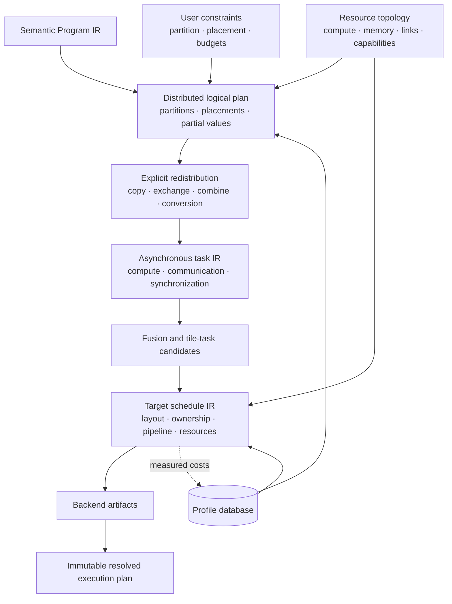
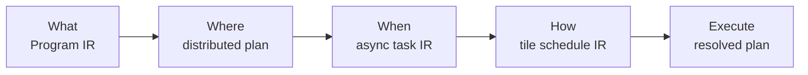
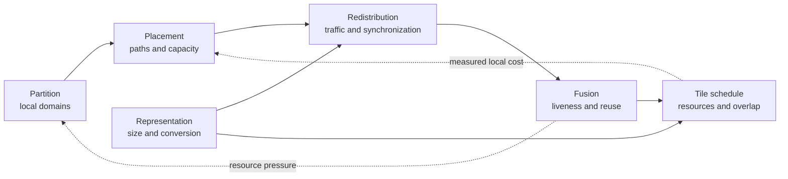
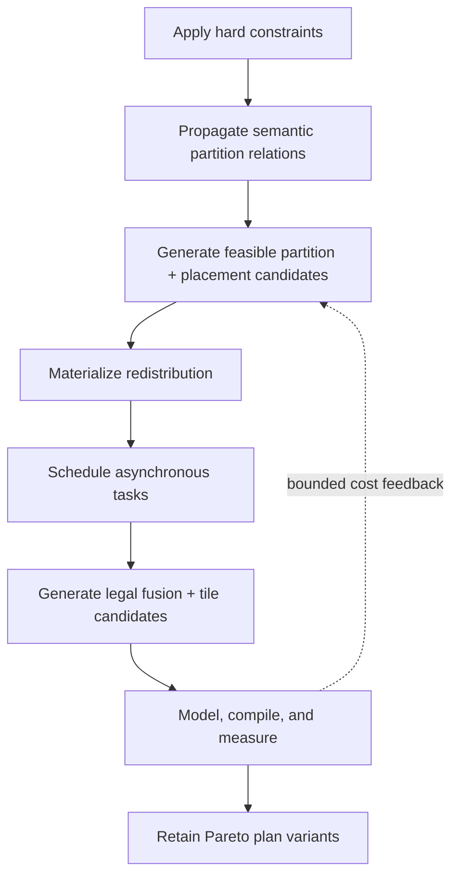
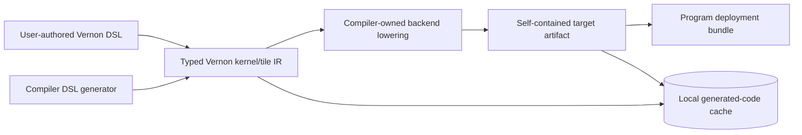
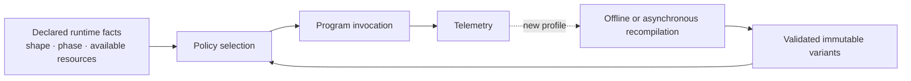
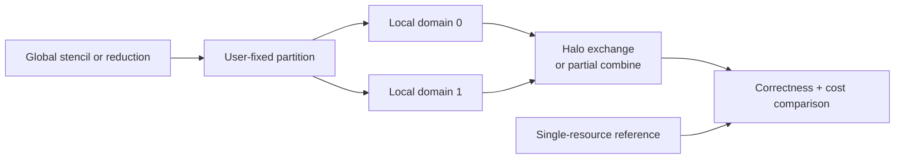
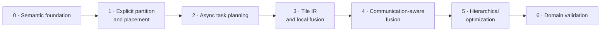

# Distributed compiler architecture

Status: future design, not a current VernonDSL contract.

This document defines domain-independent compiler abstractions for partitioning
a Program across a heterogeneous hierarchy of compute and memory resources.
Machine learning, graphics, simulation, scientific computing, and data
processing are clients of these abstractions. No workload-specific parallelism
name is part of the core IR.

Detailed designs are split into:

- [`distributed_planner.md`](distributed_planner.md): resource topology,
  partitioning, placement, communication materialization, and cost modeling;
- [`megakernel_tile_ir.md`](megakernel_tile_ir.md): tile tasks, communication
  fusion, bounded megakernels, and backend lowering;
- [`mixed_precision.md`](mixed_precision.md): encoded values, scaled tensors,
  numerical policy, target capabilities, and portable fallbacks.

The LLM deployment experiment is specified separately in
[`distributed_dl_compiler.md`](distributed_dl_compiler.md). It validates the
generic architecture; it does not define it.

The current Program architecture remains
[`../program/architecture.md`](../program/architecture.md). Nothing here
changes the current compiler contract, Program contract, manifest schema, or
Runtime ABI.

## Design boundary

| In scope | Outside the core contract |
| --- | --- |
| Partition Values, Storages, index domains, operations, and Program regions | Discover workload-specific strategy names |
| Apply exact user constraints and infer only open decisions | Prove a global optimum for a dynamic system |
| Jointly cost placement, communication, fusion, memory, schedule, and target capability | Turn every Program into one persistent kernel |
| Generate dispatch graphs, overlapped tasks, fused kernels, and bounded persistent kernels | Define semantics in terms of NCCL, MPI, CUDA, or another transport |
| Preserve custom Stages, user schedules, and backend-native intrinsic lowering | Promote a backend layout or encoding into Program semantics |
| Support heterogeneous compute and hierarchical memory | Replace Program, autodiff, compiler, RHI, or Runtime authority |
| Produce deterministic, inspectable plans with explicit fallbacks | Require identical physical decomposition on every backend |

## Core vocabulary

| Concept | Meaning | Does not decide |
| --- | --- | --- |
| Resource topology | Compute units, memories, engines, storage tiers, links, capabilities, and failure domains | Program semantics |
| Partition | Logical pieces of a Value, Storage, index domain, operation set, or Program region | Physical resource |
| Placement | Mapping from logical pieces and replicas to topology resources | Kernel tile layout |
| Replication | Equivalent logical data at multiple placements under a consistency rule | How updates are synchronized |
| Partial value | Placed contribution requiring a declared combine operation | Concrete combine algorithm |
| Redistribution | Change of partition, placement, representation, or replication | Whether it becomes a copy, collective, or fused task |
| Task | Schedulable compute, copy, communication, conversion, or synchronization unit | Backend instruction sequence |
| Schedule | Resource assignment and ordering that preserves dependencies | Program meaning |
| Fusion region | Semantic group eligible for one implementation | Final kernel boundary |
| Tile task | Kernel-level work over a logical region and physical layout | Global placement |
| Plan variant | Validated immutable plan for one target and workload profile | Runtime-created semantics |

Terms such as data, pipeline, tensor, context, or expert parallelism are
domain-level recipes that lower into this vocabulary.

## Prerequisite: analyzable Program semantics

Automatic partitioning and fusion require Program IR to expose relevant
semantic operations, Values, effects, shapes, domains, and alias relations.

An opaque custom Stage remains legal. It declares:

- input and output relations;
- effects and alias behavior;
- required target capabilities;
- partition and placement constraints, if any;
- optional cost metadata;
- optional alternative implementations.

The compiler must not inspect backend code to reconstruct missing Program
semantics.

## IR levels

Solid arrows are lowering boundaries. The dotted edge is profile feedback, not
a semantic back-edge: measurements may cause another candidate to be selected,
but they never mutate Program meaning.

### Authority matrix

| Fact | Program IR | Distributed plan | Async task IR | Tile schedule IR | Resolved plan |
| --- | :---: | :---: | :---: | :---: | :---: |
| Logical Values, Storage, operations, effects | owner | reference | reference | projection | reference |
| Index, shape, iteration, and numerical semantics | owner | projection | projection | local projection | validated |
| Partition, placement, replication, partial combine | constraint | owner | materialized | local projection | validated |
| Copy, communication, conversion, completion | — | requirement | owner | optional fused form | selected |
| Queue, stream, engine, lifetime, residency | — | — | owner | requirement | selected |
| Tile layout, execution ownership, memory scope | — | — | — | owner | selected |
| Backend artifact and fallback | — | — | candidate | requirement | owner |

`—` means that the layer must not reconstruct or independently own that fact.

### Lowering boundary

- Program IR remains the only semantic authority.
- The distributed plan is independent of collective libraries.
- A compute task becomes a user-authored or compiler-generated DSL kernel. A
  non-compute task may become a Runtime operation, remote operation, or task
  sequence.
- Tile IR retains physical orchestration until target selection and reuses
  suitable MLIR dialects for ordinary lowering.

## Planning relationship

| Decision | Changes | Needs feedback from |
| --- | --- | --- |
| Partition | Local domains, partial Values, redistribution requirements | Local implementation cost |
| Placement | Communication path, capacity, residency, failure domain | Topology profiles |
| Redistribution | Bytes, synchronization, staging, conversion | Route and implementation measurements |
| Fusion | Traffic, liveness, launch count, split points | Resource and progress model |
| Representation | Capacity, transfer volume, conversion, numerical error | Backend capability and accuracy policy |
| Tile schedule | Layout, occupancy, pipeline, exposed communication | Hardware measurement |

The compiler uses bounded hierarchical search:

The planner does not flatten all choices into one unbounded search.

## User control

| Constraint surface | Examples |
| --- | --- |
| Partition | Axis, factor, range, index set, operation set, Program region |
| Placement | Required or allowed devices, memory tiers, failure domains |
| Replication | Replica count, owners, consistency and combine policy |
| Redistribution | Required, forbidden, maximum bytes, allowed route |
| Fusion | Required boundary, forbidden boundary, maximum region |
| Residency | Persistent, temporary, evictable, prefetched |
| Representation | Logical encoding, storage encoding, accuracy policy |
| Budget | Latency, throughput, memory, error, energy, compilation time |

| Strength | Meaning |
| --- | --- |
| `hard` | Must hold; an incompatible plan is rejected |
| `prefer` | Contributes policy or cost and may be overridden |
| `open` | The compiler may refine the decision |
| `closed` | The compiler may not add another partition or placement dimension |

The selected plan records how every user constraint was applied.

## Program transforms

Distribution is defined over ordinary Program semantics. A transform such as
VJP first creates another semantic Program graph. Partition propagation and
redistribution insertion then operate on both primal and adjoint Values.

| Planner | Exclusive authority |
| --- | --- |
| Program transform | Semantic graph construction |
| Distribution | Placement and cross-placement combination |
| Checkpointing | Retain versus recompute |
| Fusion | Implementation grouping |
| Tile lowering | Physical kernel execution |

These planners may iterate through cost feedback but cannot take over one
another's semantic authority.

## Backend policy

One semantic task may have different physical decompositions:

| Target class | DSL or intrinsic lowering | Required fallback boundary |
| --- | --- | --- |
| CUDA | Generated CUDA-oriented DSL, device-side communication, deeply fused persistent schedule | Ordinary generated kernels plus Runtime collective |
| Vulkan | SPIR-V compute, cooperative matrix when enumerated | Dispatch-level communication |
| Metal | Generated MSL and validated native intrinsic lowering | Dispatch-level communication |
| DirectX | Generated HLSL/DXIL and enumerated native intrinsic lowering | Dispatch-level communication |
| OpenGL / OpenGL ES | Restricted compute or graphics implementation | Runtime or host boundary |
| CPU | Generated loops, threads, vector code, and compiler-owned intrinsics | Ordinary task sequence |
| Storage or heterogeneous path | Staged copy, conversion, prefetch, eviction | Explicit multi-task transfer |

Unsupported target combinations fail explicitly or select a declared fallback.
The compiler never simulates portability by silently changing synchronization
or numerical semantics.

## Kernel provenance and deployment

Every executable compute kernel must originate from typed Vernon DSL, either
written by a user or generated by the compiler. The architecture does not
require an external kernel source library, precompiled kernel binary catalog,
Triton, CUTLASS, CuTe, TVM, or another kernel compiler at build or deployment
time.

Backend intrinsics are small compiler-owned operations with validation and
lowering rules. Platform drivers and shader/object compilers remain target
toolchain requirements; they are not semantic kernel-library dependencies.

Generated DSL is inspectable and reproducible, but it is stored in the
generated-code cache or deployment bundle rather than committed as an expanding
kernel-template tree. Cache identity includes generator version, target,
capabilities, shape/domain specialization, and numerical policy.

## Runtime variants

Dynamic dimensions, data distributions, contention, and resource availability
may require multiple variants. Runtime chooses among validated immutable plans
using declared inputs and measurements.

Runtime selection may choose only among validated variants. It may not violate
hard constraints, change Program semantics, create unchecked synchronization,
invent a new representation, or mutate an installed resolved plan.

New decisions requiring compilation create another validated variant.

## Domain recipes

A domain recipe is an optional source-level layer that maps familiar strategy names
to core constraints and transformations.

| Domain recipe layer | Recipe vocabulary | Core lowering |
| --- | --- | --- |
| Simulation | Spatial/domain decomposition, halo exchange | Partition index domain, place cells, exchange boundary Values |
| Graphics | Frame, pass, scene, view, or region partitioning | Partition Program regions and resources, schedule dependencies |
| Data processing | Map, partition, shuffle, combine | Partition records, redistribute by key, combine partial Values |
| Machine learning | Parameter, activation, sequence, stage, expert partitioning | Partition tensor/Program domains, place Storage, redistribute Values |
| Services / ensembles | Replica, route, aggregate | Replicate Program regions, route inputs, combine outputs |

Recipes are inspectable sugar. They do not introduce hidden IR semantics.

## Initial domain-independent acceptance

The first acceptance Program is a partitioned stencil or tiled reduction over a
two-device topology:

| Required evidence | Acceptance |
| --- | --- |
| Semantic plan | Local domains and redistribution are explicit |
| Reference variant | Ordinary sequential communication |
| Optimized variant | Asynchronous overlap |
| Optional fast path | Capability-gated fused tile implementation |
| Correctness | Every variant matches the single-resource reference |
| Diagnostics | Incompatible domain, topology, and memory fail explicitly |
| Measurement | Compute, communication, overlap, and peak memory are recorded |

This test exercises the generic contract without depending on an LLM strategy.

## Implementation phases

| Phase | Primary deliverable | Exit signal |
| --- | --- | --- |
| 0 | Analyzable Program operations, domains, effects, and custom-Stage summaries | Partition relations are explicit without contract changes |
| 1 | Resource topology, partition, placement, replication, partial Value, redistribution | Deterministic multi-process reference executes |
| 2 | Copy, communication, conversion, synchronization, completion, residency, lifetime | Event graph reproduces reference ordering and cost |
| 3 | Layout, scope, matrix, reduction, copy, barrier, pipeline, intrinsic lowering | Local fused kernels match unfused reference |
| 4 | Bounded communication-fusion generation rules and verifier | Invalid resources, ordering, progress, and cycles fail closed |
| 5 | Candidate pruning, measurement, cost feedback, Pareto ranking, explanations | Selected plan is reproducible and has a fallback |
| 6 | Simulation/scientific, graphics/heterogeneous, and [LLM](distributed_dl_compiler.md) validation | No domain-specific concept is required by core IR |

## Invariants

- Program IR remains the semantic authority.
- Core IR does not contain workload-specific parallelism names.
- Recipes lower to partition, placement, replication, redistribution, and
  schedule.
- User hard constraints are never silently weakened.
- Communication is explicit before communication-aware fusion.
- Device-side communication is capability-gated and has a legal fallback.
- Persistent schedules are bounded by verified resource and progress models.
- Persistent placement and temporary execution placement are distinct.
- Logical value semantics and physical representation are distinct.
- Every executable compute kernel originates from user-authored or
  compiler-generated Vernon DSL.
- Generated DSL and compiled artifacts belong in the cache or deployment
  bundle, not as committed kernel-template expansion.
- Current public contracts remain unchanged until a versioned release.
