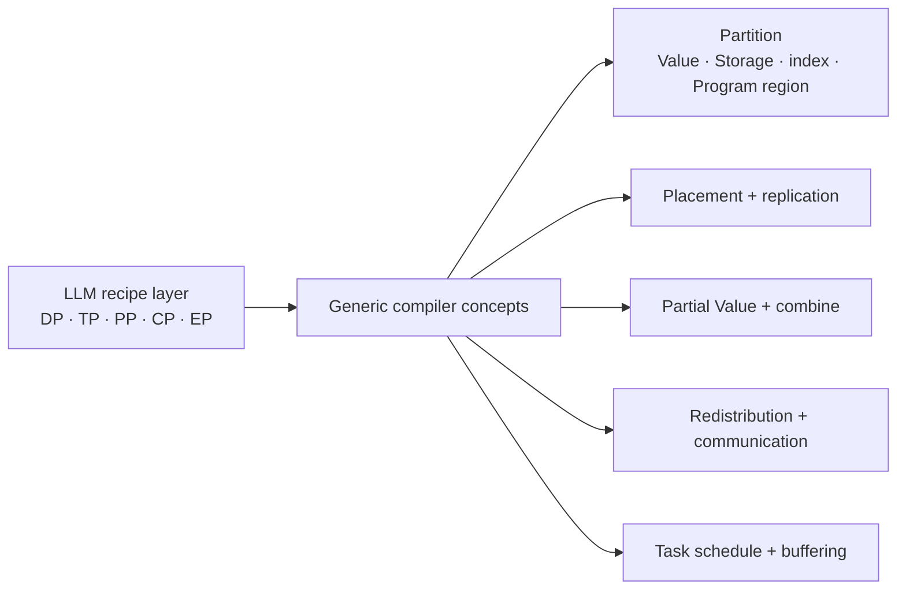
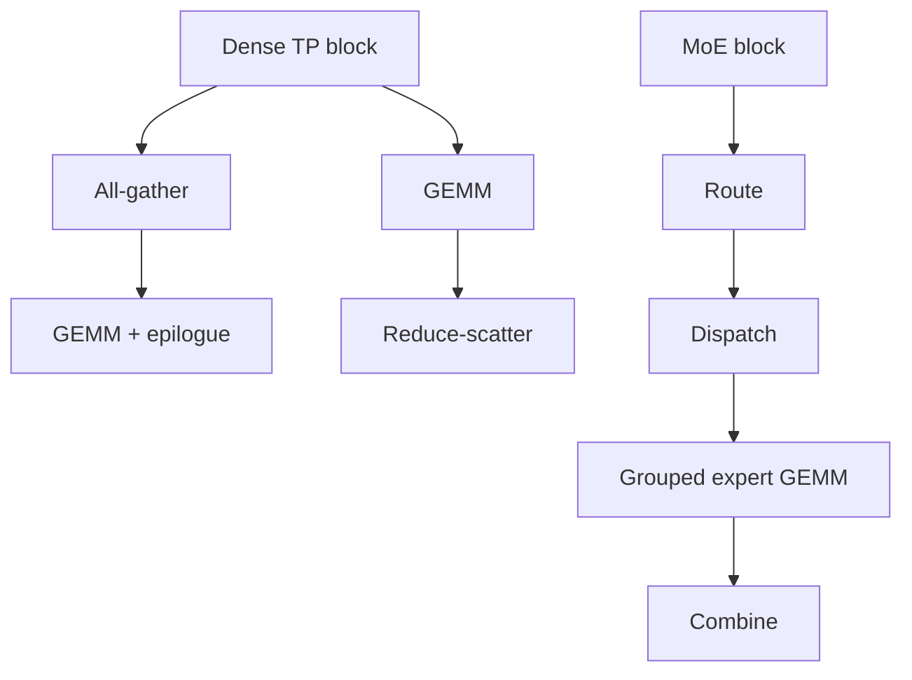
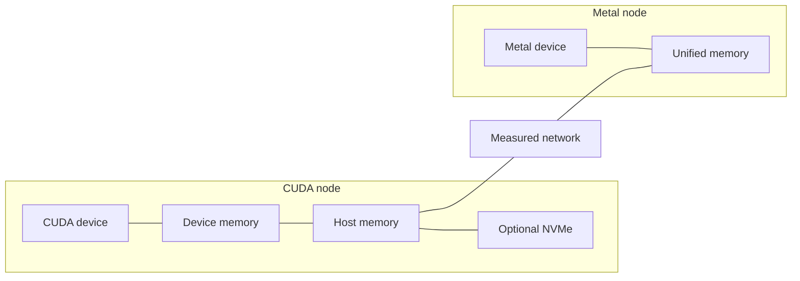

# LLM distributed compiler validation

Status: future use-case design, not a current VernonDSL contract.

This document defines an LLM validation workload for the domain-independent
architecture in [`distributed_compiler.md`](distributed_compiler.md).

DP, PP, TP, CP, and EP are source-level recipe names used by this workload. They
must lower to generic partition, placement, replication, partial-value,
redistribution, communication, and schedule semantics. They are not core
Vernon IR operations and are not goals of the language design.

## Purpose

LLMs are a useful stress test because they combine:

- repeated contractions and reductions;
- large persistent parameters and caches;
- dense and sparse data-dependent execution;
- several useful partitioning dimensions;
- bulk collectives and fine-grained communication;
- latency-sensitive and throughput-oriented phases;
- aggressive low-precision storage and computation.

Passing this use case demonstrates that the generic architecture can express
and optimize a demanding workload. It does not make Vernon an LLM-specific DSL.

## Recipe lowering

| Recipe | Generic partition | Placement/state | Materialized tasks |
| --- | --- | --- | --- |
| DP | Independent invocation or batch domain | Replicated or partitioned persistent Storage | Partial-state combine and synchronization |
| TP | Contraction input, output, or reduction factor | Tensor pieces on a mesh axis | All-gather, reduce-scatter, all-reduce, or equivalent redistribution |
| PP | Program regions | Regions on device groups | Boundary transfer, microbatch dependencies, buffering |
| CP | Sequence or attention context factor | Context pieces on device groups | Boundary exchange and partial reduction |
| EP | Data-dependent token set | Expert Storage placement and optional replication | Dispatch, grouped local compute, combine, load balancing |

The compiler may provide these recipes as user-facing conveniences. Their
implementation is testable by inspecting the resulting generic plan.

## User contract

An LLM deployment may:

- fix all recipe degrees and mesh axes;
- fix only selected decisions and leave the remainder open;
- forbid expensive communication on selected topology edges;
- pin layers, experts, parameters, or caches;
- select latency, throughput, capacity, or accuracy objectives;
- provide phase-specific preferences.

The compiler must not replace a hard user strategy because another candidate
has a lower modeled cost. It may optimize fusion, communication algorithm,
placement details, local layouts, and tile schedules inside the declared
constraints.

## Validation targets

| Target | Primary behavior under test | Required variants |
| --- | --- | --- |
| Dense TP block | Partition propagation, communication materialization, fusion, tile scheduling | Sequential collective + GEMM; dispatch overlap; capability-gated tile fusion |
| MoE block | Data-dependent partition, uneven load, expert placement/replication | Reference all-to-all; overlapped dispatch/compute; bounded fused path |
| Pipeline deployment | Program-region placement, activation transfer, microbatch schedule, stage memory | Homogeneous reference; heterogeneous placement; explicit coarse-transfer fallback |
| Quantized linear block | Canonical packing, exact capability, conversion and accumulation | Generated CUDA DSL; native Vulkan/Metal DSL when available; fused dequant; scalar/CPU reference |

The quantized target validates [`mixed_precision.md`](mixed_precision.md)
without requiring one arithmetic format on every backend.

## Workload profiles

The same model requires different plan profiles:

| Profile | Primary objective | Dominant constraints |
| --- | --- | --- |
| Training | Step time and throughput | Parameter/optimizer/activation memory, gradient communication, recomputation, scale synchronization |
| Prefill | Throughput and time to first token | Large contractions, pipeline bubble, communication overlap |
| Decode | Median and tail token latency | Small dynamic batches, KV locality, persistent-kernel overhead, startup latency |
| MoE | Maximum-rank completion time | Expert skew, cache hit rate, redundant-expert memory, dispatch imbalance |

These are workload policies over the generic cost model. They are not compiler
semantics.

## Heterogeneous experiment

The first plan should prefer coarse Program-region transfer over frequent
cross-backend collectives. Fine-grained TP or EP across low-bandwidth
CUDA-to-Metal links remains legal only when measured costs justify it.

| LLM policy | Generic lowering |
| --- | --- |
| Expert placement | Storage placement |
| Hot-expert copies | Replication |
| Expert cache | Residency and capacity policy |
| Prefetch | Asynchronous copy or I/O task |
| Cache replacement | Eviction task and lifetime transition |

They do not require expert-specific Runtime primitives.

## Success criteria

| Area | Exit condition |
| --- | --- |
| Abstraction | Every named recipe lowers to inspectable generic IR |
| User control | Recipes may be fully fixed or partially open |
| Dense TP | Ordinary, overlapped, and capability-gated fused variants agree |
| MoE | Skew and explicit expert placement execute correctly |
| Dynamic workload | Prefill and decode select separate validated plans |
| Heterogeneity | Placement uses measured topology and explicit transfer |
| Precision | Exact encoding and native/emulated status are preserved |
| Safety | Every optimized plan has an ordinary dispatch fallback |
| Correctness | Results match an unpartitioned reference within policy |
| Generality | Program, tile, and Runtime core require no LLM-specific concept |
