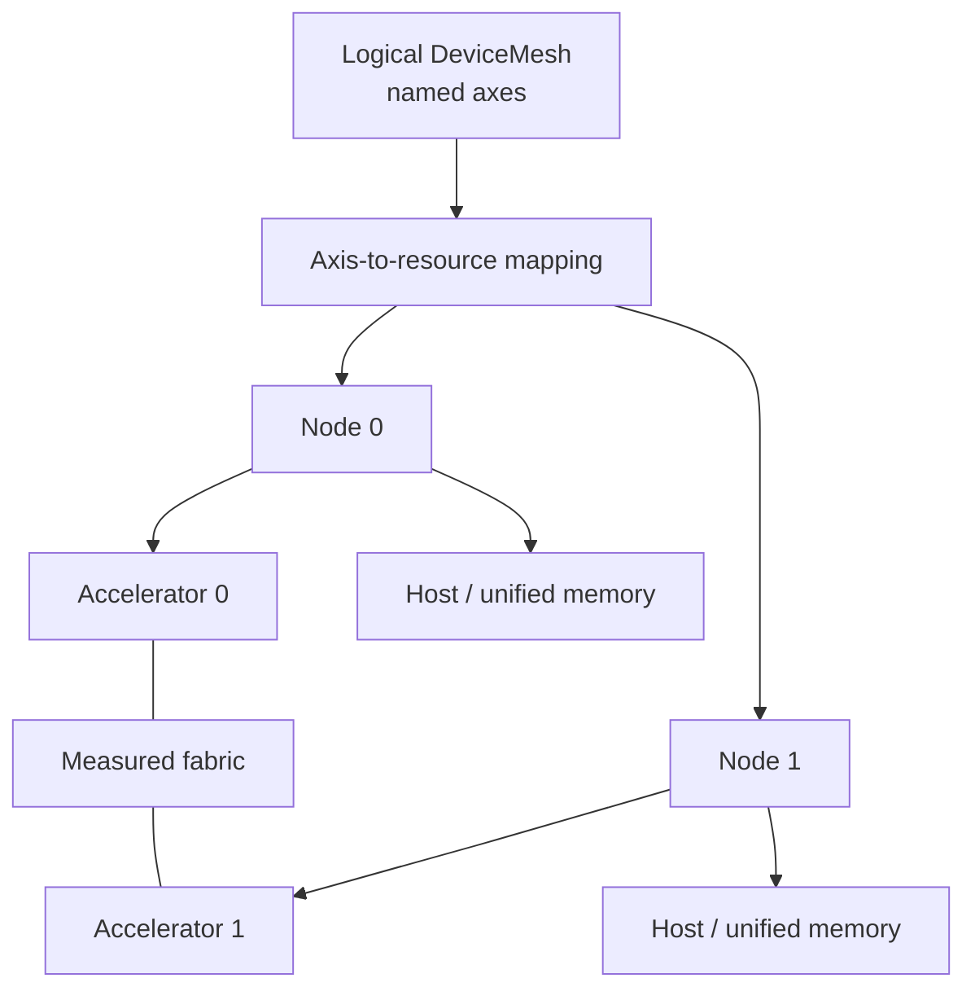
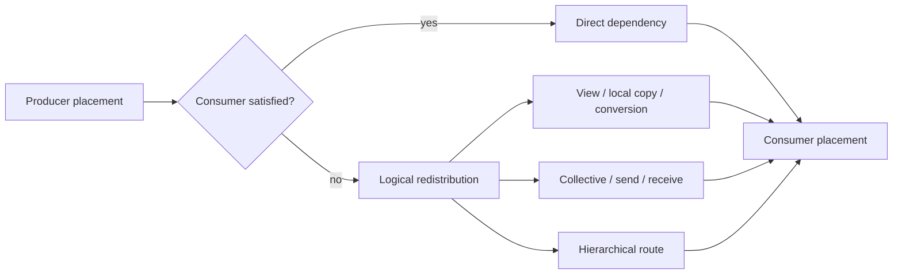
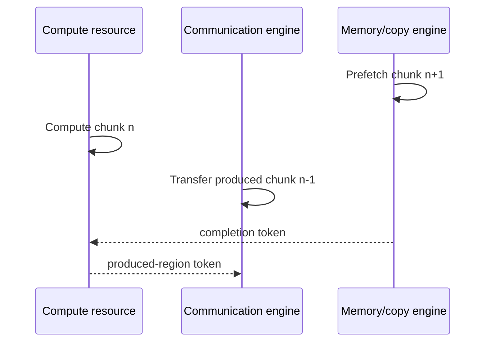
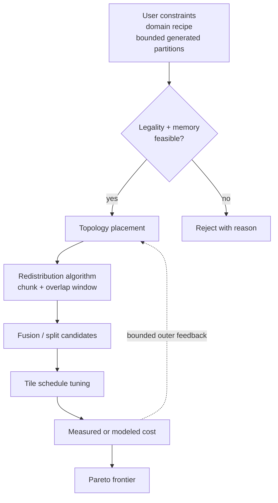

# Distributed partitioning and placement planner

Status: future design, not a current VernonDSL contract.

This document defines the planner underneath
[`distributed_compiler.md`](distributed_compiler.md). It covers logical
partitioning, placement, propagation, communication materialization,
topology-aware scheduling, and cost modeling.

It does not define tile-kernel internals or quantized encodings. Those belong
to [`megakernel_tile_ir.md`](megakernel_tile_ir.md) and
[`mixed_precision.md`](mixed_precision.md).

## Principles

- User-provided parallelism is a first-class constraint, not a hint hidden in
  frontend Python control flow.
- Workload strategies are optional recipes over partition, placement,
  replication, partial Values, redistribution, and scheduling.
- The planner searches only legal, memory-feasible candidates.
- Persistent storage layout and temporary compute layout are distinct.
- Communication is explicit and asynchronous before overlap and fusion are
  selected.
- Cost estimates combine analytical models with measurements from the actual
  target.
- Dynamic workloads produce multiple plan variants rather than one universal
  answer.

## DeviceMesh and topology

A `DeviceMesh` is a named logical view over a potentially hierarchical physical
topology:



Each logical axis maps to concrete devices. Axes may share the same physical
devices when recipes compose.

| Topology element | Required facts |
| --- | --- |
| Compute node | Backend, operation capabilities, concurrency, failure domain |
| Memory node | Capacity, bandwidth, address space, persistence, ownership |
| Engine | Copy/communication capability, concurrency and progress behavior |
| Link | Transport, addressability, direction, bandwidth, latency, contention |
| Route | Direct or staged path, collective/RMA support, failure domain |

Topology values are measured and versioned. Marketing bandwidth is not a cost
model input unless no measurement exists.

## Partition and placement

The generic planner first partitions a logical Value, Storage, iteration
domain, operation set, or Program region, then places each piece on topology
resources. It may replicate a piece or mark it as a partial contribution
requiring an explicit combine operation.

Tensor placement is one specialization with one entry per mesh axis:

- `Replicate`: every rank on the axis owns an equivalent value;
- `Shard(dim)`: the tensor dimension is partitioned over the axis;
- `Partial(reduction)`: every rank owns a partial result requiring a reduction;
- future `RaggedShard`: ranks may own unequal extents with explicit offsets.

A distributed tensor Value has:

| Field | Purpose |
| --- | --- |
| Global type | Program-level semantic shape and dtype |
| Persistent placement | Retained Storage ownership |
| Temporary compute placement | Operator-local execution arrangement |
| Local shard type | Rank/resource-local projected type |
| Padding or ragged metadata | Uneven partition interpretation |
| Owner and lifetime | Allocation, publication, and reclamation |

Persistent placement describes parameters, optimizer state, KV cache, and
other retained Storage. Temporary compute placement may change around an
operator when a different local layout is profitable.

Other domains may partition spatial cells, graph vertices, render passes,
records, time steps, or arbitrary index sets without pretending they are tensor
dimensions.

## Constraints

A `PartitionConstraint` applies to a Program boundary, Module, operator, Value,
Storage, tensor dimension, iteration domain, index set, or Program region.

Constraint strength is:

- `hard`: must hold exactly;
- `prefer`: adds a cost or priority but may be changed;
- `open`: propagation may add mesh axes;
- `closed`: propagation may not add another axis.

Examples include:

```text
hard: grid.x partitioned over devices.x
hard: render_region_a placed on gpu_group_0
prefer: replicated lookup Storage near each consumer
closed: public output replicated
forbid: selected communication class on a topology edge
```

Conflict diagnostics identify the two constraints, the affected tensor factor,
and the communication or shape rule that makes them incompatible.

## Domain recipe libraries

Recipe libraries lower domain vocabulary to ordinary constraints and
transformations. Examples include:

- simulation domain decomposition into spatial partitions and halo exchange;
- graphics placement of passes, scene regions, or independent views;
- data-processing partition, map, shuffle, and combine;
- replicated service or ensemble execution;
- machine-learning strategies defined by
  [`distributed_dl_compiler.md`](distributed_dl_compiler.md).

Recipes are composable and inspectable. A user may start from a recipe and
override one region, Value, Storage, or domain without creating another IR
concept.

## Partition rules and propagation

Each semantic operator defines a partition rule over its logical domains.
Tensor operators may express that rule over factors rather than only physical
dimensions. A factor can represent a subdimension participating in
contraction, batching, grouping, or reduction. Other operators may use spatial,
graph, record, or application-defined index factors.

An operator rule declares:

- correspondence between operand and result factors;
- factors that may be sharded independently;
- factors that produce partial results;
- legal replication requirements;
- divisibility, padding, and ragged constraints;
- forward and derivative placement relationships;
- communication alternatives and their semantic result.

Propagation runs in both dataflow directions until a fixed point:


Propagation proves semantic consistency. It does not select a communication
algorithm or tile schedule.

## Communication materialization

Whenever a producer placement does not satisfy a consumer placement, the
planner inserts an explicit redistribution.

Logical redistribution may lower to:

- local view or transpose;
- local copy or layout conversion;
- broadcast;
- reduce;
- all-reduce;
- all-gather;
- reduce-scatter;
- all-to-all;
- send and receive;
- hierarchical or topology-specific combinations.

The result is an asynchronous task graph. Every communication task records:

- source and destination placements;
- logical tensor region;
- route and process group;
- communication algorithm;
- stream or engine;
- completion token;
- ordering and visibility scope;
- staging Storage and lifetime;
- whether device-initiated execution is required or optional.

Bulk Runtime communication tasks are the reference path. Device-side
communication is emitted as user-authored or compiler-generated DSL only when
capability, topology, memory ordering, and progress requirements are proven.
The plan does not require an external collective or kernel library.



## Scheduling

The distributed scheduler may overlap:

- independent compute and communication;
- communication chunks with dependent compute tiles;
- work items across placed pipeline stages;
- persistent-Storage or domain-specific prefetch with current computation;
- host, device, and storage transfers;
- forward, backward, and optimizer work where semantics permit.

Overlap is represented by dependencies and resources, not by subtracting one
estimated duration from another. The schedule tracks:

- compute occupancy and reserved SM budget;
- copy and communication engine use;
- stream and queue dependencies;
- buffer production and consumption intervals;
- memory capacity and double buffering;
- network contention;
- collective progress requirements.



## Candidate generation



| Layer | Typical algorithms | Hard pruning |
| --- | --- | --- |
| Partition seed | User/domain recipe, bounded enumeration | Semantic rule, resource count, memory lower bound |
| Placement | Dynamic programming, min-cut, small ILP, beam search | Capacity, capability, required/forbidden resource |
| Communication | Algorithm and route enumeration | Addressability, collective participants, progress |
| Fusion | Pattern DAG and bounded region growth | Effects, liveness, synchronization, resource ceiling |
| Tile schedule | Template enumeration and autotuning | Shape, layout, target capability |

The algorithm is an implementation choice. IR correctness does not depend on a
specific search method.

The outer planner may reconsider placement when the measured local cost differs
materially from its estimate. Iteration is bounded and cached.

## Cost model

The cost model evaluates an event graph.

| Cost component | Inputs | Preferred source |
| --- | --- | --- |
| Compute | Local domain, logical/physical dtype, region, layout, tile schedule | Measured kernel profile |
| Communication | Startup, bytes, effective bandwidth, route, contention | Measured link/collective profile |
| Conversion | Packing, layout change, quantize/dequantize | Measured conversion kernel |
| Synchronization | Events, barriers, queue and collective completion | Event-graph simulation |
| Missing profile | Operation count, traffic, target limits | Conservative roofline estimate |

```text
communication =
  startup
  + bytes / effective_bandwidth
  + route_hops
  + packing_and_conversion
  + synchronization
  + measured_contention
```

Collectives use algorithm-specific and hierarchy-specific models. A single
bandwidth number is insufficient.

Peak memory is simulated over the schedule:

| Lifetime class | Examples |
| --- | --- |
| Persistent | Storages and domain state |
| Semantic live range | Intermediate Values and retained transform state |
| Communication | Staging and receive buffers |
| Kernel | Fusion workspace and pipeline buffers |
| Representation | Quantization metadata and temporary layout conversion |
| Transform | Checkpoint, replay, and pullback state |

The overlap model must account for shared compute resources. A communication
kernel consuming SMs is not free simply because it is asynchronous.

## Objectives

Plans are ranked by workload-specific objectives.

Common objectives include:

- latency distribution and throughput;
- peak and persistent memory;
- exposed communication and transfer bytes;
- resource utilization and contention;
- recomputation;
- energy where measurements exist;
- numerical error;
- compilation and tuning time;
- failure-domain and availability requirements.

Domain libraries define derived metrics without changing planner semantics.
The LLM validation defines time-to-first-token, token latency, KV locality,
pipeline bubble, and expert imbalance in
[`distributed_dl_compiler.md`](distributed_dl_compiler.md).

The result is a Pareto set. Policy selects one candidate for a deployment
profile.

## Profile database

Profiles are keyed by:

- device and architecture;
- driver and operating system;
- compiler and backend version;
- communication Runtime and generated-kernel version;
- topology identity;
- operation, shape, dtype, layout, and schedule;
- warm/cold and contention conditions.

Profiles record distributions rather than only averages. Serving decisions use
tail measurements where the objective is a tail SLO.

Stale profiles initialize search but cannot certify a final plan on a changed
target.

## Runtime adaptation

Runtime adaptation chooses among already validated variants for:

- dynamic shape and work-size buckets;
- declared workload phases;
- observed data-distribution changes;
- available devices and links;
- latency and throughput modes.

| Runtime may observe/update | Runtime must not change |
| --- | --- |
| Data popularity and load distribution | Hard placement constraints |
| Measured task-duration distributions | Program numerical semantics |
| Cache and residency hit rates | Device-side synchronization structure |
| Communication contention | An immutable installed plan |

A materially new plan is compiled, validated, and installed as another
variant.

## Heterogeneous deployment

Heterogeneous devices are not modeled as interchangeable ranks.

Placement accounts for:

- backend and dtype capabilities;
- memory capacity and bandwidth;
- supported operators;
- compilation availability;
- transfer format;
- network cost;
- different preferred batch shapes.

Coarse Program-region and task placement are usually the first useful
cross-backend strategy. Fine-grained partitions across a low-bandwidth
CUDA-to-Metal link are legal only when measured costs justify them.

Hierarchical memory placement may include accelerator memory, unified memory,
host RAM, and NVMe. Prefetch and eviction are explicit scheduled tasks.

## Explainability

Every selected plan records:

| Record | Why it is required |
| --- | --- |
| User and recipe constraints | Reproduce planner inputs |
| Propagated partitions and placements | Explain derived state |
| Inserted redistributions | Expose communication and conversion |
| Rejected alternatives with reason | Diagnose constraints and pruning |
| Estimated and measured costs | Audit model accuracy |
| Selected fusion and tile variants | Explain physical implementation |
| Backend capability dependencies | Validate deployment compatibility |
| Fallback plan | Preserve safe execution |

The compiler exposes this record for diagnostics and reproducibility.

## Acceptance

| Area | Exit condition |
| --- | --- |
| Input | Accept a user topology and partition constraint |
| Propagation | Derive partitions through index and reduction domains |
| Materialization | Insert halo exchange or partial-result combination |
| Correctness | Match a replicated reference |
| Variants | Emit ordinary and overlapped plans |
| Failure | Reject incompatible domains and constraints deterministically |
| Cost | Report estimated and measured compute, communication, overlap, and peak memory |
| Compatibility | Preserve current contracts until an explicit release |
