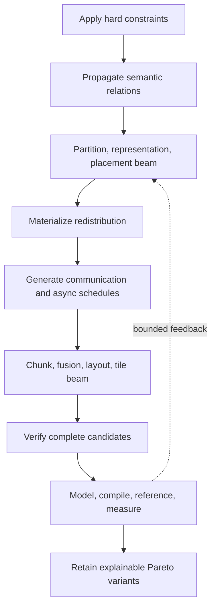

# Joint planner, cost model, and agents

Status: future design, not a current VernonDSL contract.

This document defines topology, recipe-free joint search, cost modeling,
profiles, measurement, Pareto selection, and agent proposals. IR and legality
belong to [`optimization_ir.md`](optimization_ir.md). Numerical quality and
representation belong to
[`numerical_representation.md`](numerical_representation.md).

## 1. Planner responsibility

The planner jointly evaluates:

- numerical and storage representation;
- partition, placement, and replication;
- partial Values and redistribution;
- communication route, algorithm, and chunking;
- asynchronous dependencies and overlap;
- fusion and split points;
- tile, sparse, graphics, communication, and persistent schedules;
- memory lifetime and residency;
- target lowering and future `PhysicalPlanVariant` records.

It searches legal, memory-feasible plans. It does not prove a global optimum
or change Program semantics.

## 2. Inputs

```text
PlannerInput {
  semantic_program_and_analysis
  user_constraints
  resource_topology
  numerical_and_quality_policy
  objectives_and_budgets
  versioned_profiles
}
```

Named machine-learning strategies are not required inputs. Recipes may lower
to ordinary constraints and provide optional seeds, but recipe-free and
recipe-seeded runs are measured separately.

## 3. Resource topology

A logical `DeviceMesh` is an optional named view over a physical topology; it
is not the topology itself.

```text
HardwareTopologyProfile {
  identity_and_versions
  compute_nodes
  memory_nodes
  engines
  directed_links
  routes
  failure_domains
}
```

| Element | Required facts |
| --- | --- |
| Compute node | Backend, exact operation capabilities, concurrency, measured throughput |
| Memory node | Capacity, address space, ownership, persistence, measured bandwidth/latency |
| Engine | Copy/communication operations, concurrency, progress behavior |
| Link | Transport, direction, addressability, startup, bandwidth distribution, contention |
| Route | Direct/staged path, collective or remote support, hierarchy, failure domain |

Topology facts are versioned and measured. Peak marketing bandwidth is a
fallback prior only when measurements do not exist.

Heterogeneous devices are not interchangeable ranks. Placement accounts for
backend, capabilities, capacity, transfer format, network cost, compilation
availability, and different preferred local shapes.

## 4. Generic action space

Automatic search uses only generic transformations:

- split or merge a logical factor, index set, or Program region;
- replicate, move, pin, prefetch, or evict a piece;
- create partial contributions with a declared combine;
- choose persistent versus temporary placement;
- select a storage or transfer representation;
- select redistribution route, algorithm, and chunk;
- assign streams, queues, engines, and buffers;
- fuse or split a physical region;
- change tile, local layout, scope, role, pipeline, or resources.

TP, EP, DP, CP, PP, attention, MoE, halo, and similar domain names are not
actions or hidden cost features. A generic search may rediscover the same
physical plan when it is profitable.

## 5. Bounded joint search

Search remains hierarchical but revisable:



Initial algorithms:

| Decision | Initial method | Hard pruning |
| --- | --- | --- |
| Partition seed | Constraint propagation and bounded factor enumeration | Semantics, resource count, memory lower bound |
| Placement | Beam search with optional min-cut or small ILP | Capacity, capability, forbidden resources |
| Redistribution | Route/algorithm/chunk enumeration | Addressability, participants, progress |
| Fusion | Pattern DAG and bounded region growth | Effects, liveness, numerics, synchronization, resources |
| Physical schedule | Template enumeration and autotuning | Shape, layout, target capability |

Every outer candidate materializes communication and receives an inner
implementation estimate. Material measured deviations may trigger a bounded,
cached outer reconsideration.

## 6. Cost model role

The optimization system separates authority:

| Component | Authority |
| --- | --- |
| Semantic rules and verifiers | Define the feasible set |
| Generic transformations | Define candidate actions |
| Cost model | Approximate multi-objective value with uncertainty |
| Hardware measurement | Supply ground-truth observations |
| Planner or agent | Propose candidates |

A favorable model score cannot legalize an invalid candidate.

The model evaluates a complete `PlanCandidate`, not a kernel after distribution
has already been fixed.

## 7. Candidate features

### 7.1 Distribution and representation

- partition geometry, divisibility, padding, raggedness, imbalance;
- persistent and temporary placement;
- replicated and partial Value sizes;
- storage/compute/transfer encodings and metadata;
- conversion, scale synchronization, and numerical quality.

### 7.2 Communication and schedule

- bytes by source, destination, route, representation, and chunk;
- startup, hierarchy, participants, algorithm, staging, and contention;
- events, barriers, channels, epochs, streams, and engines;
- legal overlap windows and event-graph critical path;
- buffer lifetime and peak memory.

### 7.3 Local implementation

- typed operation counts and operation-class FLOPs;
- bytes and transactions by memory level;
- reuse and materialization avoided;
- layout conversions;
- registers, local memory, workspace, occupancy, residency;
- launch count, code size, pipeline fill/drain;
- compilation and tuning complexity.

Features use typed domain payloads. GEMM uses M/N/K and layouts; stencil uses
radius and local geometry; sparse work uses occupancy and neighbor
distributions; graphics uses attachments and resolution. Tensor shape is not a
universal workload identity.

## 8. Multi-fidelity evaluation

```text
legality and exact capabilities
-> memory, resource, and progress lower bounds
-> analytical compute and communication bounds
-> resource-constrained event-graph simulation
-> exact or nearest versioned profile lookup
-> calibrated residual model with uncertainty
-> compile and reference comparison
-> hardware measurement
```

### 8.1 Compute baseline

```text
kernel_lower_bound =
  max(
    work_by_operation_class / measured_operation_throughput,
    bytes_L2 / measured_L2_bandwidth,
    bytes_device_memory / measured_device_memory_bandwidth
  )
  + launch
  + mandatory_synchronization
```

Measured residuals account for occupancy, pipeline fill/drain, layout
conversion, cache regime, instruction mix, and code size.

### 8.2 Communication baseline

```text
communication =
  startup
  + bytes / effective_bandwidth
  + route_and_hierarchy
  + packing_and_conversion
  + synchronization
  + measured_contention
```

Collectives are algorithm- and hierarchy-specific. A single bandwidth number
is insufficient.

### 8.3 Event-graph simulation

End-to-end latency and throughput come from a resource-constrained event
simulation. A communication kernel consuming compute units is not free because
it is asynchronous. Overlap is never modeled by subtracting one duration from
another.

Peak memory is simulated across persistent state, semantic live ranges,
communication staging, kernel workspace, representation conversions, and
transform/checkpoint state.

### 8.4 Fusion delta

Benefits:

- removed launches;
- removed global materialization and staging;
- reduced transferred bytes;
- earlier region availability.

Costs:

- increased register and local-memory use;
- reduced occupancy or concurrent residency;
- compute resources consumed by communication;
- additional barriers, channels, and code size;
- pipeline imbalance and fill/drain;
- stricter progress and capability requirements;
- compilation and tuning time.

The same model compares fewer-communication/poor-local-tile plans against
more-communication/better-overlap plans.

## 9. Profiles and measurements

Profiles are keyed by:

- device, architecture, driver, OS;
- compiler, backend, Runtime, and communication implementation;
- topology identity;
- candidate and generator identity;
- typed workload bucket;
- representation, layout, and schedule;
- warm/cold and contention conditions.

They record distributions, counters, correctness status, objectives, and
Pareto status rather than only means. Tail objectives use tail measurements.
Stale profiles initialize search but cannot certify a changed target.

### 9.1 Active measurement

The model reports uncertainty. The tuner selects candidates likely to improve
the Pareto frontier or reduce decision-relevant uncertainty. It does not spend
equal measurement budget on clearly dominated candidates.

Every candidate records:

- parent candidate;
- one generic transformation;
- changed features;
- predicted cost/resource delta;
- verification and compilation result;
- measured delta.

This supports cross-layer credit assignment: whether a result came from
partition geometry, communication, conversion, fusion, or local scheduling.

### 9.2 Model evaluation

Report:

- top-k recall;
- rank correlation;
- selected-plan regret;
- uncertainty calibration;
- Pareto-front recall;
- compilation and measurement budget.

Average runtime prediction error alone is not an adequate planner metric.

## 10. Objectives and Pareto selection

Objectives may include:

- latency, tail latency, and throughput;
- peak and persistent memory;
- exposed communication and transfer bytes;
- utilization and contention;
- energy;
- numerical error and quality;
- recomputation;
- compilation and tuning time;
- failure-domain and availability policy.

The result is an explainable Pareto set. A future versioned deployment policy
selects one or more `PhysicalPlanVariant` records. These are not the current
compile-time Program typed specialization variants.

## 11. Explainability

Every selected plan records:

- user and recipe constraints, if any;
- propagated partitions and placements;
- representations and inserted conversions;
- redistributions and physical communication;
- rejected alternatives and reasons;
- estimated and measured costs with uncertainty;
- fusion and physical schedules;
- capability dependencies;
- ordinary fallback;
- recipe-free or recipe-seeded provenance.

## 12. Runtime adaptation

Runtime may observe shape/work buckets, declared phases, load distributions,
available devices/links, task durations, cache hits, and contention. Under a
future versioned contract it may select only among compatible installed
`PhysicalPlanVariant` records.

Runtime may not change hard placement, Program numerics, synchronization,
representation, or an immutable installed plan. New decisions require
compilation and validation.

## 13. Agent proposal layer

### 13.1 Inputs and outputs

An agent receives canonical IR summaries, generic action schemas, topology and
capabilities, relevant profile slices, model uncertainty, verifier
obligations, and prior failures.

It may propose:

- partition or placement transformations;
- task decompositions and availability regions;
- fusion or split candidates;
- physical schedule templates;
- search-order and pruning hypotheses;
- new cost features or residual models.

Typed builders are preferred. Free-form DSL must parse into the same typed IR
and pass the same checks.

### 13.2 Evaluation

```text
construct
-> verify
-> compile
-> reference/differential test
-> benchmark
-> classify and record
```

Failures are semantic, capability, resource, progress, compilation,
correctness, numerical, or performance failures.

### 13.3 Insight promotion

```text
InsightRecord {
  semantic_preconditions
  topology_and_capability_preconditions
  transformation_or_feature
  predicted_resource_and_cost_delta
  measured_evidence
  uncertainty
  counterexamples_and_failure_boundaries
  toolchain_identity
}
```

An insight becomes a deterministic compiler rule only after held-out replay
across shapes, devices, versions, and negative cases. Generated artifacts stay
in caches or bundles rather than becoming a source kernel library.

As agents improve they may control more proposal policy. They never replace
semantic authority, verification, reference checks, measurement, or immutable
plan installation.

## 14. Verification requirements

Planner evaluation must distinguish recipe-free from seeded search, compare
small spaces with exhaustive ground truth, measure selected-plan regret, and
preserve explanation and fallback. Cost estimates never bypass legality.
Delivery and acceptance gates are owned solely by
[`implementation_roadmap.md`](implementation_roadmap.md).
