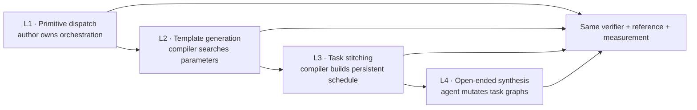
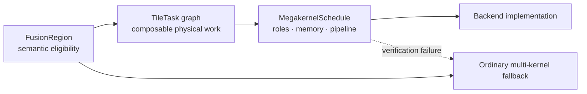
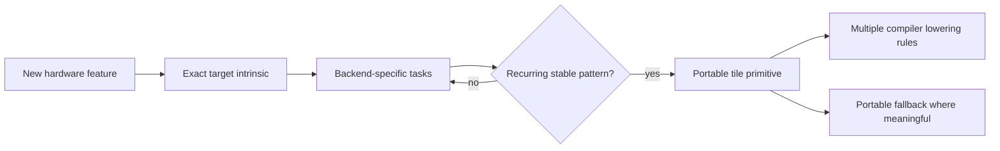
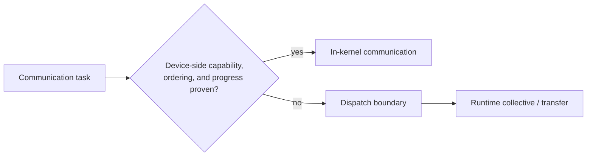
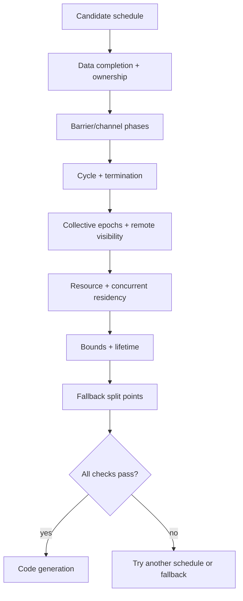
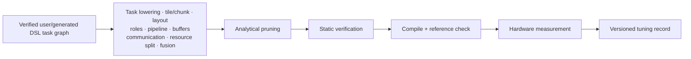
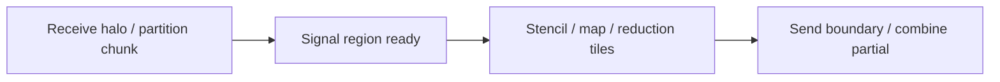
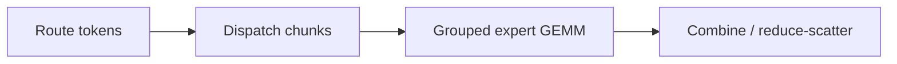

# Tile IR and bounded megakernel design

Status: future design, not a current VernonDSL contract.

This document defines the kernel-level architecture used by
[`distributed_compiler.md`](distributed_compiler.md). It describes
composable tile tasks, explicit orchestration, communication-aware fusion, and
bounded megakernel generation.

It does not claim that arbitrary Programs can be converted automatically into
one optimal persistent kernel.

## Position

The intended design combines two ideas:

- expose reusable tile primitives that the compiler can analyze, dispatch, and
  tune;
- preserve hardware-native orchestration and backend intrinsics when a user or
  generator requires direct control.

This is not a choice between adding tile primitives and using a mature IR
stack. Vernon adds a small tile/task abstraction and lowers ordinary
computation through MLIR. Backend-specific features remain explicit until a
legal target implementation is selected.

TVM TIRx, TileLang, Triton, CuTe, FLUX, PyTorch symmetric memory, and research
megakernel systems are design references. TIRx is a task substrate rather than
a complete megakernel compiler: task graphs, dependency tracking, global
in-kernel scheduling, and runtime policy remain an upper layer.

They are not Vernon build or deployment dependencies. Every executable compute
kernel originates from user-authored or compiler-generated Vernon DSL.

## Automation levels

Megakernel generation is incremental.

| Level | DSL source | Compiler supplies | Maturity target |
| --- | --- | --- | --- |
| L1 | User-authored complete orchestration | Primitive lowering selected from scope, layout, target, capability | Initial foundation |
| L2 | Compiler-generated structured task graph | Tile, layout, pipeline, chunk, and lowering search | Initial optimization |
| L3 | User-authored or generated composable tasks | Dependencies, roles, barrier/channel renaming, memory offsets, interleaving | Bounded megakernel |
| L4 | Meta-rules or seed programs | Agentic generation and mutation | Research |

Level 4 is a research direction. It is not required for the first Vernon
megakernel milestone.

## IR layers

| Layer | Owns | Must not decide |
| --- | --- | --- |
| FusionRegion | Semantic boundary, Values, effects, local domains, split points | Worker roles or native instructions |
| TileTask | Logical tile, layout requirements, scope, effects, completion, resources | Global Program placement |
| MegakernelSchedule | Roles, ordering, channels, memory lifetime, routes, queues, termination | Program semantics |
| Backend | Native operations and ABI | Undeclared synchronization or numerical changes |

### Fusion region

A `FusionRegion` is a semantic group selected from Program and distributed task
IR. It records:

- input and output Values;
- operator and communication semantics;
- effects and alias constraints;
- local shapes and placements;
- numerical requirements;
- allowed split points;
- candidate implementation families.

A FusionRegion is not yet a kernel schedule.

### Tile task

A `TileTask` is a reusable, analyzable unit such as:

- load or store tile;
- stencil or neighborhood tile;
- GEMM tile;
- reduction tile;
- quantize or dequantize tile;
- all-gather or reduce-scatter chunk;
- remote put or get;
- generated domain tasks such as an attention tile;
- MoE dispatch, expert compute, or combine tile;
- epilogue tile.

Every task declares:

- typed inputs and outputs;
- logical tile region;
- physical layout requirements;
- execution ownership and scope;
- memory reads, writes, and atomics;
- synchronization and completion behavior;
- resource estimates or exact requirements;
- backend capability requirements;
- legal fallback implementation.

Tasks remain compiler IR. They are not separately compiled opaque kernels.

### Megakernel schedule

A `MegakernelSchedule` assigns tasks to a persistent execution structure:

- role and worker group;
- ordering and dependency token;
- pipeline stage and channel;
- memory allocation and lifetime;
- communication route;
- static or dynamic work queue;
- termination and failure behavior.

The schedule is valid only for its declared target capability and resource
envelope.

## Execution scope

| Portable scope | Possible target realization |
| --- | --- |
| Lane | Thread or CPU scalar/vector lane |
| Subgroup | Warp, wave, SIMD group |
| Workgroup | CTA, threadgroup, GPU workgroup |
| Workgroup cluster | CUDA cluster or unsupported |
| Device | One accelerator or CPU domain |
| Distributed team | Process/device group with Runtime or device-side communication |

The portable IR must not use `warp`, `CTA`, or `TMA` as universal semantics.
Backend intrinsics may use those names after target selection.

## Tile layout

A tile layout maps logical coordinates to physical storage and ownership.

It records:

- logical shape;
- memory scope;
- shard mapping over named hardware axes;
- replication;
- offset;
- vector or matrix packing;
- alignment and swizzle;
- scale and metadata layout for low precision;
- producer and consumer compatibility.

Program-level global sharding and kernel-level tile layout are separate. A
global `Shard(dim)` does not determine register, subgroup, shared-memory, or
matrix-fragment layout.

Layouts are immutable contracts consumed by primitive dispatch and legality
checks. Transform recipes may generate layouts, but a backend must not infer
missing correctness facts from pointer arithmetic.

## Primitive set

| Family | Initial operations | Required semantic result |
| --- | --- | --- |
| Data movement | View/subview, load/store, sync/async copy, prefetch, layout transform, pack/unpack | Value or completion token |
| Compute | Elementwise map, MMA, reduction, optional scan, quantize/dequantize/requantize | Typed tile Value |
| Coordination | Scoped barrier, signal/wait, channel state, producer/consumer state, scoped atomic | Ordering and visibility |
| Communication | Remote put/get, multicast, reduce-to-owner, collective chunk, team signal/wait | Remote completion and ownership |
| Domain generation | Stencil, attention, grouped matrix, other reusable tasks | Generated portable tasks or intrinsic lowering |

Communication primitives declare addressability, ordering, and progress
requirements. They are not automatically legal on every target.

## Intrinsic promotion

The core language does not grow one universal operation for every hardware
instruction.

## On-chip and inter-device communication

Two different forms of communication must not be conflated.

| Property | On-chip | Inter-device |
| --- | --- | --- |
| Examples | Global/shared/accelerator-memory copy, role exchange, cluster multicast | Peer access, symmetric memory, collective, network/fabric |
| Typical scope | Subgroup, workgroup, cluster, device | Distributed team |
| Completion | Barrier, channel, async-copy token | Runtime event, signal, remote completion, collective epoch |
| Portable lowering | GPU/Vector/backend memory ops where supported | Usually dispatch + Runtime communication |
| CUDA fast path | TMA, barriers, cluster operations | Symmetric memory, NVSHMEM, device collective |
| Primary risk | Visibility and role mismatch | Addressability, ordering, progress, global deadlock |

MLIR GPU asynchronous tokens and runtime command dependencies can represent
launch and memory dependencies. They do not by themselves provide device-side
inter-GPU communication or its forward-progress guarantee.

CUDA may take the fused branch. Vulkan, Metal, OpenGL, and DirectX normally
take the Runtime branch. The fallback is part of the implementation contract.

## Fusion legality

| Legality domain | Must preserve | Reject when |
| --- | --- | --- |
| Values and Storage | Program meaning, ownership, aliases, publication | Caller-owned read-only data may be mutated |
| Effects | RAW, WAR, WAW and collective participation | Reordering changes an observable effect |
| Numerics | Type, reduction, encoding, scale layout | Encodings or accumulation rules are incompatible |
| Synchronization | Visibility, participants, phases | Barrier/channel cycle or scope mismatch |
| Resources | Registers, memories, barriers, code size | Any target ceiling is exceeded |
| Progress | Required workers and communication engine make progress | Residency or peer access cannot be guaranteed |
| Transforms | Permitted derivative and residual behavior | Fusion changes retained or derivative semantics |

## Static verification

Verification failure selects another schedule or an ordinary multi-kernel
fallback. It does not weaken synchronization.

## Resource model

| Resource class | Tracked quantities |
| --- | --- |
| Registers | Per lane/thread use and spilling |
| Local memories | Shared/threadgroup, tensor memory, accelerator SRAM |
| Synchronization | Barrier, channel, signal, and phase slots |
| Residency | Workgroups, clusters, persistent workers |
| Code | Size and instruction-cache pressure |
| Compute sharing | Compute-unit budget for compute versus communication |
| Engines | Communication and copy concurrency |
| Buffers | Staging capacity and lifetime |

Fusion stops when its predicted memory-traffic or launch benefit is outweighed
by occupancy, code-size, resource, or progress cost.

## Generation and tuning

The compiler searches structured choices, not arbitrary source programs:

Search begins from valid user-authored DSL or a compiler-generated DSL task
graph. Analytical models prune impossible or clearly dominated candidates.
Surviving candidates compile and run against representative shape buckets.

An agent may generate or mutate DSL, but generated schedules pass the same
verifier, reference comparison, and resource checks as other
compiler-generated DSL.

## Backend lowering

| Backend | Shared lowering | Peak DSL/intrinsic lowering | Communication boundary |
| --- | --- | --- | --- |
| CUDA | GPU → NVGPU/NVVM/LLVM | Compiler-generated native IR for TMA, matrix ops, tensor memory, warp specialization | Device-side when proven; otherwise Runtime |
| Vulkan | GPU/Vector → SPIR-V | Enumerated cooperative-matrix tuple | Runtime |
| OpenGL | Restricted SPIR-V/GLSL adapter | Target extension only after separate validation | Runtime/host |
| Metal | Dedicated MSL-oriented lowering | Generated MSL/native intrinsic where device and OS permit | Runtime |
| DirectX | Structured shader IR → HLSL/DXIL | Enumerated native intrinsic, native or driver-emulated | Runtime |
| CPU | Linalg/Vector → LLVM | Generated SIMD/ISA intrinsic lowering | Runtime/host |

## Initial templates

The domain-independent template is:

Required variants are:

- ordinary communication and compute dispatches;
- communication and compute overlap;
- optional fused tile implementation where the target supports it.

The LLM validation in
[`distributed_dl_compiler.md`](distributed_dl_compiler.md) adds:

Required variants are:

- ordinary collective plus GEMM;
- collective and GEMM on independent streams;
- device-side tile-fused implementation where supported.

Its second family is:

LLM prefill and decode use separate scheduling and communication policies.

## Acceptance

| Area | Exit condition |
| --- | --- |
| Generation | One stencil/reduction region produces ordinary, overlapped, and optional fused variants |
| IR | Dependencies, layouts, scopes, effects, and completion remain inspectable |
| Verification | Injected barrier, resource, residency, ownership, and cycle errors fail closed |
| CUDA | Supported hardware may select generated communication-fused DSL |
| Other backends | Select legal generated DSL or explicit dispatch-level fallback |
| Correctness | Fused and fallback variants match the reference within numerical policy |
| Measurement | Record compile time, latency distribution, throughput, occupancy, resources, exposed communication |
| Compatibility | Current public contracts remain unchanged until a versioned release |

The subsequent LLM validation applies the same acceptance to a TP linear region
without adding TP or another workload-specific concept to tile IR.

Generated DSL and compiled artifacts are cache/deployment outputs. They are not
committed as a growing kernel library, and deployment does not load an external
kernel package.
