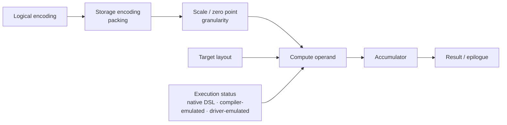
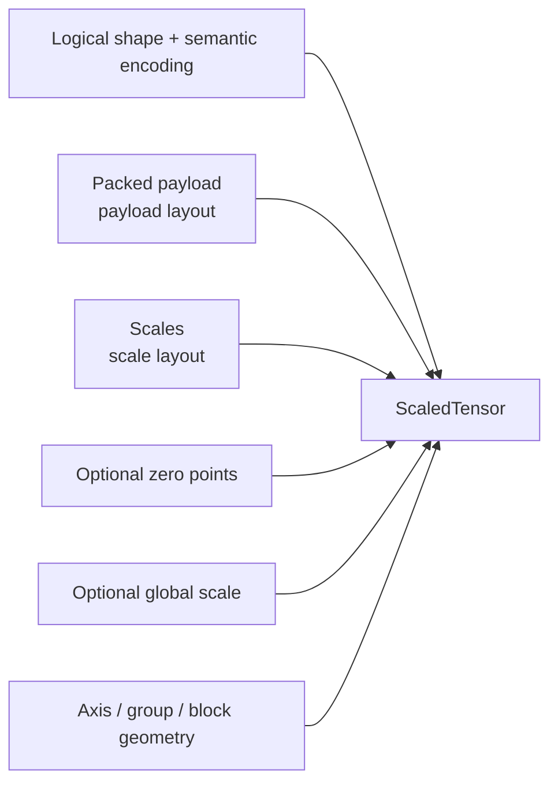
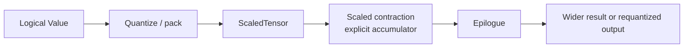
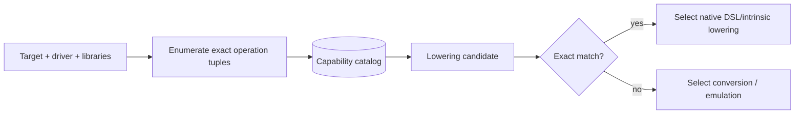
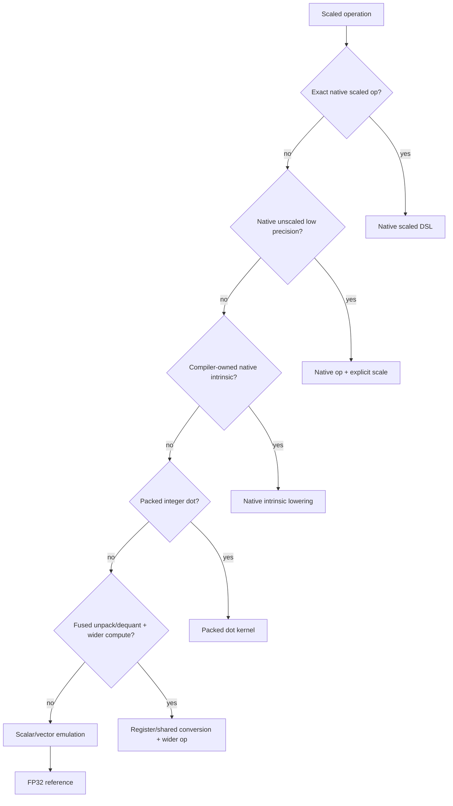
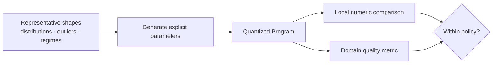
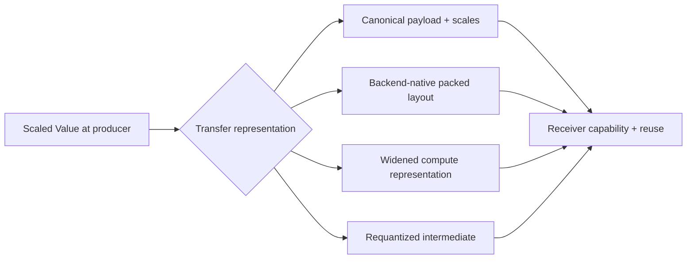

# Mixed-precision and quantized tensor design

Status: future design, not a current VernonDSL contract.

This document defines portable mixed-precision and encoded-value semantics for
the domain-independent distributed architecture in
[`distributed_compiler.md`](distributed_compiler.md).

It does not add FP8, FP6, FP4, INT4, or quantization metadata to the current
public compiler, Program, Runtime, or manifest contracts.

## Principle

Low precision is not one scalar dtype.

The compiler must not treat “the device accepts an FP8 tensor” as proof that a
specific FP8 matrix operation is accelerated.

## Design boundary

| In scope | Forbidden inference or rewrite |
| --- | --- |
| Preserve exact encoding and quantization semantics | Silently select calibration scales |
| Retain compressed storage when profitable | Treat affine INT4, NF4, MXFP4, and NVFP4 as interchangeable |
| Select operations by exact type, shape, layout, and accumulator | Canonicalize distinct E4M3 variants without proof |
| Keep Program formats independent from backend swizzles | Require FP4/FP8 arithmetic on every backend |
| Express conversion, calibration, and error policy | Infer matrix acceleration from scalar/buffer support |
| Provide bit-exact references and deterministic failures | Encode tensor-core layout in Program semantics |

## Type model

A future `QuantizedType` contains:

| Component | Required fields | Examples |
| --- | --- | --- |
| Logical encoding | Family and exact variant | IEEE float, bfloat, E4M3FN, E5M2, E2M1, signed integer, codebook |
| Storage | Bit width, packing unit/order, signedness, alignment | Two INT4 values per byte |
| Quantization | Scheme, scale/zero-point type, granularity, block geometry | Affine, symmetric, microscaling, codebook |
| Numerics | Rounding, overflow, saturation, subnormal, NaN/Inf policy | Round-to-nearest-even, finite-only |

Names such as `E4M3FN`, `E4M3FNUZ`, OCP E4M3, and a vendor-specific Metal
E4M3 encoding remain distinct unless their full numerical behavior is proven
equivalent.

## ScaledTensor

A quantized tensor is represented semantically as:

| Format example | Payload | Metadata / geometry |
| --- | --- | --- |
| Affine INT8 | Signed/unsigned INT8 | Scale + zero point |
| Grouped symmetric INT4 | Packed signed INT4 | Scale per output-channel group |
| MXFP8 | E4M3 or E5M2 | E8M0 scale per 32 elements |
| MXFP4 | E2M1 | E8M0 scale per 32 elements |
| NVFP4 | E2M1 | E4M3 local scale per 16 + global tensor scale |
| NF4 | Four-bit code index | Versioned nonlinear codebook |

Backend swizzles and matrix-instruction layouts are target layout attributes.
Serialization and communication use a canonical packing unless a versioned
interchange format explicitly says otherwise.

## Operations

| Operation family | Operations | Semantic state |
| --- | --- | --- |
| Representation | Pack, unpack, layout transform | Physical representation only |
| Quantization | Quantize, dequantize, requantize, fake/block quantize | Encoding and scale transition |
| Contraction | Scaled dot, matmul, convolution | A/B encoding, scale, compute, accumulator, result |
| Dynamic scale | Amax, scale update, delayed-scale update | Explicit mutable scale state |

Quantization boundaries remain visible until a fusion pass proves that moving
or eliminating them preserves semantics.

## Capability model

Capabilities are operation records, not target booleans:

| Capability field | Meaning |
| --- | --- |
| Operation | Dot, matmul, convolution, conversion, reduction |
| Inputs | A/B encoding and scale scheme |
| Outputs | Accumulator and result type |
| Geometry | M/N/K, block, subgroup, and scope constraints |
| Physical contract | Layout and alignment |
| Numerics | Rounding and saturation |
| Status | Native DSL/intrinsic, driver-emulated, compiler-emulated |
| Cost | Conversion, layout, workspace, and measured execution |

Capability records are cached by device, driver, OS, compiler, and Runtime
version.

## Portable baseline

| Baseline path | Accumulation / execution |
| --- | --- |
| FP16 multiply | FP32 accumulation |
| BF16 multiply where available | FP32 accumulation |
| INT8 dot/matrix | INT32 accumulation |
| Packed INT4 storage | Explicit or fused conversion to FP16/BF16/INT8 |
| Universal reference | FP32 scalar or vector |

FP8, FP6, FP4, and block-scaled acceleration are optional target
specializations.

The baseline describes semantic availability, not guaranteed performance.
Each target still requires measured generated implementations.

## Backend policy

| Backend | Candidate DSL/intrinsic path | Mandatory qualification | Portable fallback |
| --- | --- | --- | --- |
| CUDA | Generated FP16/BF16/FP8, Blackwell FP8/6/4, MX/NV formats, INT8/4 kernels | Architecture, instruction availability, direction, layout, alignment, accumulator, scale swizzle | Fused unpack/dequant or wider compute |
| Vulkan/SPIR-V | FP16/BF16/INT8, FP8 and OCP extensions, cooperative matrix | Feature chain plus exact component/shape/scope/result tuple | Register/shared conversion then supported contraction |
| Metal | Generated MSL and compiler-owned native tensor intrinsic lowering | OS/API, GPU family, descriptor/alignment, measured implementation | Packed storage plus fused conversion |
| DirectX/HLSL | True FP16, packed integer dot, wave/linear algebra, FP8 | Granular operation query and native/emulated status | Conversion or wider shader arithmetic |
| OpenGL/ES | Extension-dependent FP16/integer | Exact extension and implementation | Canonical packed storage plus software conversion |
| CPU | Generated scalar/SIMD and compiler-owned ISA intrinsics | ISA, packing, accumulator, alignment | Scalar/vector reference |

Type acceptance, compute capability, shader model, or extension presence alone
is never sufficient proof of an accelerated contraction.

All compute implementations originate from user-authored or
compiler-generated Vernon DSL. A target intrinsic may lower to a hardware
instruction or platform compiler operation, but it does not require an
external quantized-kernel package. Generated packing, conversion, and
contraction kernels are cache/deployment artifacts rather than committed source
variants.

## Lowering order

Multiple variants may be compiled and measured. Runtime dispatch chooses among
validated variants for the current device and workload bucket.

The compiler does not avoid quantization merely because native FP4 or FP8
arithmetic is unavailable. Compressed storage may still reduce data size and
memory traffic enough to pay for fused conversion.

## Accumulation policy

| Input class | Default accumulation | Notes |
| --- | --- | --- |
| INT8 / INT4 | INT32 | Long reductions require overflow analysis or segmentation |
| FP16 / BF16 | FP32 | Reduced accumulation is an explicit fast mode |
| FP8 / FP6 / FP4 / block-scaled | FP32 | Scale application remains explicit |
| Long reductions and range statistics | FP32 | Reproducibility policy controls order |
| Epilogue | Explicit result type | May convert or requantize |

Reduced-precision accumulation is an explicit fast mode with separate accuracy
acceptance. Long integer reductions require overflow analysis or segmented
accumulation.

Reduction order and reproducibility policy are explicit because matrix
hardware, split accumulation, and fusion may change rounding.

## Calibration and accuracy

Quantization parameters are Program inputs or explicit compiler-transform
results. Backend legalization must not invent them.

An optional machine-learning quantization profile additionally covers:

- representative sequence lengths and batch shapes;
- rare activation outliers;
- prefill and decode;
- modalities and operating regimes;
- realistic MoE routing where applicable.

LLM validation may use perplexity or task accuracy.

Recommended starting policies are:

- per-output-channel or grouped symmetric weight quantization;
- per-tensor or per-token activation quantization according to workload;
- group sizes selected from an explicit allowed set;
- required MX block sizes preserved exactly;
- sensitive layers and reductions retained in higher precision;
- activation smoothing or rescaling represented as explicit graph transforms.

The compiler may tune group size only when it is allowed to regenerate scales
without changing a fixed Program contract.

## Distributed interaction

Scaled tensor metadata participates in placement and communication.

| Cost or constraint | Planner input |
| --- | --- |
| Network | Transmitted bytes and route |
| Conversion | Packing/layout latency |
| Legality | Receiver capability |
| Consistency | Scale synchronization |
| Numerics | Error policy |
| Amortization | Reuse count |
| Identity | Canonical checkpoint/cache format |

Replicated state that requires numerically identical dynamic scale updates must
synchronize range and scale state over the correct resource group.

Backend-native swizzled formats are not silently sent to an incompatible
device. Heterogeneous links use canonical formats or an explicit transfer
conversion.

## Legal optimizations

| Legal optimization | Forbidden semantic change |
| --- | --- |
| Fold constant quantization | Alter fixed calibration parameters |
| Fuse Q/DQ with contraction | Replace affine INT4 with FP4 or NF4 |
| Fuse unpack and scale load into tile movement | Replace MXFP4 with NVFP4 |
| Move scales when proven safe | Change rounding, saturation, NaN/Inf, or subnormal behavior |
| Generate dynamic quantization kernel | Remove observable fake-quantization boundaries |
| Preserve sensitive operations in wider precision | Serialize backend swizzles as Program format |
| Cache target-native packing | Make that cache the canonical representation |

## Packing ABI

| Packing field | Required definition |
| --- | --- |
| Bit order | Bit/nibble order inside packing unit |
| Integer interpretation | Signedness and sign extension |
| Unit layout | Packing unit and byte order |
| Tail | Padding for incomplete units |
| Tensor projection | Byte strides and logical dimensions |
| Metadata | Scale and zero-point storage |
| Codebook | Identity and version |
| Physical requirement | Alignment |

Odd-length, non-contiguous, and misaligned tensors have defined behavior or
fail before execution.

## Validation

Every encoding has a scalar reference implementation.

| Validation layer | Coverage |
| --- | --- |
| Encoding | Every narrow bit pattern, zero, extrema, subnormal, NaN/Inf |
| Rounding | Halfway cases, saturation, overflow |
| Scale | Overflow, underflow, global/local interaction |
| Packing | Odd length, padding, non-contiguous, misaligned |
| Accumulation | Integer overflow and reduction order |
| Differential | Native versus emulated; fused versus unfused |
| Portability | Cross-backend canonical serialization |
| Domain | Numerical quality and performance |

## Acceptance

| Area | Exit condition |
| --- | --- |
| Semantics | INT4 operator declares encoding, packing, group scale, compute, accumulator |
| Reference | Bit-exact scalar path |
| Implementations | Generated CUDA DSL plus portable fused-dequant fallback |
| Portability | One non-CUDA backend preserves compressed Program storage |
| Capability | Reports native DSL/intrinsic, driver-emulated, or compiler-emulated |
| Numerics | Matches declared tolerance |
| Cost | Records latency, memory, conversion, and quality delta |
| Failure | Rejects incompatible packing, scale layout, and capability |
| Compatibility | Current contracts remain unchanged until release |
