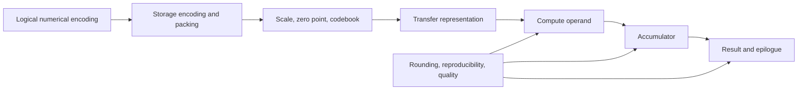

# Numerical and representation optimization

Status: future design, not a current VernonDSL contract.

This document defines mixed precision, quantized values, accumulation,
calibration, transfer representation, and numerical quality as one dimension
of the joint compiler described in [`architecture.md`](architecture.md).

Mixed precision is not an inference-only optimization. It applies to training,
inference, fine-tuning, simulation, scientific computing, storage, and
communication.

## 1. Value chain

Low precision is not one scalar dtype:



Each stage is explicit. A target accepting an FP8 buffer does not prove that a
specific FP8 matrix operation is accelerated.

## 2. Joint-plan fields

```text
NumericalRepresentationPlan {
  logical_encoding
  storage_encoding_and_packing
  quantization_parameters_and_geometry
  persistent_representation
  transfer_representation
  compute_operand_types
  accumulator_type_and_order
  result_and_epilogue_type
  rounding_overflow_nan_subnormal_policy
  reproducibility_policy
  quality_constraints
  conversion_and_fallback_paths
}
```

Program IR owns logical numerical meaning and fixed quantization parameters.
Logical distribution owns required representation compatibility. Physical IR
owns target layouts and conversions. A backend may select only a representation
allowed by the plan.

## 3. Type and encoding model

A quantized type declares:

| Component | Required fields |
| --- | --- |
| Logical encoding | Exact family and variant |
| Storage | Bit width, packing unit/order, signedness, alignment |
| Quantization | Scheme, scale/zero-point type, granularity, block geometry |
| Numerics | Rounding, overflow, saturation, subnormal, NaN/Inf |
| Codebook | Identity and version where applicable |

E4M3FN, E4M3FNUZ, OCP E4M3, INT4, NF4, MXFP4, and NVFP4 remain distinct
unless complete numerical behavior is proven equivalent.

## 4. Scaled values

```text
ScaledValue {
  logical_shape_and_encoding
  packed_payload
  payload_layout
  scales_and_scale_layout
  optional_zero_points
  optional_global_scale
  axis_group_or_block_geometry
  codebook_identity
}
```

Examples:

| Format | Payload | Metadata |
| --- | --- | --- |
| Affine INT8 | Signed/unsigned INT8 | Scale and zero point |
| Grouped symmetric INT4 | Packed signed INT4 | Scale per group |
| MXFP8 | E4M3 or E5M2 | E8M0 scale per defined block |
| MXFP4 | E2M1 | E8M0 scale per defined block |
| NVFP4 | E2M1 | Local E4M3 scale plus global scale |
| NF4 | Four-bit code index | Versioned nonlinear codebook |

Backend swizzles and matrix layouts are physical target attributes. Canonical
serialization and communication never silently use a target-native swizzle.

## 5. Operation semantics

| Family | Operations |
| --- | --- |
| Representation | Pack, unpack, layout transform |
| Quantization | Quantize, dequantize, requantize, fake/block quantize |
| Contraction | Scaled dot, matmul, convolution |
| Dynamic scale | Amax, scale update, delayed scale update |
| Reduction | Range statistics, partial combine, high-precision reduction |

A scaled contraction declares both input encodings and scales, compute operand
types, accumulator, reduction order, result type, and epilogue conversion.
Quantization boundaries remain visible until fusion proves that moving or
eliminating them preserves semantics.

## 6. Training, inference, and other profiles

### 6.1 Training

Typical choices include FP16/BF16/FP8 operands, FP32 accumulation, higher-
precision master state, loss scaling, dynamic amax/scale updates, stochastic
or specified rounding, high-precision sensitive reductions, and compressed
gradient communication.

Scale state is explicit mutable Program state where observable. Replicated
dynamic scales synchronize over the correct resource group.

### 6.2 Inference

Typical choices include weight-only INT4/INT8, W8A8, FP8/FP4 compute, compressed
caches, static or per-token scales, and fused unpack/dequantization.

Inference may prioritize latency, capacity, or throughput, but uses the same
IR and legality contracts as training.

### 6.3 Fine-tuning and scientific work

Fine-tuning may retain quantized base weights while updating higher-precision
adapters. Scientific workloads may combine low-precision local work with
high-precision reduction or iterative refinement. These are policies over the
same representation chain, not separate compiler semantics.

## 7. Capability model

Capabilities are exact operation tuples:

```text
OperationCapability {
  operation
  input_encodings_and_scale_schemes
  compute_accumulator_and_result_types
  shape_and_block_geometry
  layout_alignment_and_scope
  rounding_and_saturation
  native_driver_emulated_or_compiler_emulated
  conversion_workspace_and_measured_cost
}
```

Queries are keyed by device, architecture, driver, OS, compiler, and Runtime.
Scalar type acceptance or shader model alone is never proof of an accelerated
contraction.

## 8. Portable baseline and lowering order

Portable defaults:

- FP16 or BF16 multiply with FP32 accumulation;
- INT8 or INT4 integer work with overflow-checked INT32 accumulation;
- packed INT4 storage with explicit or fused widening;
- FP32 scalar/vector reference.

Optional FP8, FP6, FP4, microscaling, and reduced accumulation require exact
capabilities and separate quality acceptance.

Lowering order:

```text
exact native scaled operation
-> native unscaled low precision plus explicit scale
-> compiler-owned intrinsic
-> packed integer operation
-> fused unpack/dequant plus wider compute
-> scalar/vector emulation
-> reference
```

Multiple legal variants may be compiled and measured.

## 9. Accumulation and reproducibility

Default accumulation:

| Inputs | Default |
| --- | --- |
| INT8/INT4 | INT32 with overflow analysis |
| FP16/BF16 | FP32 |
| FP8/FP6/FP4/block-scaled | FP32 |
| Long reductions and statistics | FP32 or declared wider type |

Reduced accumulation is an explicit fast mode. Long integer reductions require
overflow proof or segmented accumulation. Floating-point reassociation,
parallel reduction, and split accumulation follow an explicit reproducibility
and error policy.

Distribution may create partial Values. A nonlinear consumer cannot run until
all required partial contributions are combined unless a separate equivalence
proof exists.

## 10. Calibration and quality

Quantization parameters are Program inputs or outputs of explicit transforms.
Backend legalization does not invent them.

```text
representative regimes
-> explicit calibration transform
-> quantized Program
-> local numerical comparison
-> domain quality comparison
-> accept or reject
```

Calibration covers shapes, distributions, outliers, workload phases, and data-
dependent routing where relevant. Domain metrics may include task quality,
perplexity, physical conservation error, or application-specific tolerance.

The compiler may tune group size or scales only when policy explicitly permits
regeneration. Fixed calibration is semantic input.

## 11. Distribution interaction

For each redistribution the planner selects among:

- canonical compressed payload and metadata;
- receiver-compatible native packing;
- widened compute representation;
- explicitly requantized intermediate.

The decision considers:

| Dimension | Cost or constraint |
| --- | --- |
| Network | Payload and metadata bytes, route |
| Conversion | Packing, layout, scale cost |
| Capability | Receiver operation tuple |
| Consistency | Dynamic scale synchronization |
| Numerics | Error and reproducibility |
| Reuse | Conversion amortization |
| Identity | Canonical checkpoint/cache format |

Heterogeneous links use canonical formats or explicit conversion. A target-
native swizzle is never sent silently to an incompatible receiver.

## 12. Fusion interaction

Legal optimizations include:

- folding constant quantization;
- fusing quantize/dequantize with contraction;
- fusing unpack and scale load into tile movement;
- moving scales when equivalence is proven;
- preserving sensitive operations in wider precision;
- caching target-native packing as a noncanonical artifact.

Forbidden changes include:

- altering fixed calibration;
- exchanging INT4, FP4, NF4, MXFP4, or NVFP4;
- changing rounding, saturation, NaN/Inf, or subnormal behavior;
- removing observable fake-quantization boundaries;
- serializing backend swizzles as Program format.

Fusion profitability accounts for removed memory and communication against
conversion, scale loads, local memory, registers, occupancy, and code size.

## 13. Joint cost features

Numerical candidates contribute:

- payload, metadata, and transfer bytes;
- packing, conversion, and scale-update latency;
- operation throughput by exact tuple;
- workspace and layout cost;
- scale synchronization and collective cost;
- reuse count;
- accumulator overflow/reproducibility restrictions;
- local error and domain quality delta;
- calibration and tuning budget.

Quality is a constraint or Pareto objective, not an after-the-fact annotation.

## 14. Packing and interchange

Canonical packing specifies bit order, signedness and extension, packing unit,
byte order, tail padding, logical tensor projection, scale/zero-point storage,
codebook identity, and alignment.

Odd-length, non-contiguous, and misaligned values have defined behavior or fail
before execution.

## 15. Verification requirements

- Exhaustively test narrow bit patterns, extrema, subnormal, NaN/Inf where
  defined.
- Test halfway rounding, saturation, and overflow.
- Test local/global scale interaction.
- Test odd, padded, non-contiguous, and misaligned packing.
- Test integer overflow and reduction order.
- Differentially compare native, emulated, fused, and unfused paths.
- Round-trip canonical representation across at least two backends.
- Evaluate domain quality and performance.

Delivery and acceptance gates, including the initial grouped INT4 workload,
are owned solely by
[`implementation_roadmap.md`](implementation_roadmap.md).
