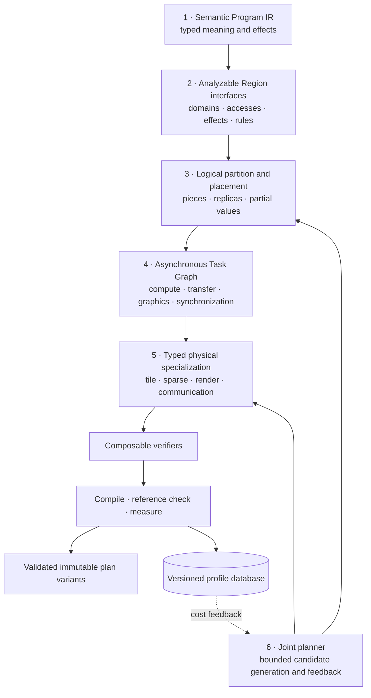
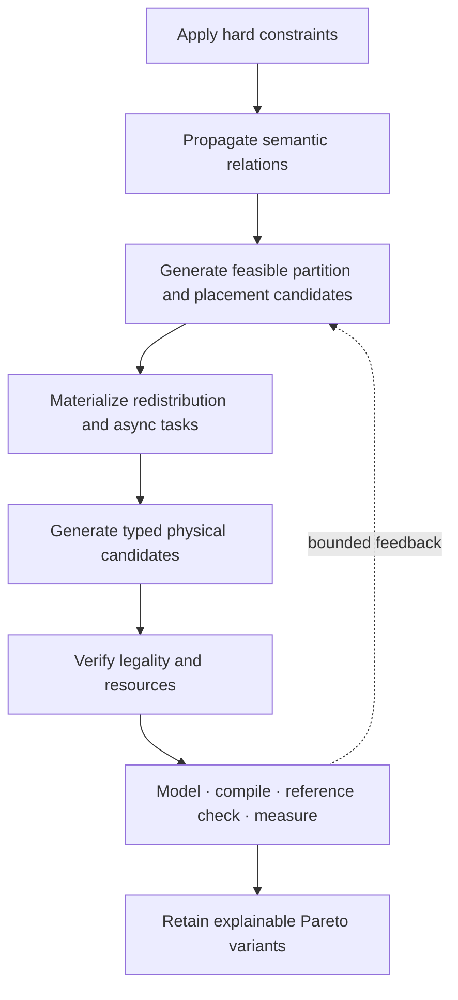

# Unified optimization IR layers

Status: future explanatory design, not a current VernonDSL contract.

This document explains how one optimization architecture can serve machine
learning, simulation, scientific computing, sparse workloads, and graphics
without forcing every domain into tensor operations or one universal kernel
form. It refines the layering proposed by
[`distributed_compiler.md`](distributed_compiler.md) and
[`megakernel_tile_ir.md`](megakernel_tile_ir.md); it does not add current
Program fields, manifest fields, Runtime behavior, or public APIs.

The central claim is:

> Vernon can share semantic authority, analysis interfaces, partition and
> placement planning, asynchronous task dependencies, resource accounting,
> verification infrastructure, measurement, and candidate selection across
> domains while retaining typed domain-specific operations, legality rules,
> physical tasks, and schedules.

The goal is not one IR operation that means tensor tile, sparse traversal,
render pass, collective, and persistent worker at once. The goal is one
layered optimization protocol in which each fact has one owner.

## 1. Why several layers are required

An optimizer must answer different questions:

1. **What does the Program mean?**
2. **What semantic structure can the compiler analyze?**
3. **How is logical work divided and where is it placed?**
4. **What work and dependencies must execute?**
5. **How does a selected target implement that work?**
6. **How are legal alternatives generated, measured, and selected?**

Putting all answers into one IR causes physical choices to become accidental
semantics. For example:

- a matrix multiplication does not semantically require a `128 x 64` tile;
- a stencil does not semantically require a two-device halo exchange;
- a render graph does not semantically require two compatible passes to use
  one native render scope;
- a reduction does not semantically require an all-reduce rather than a
  reduce-scatter followed by another redistribution;
- a particle traversal does not semantically require one work queue or
  persistent worker layout.

The architecture therefore separates:

```text
meaning
  -> analyzable relations
  -> logical division and placement
  -> required asynchronous work
  -> target-specific implementation
  -> measured candidate selection
```

The arrows are lowering and planning boundaries. Lower layers may report cost
or feasibility to higher-level planners, but they must not change Program
meaning.

## 2. End-to-end model



This picture contains two kinds of structure:

- **IR layers** carry progressively more physical decisions;
- **optimization services** generate, reject, measure, and rank alternatives.

The joint planner is not another semantic IR. It coordinates transformations
whose results remain owned by the appropriate IR layer.

## 3. Layer 1: Semantic Program IR

### 3.1 Responsibility

Semantic Program IR is the only authority for:

- logical Values and Storages;
- typed operations;
- shape, index, numerical, and control semantics;
- effects, aliases, and resource-version transitions;
- public boundaries;
- Program transforms such as VJP;
- required ordering that is part of Program meaning.

It retains distinct typed operation families when their semantics differ:

- structured compute;
- irregular or sparse compute;
- graphics;
- semantic exchange or coordination where explicitly authored;
- control or task regions.

The current one-Program architecture remains authoritative:
[`../program/architecture.md`](../program/architecture.md). A standalone
kernel, graphics pipeline, Module, or transformed Program does not select
another executable model.

### 3.2 What is forbidden at this layer

Semantic Program IR does not own:

- tile or chunk sizes;
- register, subgroup, warp, or matrix-fragment layouts;
- concrete device count or topology placement;
- collective algorithm;
- copy engine or stream assignment;
- persistent worker roles;
- native render-scope grouping;
- measured duration;
- a selected backend artifact.

Runtime values such as concrete dynamic TensorView shapes, strides, offsets,
extents, resources, and launch grids remain invocation state. They do not
become capture, compile, manifest, or artifact identity.

### 3.3 Communication distinction

Two uses of the word *communication* must remain separate:

1. A Program may contain an explicitly authored semantic operation such as an
   exchange, combine, or domain coordination requirement.
2. The compiler may introduce physical copy, halo, collective, remote access,
   or synchronization tasks because selected placements are incompatible.

The second kind is not inserted into Semantic Program IR. It is materialized
after logical partition and placement. A backend collective name such as
NCCL, MPI, or a device-specific remote instruction never defines Program
meaning.

### 3.4 Example

Consider:

```text
y = relu(matmul(a, b))
```

Semantic Program IR records matrix multiplication and elementwise ReLU. It
does not record whether:

- `matmul` and `relu` are fused;
- `a`, `b`, or `y` is sharded;
- the implementation uses matrix hardware;
- an intermediate tile remains in registers;
- execution uses one dispatch or a persistent kernel.

All of those are legal physical alternatives only if they preserve the same
Program result and effects.

## 4. Layer 2: Analyzable Region interfaces

### 4.1 An interface, not one universal operation

An analyzable operation exposes the subset of the following interfaces that
is meaningful for it:

- `IterationDomain`: the logical points, elements, cells, records, rays,
  particles, or operations over which work is defined;
- `AccessRelation`: how a logical work item reads or writes Values, Storages,
  image subresources, or index sets;
- `Effects`: reads, writes, atomics, allocation, synchronization, visibility,
  and externally observable behavior;
- `Dependencies`: semantic ordering not already implied by Value SSA and
  Storage versions;
- `PartitionRules`: legal ways to divide the domain and the relations induced
  on operands and results;
- `FusionRules`: conditions under which an implementation region may be
  composed without changing semantics;
- `ReferenceSemantics`: a trustworthy unfused, undistributed, or otherwise
  conservative implementation against which candidates can be checked.

These are compiler analysis interfaces. They need not become one serialized
operation schema, and an operation need not implement every interface.

`Dependencies` must supplement rather than duplicate canonical Value SSA,
Storage versions, and effects. A lower layer must not construct an
independently authoritative semantic graph.

### 4.2 Linalg-style indexing maps

For structured tensor computation, a Linalg-like model is especially
powerful. It describes an operation using structural semantics rather than
requiring every optimization to recognize an operation name such as
`matmul_relu`.

```text
iteration domain
+ iterator kinds
+ operand indexing maps
+ scalar body and reduction combiner
+ effects
```

Indexing maps are necessary but are not the complete operation semantics. They
answer:

```text
At logical iteration point (m, n, k), which element of each operand is read
or written?
```

They do not answer:

```text
What scalar computation combines those elements?
Is a many-to-one output access a sum, maximum, ordered update, or invalid race?
May iterations be reordered?
Are there effects outside the declared tensor accesses?
```

Those facts come from iterator kinds, the scalar body, operation traits,
effects, and numerical policy.

#### 4.2.1 Complete matrix multiplication semantics

For tensors:

```text
A: M x K
B: K x N
C: M x N
```

matrix multiplication with an initialized output is:

```text
for m in [0, M):
  for n in [0, N):
    accumulator = C_init[m, n]
    for k in [0, K):
      accumulator = accumulator + A[m, k] * B[k, n]
    C_result[m, n] = accumulator
```

The corresponding structured description is:

```text
iteration domain:
  D = { (m, n, k) |
        0 <= m < M,
        0 <= n < N,
        0 <= k < K }

access maps:
  A: (m, n, k) -> (m, k)
  B: (m, n, k) -> (k, n)
  C: (m, n, k) -> (m, n)

iterator kinds:
  m: parallel
  n: parallel
  k: reduction

scalar body:
  next_c = add(current_c, mul(a, b))

effects:
  read A
  read B
  read C_init
  produce C_result
```

The access maps are functions from the common iteration domain to operand
coordinates. In affine notation they are:

```text
map_A(m, n, k) = (m, k)
map_B(m, n, k) = (k, n)
map_C(m, n, k) = (m, n)
```

The `n` coordinate is projected out by `map_A`, `m` is projected out by
`map_B`, and `k` is projected out by `map_C`.

#### 4.2.2 Concrete `linalg.generic` example

The following MLIR-like example shows all important parts. Exact syntax may
vary with the selected MLIR version, but the semantic structure is:

```mlir
// d0 = m, d1 = n, d2 = k
#map_a = affine_map<(d0, d1, d2) -> (d0, d2)>
#map_b = affine_map<(d0, d1, d2) -> (d2, d1)>
#map_c = affine_map<(d0, d1, d2) -> (d0, d1)>

%result = linalg.generic {
    indexing_maps = [#map_a, #map_b, #map_c],
    iterator_types = ["parallel", "parallel", "reduction"]
  }
  ins(%A, %B : tensor<?x?xf32>, tensor<?x?xf32>)
  outs(%C_init : tensor<?x?xf32>) {
^bb0(%a : f32, %b : f32, %current_c : f32):
  %product = arith.mulf %a, %b : f32
  %next_c = arith.addf %current_c, %product : f32
  linalg.yield %next_c : f32
} -> tensor<MxNxf32>
```

This operation is matmul-like because of the combination of:

- a three-dimensional iteration domain;
- the three indexing maps;
- two parallel iterators and one reduction iterator;
- the multiply-add scalar body;
- tensor read and destination-style result effects.

Changing only the scalar body changes the operation:

```text
next_c = max(current_c, a * b)  -> maximum reduction
next_c = current_c - a * b      -> order-sensitive update
next_c = a * b                  -> repeated overwrite, not a valid parallel
                                  reduction over k
```

Therefore the compiler does not derive complete semantics from the maps.
`linalg.generic` declares the maps, iterator kinds, and scalar body as one
semantic contract. A named `linalg.matmul` operation can be understood as a
restricted, predefined instance of this contract.

#### 4.2.3 Why `m` and `n` are parallel

For different output coordinates:

```text
(m0, n0) != (m1, n1)
```

the output map is injective:

```text
map_C(m0, n0, k) != map_C(m1, n1, k)
```

for the differing `m` or `n` coordinate. Each `(m, n)` pair owns a distinct
output element. If the scalar body has no undeclared side effects, computing
`C[m0, n0]` does not depend on computing `C[m1, n1]`.

This is the dependence-theory basis for marking `m` and `n` parallel:

```text
no loop-carried dependence across m or n
+ distinct output ownership
+ no conflicting effects
= iterations may execute in any order or concurrently
```

In Linalg, iterator kinds are normally explicit operation attributes or known
properties of a named operation. The compiler may infer candidate properties
from access and dependence analysis, but it should verify or conservatively
use the declared semantic contract rather than guess parallelism from operand
shapes.

#### 4.2.4 Why `k` is a reduction

For fixed `(m, n)`, all `k` iterations map to the same output:

```text
map_C(m, n, 0) = (m, n)
map_C(m, n, 1) = (m, n)
...
map_C(m, n, K - 1) = (m, n)
```

The map is many-to-one with respect to `k`. That proves only that multiple
iterations contribute to one output; it does not by itself prove a legal
reduction. The scalar body must have reduction form:

```text
accumulator_next = combine(accumulator_current, contribution)
```

and the compiler needs the combiner's algebraic contract. Common reductions
form monoids:

```text
sum:      combine = add,      identity = 0
product:  combine = multiply, identity = 1
maximum:  combine = max,      identity = -infinity
minimum:  combine = min,      identity = +infinity
```

Associativity permits grouping contributions differently. Commutativity
permits arbitrary reordering. These properties justify transformations such
as reduction tiling, tree reduction, vector reduction, or combining partial
results from multiple devices.

Floating-point addition is not strictly associative:

```text
(a + b) + c != a + (b + c)
```

for some finite-precision values. A numerical policy must therefore decide
whether reassociation is allowed. A strict policy may preserve reduction order
and reject transformations that change it; a relaxed policy may permit tree
or parallel reduction within declared error bounds.

#### 4.2.5 Relationship to `einsum`

The same matmul can be written:

```text
einsum("mk,kn->mn", A, B)
```

Einsum supplies additional language semantics:

- indices present in the output are retained;
- input indices absent from the output are reduced;
- multiplication creates each contribution;
- summation combines contributions.

For `"mk,kn->mn"`:

```text
all indices       = {m, n, k}
output indices    = {m, n}
reduction indices = {k}
```

Einsum can classify `k` as a sum reduction because the sum-product convention
is built into the einsum language. The classification is not a theorem derived
only from the letters. Linalg makes the same information explicit through
iterator kinds and the scalar body, and it permits scalar bodies other than
sum-product.

#### 4.2.6 The affine and polyhedral basis

When domains and access maps are affine, they can be represented using integer
sets and relations:

```text
iteration set:
  D = { (m, n, k) | bounds }

operand access relation:
  R_A = { ((m, n, k), (i, j)) |
          i = m and j = k }
```

Compiler analyses can manipulate these sets and relations to answer:

- which operand region an iteration tile reads;
- whether two iteration regions may access the same output;
- whether a dependence crosses a proposed tile or fusion boundary;
- what producer iterations are required by a consumer region;
- whether loop interchange, tiling, or parallelization preserves dependence
  order.

This is related to the polyhedral model and Presburger arithmetic. The useful
guarantee is not that the compiler discovers a globally optimal schedule. It
is that, inside the representable affine subset, it can derive exact accessed
regions and prove many transformation legality conditions.

#### 4.2.7 Concrete fusion example: matmul followed by ReLU

Consider:

```text
T[m, n] = sum(k, A[m, k] * B[k, n])
Y[m, n] = relu(T[m, n])
```

The ReLU operation has:

```text
domain: (m, n)
T access: (m, n) -> (m, n)
Y access: (m, n) -> (m, n)
iterators: parallel(m), parallel(n)
scalar body: y = max(t, 0)
```

Suppose the compiler chooses the consumer output tile:

```text
Y[m0 : m0 + TM, n0 : n0 + TN]
```

The ReLU input map is the identity, so this tile requires exactly:

```text
T[m0 : m0 + TM, n0 : n0 + TN]
```

The compiler then computes the preimage of that `T` region through the matmul
producer maps. It derives:

```text
A required region:
  A[m0 : m0 + TM, 0 : K]

B required region:
  B[0 : K, n0 : n0 + TN]

C_init required region:
  C_init[m0 : m0 + TM, n0 : n0 + TN]
```

A tiled implementation can therefore be:

```text
for m_tile in tiles(M, TM):
  for n_tile in tiles(N, TN):
    T_tile = C_init[m_tile, n_tile]

    for k_tile in tiles(K, TK):
      A_tile = A[m_tile, k_tile]
      B_tile = B[k_tile, n_tile]
      T_tile += A_tile * B_tile

    Y_tile = relu(T_tile)
    store Y_tile
```

The full intermediate tensor `T` need not be materialized in global memory.
Only the current `T_tile` must remain live in registers, local memory, or
another selected physical representation.

The maps prove which regions are required, but fusion legality also depends
on:

- the matmul reduction being complete before applying ReLU;
- numerical policy permitting the chosen reduction schedule;
- `T` having no other consumer that requires materialization, or the planner
  preserving that consumer;
- memory and register capacity for `T_tile`;
- absence of conflicting effects;
- target support and profitability.

ReLU cannot generally move inside the `k` loop:

```text
relu(sum(k, contribution(k)))
```

is not equivalent to:

```text
sum(k, relu(contribution(k)))
```

This demonstrates the division of labor:

```text
indexing maps
  -> derive required operand and producer regions

iterator and dependence information
  -> determine legal loop and tile transformations

scalar body and algebraic properties
  -> preserve computation and reduction meaning

effects and ownership
  -> preserve observable behavior

resource model and measurement
  -> decide whether a legal fusion is profitable
```

For a reduction dimension sharded across devices, each device initially
produces only a partial `T_tile`. The partial tiles must be combined before the
nonlinear ReLU unless a separate proof establishes an equivalent
transformation. Thus the same semantics constrain both local tile fusion and
distributed sharding plus communication.

#### 4.2.8 What is and is not inferred

The compiler may derive:

- operand regions required for a selected iteration tile;
- possible dependences and conflicting accesses;
- candidate parallel dimensions;
- the producer slice needed by a consumer;
- legal affine loop transformations;
- candidate reduction decomposition when the combiner contract permits it.

The compiler must be given or prove:

- the scalar operation;
- iterator and reduction meaning;
- combiner identity and algebraic properties;
- effects and alias behavior;
- numerical reassociation policy;
- semantics for non-affine or data-dependent access.

The important abstraction is therefore not “indexing maps replace operation
semantics.” It is:

> A structured operation exposes its semantics in a relational form that lets
> the compiler reason about iteration, access, dependence, and fusion without
> matching one workload-specific operation sequence.

### 4.3 Why `AccessRelation` is broader than affine indexing

Affine indexing maps are not sufficient for:

```text
value = table[index[i]]
neighbor = particles[cell_list[cell][j]]
edge_value = graph.values[graph.row_offsets[v] + e]
```

These operations have indirect or data-dependent accesses. They may still
expose:

- a symbolic indirect relation;
- bounds or containment properties;
- uniqueness or possible-conflict information;
- a declared atomic or reduction policy;
- an index-set construction phase;
- a conservative unknown relation.

Optimization becomes less aggressive as information becomes weaker, but the
operation remains valid. The compiler must not invent affine structure that
the Program does not prove.

### 4.4 Graphics analysis

Graphics operations expose different relations:

- attachment and image-subresource accesses;
- load, store, clear, discard, and resolve behavior;
- draw and render-area domains;
- resource hazards and visibility;
- render-scope composition conditions;
- fixed-function and shader capability requirements.

These are analyzable, but they are not tensor indexing maps. Adjacent graphics
Nodes may be eligible for one native render scope because their attachment
semantics compose, not because their shader indexing maps compose.

### 4.5 Opaque operations

An opaque custom Stage remains legal. It supplies conservative summaries:

- typed inputs and outputs;
- effects and aliases;
- required capabilities;
- optional partition or fusion constraints;
- optional cost metadata;
- legal alternative implementations.

Unknown structure reduces optimization opportunity. It must not cause the
compiler to inspect backend code and reconstruct missing semantics.

## 5. Layer 3: Logical partition and placement

### 5.1 Common vocabulary

This layer answers **which logical pieces exist** and **where they may live**.
The same vocabulary applies to:

- tensor dimensions;
- spatial cells;
- particles or graph vertices;
- records or arbitrary index sets;
- render regions, views, passes, or Program regions;
- persistent Storage;
- replicated and partial Values.

The key concepts are:

- `Partition`: logical pieces independent of physical resources;
- `Placement`: mapping pieces and replicas to topology resources;
- `Replication`: equivalent logical state at multiple placements;
- `PartialValue`: a contribution requiring a declared combine operation;
- `Redistribution`: a required change of partition, placement,
  representation, or replication.

Global partition and placement do not determine kernel-local tile layout.

### 5.2 Materializing mismatch

If a producer placement does not satisfy a consumer placement, the logical
plan requires redistribution. Later lowering may implement it as:

- local view or transpose;
- local copy or representation conversion;
- halo or boundary exchange;
- broadcast, reduction, all-reduce, all-gather, reduce-scatter, or all-to-all;
- point-to-point transfer;
- image or buffer transition;
- hierarchical or fused communication.

The logical requirement does not prematurely select the physical algorithm.

### 5.3 Example: two-device stencil

Suppose a two-dimensional five-point stencil updates a grid:

```text
next[x, y] =
  f(current[x, y],
    current[x - 1, y], current[x + 1, y],
    current[x, y - 1], current[x, y + 1])
```

A legal logical plan may:

1. partition the `x` domain into left and right regions;
2. place each region and its persistent Storage on one device;
3. derive one-cell boundary requirements from the access relation;
4. require left-to-right and right-to-left halo redistribution;
5. keep external boundaries governed by the Program boundary condition.

This is the same partition/placement machinery used for tensor sharding, but
the domain recipe is spatial decomposition rather than tensor parallelism.

### 5.4 Example: graphics

A frame may contain:

```text
simulation compute
-> geometry generation
-> shadow pass
-> main color pass
-> post-processing
```

Logical planning may place simulation and geometry compute on one device,
place independent views on different device groups, or keep the entire frame
local. The plan reasons about Program regions, image Storage, subresources,
and boundary transfers. It does not reinterpret a render pass as a tensor
dimension.

## 6. Layer 4: Asynchronous Task Graph

### 6.1 Why this is the strongest common physical layer

After partition and placement, every domain needs an explicit account of work,
dependencies, completion, and resources. The asynchronous task graph can use
typed task kinds:

- compute;
- copy or communication;
- graphics;
- synchronization;
- conversion;
- allocation, prefetch, eviction, or publication where applicable.

Every task identifies:

- semantic source or logical-plan provenance;
- inputs, outputs, and affected resource versions;
- required predecessors and completion token;
- placement and eligible engines;
- lifetime and residency requirements;
- capability requirements;
- a legal fallback boundary.

The graph owns physical execution dependencies. It references Program facts
but does not redefine Program Values, effects, or meaning.

### 6.2 Example: stencil task graph

One legal schedule is:

```text
left boundary pack  -> left-to-right transfer  -> right boundary compute
right boundary pack -> right-to-left transfer  -> left boundary compute

left interior compute  -------------------------> left completion
right interior compute ------------------------> right completion
```

Interior computation can overlap halo transfer because dependencies are
region-specific. Overlap is derived from the event graph; it is not modeled by
subtracting one estimated duration from another.

### 6.3 Example: compute-to-graphics

```text
simulation compute
-> storage visibility / image transition
-> geometry or graphics task
-> render-scope completion
-> publication
```

Compute and graphics remain distinct typed tasks, but they share the same
Value, Storage-version, hazard, completion, and publication ordering
infrastructure.

### 6.4 Relation to Runtime

The task graph is compiler and planning IR. It is not a second public
executable model and does not replace the canonical lifecycle:

```text
load bundle
-> resolve executable
-> create instance
-> begin invocation
-> bind
-> invoke
```

The selected tasks lower into an immutable `ResolvedExecutionPlan`. Runtime
executes that plan and does not recover missing semantics or perform unchecked
replanning.

## 7. Layer 5: Typed physical specialization

### 7.1 Shared task contract

Different domains need different physical tasks. They can still share a
contract containing:

- logical region;
- physical ownership;
- memory and representation requirements;
- resource estimate or exact requirement;
- completion and synchronization behavior;
- target capabilities;
- verification obligations;
- split point or fallback implementation.

The following names describe conceptual specializations, not settled public
Vernon types.

### 7.2 `TileTask`

`TileTask` serves structured or indexable compute:

- elementwise and reduction tiles;
- GEMM and convolution tiles;
- stencil or neighborhood tiles;
- image-processing tiles;
- load, store, pack, and conversion tiles;
- bounded communication chunks that participate in a tiled schedule.

It can carry local layout, memory scope, pipeline stages, and hardware-axis
mapping. A global shard does not determine these local layouts.

### 7.3 `SparseTask`

`SparseTask` serves indirect or data-dependent work:

- graph frontier traversal;
- particle neighbor processing;
- sparse gather/scatter;
- adaptive mesh work;
- data-dependent dispatch or compaction.

Its physical choices may include:

- index preprocessing;
- bucket or queue construction;
- conflict and atomic strategy;
- load balancing;
- sparse layout;
- bounded persistent workers.

It must not pretend that a data-dependent access is an affine tile.

### 7.4 `RenderScopeTask`

`RenderScopeTask` represents graphics-specific execution such as:

- compatible attachment scope;
- one or more ordered draws;
- load, store, clear, and resolve actions;
- graphics pipeline and dynamic-state transitions;
- image visibility and subresource constraints.

Its fusion rules are render semantics and backend capability rules, not Linalg
producer-consumer fusion rules.

### 7.5 `CommunicationTask`

`CommunicationTask` represents:

- point-to-point transfer;
- halo exchange;
- collective or collective chunk;
- remote put or get;
- reduction to an owner;
- topology-aware hierarchical routing.

It declares addressability, participants, ordering, visibility, progress,
staging, and completion. It may lower to a Runtime operation or a verified
device-side implementation.

### 7.6 `PersistentSchedule`

A persistent schedule composes compatible physical tasks into a bounded
resident execution structure. It records:

- worker roles and ownership;
- work queues;
- memory offsets and lifetimes;
- barriers, channels, and epochs;
- progress and termination;
- communication routes;
- split fallbacks.

It is one optimization form, not the final form required for every Program.
Verification failure selects another schedule or an ordinary multi-task
fallback.

## 8. Shared resource and capability framework

### 8.1 Common resource algebra

The framework should represent reusable resource classes:

- compute-unit capacity and occupancy;
- registers and local memories;
- synchronization objects;
- buffers, lifetime, and peak memory;
- copy or communication engines;
- residency and concurrent progress;
- code size and instruction-cache pressure;
- topology links, memories, and failure domains.

### 8.2 Typed extensions

Domains and targets add typed capabilities rather than hidden cost flags:

- graphics attachments, texture and sampler limits, raster or ray hardware;
- matrix and tensor units;
- atomic and sparse-memory behavior;
- collective, peer-addressability, and remote-visibility support;
- specialized local memory or asynchronous transfer features.

A target-specific capability may enable a fast path. Lack of that capability
selects a declared fallback or produces an explicit unsupported diagnostic.

### 8.3 Why one fixed resource record is insufficient

A field such as `shared_memory_bytes` cannot explain:

- whether all persistent workers can reside concurrently;
- whether a barrier or channel allocation is legal;
- whether a render scope exceeds attachment limits;
- whether communication makes progress while compute occupies all workers;
- whether an indirect access pattern saturates memory latency;
- whether code growth destroys instruction-cache locality.

The resource model is therefore an extensible typed framework plus conservative
aggregation rules, not one DL-oriented occupancy formula.

## 9. Composable verification

### 9.1 Common verification pipeline

Every candidate passes shared checks:

1. semantic provenance and reference agreement;
2. Value, Storage-version, and region dependency preservation;
3. ownership and completion;
4. memory bounds and lifetime;
5. effects, hazards, and visibility;
6. resource capacity and concurrent residency;
7. capability satisfaction;
8. fallback validity.

### 9.2 Domain proof obligations

Typed verifiers add domain-specific checks:

- structured compute: iteration coverage, access bounds, reduction legality,
  layout compatibility;
- sparse compute: indirect-index bounds, conflict policy, queue termination,
  load-balancing assumptions;
- graphics: attachment compatibility, version continuity, render-scope
  composition, image transitions;
- communication: participants, collective epochs, route legality, remote
  visibility, progress;
- persistent schedules: cycles, barrier phases, worker residency,
  termination.

This is one verifier framework with composable proof obligations, not one
monolithic verifier that treats every task as a tensor tile.

## 10. Measurement and profile infrastructure

### 10.1 What is shared

All domains need versioned records for:

- target architecture and capabilities;
- compiler, driver, Runtime, and backend versions;
- topology;
- candidate and generator identity;
- declared workload bucket;
- latency and throughput distributions;
- peak memory and resource counters;
- contention and warm or cold conditions;
- correctness result;
- selected objective and Pareto status.

The system records distributions rather than only averages. Tail-sensitive
graphics or serving objectives may select different variants from
throughput-oriented simulation or training.

### 10.2 What remains domain-specific

Feature descriptions differ:

- GEMM: `M`, `N`, `K`, dtype, layout, sparsity;
- stencil: dimensions, radius, boundary rule, local-domain geometry;
- particles: occupancy distribution, neighbor-count distribution, locality;
- graphics: resolution, formats, samples, overdraw, attachment behavior;
- communication: message distribution, participants, route, contention.

The profile database therefore has a common envelope and typed feature
payloads. It must not use tensor shape as the universal workload identity.

### 10.3 The cost model is not an oracle

The optimizer uses multiple fidelities:

```text
legality and resource lower bounds
-> analytical rejection of impossible or dominated candidates
-> profile-based ranking
-> compile and reference check
-> hardware measurement
-> bounded feedback to outer planning
```

It does not need to predict every candidate's exact runtime. Its first duties
are to preserve correctness, reduce the search space, and identify a small set
worth measuring.

## 11. Layer 6: Joint planner

### 11.1 Joint decisions

The planner jointly evaluates interactions among:

- partition;
- placement and replication;
- redistribution;
- representation;
- fusion and split points;
- tile, sparse, render-scope, communication, and persistent schedules;
- memory lifetime and residency;
- target resources and capabilities.

For example, a partition that minimizes communication volume may produce poor
local tiles, while a locally fast tile may consume enough resources to prevent
communication overlap. These decisions require feedback.

### 11.2 Bounded hierarchical search

The planner must not flatten every decision into one unbounded Cartesian
product:



Typical search methods may include dynamic programming, min-cut, small ILP,
beam search, pattern-based region growth, template enumeration, autotuning, or
agent-generated candidates. IR correctness does not depend on one search
algorithm.

### 11.3 Agent role

An agent may propose:

- new partition recipes;
- new analyzable task decompositions;
- fusion candidates;
- physical task graphs;
- schedule templates;
- search-order or pruning hypotheses.

The agent does not bypass semantic authority, capability checks, verification,
reference comparison, or measurement. Agent generation extends the candidate
space; it does not become an oracle or a second Runtime planner.

## 12. Four end-to-end examples

### 12.1 Distributed matrix multiplication and epilogue

Program:

```text
y = gelu(matmul(a, b) + bias)
```

Layer-by-layer:

1. Semantic Program IR owns `matmul`, addition, GELU, Values, and numerical
   policy.
2. Analyzable interfaces expose contraction and elementwise indexing maps,
   reduction dimensions, effects, and fusion rules.
3. Logical planning may shard an output dimension, shard the reduction
   dimension into partial Values, or replicate an operand.
4. The async graph materializes required all-gather, reduce-scatter, or
   all-reduce tasks and their dependencies.
5. Physical refinement generates MMA tiles, epilogue fusion, communication
   chunks, pipelines, and an ordinary split fallback.
6. The planner measures legal candidates and may reconsider placement if
   local tiling cost or communication overlap differs materially from its
   estimate.

The general architecture contains no `TP` operation. Tensor parallelism is a
source recipe over generic partition and placement.

### 12.2 Two-device fluid or wave stencil

Program:

```text
next_grid = stencil_step(current_grid, coefficients)
```

Layer-by-layer:

1. Program IR owns the update equation and boundary conditions.
2. Analysis exposes the spatial iteration domain and neighborhood access
   relation.
3. Logical planning partitions cells and derives halo requirements.
4. The async graph overlaps interior compute with boundary exchange.
5. Physical refinement chooses stencil tile shape, local memory reuse,
   boundary packing, transfer chunks, and synchronization.
6. Measurement compares communication exposure, occupancy, and peak memory.

This uses the same planner, tasks, resources, verifier framework, and profiles
as the DL example without introducing a tensor-parallel recipe.

### 12.3 Particle or graph traversal

Program:

```text
for particle in active_particles:
    for neighbor in cell_list[cell_of(particle)]:
        accumulate_interaction(particle, neighbor)
```

Layer-by-layer:

1. Program IR owns interaction and accumulation semantics.
2. Analysis exposes particle and neighbor index sets, indirect accesses,
   possible conflicts, and the accumulation policy.
3. Logical planning partitions spatial cells or graph vertices and identifies
   migrated or ghost data.
4. The async graph contains index construction, redistribution, traversal, and
   combine tasks.
5. Sparse physical refinement selects bucket layout, work queues, atomics,
   load balancing, and optional persistent workers.
6. Measurement uses neighbor-count and locality distributions rather than
   pretending the workload is a dense rectangular tensor.

The common architecture remains useful precisely because it permits a
`SparseTask`-like refinement instead of forcing affine `TileTask` semantics.

### 12.4 Simulation feeding graphics

Program:

```text
wave simulation
-> normal and geometry generation
-> graphics draw
-> post-processing
-> publication
```

Layer-by-layer:

1. Program IR owns typed compute and graphics Nodes, shared Storage versions,
   attachments, and publication.
2. Structured compute exposes index mappings; graphics exposes attachment,
   render-area, and render-scope relations.
3. Logical planning places simulation domains, frame resources, views, and
   Program regions.
4. The async graph orders compute, image transitions, draw tasks,
   post-processing, and publication.
5. Compute uses tile refinement; graphics uses render-scope refinement.
   Compatible graphics Nodes may share a native render scope independently of
   whether adjacent compute Nodes are tile-fused.
6. The planner compares split and fused candidates under graphics capability,
   memory, latency, and publication constraints.

This example demonstrates why the asynchronous task graph is a better common
physical layer than either Linalg or a render pass.

## 13. What is shared and what is intentionally different

Shared across machine learning, physics, scientific computing, and graphics:

- canonical Program semantic authority;
- analyzable-region protocol;
- partition and placement vocabulary;
- asynchronous dependency and completion model;
- resource and capability framework;
- composable verifier infrastructure;
- measurement and profile database;
- candidate generation, explanation, Pareto retention, and validated variants;
- immutable resolved-plan and ordinary fallback requirements.

Intentionally domain-specific:

- primitive operations;
- access-relation precision;
- fusion legality;
- physical task kinds;
- cost-model features;
- schedule templates;
- reference implementations;
- peak fast paths and backend intrinsics;
- whether a megakernel or persistent schedule is useful at all.

Generality means that a new domain plugs into common interfaces and services.
It does not mean erasing domain semantics.

## 14. How to report the design externally

### 14.1 One-sentence report

> Vernon is exploring a domain-independent optimization architecture that
> preserves one semantic Program, exposes typed access/effect/ownership
> relations for analysis, lowers distributed and heterogeneous work into an
> explicit asynchronous task graph, and selects verified physical
> specializations using bounded search and hardware measurement.

### 14.2 Three-minute narrative

1. **Problem:** DL compilers optimize tensor sharding and tiles, simulation
   compilers optimize domains and halos, and graphics systems optimize passes
   and resource transitions. Their operations differ, but all must preserve
   semantics while deciding placement, dependencies, resources, and schedules.
2. **Key separation:** Program IR owns meaning. Analysis interfaces expose
   structure without turning physical choices into semantics.
3. **Common waist:** logical partition/placement followed by an explicit
   asynchronous task graph is the shared middle of the system.
4. **Typed refinement:** structured compute becomes tiles, irregular compute
   becomes sparse or queue-based tasks, graphics becomes render scopes, and
   redistribution becomes communication tasks.
5. **Optimization:** a bounded hierarchical planner generates legal
   candidates; composable verifiers reject invalid plans; models prune;
   hardware measurements rank surviving variants.
6. **Result:** domains share infrastructure without pretending that all work
   is Linalg or that every Program should become one megakernel.

### 14.3 Suggested report sequence

A longer presentation can use the following sequence:

1. one canonical Program and strict semantic authority;
2. Linalg indexing maps as the motivating structured-analysis example;
3. `AccessRelation` as the generalization to stencil, sparse, and graphics;
4. partition and placement over tensors, cells, index sets, and Program
   regions;
5. asynchronous task graph as the common execution-planning layer;
6. typed physical refinements rather than one universal physical operation;
7. shared resource, verifier, and profile services;
8. bounded joint planning with measurement feedback;
9. one DL, one simulation, and one graphics walkthrough;
10. explicit non-goals and fallback guarantees.

### 14.4 Claims to make carefully

Prefer:

- “domain-independent framework with typed domain extensions”;
- “bounded joint optimization”;
- “measurement-driven candidate selection”;
- “Linalg-style maps cover structured computation”;
- “validated variants with explicit fallbacks”.

Avoid:

- “one IR represents every workload equally well”;
- “affine index maps model arbitrary sparse or graphics behavior”;
- “the cost model predicts exact performance”;
- “the planner finds the global optimum”;
- “every Program becomes one megakernel”;
- “communication is only a tensor-sharding artifact”;
- “Runtime dynamically invents new execution plans”.

### 14.5 Questions the report should answer

An external design report is incomplete unless it answers:

- Which layer owns each semantic and physical fact?
- What can be optimized when an operation exposes only conservative analysis?
- How does a placement mismatch become explicit work?
- Which dependencies are semantic, and which belong to physical scheduling?
- How are structured, sparse, graphics, and communication tasks kept typed?
- What is statically verified?
- What must be measured?
- How is profile identity versioned?
- What fallback executes when a fast path is unavailable or invalid?
- Which choices may Runtime select without recompilation?

## 15. Non-goals

This design does not propose:

- replacing the canonical Program model;
- serializing one universal `AnalyzableRegion` operation;
- reducing graphics to tensors;
- reducing sparse traversal to affine loops;
- making communication libraries part of Program semantics;
- proving a global optimum for a dynamic heterogeneous system;
- compiling every Program into one persistent kernel;
- allowing measurements to mutate Program meaning;
- allowing Runtime to create unchecked schedules;
- adding public fields before a versioned contract and implementation exist.

## 16. Architectural invariants

- Program IR remains the sole semantic authority.
- Analysis interfaces expose facts; they do not become a second semantic
  graph.
- Logical partition and placement remain separate from local tile layout.
- Compiler-induced communication is explicit before communication-aware
  fusion.
- The asynchronous task graph owns physical dependencies but references
  canonical Program Values, Storages, effects, and versions.
- Physical tasks remain typed; no domain is forced into an invalid universal
  primitive.
- Resource and capability requirements are explicit and fail closed.
- Every optimized candidate has a reference strategy, split point, fallback,
  or explicit unsupported-target diagnostic.
- Cost feedback may select another candidate but never changes Program
  semantics.
- Runtime selects only among validated immutable variants.
- Concrete invocation state does not leak into capture, compilation,
  manifests, or artifact identity.
