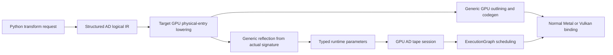

# GPU Autodiff Responsibility Architecture

## Status

This document records architecture decisions and does not maintain completion
state. Current behavior and remaining work live in
[`autodiff.md`](autodiff.md) and [`roadmap.md`](roadmap.md).

GPU and graphics autodiff are deferred and unsupported. Current GPU backends
compile and execute ordinary non-AD compute and graphics pipelines only. This
document describes constraints for a possible future implementation, not an
available compatibility path.

This document records the architecture decision made after the first Metal
capture/retry/commit attempt mixed compiler reflection, pipeline parsing,
autodiff graph orchestration, backend binding, and Python cooking.

It refines the GPU sections of:

- `specs/mlir-centered-autodiff-architecture.md`;
- `specs/scalable-autodiff-rules-architecture.md`.

The immediate decision is:

1. stop extending the current mixed GPU implementation;
2. remove the incomplete GPU-specific branches while preserving verified
   structured VJP, CPU dynamic tape, and canonical `VernonValueAbi` work;
3. rebuild GPU autodiff around a physical-entry ABI boundary.

Do not update the compiler contract or pipeline contract versions until the
next release.

## Problem Found in the First Metal Attempt

The first implementation made several layers infer or recreate the same
autodiff facts:

- `compiler_reflection.cpp` predicted and synthesized
  `__vernon_ad_status` and `__vernon_ad_tape` before physical lowering;
- `VernonLowerGPUAutodiff.cpp` independently created those resources and
  rewrote function boundaries;
- `runtime_pipeline_direct.cpp` expanded hidden resources and inferred
  cotangent/output/gradient carriers;
- the removed GPU pullback runtime detected structured profiles from resource
  names and changed shape rules;
- the removed graph pullback runtime found protocol resources by path and
  directly implemented capture/retry/commit;
- `runtime_pipeline_metal.cpp` required a structured-autodiff binding branch;
- Python cooking mixed structured and legacy compilation through fallback
  behavior.

This caused new structured behavior to leak into old cooked GPU pullbacks.
Adding an equivalent Vulkan branch would duplicate the problem rather than
solve it.

## Non-Negotiable Invariants

- Structured primal MLIR remains the source for VJP.
- AD does not define a value ABI. Tape payload layout always comes from
  `VernonValueAbi`.
- AD owns only tape record metadata, region metadata, and the
  capture/retry/commit protocol.
- Reflection describes an existing physical function signature. It never
  predicts a later lowering.
- Reflection and code generation consume the same target-prepared module.
- Metal, Vulkan, CUDA, and generic pipeline binding do not recognize
  structured AD.
- Runtime parses serialized protocol metadata once into typed enums.
  Downstream code does not dispatch on `__vernon_*` names.
- Capture failure cannot expose Storage or output effects.
- Exact retry is checked. A second overflow, malformed status, offset overflow,
  or allocation-policy failure prevents commit.
- Python does not silently fall back from a failed structured compilation to
  legacy native AD.
- Do not extend JVP as part of this work.

## Target Architecture



### Logical AD

`VernonStructuredAutodiff` owns:

- activity and `wrt` use through shared analysis;
- VJP rule application;
- tape planning;
- structured reverse control flow;
- emission of logical tape operations;
- `vernon.ad.capture` and `vernon.ad.commit`.

It emits no Metal/Vulkan resources, bindings, status-word indices, or runtime
buffer names.

### Target Physical-Entry Preparation

The compiler flow must become:

```text
frontend MLIR
  -> logical structured AD preparation
  -> target physical-entry preparation
  -> reflection from the prepared module
  -> code generation from the same prepared module
```

`VernonLowerGPUAutodiff` is the only owner of GPU AD physical boundary
materialization. It converts:

- `!vernon.ad_tape` into ordinary status and dynamic-tape `TensorView`
  parameters;
- cotangent inputs into ordinary readable physical resources when required by
  the GPU entry ABI;
- forward outputs and backward gradients into ordinary writable physical
  resources;
- logical tape and effect-phase operations into GPU-executable operations.

The resulting physical parameters carry optional metadata:

```text
vernon.autodiff_role
vernon.autodiff_protocol = capture_status | dynamic_tape
```

The lowering also assigns the real set/binding information that code
generation consumes.

`compiler_reflection.cpp` then reflects those real arguments. It must not
synthesize hidden resources or result carriers.

`VernonToGPU.cpp` remains a generic outlining pass and contains no AD
conditionals.

## GPU Tape Wire Protocol

The compiler lowering and runtime session need one small shared internal
protocol header. It defines only:

- capture and commit phase values;
- status header word indices;
- protocol error codes;
- checked offset and capacity limits;
- invocation-root entry layout;
- region-header and record-prefix layout.

It does not contain `VernonValueAbi` payload layouts or backend binding rules.

### Status Resource

The status resource contains:

1. a fixed header with phase, capacity, required bytes, overflow, invocation
   count, and protocol error;
2. one root-region entry per logical invocation.

A single global root entry is insufficient because a nontrivial dispatch grid
can execute multiple independent invocations.

### Tape Resource

Use checked 32-bit byte offsets and reject required capacities that cannot be
represented. All allocator arithmetic must fail closed.

Parallel invocations can interleave atomic allocations, so dynamic-region
records must not rely on physical contiguity. The format uses:

- a region header containing the last record offset, executed count, and exit
  kind;
- a record prefix containing the previous record offset and statically planned
  child-region handles;
- a canonical payload whose leaf offsets and alignment come from
  `VernonValueAbi`.

Reverse traversal follows record links. Nested-region lookup follows child
handles stored in the parent iteration record.

Allocation uses one protocol-defined alignment and checked atomic reservation.
Every attempted reservation contributes to the exact required byte count even
after capacity overflow. No out-of-capacity payload write is issued.

### Runtime State Machine

```text
Idle
  -> ProvisionalCapture
  -> StatusKnown
  -> ExactAllocation, when required
  -> ExactCapture, when required
  -> CheckedCaptureSuccess
  -> Commit
  -> PullbackReady
```

Commit is forbidden unless the latest capture:

- reports no protocol error;
- reports no overflow;
- fits the bound capacity;
- has valid invocation roots and checked offsets.

## Runtime Responsibilities

### Reflection Ingestion

`runtime_pipeline_direct.cpp` parses serialized
`vernon.autodiff_protocol` once into a typed enum in `pipeline_manifest.h`.
Serialized strings stop at this boundary.

It does not append resources that were absent from reflection and does not
infer carriers from function roles.

### Future GPU Profile and Invocation

A future GPU profile loader would build `ResourceAbi` from typed role/protocol
metadata. It must not:

- compare resource names with `__vernon_ad_status`,
  `__vernon_ad_tape`, or `__vernon_launch`;
- use a broad `structuredProfile` boolean to alter unrelated legacy shape
  rules;
- encode capture/retry/commit orchestration.

### Deferred GPU Autodiff Tape Session

No GPU autodiff tape session or executable exists in the current runtime.
When GPU autodiff is reintroduced, its tape lifecycle and typed resource
bindings must be backend-independent rather than restoring the removed native
emitter/runtime path.

### Future Graph Composition

A future graph-level differentiation layer would own:

- graph topology;
- node dependency order;
- forward value wiring;
- cotangent and gradient wiring;
- pullback lifetime.

It delegates each structured GPU forward node to
`GpuAutodiffTapeSession`. It does not know status-word indices or protocol
resource names.

Each node has an independent forward session. This directly supports later
multi-stage forward graphs: execute a node's successful capture/commit before
making its committed outputs visible to downstream nodes.

### Backend Pipeline Resolution

`runtime_pipeline_metal.cpp` and `runtime_pipeline_vulkan.cpp` bind the ordinary
physical resources described by reflection. Neither file may contain a
structured-autodiff branch.

If final physical reflection cannot be consumed by the normal backend binding
path, fix the generic physical reflection/binding contract rather than adding
an AD exception.

## Python Cooking Responsibilities

Python owns:

- the user VJP request;
- `wrt` paths;
- profile identity and manifest packaging;
- explicit target capability selection.

During migration:

- unsupported GPU targets reject differentiated assets explicitly;
- a structured compiler failure remains a structured compiler failure;
- no exception-based or empty-artifact fallback silently changes the
  implementation;
- CPU structured paths and rejected GPU requests remain separately observable
  in tests.

Delete Python native AD, flat graph, and static-loop implementations only after
CPU, Metal, and Vulkan parity.

## Migration tracking

Current migration state is summarized in [`autodiff.md`](autodiff.md) and
remaining work in [`roadmap.md`](roadmap.md). This document retains the
responsibility boundaries and invariants that future work must satisfy.

## Acceptance Gates

Do not proceed from one phase to the next unless:

- existing CPU AD and non-AD GPU tests remain green;
- no general runtime or backend file contains a structured-AD special branch;
- reflection exactly matches the physical entry signature;
- all protocol selection below reflection ingestion is typed;
- all offset, alignment, size, and allocation arithmetic is checked;
- capture failures produce no visible Storage or output changes;
- Metal and Vulkan consume the same protocol implementation.
