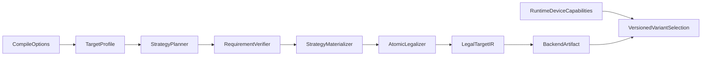

# GPU Atomic and Autodiff Runtime Refactor Plan

## Goal

Replace target-name atomic switches and backend code-generation workarounds with
one capability-driven accumulation pipeline. Finish the still-incomplete GPU
autodiff binding, replay, checkpoint, runtime-split, accounting, and performance
work without changing the released compiler or pipeline contracts before the
next version.

Captured Tape payload and graph checkpoints must remain device-local. Host
readback is limited to a fixed-size capacity/error summary when the runtime
cannot proceed without it.

## Current state and unresolved work

- Atomic selection now uses one typed target profile through accumulation
  planning and generated-requirement verification. Native and integer-CAS paths
  remain distinct, CAS storage is represented as integer storage with
  value-boundary bitcasts, and SPIRV-Cross has no Vernon atomic override.
- GPU replay binding plans use prevalidated indexed source slots and exact
  physical layout recipes. `BindingSpecPlan` is the sole authority for
  derivative role, leaf path, carrier rank, shape, and stride validation.
  External cotangent/gradient value sets and the per-apply derivative device
  table still perform string-keyed lookup and remain to be converted to fully
  indexed tables.
- Replay status is reduced on device to one fixed-size batch summary, and
  reverse batch progress is owned by a dedicated scheduler. Every replay batch
  clears and validates its own summary; the unsafe cross-apply validated-stride
  cache and paired forward/backward fast path have been removed.
- GPU replay batches, virtual workgroup metadata, D2D retained-primal restore,
  transactional Tape resize, and the backend-neutral memory reservation owner
  exist. Resize releases old Tape/segment/status buffers and current host
  segment metadata before allocating replacements, so old and replacement
  payloads are not simultaneously live.
- ExecutionGraph persistent checkpoints, initial-state snapshots, rollback
  snapshots, and final-state restoration snapshots use budgeted device buffers
  and D2D capture/restore for RHI graphs; CPU graphs retain aligned host storage.
- `runtime_gpu_derivatives` now owns shared derivative validation, device
  staging, and transactional gradient publication. No-Tape and Tape execution
  also share forward resource preparation, launch metadata binding, submission,
  and deferred transactional publication. No-Tape and Tape executable classes
  live in `runtime_gpu_executable`, pullback execution lives in
  `runtime_gpu_pullback`, replay restoration and argument materialization live
  in dedicated replay/binding modules, and reflected-value/signature preparation
  lives in `runtime_gpu_preparation` and `runtime_gpu_signature`.
- GPU cotangents use one explicit physical carrier ABI. The compiler prepends a
  carrier dimension and indexes it with the full three-dimensional physical
  invocation ID; the runtime accepts shared values with carrier stride zero and
  carried values with one logical-cotangent byte stride. Gradient and
  cotangent device keys include their role, so equal logical paths do not
  alias.
- CPU profile/program state, values, preparation, forward dispatch, backward
  execution, bounded replay, and executable assembly are split into
  `runtime_cpu_*` modules; `runtime_autodiff_cpu.cpp` is now a thin backend
  orchestration entry point matching `runtime_autodiff_gpu.cpp`.
- CPU Runtime, GPU Runtime, and ExecutionGraph use the same typed accounting
  definition for logical, retained-allocation, resident, allocated, checkpoint,
  and peak temporary bytes; only disjoint physical categories enter memory
  budgets. Apply-time payload admission happens before allocation and includes
  launch metadata, implicit cotangents, transactional gradient staging, device
  gradients, Tape, batch status, and both host and device segment metadata.
- SPIR-V workgroup reduction uses a non-power-of-two-safe shared-memory tree
  and reuses one scratch allocation per kernel and floating-point type. It
  emits one global atomic per workgroup. CUDA keeps the generic
  `gpu.all_reduce` path. Two-stage reduction is intentionally excluded: it
  would add a second kernel, partial-buffer ABI, dispatch, synchronization, and
  failure surface for a strategy that is not required by the current
  single-kernel architecture.
- Failure injection covers allocation, upload, copy, encode, submit, wait,
  download, resize, and publication. Forward values and gradients are staged
  before caller-owned memory is modified.
- The benchmark runner supports planning-policy-labelled latency summaries,
  but the published `autodiff_phase2_benchmark` and pressure reports are old
  CPU-only evidence. They predate final GPU planning-policy propagation,
  control-plane telemetry, and the current memory accounting, and must not be
  treated as performance sign-off.
- Validation snapshot (2026-08-16): after a complete rebuild in one
  `osx_build/` directory, all 443 configured C++/CTest tests pass; 31
  unavailable-backend cases skip. The full Python suite reports 412 passed and
  59 unavailable/optional cases skipped.

## Priority 0: one typed atomic capability architecture

1. Add one internal compiler target profile resolved from compile options. It
   must describe f32/f64 atomic legalization independently for device and
   workgroup scope as `native`, `integer_cas`, or `unsupported`, plus
   workgroup/subgroup reduction support and required SPIR-V
   capabilities/extensions.
2. Pass the profile through pipeline construction. Remove atomic decisions
   based on direct `VernonTarget` comparisons and remove repeated
   `useNativeF32AtomicAdd` booleans.
3. Split accumulation handling into:
   - a strategy planner that preserves direct store, invocation-private
     load/add/store, workgroup reduction, native atomic, and CAS as distinct
     decisions;
   - a generated-requirement verifier that runs after autodiff accumulation
     planning;
   - a materializer that lowers only a validated strategy.
4. Select strategy from proven ownership, index uniformity, determinism,
   estimated contention, and implementation cost. CAS is a low-contention
   irregular-update fallback, not a generic synonym for atomic support.
5. Preserve address space, scope, and relaxed ordering explicitly through all
   lowering stages.

Exit criteria:

- Pipeline assembly contains no target-name atomic branch.
- Native, CAS, reduction, and unsupported remain distinguishable until physical
  legalization.
- Capability validation includes atomics generated by autodiff.

## Priority 1: legal native and CAS lowering

1. Make SPIR-V conversion consume the typed atomic profile.
2. Derive the SPIR-V target environment from selected capabilities and verify
   after conversion that emitted operations, extensions, and capabilities
   agree.
3. Modules that do not emit native f32 atomic add must not declare
   `AtomicFloat32AddEXT` or `SPV_EXT_shader_atomic_float_add`.
4. Represent CAS-backed f32 storage legally as integer atomic storage with
   value-boundary bitcasts. Do not reinterpret a float pointer as an atomic
   integer pointer in generated source.
5. Delete custom atomic instruction emission and injected CAS helpers from
   `compiler_spirv_cross.cpp`.
6. Use an atomic load to seed CAS where the target IR supports it; preserve
   NaN bit patterns, signed zero, scope, and ordering.
7. Stop rejecting the entire Vulkan device solely because optional native f32
   atomic add is absent. Record enabled device capabilities and select a legal
   portable path.
8. Design native/portable artifact variants for the next versioned pipeline
   contract. Do not add an unversioned manifest convention.

Exit criteria:

- SPIRV-Cross receives legal ordinary SPIR-V and contains no Vernon atomic
  source-generation override.
- Vulkan runtime capability and compiler artifact requirements agree.
- Unsupported combinations fail before artifact generation with a precise
  diagnostic.

## Priority 2: complete single-kernel hierarchical reduction

1. Keep direct stores for lane-exclusive writes.
2. Keep invocation-private staging for proven private aggregate gradients.
3. Use workgroup reduction for uniform-index shared sums.
4. Publish at most one atomic per workgroup and never use per-invocation CAS on
   a high-contention uniform reduction path.
5. Keep irregular low-contention scatter on the selected native/CAS fallback.
   Strategy selection must use ownership and index-uniformity evidence, never a
   hard-coded backend-name branch.
6. Reject deterministic shared reduction explicitly; do not add a hidden
   second kernel or an unreflected runtime dispatch.

Exit criteria:

- Hot uniform reductions do not issue one global atomic per invocation.
- Cross-workgroup publication issues at most one global atomic per workgroup.
- Deterministic shared reductions are rejected explicitly.

## Priority 3: finish immutable GPU binding plans

1. Extend load-time `BindingSpecPlan` into a complete immutable execution plan:
   physical parameter index, source slot, derivative slot, TensorView rank,
   leaf projection, and a prevalidated dynamic-shape/stride recipe.
2. Replace apply-time unordered-map and string-path lookup with indexed value
   tables built once per pullback.
3. Keep only dynamic extent substitution at apply time; do not rediscover
   layout or role.
4. Remove runtime internal-name prefix checks once every internal parameter has
   an explicit reflected role.
5. Add multidimensional, aggregate, dynamic-shape, leaf-path, aliasing, and
   mismatched-layout tests.

Exit criteria:

- Replay binding is indexed and allocation-free after per-apply buffers exist.
- Runtime does not infer a derivative role, leaf path, rank, or layout.

## Priority 4: finish replay and checkpoint device residency

1. Add a device reduction for lane statuses that produces one fixed-size batch
   summary: maximum required stride and aggregate error status.
2. Read only that summary for each validating replay batch or when an error
   requires host action. Do not reuse a dynamic Tape-stride validation across
   pullback applications.
3. Replace host `AlignedCheckpointStorage` for RHI graphs with budgeted device
   checkpoint buffers.
4. Capture and restore declared checkpoint ranges with RHI D2D copies in the
   same command stream as graph execution/replay.
5. Retain the host checkpoint implementation only for CPU execution.
6. Attribute device checkpoint allocations and temporary copy traffic to the
   same `AutodiffMemoryPolicy`.

Exit criteria:

- GPU checkpoint payload is never downloaded to host.
- Tape status readback is constant-size per validating batch, not proportional
  to lanes.
- Capture, restore, replay, and publication remain transactional.

## Priority 5: finish runtime decomposition and accounting

1. Move replay batch state and scheduling from
   `runtime_autodiff_gpu.cpp` into `runtime_gpu_replay_scheduler`.
2. Move No-Tape/Tape executable and pullback implementations into dedicated
   executable modules.
3. Introduce shared resource preparation for cotangents, gradients, retained
   primals, working shadows, launch metadata, and result publication.
4. Keep policy-specific replay control flow separate from common allocation and
   binding.
5. Define logical, retained, resident, allocated, checkpoint, and temporary
   bytes once and consume the same definitions in Runtime and ExecutionGraph
   telemetry.
6. Add failure injection for every allocation, upload, copy, encode, submit,
   wait, resize, and publication boundary; verify no partial gradient or state
   publication.

Exit criteria:

- `runtime_autodiff_gpu.cpp` is an orchestration entry point, not the owner of
  resources, scheduling, execution, and telemetry.
- No duplicated No-Tape/Tape preparation or competing byte-accounting formula
  remains.

## Priority 6: correctness and artifact coverage

1. Add MLIR strategy tests for exclusive, private, uniform reduction,
   irregular scatter, deterministic, native, CAS, and unsupported cases across
   device/workgroup scope and f32/f64.
2. Add SPIR-V artifact checks for native extension presence/absence and legal
   CAS integer storage.
3. Add generated GLSL, HLSL, and MSL checks that reject pointer
   reinterpretation and injected atomic helpers.
4. Add runtime contention, NaN, signed-zero, dynamic-shape, static/dynamic Tape
   growth, device-checkpoint, and transactional-failure tests on every
   available backend.
5. Run all compiler, cooking, C++, Python, and hardware backend tests
   sequentially in one `*build/` directory.

## Priority 7: performance sign-off

1. Add a dedicated atomic/reduction benchmark with test-only forced strategies
   over:
   - invocation counts and workgroup sizes;
   - one-bin, few-bin, and low-collision scatter patterns;
   - native atomic, CAS, and workgroup reduction.
2. Record GPU timestamps, wall time, submissions, waits, readbacks, atomic
   publications, temporary bytes, and median/p95 latency.
3. Establish strategy thresholds from measured crossover data and persist the
   raw JSON evidence.
4. Re-run CPU, Metal, and Vulkan smoke for 128/256/512/1024 under
   `min_memory`, `balanced`, and `min_runtime`.
5. Regenerate policy-labelled JSON and Markdown comparison artifacts with
   forward parity, gradient parity, Tape metrics, control-plane counts, and
   speedup over same-policy CPU.

Performance acceptance:

- 128² `min_runtime` is no more than 10% slower than the current correct
  backend baseline.
- 256² and larger GPU runs are faster than same-policy CPU on the benchmark
  machine.
- No grid/backend regresses more than 10% from the best reproducible
  pre-refactor GPU baseline without a documented memory-policy trade-off.
- CAS is absent from measured high-contention hot paths.
- Submission and readback counts scale with replay batches, not workgroups or
  lanes.

## Session handoff: remaining work

The following work remains for the next session. Keep release `0.1.2`,
compiler contract `12`, and pipeline contract `16`; do not introduce a
two-stage reduction or compatibility schema.

1. Finish the single-kernel accumulation policy:
   - complete automatic selection among exclusive stores, private staging,
     workgroup publication, native atomics, and CAS;
   - derive contention thresholds from measured crossover data rather than
     backend-name branches;
   - retain explicit rejection for deterministic shared reductions.
2. Complete correctness and artifact coverage:
   - cover f32/f64 across device/workgroup and native/CAS/unsupported paths;
   - add non-power-of-two workgroup numerical tests on available hardware;
   - finish mixed/shared-carried cotangent, multidimensional No-Tape, and
     dynamic leaf-path coverage;
   - verify SPIR-V plus generated GLSL/HLSL/MSL artifacts and preserve explicit
     skip evidence for unavailable backends.
3. Complete control-plane telemetry and performance sign-off:
   - record GPU timestamps, submissions, waits, readbacks, atomic
     publications, and temporary allocation traffic;
   - run the 128/256/512/1024 policy matrix on CPU, Metal, and Vulkan;
   - emit raw JSON and Markdown reports and enforce the 10% regression gate;
   - evaluate device-resident cotangent chaining for graph backward execution;
     the current pullback path still submits and waits at host-visible
     dependency boundaries.
4. Perform final validation in the single `osx_build/` directory:
   - run the complete C++ suite and then the complete Python suite
     sequentially;
   - run available hardware benchmarks and record unavailable targets as
     skips;
   - update this specification with final test, artifact, and benchmark
     evidence.

Completed in the preceding session: graph forward VJP now encodes into the
existing graph encoder; standalone ownership paths were removed; Vulkan/CUDA
driver teardown ordering was fixed; GPU derivative binding plans use indexed
slots; retained physical layouts preserve aggregate and negative-stride
TensorViews; malformed encoded C API invocations are rejected; and GPU f16 is
temporarily rejected by every GPU compiler path while the CPU f16
legalization remains supported.

## Intended architecture

