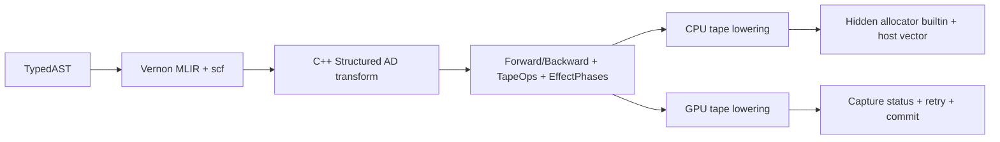

# MLIR-Centered Autodiff Architecture

## Status

This document records architecture decisions and does not maintain completion
state. Current behavior and remaining work live in
[`autodiff.md`](autodiff.md) and [`roadmap.md`](roadmap.md).

This document records the prerequisite architecture work for dynamic
control-flow autodiff. It supersedes attempts to add dynamic regions directly
to the Python flat `AutodiffProgram` graph.

This decision was released in compiler contract 11 and pipeline contract 15.
CPU now uses the structured `dynamic_v2` path exclusively; GPU/graphics
temporarily retain the explicit `legacy_fixed` emitter.

## Problem

Autodiff currently lives at the wrong abstraction layer:

- `python/vernon_dsl/frontend/autodiff.py` rebuilds program semantics as a flat
  DAG and separately implements `if`, `for`, `while`, `continue`, `return`, and
  carried-value merging.
- Normal frontend control flow is independently implemented by
  `control_flow_lowering.py` and `loop_lowering.py`.
- the former `autodiff_native_cpu.py` and the retained
  `autodiff_native_gpu.py` combined the AD transform, graph traversal,
  control-flow emission, tape layout, and target-specific lowering.
- CPU Runtime copies a fixed product of reflected tape leaves. GPU Runtime
  supports only fixed resource sizes multiplied by the dispatch grid.
- GPU emitter phases named `CAPTURE_TAPE`, `COMMIT_STORAGE`, and
  `OBSERVE_OUTPUT` are fused graph-replay strategies, not an IR-level effect
  transaction visible to Runtime.
- `runtime_autodiff_graph.cpp` builds an allocate-once, execute-once graph. It
  cannot read capture status, resize tape, replay capture, and then commit.

Consequently, every control-flow feature must currently be implemented in
inference, normal MLIR lowering, the AD graph builder, the CPU reference
interpreter, both native emitters, and Runtime orchestration.

Adding `REGION_ARGUMENT` and `REGION_RESULT` to the flat graph does not remove
this duplication. It embeds another CFG inside a representation whose native
and Runtime consumers still assume a static DAG and fixed tape.

## Target Architecture



The typed AST and existing inference remain the source of frontend types and
effects. The normal frontend lowers control flow once to structured MLIR.
Autodiff consumes that MLIR rather than reconstructing source control flow.

## 1. Restore a Verifiable Baseline

- Preserve completed canonical ABI and GPU aggregate AD work.
- Isolate or remove the incomplete Python `DynamicRegion` path until native
  and Runtime consumers exist.
- Restore the full test suite to green before starting the architecture
  migration. Do not retain a state where the CPU reference accepts loops while
  native AD rejects `REGION_ARGUMENT` or `REGION_RESULT`.
- Keep general `for`/`while-else` frontend support only if inference and normal
  MLIR lowering have complete, independently tested semantics.

## 2. Structured AD IR

Add internal Vernon MLIR operations or types for:

- runtime tape handle;
- invocation and dynamic-region headers;
- checked record reservation;
- typed/canonical leaf tape writes and reads;
- capture outcome (`success`, `requiredBytes`, `overflow`);
- explicit capture and commit effect phases.

The C++ AD transform consumes `scf.if`, `scf.while`, Vernon aggregate
operations, and Vernon Storage operations. It produces augmented forward and
backward functions.

Python remains responsible for:

- the user transform request;
- `wrt` paths;
- profile selection and identity inputs;
- launch and accumulation policy metadata.

Python must no longer generate target-specific derivative MLIR after the C++
transform covers existing behavior.

### Reverse control flow

Each dynamic region invocation records a header:

```text
offset: runtime-sized byte offset
count: actual executed iteration count
exitKind: fallthrough | break | continue | return
```

Forward records reverse-required values once per actual iteration. Reverse
reads the header and interprets records in descending iteration order.
Nested-region invocation headers are referenced from their parent iteration
records.

All tape slots derive from the canonical ABI tree. Aggregate input, output,
tape, cotangent, and gradient projection must share that layout source.

## 3. Unified Tape Allocator and Effect Protocol

The logical protocol is:

```text
beginInvocation
beginRegion
reserveRecord
writeLeaf
endRegion
finishCapture
commit
```

`finishCapture` reports only:

- success;
- exact required bytes;
- arithmetic/counter overflow.

Storage and externally observable output writes are legal only during
`commit`. Capture failure must not produce visible side effects.

All size multiplication, offset alignment, counters, iteration counts, and
allocations fail closed.

There is no compile-time iteration cap. `tape_bytes` may describe static
layout, an initial-capacity hint, or statistics; it must not become a maximum
iteration or allocation bound. Runtime process memory policy and allocation
failure remain independent fail-closed limits.

## 4. CPU Backend

CPU capture grows a Runtime-owned `std::vector<std::byte>` directly during
execution. It does not retry the primal computation.

`VernonCpuInvocation` has no generic `user_data`; its fifth field is the
texture-callback table and must not be repurposed. Do not change this contract.

Instead:

- add a packed-arguments builtin used only by Compiler and Runtime, such as
  `ad_tape_allocator`;
- Runtime excludes this builtin from the user-visible signature;
- Runtime fills an internal descriptor containing allocator context and
  checked append callbacks;
- CPU tape operations lower to calls through that descriptor;
- successful forward execution transfers tape ownership to the pullback;
- backward reads region headers and records from the vector;
- pullback destruction releases tape ownership.

Capture must functionalize or defer Storage changes until all tape allocations
succeed, then commit exactly once.

## 5. GPU Backend

GPU dispatch binds fixed-capacity buffers before launch. Dynamic allocation is
implemented through capture/count and checked retry:

1. Allocate provisional tape and compact status resources.
2. Run capture. Each invocation uses a monotonic required-byte counter.
3. Bounds-check every tape write.
4. Continue reporting exact required size after capacity overflow.
5. Submit and read compact count/overflow status.
6. Validate all arithmetic and allocation limits.
7. Allocate exact capacity and replay capture when required.
8. Run commit/output only after a successful capture.

The internal status includes capacity, required bytes, overflow, and region
headers. It is not part of the user ABI.

Runtime must orchestrate capture and commit as distinct observable phases. A
single command encoder cannot hide a host readback/allocation retry.

`runtime_autodiff_graph.cpp` therefore needs a per-forward session state
machine rather than a single static `ExecutionGraph::execute()`:

```text
Idle
Capture
StatusKnown
AllocateChecked
ReplayCapture
Commit
PullbackReady
```

Compiled topology remains immutable. Capacity, status, tape ownership, and
retry state belong to a per-forward session and then to the pullback.

## 6. Runtime Model Changes

Replace the assumption that tape is only `std::vector<ValueAbi>` with an
internal tape description containing:

- fixed static leaves, if present;
- dynamic region descriptors;
- record stride and alignment;
- invocation/region header schema;
- backend storage policy.

CPU host layouts must no longer require a one-to-one fixed-byte copy from each
forward result leaf into each backward argument leaf.

GPU resources must distinguish dispatch-grid carriers from runtime-length tape
storage. Current `runtimeCarrier` only means `elementSize * grid`; it is not a
dynamic tape abstraction.

Backward resource validation must consume a tape layout plan rather than the
fixed formula:

```text
launch + N tape leaves + cotangent + gradients
```

The existing manifest key set, compiler contract version, and pipeline
contract version remain unchanged. Internal reflection may add allocator,
status, or tape-layout roles if old profiles retain compatible parsing.

## 7. Remove the Old Native AD Path

After the C++ structured transform and both backend lowerings cover existing
AD:

- remove Python native forward/backward graph evaluators;
- remove duplicated CPU/GPU derivative rule bodies;
- remove `_GpuForwardEmitter` graph replay as the owner of effect
  transactions;
- remove static loop unrolling and its 1024/256 limits;
- reduce `AutodiffProgram` to user transform metadata, canonical ABI/profile
  identity, and launch/accumulation plans;
- keep a reference interpreter only as a test oracle, not as a second compiler
  semantics implementation.

Existing `vernon.reduce_sum` and `vernon.scatter_add` are good abstraction
boundaries. Their target strategy remains owned by
`VernonLowerAccumulation.cpp`.

## 8. Implementation boundary

Current implementation status is summarized in [`autodiff.md`](autodiff.md);
remaining product work is tracked in [`roadmap.md`](roadmap.md).

## 9. Acceptance

### IR

- `scf.if` and data-dependent `scf.while`;
- zero, one, and long loops;
- nested `continue`;
- multiple loop-return exits;
- `for-else` normal and break paths;
- nested region headers;
- aggregate and nested aggregate tape records.

### Allocation and safety

- iteration counts beyond old 1024/256 thresholds;
- record-size multiplication overflow;
- counter and offset overflow;
- CPU allocation rejection;
- GPU provisional overflow and exact retry;
- process memory-policy rejection;
- no visible Storage mutation after failed capture.

### Transaction

- capture overflow leaves Storage/output uncommitted;
- successful retry commits exactly once;
- required-size reporting remains exact after overflow;
- pullback owns a stable successful tape snapshot.

### Numerical

- CPU reference and native CPU agree;
- Metal and Vulkan agree with CPU;
- CUDA, DirectX 12, and OpenGL complete cooking/validation, with numerical
  execution when hardware is available.

### Verification

Run formatting through `.venv`. Use one `*build/` directory at a time and run
Python, compiler, and Runtime suites sequentially.
