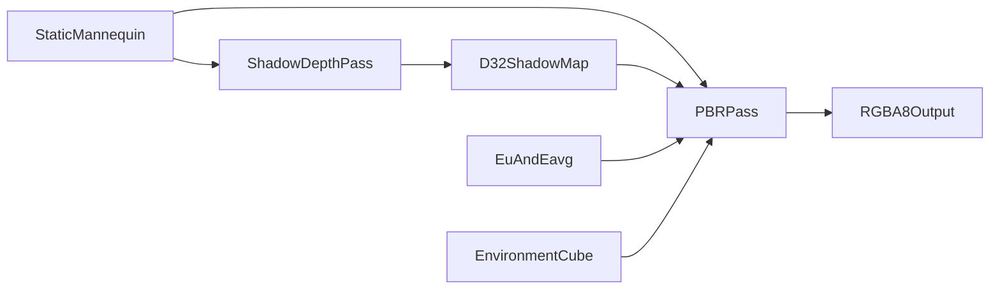

# PBR、Shadow Map 与 Cubemap 可用性验证计划

先记录后续性能架构工作，然后补齐真正的 depth attachment 与 cubemap
资源链路，用静态 mannequin 构建一个跨 Vulkan、DirectX12、OpenGL 的
PBR + shadow map + cubemap 集成示例。骨骼动画不在本轮范围内。

## 实施状态

- [ ] 记录 command batching、RenderGraph submission 和 GPU benchmark 性能待办。
- [ ] 补齐并测试 RHI/Runtime depth attachment、sampled depth 和 cubemap 资源链路。
- [ ] 移植 PBR、shadow map、cubemap DSL shaders 和静态资源。
- [ ] 实现 mannequin 双 pass PBR 集成示例及 CLI。
- [ ] 在 Vulkan、DirectX12、OpenGL 上运行集成与完整回归测试。

## 1. 记录后续性能优先项

- 更新 `specs/runtime/rhi_execution_plan.md`，记录 Engine 迁移前仍需完成的
  external command encoder、批量提交、RenderGraph barrier/submission
  ownership、dirty binding 更新和 C++ GPU timestamp benchmark。
- 本轮不实现这些性能架构改动，先以材质和多 pass 场景验证 API 完整性。

## 2. 补齐 depth 与 cubemap 的 RHI/Runtime 链路

- 扩展 `source/include/VernonRHI.h` 和 Python native RHI wrapper，使 Image
  可描述 2D/cube、RGBA8/D32、usage、六面上传及可配置 sampler；相应提升
  API/ABI 版本。
- 在继续扩展前，将 image create/upload/download 逻辑从过长的
  `source/lib/rhi/rhi.cpp` 拆到独立 image 实现，复用 generational slot 和
  backend state。
- 扩展 `source/include/VernonRuntimeProvider.h`、
  `source/include/VernonRuntime.h`、graphics planner 和 RuntimeCore draw
  descriptor：支持 depth-only pass、D32 depth attachment、clear/write/test
  以及 sampled depth resource。
- 在 Vulkan、DirectX12、OpenGL adapters 中实现 native depth attachment：
  Vulkan dynamic rendering/render pass depth view，D3D12 typeless depth
  resource + DSV/SRV，OpenGL depth FBO attachment；同时补齐 D3D12 cube SRV
  和 Vulkan/D3D12 六面上传。
- Python 高层增加 `DepthTexture`/cube texture（或等价明确类型）以及
  pipeline `depth_target=`，保持普通 `Texture` API 简单。

## 3. 移植 shader 与静态素材

- 以 `Vernon/Vernon/shaders/pbr.frag` 和对应 vertex/shadow shaders 为参考，
  在 `examples/shader_lib/` 编写 DSL 版本：metallic-roughness GGX、Schlick
  Fresnel、Smith geometry、multi-scatter LUT、normal/emissive/occlusion、
  clearcoat/transmission 参数、方向光和 PCF shadow。
- Cubemap 作为 PBR environment/reflection 输入，使用
  `Texture["cube", f32]` 和现有 `texture_sample`；shadow pass 写真正 D32
  depth，PBR pass 采样同一 depth image。
- 本轮模型按 bind pose 静态渲染，忽略 JOINTS/WEIGHTS；alpha discard 和
  复杂 PCSS 不作为完成条件，mannequin 为 opaque，shadow 使用稳定的固定核
  PCF。
- 将 mannequin 必需的 `.gltf`/`buffer.bin` 和 Eu/Eavg LUT 复制到
  `examples/assets/pbr/` 并记录来源；用 stdlib JSON + NumPy 读取 glTF
  accessor，避免为单一静态模型引入大型依赖。Cubemap 六面使用代码生成的
  确定性测试环境。

## 4. 编写集成示例

- 新增 `examples/pbr.py`：加载 mannequin POSITION/NORMAL/TANGENT/
  TEXCOORD/indices，生成默认 glTF material textures，建立 light-space、
  view、projection 与 normal matrices。
- 每帧执行两个 pass：

- CLI 支持 `--arch vulkan|directx|opengl`、`--headless`、`--frames`、
  `--size`、`--output`，并提供关闭 shadow/cubemap 的开关用于验证各贡献项；
  动画使用墙钟时间。

## 5. 验证与回归

- 增加 RHI resource tests：D32 generational lifetime、cube 六面上传/采样、
  错误 dimension/format、跨 device identity。
- 增加 Runtime integration tests：三个 desktop backend 的 depth-only pass、
  depth test、sampled shadow、cubemap sampling 和 depth+color compatibility
  cache。
- 增加 Python headless example test，在 Vulkan、DirectX12 WARP/可用设备、
  OpenGL 上渲染小尺寸图；验证输出非空、shadow 开关改变阴影区域、cubemap
  开关改变反射区域，并允许 backend 浮点容差。
- 运行完整 C++、Python 测试及三个后端的 headless screenshot，确认现有
  compute/graphics 示例无回归。

## 当前示例实现记录

- `examples/pbr.py` 先提供不依赖 glTF 包的程序化 cube + 细分平面验证场景。
- BRDF 使用 Cook-Torrance 框架、GGX 法线分布（Walter et al., 2007）、
  Schlick Fresnel（Schlick, 1994）和可分离 Smith 遮蔽项；选择这些公式是为了
  与 metallic-roughness 工作流一致，并保持 DSL shader 足够小。
- Python Runtime 已暴露 render-only D32 attachment，示例使用真实深度测试；
  sampled D32 和 cube texture 仍未暴露，因此阴影与环境项继续使用解析平面阴影
  和确定性程序化环境色。它们不替代计划中的双 pass PCF shadow map 和真实
  cubemap 集成验收。
