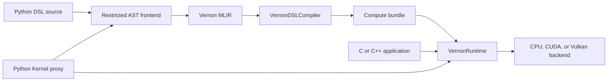

# Python and Native GPU Kernel Runtime Plan

Status: implemented. Current native execution is provided by the unified
`VernonRuntime`; deployable CPU execution is AOT-only.

## Goal

Add explicit GPU kernel dispatch to VernonDSL without automatic loop
parallelization. Python is one caller, not a required runtime dependency.

The same kernel must support both workflows:

1. **Python JIT call**
   - parse the decorated function without executing its body;
   - compile on first call;
   - cache and launch it through the native runtime.
2. **Native AOT call**
   - compile Python DSL to MLIR as an authoring step;
   - compile MLIR to a persisted compute bundle;
   - load and launch that bundle from C or C++ without Python, nanobind, or
     NumPy.

Both workflows use the same compiler, compute bundle, reflection, Tensor ABI,
and backend runtime.

CUDA is the first GPU backend. Vulkan follows through the same runtime
interface. A CPU reference backend provides deterministic tests and GPU-like
grid semantics.

## Public target API

This is target syntax; the frontend prerequisites below must be implemented
before the example works.

```python
from typing import Annotated

import cv2
import vernon_dsl as vd

width = 640
height = 320

vd.init(arch=vd.cuda)
pixels = vd.Tensor.zeros(dtype=vd.f32, shape=(height, width))


@vd.kernel(workgroup_size=(16, 16, 1))
def paint(
    pixels: vd.Tensor[vd.f32, (None, None)],
    time: vd.f32,
    gid: Annotated[
        vd.Tensor[vd.u32, (3,)],
        vd.builtin("global_invocation_id"),
    ],
) -> None:
    x = gid[0]
    y = gid[1]
    if x < width and y < height:
        pixels[y, x] = ...


paint(pixels, 0.03, grid=(width, height, 1))
image = pixels.to_numpy()
cv2.imshow("Julia Set", image)
cv2.waitKey(0)
```

Builtin arguments are synthesized by the backend and omitted from the Python
and native launch argument lists. `grid` is always explicit; VernonDSL does not
infer parallel dispatch from Python loops.

`@kernel` is the public runtime decorator. `@compute` remains a compatibility
alias.

## Tensor model

`Tensor[element_type, shape]` remains the only compound numeric type.

- `vec*` and `mat*` remain convenience spellings for fixed-shape Tensor values.
- Value Tensors lower to MLIR tensor/vector values.
- Addressable kernel Tensor parameters lower internally to
  `!vernon.buffer`/`memref` and backend storage.
- `Buffer` remains temporarily supported for existing shaders, but is not a
  second public runtime type.
- `DeviceBuffer` is a native implementation detail.
- A `None` dimension is specialized from the runtime Tensor before native
  compilation. The concrete shape is written to reflection and the cache key;
  the first version has no dynamic-shape device ABI.

Runtime Tensor operations:

```python
Tensor.zeros(dtype=f32, shape=(height, width))
Tensor.empty(dtype=f32, shape=(height, width))
Tensor.from_numpy(array)
tensor.to_numpy()
tensor.copy_from_numpy(array)
tensor.synchronize()
```

Tensor layout is contiguous row-major. Shape order matches NumPy:
`(height, width, ...)`. `to_numpy()` synchronizes and returns an independently
owned array. Upload validates dtype, shape, and contiguity.

## Compilation and execution paths



The native compiler does not parse Python. Native AOT authoring is therefore:

```text
vernon-compile-python --entry paint fractal.py -o fractal.mlir
vernon-compile --target cuda fractal.mlir --compute-bundle fractal
```

A C/C++ application may instead pass already generated MLIR to the compiler C
API and consume the returned artifact and reflection in memory.

## Frontend and lowering prerequisites

Modify the Python frontend and Vernon-to-GPU lowering before implementing the
fractal runtime path:

- recognize `@kernel` as compute and keep `@compute` compatible;
- specialize `None` Tensor dimensions from call arguments;
- allow addressable Tensor load/store and multidimensional indexing;
- lower multidimensional indexing to a documented row-major linear index;
- represent `global_invocation_id` as a three-element `u32` Tensor and lower
  x, y, and z;
- support scalar by-value kernel arguments;
- support `while`, `AugAssign`, integer/float conversion, Tensor-scalar
  arithmetic, and the fractal's power/norm operations;
- keep explicit bounds checks in source; unchecked out-of-bounds GPU access is
  undefined behavior;
- add `--entry` and feature options to `vernon-compile-python` so CLI and Python
  JIT select entries identically.

The first implementation only supports top-level functions in real files.
Nested functions, lambdas, REPL definitions, module-level Tensor capture, and
automatic parallel loops are out of scope.

## Compute reflection and launch ABI

Extend compiler reflection with `gpu_launch_abi_version: 1`. Do not reinterpret
the existing `cpu_offset`, `cpu_size`, or packed CPU invocation fields as a GPU
ABI.

Each compute entry records:

- entry and backend symbol names;
- target and artifact format;
- workgroup size;
- argument index and source name;
- argument kind: `tensor`, `scalar`, or `builtin`;
- scalar/element dtype;
- Tensor rank, specialized shape, contiguous strides, access, and alignment;
- builtin name;
- Vulkan set/binding where applicable.

The backend-neutral launch descriptor is:

```text
global_size:    (x, y, z)
workgroup_size: (x, y, z)
```

CUDA and Vulkan derive group counts using ceiling division. Runtime validation
rejects argument-count, dtype, rank, shape, access, alignment, and ABI-version
mismatches before launch.

## Compute bundle

A persisted AOT kernel uses a normal directory:

```text
fractal/
  compute.json
  paint.ptx
```

Vulkan uses the same layout with a SPIR-V artifact. `compute.json` contains:

- bundle schema, compiler, and GPU launch ABI versions;
- target, entry, symbol, and workgroup size;
- artifact filename, format, size, and SHA-256;
- compute reflection;
- module and transitive source dependency hashes.

Canonical JSON and hashing must follow the existing shader asset cooker rules.
The bundle contains everything needed for native loading; it must not reference
Python objects or a Python cache.

## Native runtime

The separately linkable `VernonRuntime` library provides the stable C API:

- runtime creation, destruction, and capability queries;
- Tensor-compatible allocation and free;
- host/device copies;
- in-memory artifact plus reflection loading;
- compute bundle loading;
- validated explicit launch;
- synchronization.

Core native handles are `RuntimeContext`, `DeviceBuffer`, and `LoadedKernel`.
The C API is canonical for C, C++, and nanobind. Internal C++ code uses
`Result`; optional C++ RAII wrappers only wrap the C API.

Native execution must work without CPython. Handle ownership enforces:

1. synchronize outstanding work;
2. release buffers;
3. unload kernels/modules;
4. destroy the backend context.

The first version uses one process runtime, one device, one default execution
stream, and synchronous transfers. Reinitialization with live handles fails.
Async streams, multi-device scheduling, fork safety, and cross-thread launch
are deferred.

Compiler capability and runtime capability are separate:

- compiler capability means the target artifact can be emitted;
- runtime capability means a driver/device can allocate, load, launch, copy,
  and synchronize.

## CPU execution

Python `vd.cpu` and deployable native execution both load schema-versioned AOT
compute bundles containing a platform shared library and stable C wrapper.
The Python frontend uses AST only to generate Vernon MLIR; it does not interpret
kernel bodies. Raw LLVM IR and ORC JIT artifacts are not accepted by
`VernonRuntime`.

## CUDA backend

Make CUDA runtime support optional at configure time. Use the CUDA Driver API
to retain the primary context, allocate memory, copy data, load PTX, resolve
symbols, launch kernels, synchronize, and release resources.

PTX is produced by the existing NVVM/NVPTX compiler path. Every driver error is
converted to a descriptive runtime error. A machine may support CUDA
compilation while reporting CUDA runtime unavailable.

## Python binding and cache

Build `vernon_dsl._native` with nanobind. It wraps the compiler and runtime C
APIs; it does not implement backend behavior in Python or use `ctypes`.

`Kernel.__call__` performs:

1. validate user arguments and explicit grid;
2. specialize `None` dimensions;
3. call `compile_file(..., entry=...)` without executing the kernel body;
4. compile MLIR through the selected backend compiler; CPU invokes
   `vernon-compile` to create a temporary native compute bundle;
5. validate reflection and load the artifact or CPU bundle;
6. cache and launch the loaded kernel.

The in-memory cache key is SHA-256 over canonical data containing:

- runtime cache, compiler, reflection, and launch ABI versions;
- selected entry;
- transitive source dependency hashes;
- target and target options;
- workgroup size;
- concrete Tensor dtypes and specialized shapes.

Ordinary scalar values do not enter the cache key. A persistent disk cache is
deferred; persisted AOT output uses the compute bundle.

Native handles retain all launch resources until synchronization completes.
Native `Result` errors become specific Python exceptions.

## Fractal acceptance example

Convert `fractal.py` from Taichi to VernonDSL:

- explicit two-dimensional grid and builtin ID;
- explicit bounds guard;
- runtime Tensor output;
- `to_numpy()` readback;
- OpenCV display outside automated tests.

Add OpenCV as an optional example dependency, not a core runtime dependency.
The numerical test compares a small result against a NumPy reference with a
documented tolerance.

## Build configuration

- `VERNON_ENABLE_RUNTIME` and `VERNON_ENABLE_CUDA_RUNTIME` control the runtime.
- `VernonRuntime` and its runtime C headers are separately installable.
- The sole nanobind `vernon_dsl._native` module links
  `VernonDSLCompiler` and `Vernon::Runtime`.
- A runtime-only configuration uses `VERNON_ENABLE_COMPILER=OFF` and
  `VERNON_ENABLE_RUNTIME=ON`.
- Keep the compiler library usable without the runtime and both usable without
  Python.
- Use one binding technology; remove `pybind11` from this runtime path.
- Register backend-independent runtime tests in CTest. Register CUDA tests
  conditionally and skip them when no usable device exists.

## Verification

Add:

- `python/tests/test_kernel_runtime.py`
- `source/tests/runtime_c_api_test.c`
- `source/tests/runtime_cuda_test.cpp`

Required checks:

- decoration and calls never execute the Python function body;
- first call compiles once and the second call hits the cache;
- dependency, backend, workgroup, or specialized shape changes invalidate the
  cache;
- CPU AOT dispatch has correct 1D, 2D, and 3D builtin IDs;
- reflection and runtime reject invalid arguments and ABI versions;
- a compute bundle loads and executes through C without Python;
- Python and native launch paths produce the same result;
- CUDA compilation can succeed while runtime capability reports unavailable;
- conditional CUDA 1D and 2D numerical tests match CPU/NumPy results;
- resource destruction is safe after success and failure;
- fractal output matches the NumPy reference;
- OpenCV display is verified manually only.

## Implementation order

1. Implement frontend prerequisites and addressable Tensor lowering.
2. Define GPU reflection ABI v1 and compute bundle schema.
3. Add the native runtime C API and CPU reference grid dispatcher.
4. Add compute bundle cooking/loading and prove C-only AOT execution.
5. Implement the CUDA Driver backend and conditional native tests.
6. Add nanobind compiler/runtime bindings, runtime Tensor, and Kernel cache.
7. Convert and verify the fractal example with NumPy and OpenCV.
8. Implement Vulkan behind the same reflection and runtime interfaces.

## Non-goals

- automatic parallelization of Python loops;
- dynamic-shape device ABI in the first version;
- automatic differentiation or sparse tensors;
- asynchronous streams or unified virtual memory;
- multi-device scheduling;
- integrated GUI support;
- bitwise-identical floating-point output across backends.
