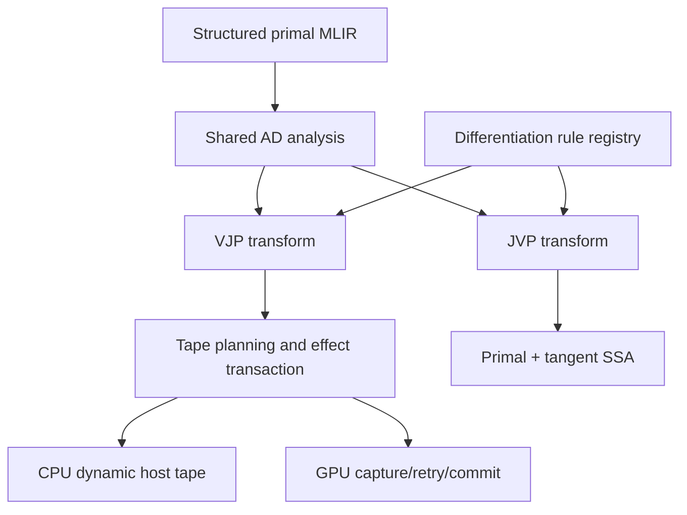

# Scalable Multi-Mode Autodiff Architecture

## Status

This document records architecture decisions and does not maintain completion
state. Current behavior and remaining work live in
[`autodiff.md`](autodiff.md) and [`roadmap.md`](roadmap.md).

This document defines the architecture refactor that must precede further
autodiff feature expansion.

The existing MLIR-centered structured VJP implementation is a useful
correctness prototype, but mathematical rules, activity analysis, tape
planning, structured control flow, and target lowering must be separated before
adding broad operator coverage, aggregate differentiation, complete dynamic
control flow, GPU retry, or JVP.

Do not update the compiler contract or pipeline contract versions until the
next release.

## Decision

Pause feature breadth. Do not discard the completed structured AD foundation.
Refactor it into shared mode-independent analysis and derivative-rule
infrastructure, then resume VJP, JVP, and backend work.

This is not a rewrite. It preserves the sound parts and replaces hard-coded
coupling before it becomes a permanent architecture.

## Current Foundation to Preserve

Keep and extend:

- `!vernon.ad_tape` and `!vernon.ad_region_header`;
- `vernon.ad.begin_invocation`, `begin_region`, `reserve_record`,
  `write_leaf`, `read_leaf`, `end_region`, and region-header reads;
- `vernon.ad.capture` / `vernon.ad.commit` and their effect verifier;
- `HostDynamicTape` checked dynamic host storage;
- structured `scf.if` and `scf.while` VJP prototypes;
- the structured AD integration-test harness;
- canonical ABI leaf projection;
- `vernon.reduce_sum` / `vernon.scatter_add` and compiler-owned accumulation
  strategy.

These pieces are reverse-mode implementation infrastructure. They do not need
to be used by JVP.

## Feature Work to Freeze Temporarily

Until this refactor is complete, do not:

- add more VJP cases to a large `if/else dyn_cast` chain;
- add aggregate-specific derivative logic directly to the transform;
- connect the conservative “save every scalar SSA value” plan to GPU tape;
- layer GPU retry onto the current fixed `Signature::tape` model;
- add more bespoke control-flow cases inside the monolithic transform;
- duplicate the structured traversal to implement JVP.

## Standard Model

Structured primal MLIR is the shared source:



Shared AD analysis owns:

- active-value discovery;
- differentiable-type classification;
- `wrt` and result projection;
- derivative type promotion;
- structured region discovery;
- effect classification;
- canonical aggregate leaf projection.

JVP and VJP are separate transforms over the same structured MLIR and rule
registry. They are not separate source languages or separate control-flow IRs.

## JVP and VJP Responsibilities

### JVP

JVP propagates primal/tangent pairs forward:

```text
z = x * y
dz = dx * y + x * dy
```

It normally requires no tape:

- `scf.if` executes the tangent of the selected primal branch;
- `scf.while` carries primal and tangent loop values together;
- no reverse iteration history is needed;
- no dynamic tape allocator or capture retry is needed.

### VJP

VJP creates:

- an augmented forward;
- a tape plan for required primal values and control-flow history;
- a reverse function that consumes an output cotangent;
- adjoint accumulation;
- capture/commit separation for visible effects.

The tape stores primal values and control-flow history. It does not store
gradients.

## Differentiation Rule Interface

Introduce one shared rule abstraction:

```text
DifferentiationRule
  classifyActivity(operation)
  getVjpPrimalRequirements(operation)
  buildJvp(operation, primalOperands, tangentOperands)
  buildVjp(operation, primalProvider, resultCotangents)
```

The first implementation may be a pass-local registry keyed by MLIR operation
name or `TypeID`. Once stable, migrate it to a Vernon differentiation
`OpInterface` with external models attached to `arith`, `math`, `tensor`, and
other upstream dialect operations.

Do not require modifications to upstream dialect definitions.

### Example: multiplication

```text
VJP primal requirements:
  lhs, rhs

JVP:
  tangent(result) = tangent(lhs) * rhs + lhs * tangent(rhs)

VJP:
  adjoint(lhs) += adjoint(result) * rhs
  adjoint(rhs) += adjoint(result) * lhs
```

### Example: sine

```text
VJP primal requirements:
  operand

JVP:
  tangent(result) = cos(operand) * tangent(operand)

VJP:
  adjoint(operand) += adjoint(result) * cos(operand)
```

### Example: addition

```text
VJP primal requirements:
  none

JVP:
  tangent(result) = tangent(lhs) + tangent(rhs)

VJP:
  adjoint(lhs) += adjoint(result)
  adjoint(rhs) += adjoint(result)
```

Rules declare semantics and required primal values. They do not allocate tape
or choose backend resources.

## Component Boundaries

Split the current structured transform into components with narrow ownership.
Names are illustrative.

### `VernonAutodiffAnalysis`

Owns:

- activity propagation;
- differentiable types;
- `wrt` resolution;
- active result discovery;
- structured region tree;
- effect analysis.

### `VernonAutodiffRules`

Owns:

- rule registry;
- JVP builders;
- VJP builders;
- primal-requirement declarations;
- diagnostics for unsupported operations.

### `VernonAutodiffTapePlanning`

Owns:

- collecting only rule-required primal values;
- deduplicating saved SSA values;
- canonical ABI leaf layout;
- static versus dynamic-region records;
- alignment and checked offset arithmetic;
- region-header schema;
- future save-versus-recompute policy.

It must replace conservative “save all scalar parameters and SSA results”
behavior.

### `VernonStructuredJvp`

Owns:

- tangent arguments and results;
- primal/tangent environment;
- `scf.if` tangent regions;
- `scf.while` tangent carried values;
- JVP profile generation.

It should not emit tape operations.

### `VernonStructuredVjp`

Owns:

- augmented forward generation;
- reverse traversal;
- reverse `scf.if`;
- reverse iteration of `scf.while`;
- adjoint accumulation;
- calls into tape planning and effect transaction components.

It delegates local derivatives to `VernonAutodiffRules`.

### `VernonAutodiffEffects`

Owns:

- functionalization or deferral of Storage writes;
- capture legality;
- commit generation;
- atomic/effect restrictions;
- ensuring failed capture has no visible side effects.

### Backend Lowering

CPU and GPU lower the same tape/effect protocol:

- CPU: hidden allocator builtin and dynamic `std::vector<std::byte>`;
- GPU: fixed bound capacity, monotonic required counter, bounds-checked writes,
  host retry, then commit.

Derivative rules must contain no CPU/GPU branching.

## Tape Planning

The VJP rule registry determines what must be available during reverse:

```text
addf: no saved primal
mulf: lhs and rhs
divf: lhs and rhs
sin: operand
exp: result
```

The planner then performs:

1. activity pruning;
2. requirement union;
3. value deduplication;
4. canonical leaf decomposition;
5. static/region classification;
6. checked size/alignment planning;
7. record/header assignment.

Later optimizations may choose recomputation instead of saving. That policy
must not alter derivative-rule semantics.

## Control Flow

Control flow is shared structured MLIR, not a derivative-rule special case.

### `scf.if`

- JVP clones the selected primal branch with tangent values.
- VJP records/reuses the predicate and reverses only the executed branch.

### `scf.while`

- JVP extends loop-carried values with tangents and follows the primal loop.
- VJP records actual iteration count, exit kind, and per-iteration required
  primals, then interprets records in reverse.

Nested regions use parent-record identity plus child ordinal. No static
iteration expansion is allowed.

## Allocator ABI Stability

`VernonAdTapeAllocator` crosses the compiler-generated code / Runtime boundary.
Stabilize it before wider use.

Add an extensible header before adding more callbacks:

```c
size_t struct_size;
uint32_t abi_version;
```

Specify:

- behavior of every callback after failure;
- whether `required_bytes` remains exact after capacity exhaustion;
- overflow versus allocation-failure reporting;
- region-handle lifetime;
- repeated-capture/reset behavior;
- read legality;
- thread and invocation ownership;
- transfer of tape ownership to pullback.

Do not repurpose `VernonCpuInvocation.textures`; allocator injection remains an
internal packed-argument builtin.

## Runtime Model

The existing fixed `Signature::tape` leaf vector is insufficient for dynamic
regions. Introduce an internal logical tape plan containing:

- static saved leaves;
- dynamic region descriptors;
- record stride/alignment;
- header schema;
- backend storage policy.

Grid carrier size and dynamic record length are distinct concepts.

Compiled executable topology remains immutable. Forward-session state owns:

- current capacity;
- required bytes;
- overflow status;
- tape storage;
- retry state.

Successful tape ownership moves to the pullback.

## Higher-Order AD

Keep generated derivative functions in ordinary differentiable MLIR for as
long as possible.

Tape and backend effect operations should be introduced after semantic
linearization/reverse construction. This leaves a path for:

- JVP-of-VJP Hessian-vector products;
- VJP-of-JVP;
- future linearization plus transposition.

Do not require higher-order transforms to differentiate allocator callbacks or
backend tape operations.

## Refactor scope

The public transform remains VJP-only. JVP validation is non-blocking future
work tracked in [`roadmap.md`](roadmap.md).

## Architecture Gates

Before resuming feature expansion:

- adding an operation requires one rule registration, not edits to multiple
  transforms;
- VJP tape requirements come from rules, not “save every scalar”;
- a minimal JVP uses the same rule registry;
- JVP emits no tape operations;
- VJP and JVP consume the same structured `scf` program;
- derivative rules contain no backend-specific code;
- allocator descriptor has explicit size/version and documented failure
  semantics;
- all existing structured VJP tests remain green.

## Verification

Use `.venv` for formatting tools. Use one `*build/` directory at a time.

Run in order:

1. AD dialect verifier tests;
2. rule-registry unit tests;
3. JVP/VJP scalar transform tests;
4. structured `if` / `while` tests;
5. host tape safety tests;
6. compiler tests;
7. Runtime tests;
8. Python frontend tests.
