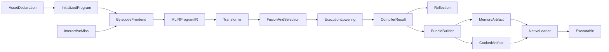

# Unified Module and Pipeline Architecture

## 1. Goals

VernonDSL uses one Program model for:

- compute kernels;
- graphics pipelines;
- composite `Module`s;
- transforms such as VJP.

All paths produce the same typed Program IR and use the same compiler, Program
Asset, loader, resolver, and native runtime. The only public asset declaration
is `program_asset`; do not add a second contract.

Standalone kernels and graphics pipelines are normalized to one-node Programs
at the asset/compiler boundary. Node count must not select a different
manifest, loader, binding, scheduling, or autodiff architecture. The detailed
primal/VJP convergence contract is defined in
[`unified_program_vjp.md`](unified_program_vjp.md).

The authoritative Program IR is an MLIR program dialect. Initialized Python Programs are compiler inputs, not serialized
compiler IR or public snapshot objects. Program-level Python control flow is host-static in this release: it may depend on
initialized Module state, constants, and Features, but not on invocation values or device data. The MLIR representation
remains region-capable so structured runtime control can be added later without replacing the Program model.

This refactor must also remove the transitional Python interpreter path. Python may enter the compiler and run host-static
frontend logic, but it must not execute lowered operations, reverse fragments, or checkpoint decisions.

The coordinated Program Asset release changes the deployment contract
atomically. Intermediate dual-schema state is not a supported contract.

## 1.1 Compute kernel stages (locked)

A compute kernel has three stages. Do not collapse them or add a Python
workaround that moves invoke-time extents into compile.

```text
source + annotations + features  →  _lower()      →  MLIR
MLIR + target                    →  specialize()  →  native artifact
native + TensorStorage/View      →  C++ bind      →  dispatch
```

Rules:

- `_lower` / Program compile never receive tensors or launch extents. `vd.dyn`
  stays `vd.dyn`.
- `specialize` / `finalize` produce one native artifact per (source, features,
  target). Static annotation extents may appear in the Program. TensorView
  `vd.dyn` stays `-1` on Value `.shape`, the same marker as shader endpoints.
  Borrowed Storage with a dyn view omits concrete byte length/image extent and
  declares only static compatibility constraints. Size comes from the bound
  provider, not a zero sentinel or cook-time formula. CPU and GPU share this
  artifact. Different launch sizes must not recompile.
- C++ bind/invoke is the only place that reads runtime shape, strides, offset,
  and byte length from the bound buffer. Direct C++ `load → bind → invoke`
  must work without a Python shape dictionary.
- `finalize` `shape_facts` are graphics image/attachment extents only. Passing
  `GraphBuffer.shape` or `TensorStorage.shape` into compute `specialize` is
  forbidden.

Module GPU primal may build an `ExecutionGraph` at specialization time, but
that graph still loads the dyn native pipeline. Extents are bound when the
user tensors are submitted, not when the graph is compiled.

## 2. Public API

### 2.1 Module

`Module`, kernels, and graphics pipelines are callable Programs:

```python
class Pbr(vd.Module):
    def __init__(self, *, shadows: bool):
        super().__init__()
        self.shadows = shadows
        self.draw = vd.pipeline(
            pbr_vertex,
            pbr_fragment,
            topology=vd.triangles,
        )

    def forward(self, mesh, camera, target):
        if self.shadows:
            self.render_shadow(mesh, camera)

        render = vd.render(
            target,
            color=vd.clear((0.0, 0.0, 0.0, 1.0)),
            depth=vd.clear(1.0),
        )
        self.draw(mesh=mesh, camera=camera, render=render)
```

A normal call is primal-only:

```python
outputs = Pbr(shadows=True)(mesh, camera, target)
```

It must not compile VJP code, allocate tape, or retain reverse state. Differentiation is explicit:

```python
outputs, pullback = vd.ad.vjp(module, wrt=("mesh",))(mesh, camera, target)
gradients = pullback(cotangents)
```

### 2.2 Program Assets

An initialized Module can be used directly:

```python
pbr_asset = vd.program_asset(
    id="pipelines/pbr",
    program=Pbr(shadows=True),
    variants=((),),
)
```

Cooking keeps the existing facade:

```python
vd.cook_program_asset(
    "scene.py:pbr_asset",
    target="metal",
    output="build/pipelines",
)

pbr = vd.load_program("build/pipelines/cooked.program.json")
pbr(mesh, camera, target)
```

`program_asset` accepts kernels, graphics pipelines, initialized Modules, and supported transforms. There is no public
`vd.export` step or `ExportedProgram` type. The initialized Program is retained by the asset declaration until cooking;
the cooker and an interactive cache miss both enter the same internal compiler frontend.

### 2.3 Invocation parameter inference

The user does not provide example `args` to cook a Module.

The compiler frontend creates internal placeholders for `forward` parameters, then resolves their types from:

1. `forward` annotations;
2. reflected parameter types of called kernels and graphics pipelines;
3. constraints introduced by Program operators.

These placeholders do not represent runtime values and never reach the public API. The frontend uses them while
interpreting `forward` bytecode and capturing Program calls instead of submitting them.

Ambiguous, unused, or conflicting parameters produce a compile error. The user resolves such cases with type or dynamic
shape annotations, not representative resources.

### 2.4 Removed public abstractions

Remove these types from the top-level Python API:

- `ExecutionGraph` and `ExecutionPass`;
- `ComputePass` and `RenderPass`;
- `ComputeEncoder` and `GraphicsEncoder`;
- `ExecutionResources` and `PipelineInvocation`;
- `VjpComputePass`.

Users compose Programs with `Module`; scheduling lowers directly to the private
C++ Command DAG without Python pass descriptors.

## 3. Frontend semantics

### 3.1 Initialized Module

`Module.__init__` is unrestricted Python. Vernon does not parse constructor AST or reconstruct the instance from
constructor arguments.

Compilation operates on the initialized object:

1. create typed placeholders for `forward` parameters;
2. interpret `forward` with the bytecode frontend;
3. execute ordinary host operations, specialize host-static control flow, and capture typed Program operations;
4. materialize authoritative MLIR Program IR and compiler reflection.

Host Python may construct children, load configuration, generate containers, or use helper libraries. Its results affect
the artifact only through the operations and constants observed by the frontend.

### 3.2 Boundary

Python executed by `__init__` or `forward` runs at initialization/frontend time, not at artifact invocation time. Therefore:

- host side effects are not runtime Program semantics;
- live frame resources must be invocation parameters or explicitly registered Program state;
- unsupported interaction with typed placeholders is a compile error;
- cooked Programs cannot contain Python callbacks or eager graph breaks.

Cooking imports and executes trusted descriptor Python in a clean worker process. Isolation controls build environment and
failure containment; it is not a security sandbox.

### 3.3 Internal compiler result

The internal compiler result contains:

- the typed public signature;
- immutable Program IR;
- lifted constants and registered state;
- specialization constraints and guards;
- source/debug provenance.

It does not contain the Module instance, `__dict__`, pickle data, executable Python, or the original configuration tree.
Changing the Module after compilation cannot change an existing executable or cooked artifact.

Interactive calls use the same compiler frontend on cache misses. Guards cover observed Module state and input
constraints; a failed guard compiles a new specialization. Cache hits invoke only the native executable.

## 4. Host-static control-flow parsing

Module parsing uses a bytecode/eval-frame frontend comparable to TorchDynamo. It preserves direct Python syntax while
distinguishing host values from typed invocation values.

Conditions over initialized Module state, constants, and Features execute in the frontend:

```python
if self.shadows:
    self.render_shadow(scene, target)
```

For `shadows=True`, only that branch appears in Program IR. C++ never receives or interprets `shadows`.

Normal Python iterables and ranges derived entirely from host-static values execute and unroll in the frontend:

```python
for layer in self.layers:
    layer(scene, target)
```

Only the observed calls appear in Program IR. Guards cover the initialized state and constants that determined
specialization. A changed guard compiles another specialization.

Python control flow must not depend on invocation placeholders or device data. The following are compile errors in this
release:

```python
if enable_shadow:       # invocation scalar
    ...

if tensor[0] > 0:       # invocation or device data
    ...

for i in range(steps):  # invocation scalar bound
    ...
```

The diagnostic directs users to move data-dependent control into a kernel or make the choice initialized Module state,
a constant, or a Feature. `while` is accepted only when the frontend can prove that its condition and all loop progress
are host-static. `break` and `continue` are ordinary frontend-time Python behavior inside such loops.

The MLIR Program dialect may use standard `scf.if`, `scf.for`, and `scf.while` in future versions. Value placement and
region/effect interfaces must therefore remain capable of representing structured runtime control, but the current
Module frontend does not emit those operations and the current Program lowerer rejects them explicitly. Per-element
dynamic control flow remains kernel/shader logic.

## 5. Render model

Target and attachment behavior form one immutable `RenderTargetUse`:

```python
render = vd.render(
    target,
    colors={
        0: vd.clear((0.0, 0.0, 0.0, 1.0)),
        1: vd.load(),
    },
    depth=vd.preserve(),
)
pipeline(..., render=render)
```

It contains the target binding, attachment load/store/clear operations, optional render area, and compatibility metadata.
`vd.render` is a value constructor, not a context manager.

Multiple graphics calls using the same compatible SSA `RenderTargetUse` may be merged into one render scope. Distinct
values are distinct logical scopes even when they reference the same target.

Primitive topology is static graphics-pipeline state:

```python
triangles = vd.pipeline(vertex, fragment, topology=vd.triangles)
lines = vd.pipeline(vertex, fragment, topology=vd.lines)
```

It participates in specialization and backend pipeline creation. Draw counts, index buffers, and instance data remain
invocation bindings.

## 6. Single compilation path



Interactive execution and cooking differ only in artifact storage. Given the same initialized state, inferred signature,
Features, target, and transform, they must produce the same Program IR identity and artifact hash.

Frontend capture must not dispatch leaf work. After capture, Python must not interpret Program IR. Both in-memory and disk
artifacts are loaded through the existing native pipeline loader.

## 7. Program IR and lowering

Program IR is immutable MLIR and independent of live invocation resources. It contains stable value/resource IDs, typed
effects, resource versions, operation attributes, regions, and source provenance. A private frozen Python debug view may
exist temporarily, but compilation, transforms, fusion, reflection, and lowering operate on the MLIR Program dialect.

Required operations include:

- `func.func`/`func.return` for independently schedulable forward and backward graphs, marked with
  `vernon_program.graph`;
- `vernon_program.compute` for custom compute implementations;
- `vernon_program.graphics` for graphics pipelines;
- existing Vernon, arith, tensor, and linalg semantic operators such as add, matmul, and norm.

Program IR does not duplicate Vernon's scalar, tensor, resource, constant, or mathematical type system. The VJP transform
derives a separate backward graph from forward operator types using the existing Vernon derivative-rule registry. A
differentiated custom compute implementation remains `vernon_program.compute` with a generated callee; cotangent fan-in
is an ordinary semantic add. `vernon_program.graphics` is not differentiable in this release.

Program VJP and kernel structured VJP are separate transforms. Program VJP owns graph cloning, reverse scheduling,
`vernon_program.compute` delegation, and graphics rejection; kernel structured VJP owns kernel ABI, Storage paths, tape,
and entry-point details. They share only level-independent differentiation rules and derivative type utilities.

This separation is between compiler levels, not between runtime architectures.
A differentiated standalone kernel is a one-node differentiated Program:
Program VJP owns its forward/backward topology and residual boundary, while
kernel structured VJP supplies the selected forward/backward node
implementations and opaque tape ABI. Tape is one residual storage strategy; it
does not create a second top-level execution model.

The dialect remains compatible with MLIR structured control-flow regions and loop-carried SSA values, but runtime
`IfOp`, `ForOp`, `WhileOp`, `BreakOp`, and `ContinueOp` are reserved future capabilities and are not emitted by the
current Module frontend.

`vernon_program.graphics` consumes one `RenderTargetUse`. Program IR must not contain live resources, Python object IDs,
callbacks, encoders, or pass objects.

The reverse transform is the only layer that inserts cotangent accumulation. After implementation selection it is an
ordinary compute operation; C++ has no hard-coded mathematical Add operation.

Fusion and implementation selection run on MLIR after logical Program transforms. They may replace multiple compatible
Program operations with one implementation while preserving source/effect provenance. Compiler reflection maps each
remaining Program node to its selected kernel or graphics implementation, artifact, entry point, ABI bindings,
workgroup or topology state, and resource effects. Program dependency edges are
derived from Value SSA and ResourceAccess version/range hazards rather than
serialized in reflection.

The lowerer converts the selected Program IR and reflection into private executable compute, render, barrier,
resource-lifetime, and reverse-command descriptors. The native ExecutionGraph is acyclic because all current
Program-level control flow was specialized before lowering.

The native checkpoint planner receives the complete primal/reverse DAG, including residual size, temporary memory,
liveness, replay cost, replay legality, and deterministic-reduction constraints. Python must not replay Module prefixes,
choose retain/rematerialize heuristics, synthesize telemetry, or execute reverse fragments.

## 8. Program Assets and runtime

For `scene.py:pbr_asset`, cooking imports the descriptor in a clean worker, obtains the initialized Program, enters the
same compiler frontend used by an interactive cache miss, and writes one
`.program.json` Program Asset.

C++ loads only cooked artifacts:

```cpp
auto bundle = runtime.loadProgram(asset);
auto executable = bundle.resolve(features);
auto instance = executable.createInstance();
auto invocation = instance.beginInvocation();
invocation.bind(values);
invocation.forward();
```

C++ does not construct Modules, embed Python, or receive constructor configuration. Multiple specializations are exposed
through stable variant IDs.

The static parser is an optional declaration-site lint only. It does not
select capture, schema, compiler, or runtime behavior.

## 9. Migration

Replace the current transitional implementation rather than extending it:

- dynamic execution in `python/vernon_dsl/program.py`;
- tuple-only primal caching and mutable `ProgramTemplate._graph`;
- direct per-kernel VJP invocation;
- `_RematerializedPullback` prefix replay;
- Python `LoweredReverseProgram.execute`;
- metadata-only reverse commands;
- f32/rank-specific semantic Add execution;
- Python-synthesized checkpoint telemetry.

Keep raw ExecutionGraph fan-in fail-closed. Fan-in succeeds only after Program reverse transformation has emitted and
lowered explicit accumulation.

Migrate examples and public tests from pass/encoder APIs to Module and callable pipeline APIs. Runtime graph/pass tests
move to internal coverage.

The coordinated breaking release changes generated compiler/Program contract
names and values only through their authoritative generator inputs and rejects
every older cooked artifact rather than normalizing it.

## 10. Implementation order

1. Define common internal Program inputs, inferred signatures, constraints, guards, and compiler results.
2. Implement host-static bytecode parsing for initialized Modules and interactive cache misses, with source-located
   rejection of invocation-dependent Python control flow.
3. Capture nested Programs, graphics calls, and `RenderTargetUse`.
4. Materialize the authoritative MLIR Program dialect and compiler reflection, including Program-node to selected
   implementation mappings.
5. Apply logical VJP transforms, implementation selection, and optional fusion in MLIR.
6. Extend `program_asset` and its cooker to compile initialized Programs in a clean worker.
7. Lower primal and VJP Program IR to native compute, render, barrier, lifetime, and reverse commands.
8. Move checkpoint planning/execution fully into the native DAG.
9. Remove public pass/encoder/graph APIs and transitional Python execution.
10. Migrate examples and validate compatibility across backends.

## 11. Acceptance criteria

- `program_asset(program=Module(...))` cooks without user-provided example arguments.
- Module parameter types are inferred from annotations, leaf reflection, and Program constraints; ambiguity is diagnosed.
- `Module.__init__` is normal Python and the artifact contains no Python object or constructor configuration tree.
- A primal Module call creates no VJP executable or reverse state.
- Interactive and cooked forms use identical frontend, IR, lowering, artifact, and loader paths.
- Cache misses parse and compile once; cache hits execute only native code.
- Direct Python `if/else/for/while/continue/break` specializes only for initialized state, constants, and Features.
- Python control flow over invocation values or device data fails during frontend parsing with a source-located diagnostic.
- The authoritative Program representation is MLIR, remains compatible with future structured-control regions, and
  reflection maps every lowered Program node to its exact StageArtifact,
  authenticated code modules, entry points, ABI, and resource effects;
  ResolveProgram derives executable dependencies.
- Render attachment operations travel in one `RenderTargetUse`; topology remains pipeline state.
- VJP fan-in is explicit Program IR and executes without restoring C++ `GraphAutodiffValue::add`.
- Checkpoint planning uses the native executable DAG and reports native telemetry.
- Top-level Python exposes no `export`, `ExportedProgram`, pass, encoder, ExecutionGraph, or PipelineInvocation abstractions.
- The coordinated Program release is intentionally artifact-incompatible and
  exposes no compatibility loader.
