# Unified Program Target Binding Refactor

## Status and handoff

This document is the implementation handoff for replacing the incomplete
canonical Program target-adapter path. The worktree already contains extensive
uncommitted compute, graphics, Program dialect, compiler, runtime, Python, test,
and spec changes. Do not reset or discard unrelated changes.

Current verified state (2026-08-23, `build/`):

- Canonical compute and graphics cook through C++ Program bootstrap,
  finalization, and `TargetBindingPlan`.
- Language 32-bit integers require explicit `i32`/`u32` metadata;
  `getValueAbiLayout` does not treat MLIR signless `i32` as an ABI oracle.
- Non-AD should-fix gates in [section 9](#9-full-suite-gate-snapshot-2026-08-23)
  are green, including ocean, terrain, Mandelbulb, compile-surface-parity,
  and kernel runtime forward cases.
- Remaining red tests are Program VJP / AD only.

These provisional adapters are **already gone** from the tree:

- `ParameterUse::wholeValueTransport`
- boolean `compileTensorCopyPlan`
- `graphicsValueInterfacePlan` and `makeReflection`
- Python-generated graphics Program MLIR and `_compile_legacy_pipeline_bundle`

Keep `pipeline_manifest` legacy parse until the coordinated contract release.
Do not reopen those adapters to fix AD.

## Scope and invariants

- Cover non-VJP/non-autodiff compute, graphics, and mixed Programs. VJP is a
  separate follow-up.
- Keep `program_execution_manifest.md` portable. Native bindings and physical
  layouts must not enter Program, StageContract, or endpoint ABI.
- Do not update `COMPILER_CONTRACT_VERSION` or `PIPELINE_VERSION` before the
  coordinated release.
- Legacy cooked loading may remain isolated until release, but canonical
  cooking, examples, and new tests must not call it.
- Prove compute behavior unchanged before each graphics cutover.
- Never fix failures by weakening ABI, layout hash, portable slot, resource
  access, or StageContract validation.

```mermaid
flowchart LR
  Frontend["Python frontend or Module capture"] --> ProgramPlan["C++ ProgramPlan"]
  ProgramPlan --> TargetCompile["Target module compilation"]
  TargetCompile --> Finalize["C++ canonical finalization"]
  Finalize --> Resolve["ResolveProgram"]
  Resolve --> BindingPlan["C++ TargetBindingPlan"]
  BindingPlan --> Backend["Backend pipeline and invocation"]
  Backend --> Execute["Compute dispatch or graphics draw"]
```



## Architectural diagnosis

Before Program cooking was unified, two hidden adapters performed the missing
work independently:

- Canonical compute synthesized legacy reflection JSON in
  `program_execution_backend.cpp::makeReflection`, then reparsed it through
  `materializeComputeEndpoint`.
- Graphics and old direct paths used Python `bundle/parameters.py` to select
  `physical_layouts`, `interface_plan`, and transport metadata.

The unified commit removed the Python adapter from the new path but did not
replace both adapters with one typed C++ boundary. Consequently,
`TransportNode::Array` was overloaded to mean either an array inside one
whole-value or an outer stream of buffer elements.

The manifest is not missing logical information. `scope=value`,
`scope=element`, endpoint tags, portable carriers, Value shape, and resource
descriptors are sufficient. The missing component is a non-serialized,
target-specific runtime plan between `ResolveProgram` and backend pipeline
creation.

## 1. Establish executable acceptance gates

Add `scripts/run_examples_acceptance.py`, reusing
`scripts/run_showcase_smoke.py` and `examples/showcase_common.py`.

Backend policy:

- Every backend available on the current machine must execute and validate
  output.
- Unavailable backends must compile and cook equivalent Program artifacts.

Deterministic non-AD acceptance targets:

- Compute: `examples/fractal.py`,
  `examples/shared_struct_methods.py`.
- Basic and mixed graphics: `examples/unified_pipeline.py`,
  `examples/complete_pipeline.py`, `examples/advanced_pipeline.py`.
- Graph and multipass: `examples/terrain_showcase.py`,
  `examples/mandelbulb_showcase.py`, `examples/pbr.py`,
  `examples/dynamic_ocean.py`,
  `examples/dynamic_terrain_erosion.py`.
- Assets and external engine:
  `examples/external_engine/fractal_pipeline.py`,
  `examples/shader_lib/mandelbulb.py`, desktop smoke where available, and the
  Node/WASM smoke.

Exclude `examples/autodiff_smoke_*` and all VJP tests.

Acceptance requires numerical comparison or rendered image/resource checks.
Exit zero or successful compilation alone is insufficient.

## 2. Introduce one typed TargetBindingPlan

Add `source/lib/runtime/target_binding_plan.{h,cpp}`.

Do not use serialized `Variant` as the new architecture. Define immutable
tagged plans for:

- source representation:
  `WholeValueBytes`, `ElementStream`, `TensorViewDescriptor`,
  `ResourceHandle`, and `SystemValue`;
- target carrier:
  inline value/push constant, uniform buffer, storage buffer, vertex/index
  buffer, image, sampler, and attachment;
- endpoint identity:
  module, interface, index, portable slot, access, and Program value binding;
- physical transport:
  canonical source projection, target ABI tree, and backend-resolved native
  location.

The builder consumes only:

```text
ResolvedProgram + Node + ResolvedStage + RuntimeBackend
```

It returns a fully validated in-memory plan. Python and manifest parsing must
never construct it.

Keep only a temporary one-way adapter for legacy cooked `Variant` assets.
Canonical loading must not pass through legacy JSON.

## 3. Share ABI projection between compiler and runtime

Extract physical projection logic from
`source/lib/Dialect/Vernon/IR/VernonValueAbi.cpp` into an MLIR-free C++ value
ABI core linked by compiler and runtime.

- Compiler: convert MLIR types to a canonical ABI tree, then call the shared
  physical projector.
- Runtime: reconstruct the same tree from `Value.type` and
  `ValueLayout.leaves/path/shape`, validate it against the canonical layout,
  then call the same projector.

Replace the provisional boolean copy API with two explicit APIs:

```text
compileWholeValueCopyPlan(canonicalValue, physicalValue)
compileElementStreamCopyPlan(elementLayout, logicalShape, physicalElement)
```

Parity tests must cover:

- scalars and vector-three padding;
- matrices;
- nested structs and ranked aggregate tensors;
- negative and non-contiguous TensorViews;
- CPU, Vulkan, and Metal profiles;
- other backend profiles at compile/cook time.

## 4. Migrate canonical compute first

Replace:

```text
makeReflection -> endpoint reflection -> materializeComputeEndpoint
```

with direct `buildTargetBindingPlan`.

Preserve:

- dispatch controls and workgroup metadata;
- TensorView descriptor slots;
- storage effects and resource SSA;
- whole-value aggregate ABI;
- system values;
- CPU entry registration.

Before deleting the old adapter, compare old and new plans semantically in
tests. Gate this phase on all non-AD compiler/runtime tests, direct kernel
tests, aggregate tensor tests, forward execution-graph tests, `fractal.py`,
and `shared_struct_methods.py`.

## 5. Complete graphics planning and target lowering

Replace Python-generated Program MLIR in
`python/vernon_dsl/_runtime/pipeline.py` with a C++ singleton graphics bootstrap
parallel to `plan_kernel_result`.

The bootstrap consumes vertex/fragment frontend logical signatures and
invocation/render-target facts, builds one `vernon_program.graphics` node, and
emits the same compile-request format as captured Programs.

Complete C++ finalization and TargetBindingPlan support for:

- aggregate/matrix vertex attributes;
- per-instance divisors and index buffers;
- scalar, vector, matrix, and struct uniforms;
- 2D/cube images, samplers, and storage images;
- direct/indexed draw, instancing, and topology;
- MRT and depth/stencil attachments;
- load/store/clear and render area;
- blend, viewport/scissor, and requested multisampling;
- cross-module linkage, system values/resolution, and feature variants.

Backends derive native locations from authenticated module bytes and target
conventions:

- SPIR-V reflection for Vulkan;
- existing MSL reflection for Metal;
- GL reflection for OpenGL/GLES;
- D3D reflection for DirectX.

No native location is persisted in portable reflection.

## 6. Build a real ResolvedExecutablePlan

Remove the canonical loader's one-node restriction.

- Build one TargetBindingPlan per unique resolved stage/node.
- Build an immutable executable plan for the Program DAG.
- Use Program Value SSA and ResourceAccess to derive scheduling,
  synchronization, attachment transitions, and RAW/WAR/WAW hazards.
- Start single-node fast paths only after `ResolveProgram`; they must consume
  the same plans as multi-node execution.
- Make `ExecutionGraph` pipeline invocations and standalone calls submit the
  same resolved node plans.
- Migrate handwritten example RenderPass adapters, especially `examples/pbr.py`,
  to invocation-backed passes. Retain only the documented low-level custom
  command escape hatch.

Validate compute-to-graphics resource handoff, resource ping-pong, multipass
render scopes, MRT, and depth identity with the mixed examples.

## 7. Cut Python over and remove canonical legacy composition

Python owns only:

- frontend lowering;
- compile orchestration;
- artifact file persistence;
- public argument marshalling.

Canonical path already dropped:

- `_compile_legacy_pipeline_bundle` and Python-emitted graphics Program MLIR;
- `makeReflection` and `graphicsValueInterfacePlan`;
- boolean `compileTensorCopyPlan` / `wholeValueTransport`.

Still on the **legacy cooked** path until contract release (do not delete yet):

- `reflected_parameters` / `merge_parameter_uses` in `bundle/parameters.py`
  (used by `cook_program_asset`);
- `materializeComputeEndpoint` for resolved one-node stage ABI;
- `pipeline_manifest` parse;
- duplicate Program vs Pipeline layout converters.

`variant_mesh` and external-engine assets still need Program plus
ArtifactSystem cooking. No example, canonical test, or new asset may depend
on the legacy parse. Its physical deletion is the release gate.

## 8. Verification and completion criteria

C++:

- compiler C API and Program finalization;
- Program manifest parse/resolve/execute;
- target binding and ABI parity;
- tensor bridge and compute launch planning;
- CPU/GPU forward runtime;
- graphics backend pipeline and invocation tests.

Python:

- non-AD kernel runtime;
- pipeline runtime;
- forward execution graph;
- shader assets and Program/module forward paths;
- acceptance harness.

Use:

```bash
PYTHONPATH=python:python/tests
```

and `.venv` for Python tools.

Completion requires:

- all ten runnable non-AD examples execute on every available backend;
- unavailable backends compile and cook;
- graphics outputs pass image/resource assertions;
- compute outputs pass numerical assertions;
- external-engine assets cook and desktop/Node-WASM smoke tests pass where
  supported;
- repeated invocation does not recompile;
- no canonical call graph reaches legacy parameter JSON composition;
- stale documentation such as `fractal.py --emit-metal` is removed;
- strict ABI, access, slot, layout, and hash validation remains enabled.

## Implementation order

1. Acceptance baseline.
2. Typed TargetBindingPlan.
3. Shared ABI projector and explicit copy planners.
4. Canonical compute migration and parity gate.
5. C++ graphics bootstrap and complete graphics lowering.
6. Multi-node ResolvedExecutablePlan.
7. Python/assets/external-engine cutover.
8. Full examples verification and legacy cleanup.

## 9. Full-suite gate snapshot (2026-08-23)

Ran from `/Users/yuanxinyu/VernonDSL/build` after rebuilding the tree:

```bash
cmake --build build --parallel 8
ctest --test-dir build --output-on-failure
PYTHONPATH=python .venv/bin/python -m pytest python/tests -q
```

| Suite | Result |
| --- | --- |
| ctest | 6 failed / 493 (99%); all six are AD |
| pytest | 13 failed / 432 passed / 60 skipped; all thirteen are AD |

Non-AD graphics and compute that already pass, and must stay green:

- `python/tests/test_pipeline_runtime.py` Vulkan / Metal / OpenGL cases
- `python/tests/test_kernel_runtime.py` forward (non-VJP) cases
- ctest Metal examples: mandelbulb, fractal, pbr, complete-pipeline
- `test_plain_module_call_does_not_compile_or_retain_vjp` (Module forward only)
- `VernonPython` storage-vjp-contract, f16, structured scalar/storage
  forward, Dynamic V2 parity, compiler/shared-definitions/blinn-phong

Do not treat a later AD-only failure as permission to loosen ABI, layout
hash, portable slot, resource access, or StageContract checks.

### Expected fail (out of scope)

VJP / Program AD is a separate follow-up. These failures are accepted until
that work. Do not block the non-AD binding cutover on them.

| Gate | Symptom |
| --- | --- |
| `RuntimeStructuredAggregateAutodiff.ExecutesAggregateInputAndStorageObjectivePullback` | aggregate leaf `scalar_count` 2≠1, `static_rank` 1≠0 |
| `VernonStructuredVjpTest.ProgramVjpScalarizesCanonicalAggregateDerivativeLeaves` | derivative leaves 2≠4 |
| `VernonPythonCookedAutodiffTest` | AD Value `value` shape `[3]` ≠ reflection `[2, 2]` |
| `VernonPythonNativeAutodiffNumericCpuTest` | `left` `[2,2,2]` ≠ reflection `[2,2,2,2,2,2]` |
| `GpuExecutionGraphAutodiffTests` (2) | `conflicting ABI values for 'particles'` |
| `ModuleTests.test_init_registers_children_and_uses_native_program_ad_abi` | `canonical compute finalization requires exactly one forward graph and signature` |
| `ModuleTests.test_calls_hold_independent_outputs_and_tapes` | same finalization diagnostic |
| `ModuleTests.test_semantic_add_uses_builtin_program_stage` | same finalization diagnostic |
| `SmokeFluidGraphTests` (8) | `Program VJP wrt argument is not differentiable` |
| `vernon-python-autodiff-phase2-benchmark` | same smoke-fluid VJP diagnostic |

ctest wraps several of the same Python files (`vernon-python-smoke-fluid-graph`,
`vernon-python-execution-graph`). Count them once.

### Should fix (non-AD, this refactor)

Resolved 2026-08-23. Public integer Program boundaries now carry language
`i32`/`u32` metadata (kernel `groups_*`, graphics uniforms, writable
TensorView `.after` results, generated builtins). Do not regress these
gates when starting Program VJP.
